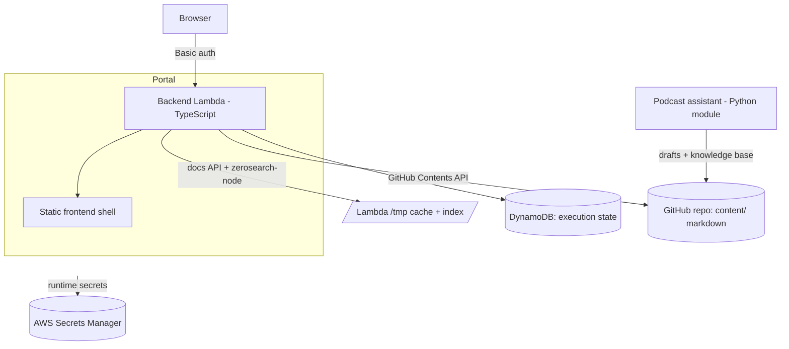

# DataOps

DataOps is the combined DataTalks.Club operations portal.

Version 1 focuses on operations docs and tasks:

- process docs, SOPs, templates, references, playbooks, prompts, and search
- task workflows, bundles, recurring work, required links, and execution state
- AWS Lambda deployment with GitHub Actions OIDC

The deployed V1 app is the DataTalks.Club operations portal for
`ops.dtcdev.click`, served from the `DataTalksClub/dataops` repository and the
`dataops-v1` stack. The single backend lives under `backend/` and serves the
frontend, docs, search, and work APIs from one TypeScript Lambda, and the
podcast assistant lives under `assistants/podcast/` as a DataOps assistant
workflow.

## Layout

- `content/` — operational documentation (SOPs, templates, references,
  playbooks, prompts) and its image assets.
- `backend/` — single TypeScript backend: docs content API, search, work
  execution, portal/auth, and assistant-job orchestration.
- `assistants/podcast/` — DataOps podcast workflow assistant module, process docs,
  guest-intake template, knowledge-base builder, and tests.
- `docs/` — repo-meta docs (this README, `STRUCTURE.md`, `sop-format*.md`,
  archived materials).
- `_docs/` — DataOps merge plan, development process, and planning notes.
- `frontend/` — static vanilla-JS app and its Dockerfile.
- `infra/` — SAM/CloudFormation templates, OIDC deploy roles, runtime secrets.
- `tools/content_tools/` — pure-Python content validation CLIs (docs link
  validation, knowledge-repo validation, process-quality reports).
- `scripts/` — repo tooling (planning-docs validator).

## Architecture

DataOps is a portal served by a single TypeScript backend Lambda. GitHub is the
source of truth for all markdown content; execution state lives in DynamoDB.

| Component | Path | Runtime | Responsibility |
|---|---|---|---|
| Frontend shell | `frontend/` | Static vanilla JS | SOP block editor, search UI, filters, publish dialog. No build step; served as static assets. |
| Backend | `backend/` | TypeScript / Node (Lambda) | Single backend: serves the frontend, docs content API, `zerosearch-node` search, work execution, and GitHub-backed content editing from one Function URL. |
| Podcast assistant | `assistants/podcast/` | Python module | Guest-intake, knowledge-base builder, and draft generation for the podcast operations workflow. |



How the pieces fit:

- **Content is GitHub-backed.** Edits made in the UI are committed straight to
  GitHub by the backend through the Contents API; the Lambda keeps a `/tmp`
  cache and builds a `zerosearch-node` index from it. No SQLite, no EFS.
- **One backend serves everything.** The frontend, docs API, search, and work
  APIs run in a single TypeScript Lambda with a single Function URL. The old
  three-process split (frontend proxy + Python docs Lambda + work engine) is
  gone. Local dev is `make dev` (one origin on port 3000).
- **The podcast assistant runs as a Python module**, not a web service — it
  drives the podcast intake/drafting workflow and writes into the knowledge base.
- **Infra is SAM/CloudFormation** (templates under `infra/`),
  deployed by GitHub Actions through an AWS OIDC role; runtime secrets live in
  AWS Secrets Manager rather than GitHub Actions secrets.

See `_docs/TARGET_ARCHITECTURE.md` for the target layout and design rationale.

## Planning

- [Portal Analysis](PORTAL_ANALYSIS.md)
- [Shared Project Plan](PROJECT_PLAN.md)
- [Merge Plan](_docs/MERGE_PLAN.md)
- [Development Process](_docs/PROCESS.md)

## Running locally

Local dev is a single backend that serves the frontend + docs + work APIs from
one origin (port 3000):

```bash
make setup
make dev
```

## Development commands

`make help` lists the current setup, dev, test, SOP lint, SAM
validation/build, and CI-parity targets. These targets are thin wrappers around
the package-local commands documented below so failures stay visible and package
commands remain useful for troubleshooting.

Common verification targets:

```bash
make seed-backend
make test-backend
make typecheck-backend
make build-backend
make test-backend-e2e
make test-assistant
make sam-validate
make sam-build
make ci
```

Run `make sop-lint FILES="content/path/to/sop.md"` for marked SOP files.
`make sam-validate` is local template validation only: it uses empty AWS config
and credentials files under `.tmp/aws-empty/`, disables EC2 metadata lookup, and
does not require live AWS credentials or run `sam deploy`.

## Node workspace

DataOps uses npm workspaces from the repository root. The single workspace is
`backend/`.

Install Node dependencies from the repo root:

```bash
npm ci
```

Common backend lifecycle commands are available from the root:

```bash
npm run dev:backend
npm run test:backend
npm run test:e2e:backend
npm run typecheck:backend
npm run build:backend
npm run seed:backend
npm run export:templates:backend
npm run validate:export:backend -- <export-dir>
npm run dry-run:import:backend -- <export-dir>
npm run clean:backend
```

`package-lock.json` at the repo root is the npm lockfile for the workspace. The
backend Lambda packaging, CI cache, and Docker Lambda image all use that root
lockfile; there is no nested `backend/package-lock.json`.

## What the editor does

- Opens every SOP in a **block view** — Section / Group / Step / Free-form /
  Screenshot / TODO. Click any text to edit inline; Cmd/Ctrl+Enter to commit.
- Add, delete, drag-reorder steps; cross-group moves; convert flat ↔ grouped
  procedures; renumber automatically. Roundtrips through the SOP linter.
- Image upload via file picker, drag-and-drop onto a step, or clipboard paste.
- Frontmatter editor: `doc_type`, summary, tags, systems (chips).
- Pending-changes panel aggregates every local draft; **Save all** from the
  sidebar, then review lint and commit from the publish dialog.
- Search (server-side), tag/system/domain/type filters, quick-nav palette
  (`Cmd/Ctrl+P`), sidebar tree filter, "Recently edited" + "Pinned" sections.
- Diff view between draft and saved version. Lint dashboard for the whole
  corpus in the publish dialog. Loom + YouTube + Vimeo embeds. Lightbox for screenshots.
- Dark mode, resizable sidebar, mobile layout.

## Keyboard shortcuts

- `/` focuses sidebar search.
- `Cmd/Ctrl + K` focuses search from anywhere.
- `Cmd/Ctrl + P` opens quick navigation.
- `Cmd/Ctrl + S` saves the current doc.
- `Cmd/Ctrl + Shift + S` saves all drafts.
- `Cmd/Ctrl + Enter` commits an inline edit.
- `Esc` cancels inline edits and closes modals.
- `?` shows keyboard shortcut help.

## SOP format

Every SOP is structured-markdown with HTML-comment markers (`<!-- sop-section-start: ... -->`
etc.) — invisible on GitHub but machine-readable. See
[`docs/sop-format.md`](docs/sop-format.md) for the strict spec and
[`docs/sop-format-design.md`](docs/sop-format-design.md) for the design log.

The Node CLI (`backend/scripts/sop.ts`) provides `parse` and `lint` subcommands;
the content-validation Python tools live in `tools/content_tools/`.
