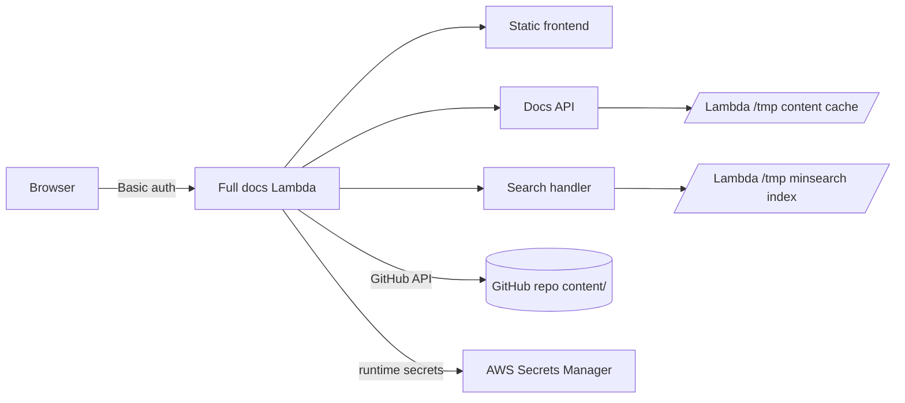

# DataOps

DataOps is the combined DataTalks.Club operations portal.

Version 1 focuses on operations docs and tasks:

- process docs, SOPs, templates, references, playbooks, prompts, and search
- task workflows, bundles, recurring work, required links, and execution state
- AWS Lambda deployment with GitHub Actions OIDC

The first deployed app uses the DTC Operations docs portal as the base Lambda
application. DataTasks is imported under `work-engine/` for the task execution
engine, and the podcast assistant is imported under `assistants/podcast/` for
the podcast operations workflow.

## Layout

- `content/` — operational documentation (SOPs, templates, references,
  playbooks, prompts) and its image assets.
- `work-engine/` — imported DataTasks task execution system.
- `assistants/podcast/` — imported podcast workflow assistant, process docs,
  guest-intake template, knowledge-base builder, and tests.
- `docs/` — repo-meta docs (this README, `STRUCTURE.md`, `sop-format*.md`,
  archived materials).
- `_docs/` — DataOps merge plan, development process, and planning notes.
- `frontend/` — static vanilla-JS app and its Dockerfile.
- `lambda-functions/` — AWS Lambda backend (docs API + search index).
- `scripts/` — repo tooling (SOP parser/linter/normalizer, migration scripts,
  the dev server).

## Planning

- [Portal Analysis](PORTAL_ANALYSIS.md)
- [Shared Project Plan](PROJECT_PLAN.md)
- [Merge Plan](_docs/MERGE_PLAN.md)
- [Development Process](_docs/PROCESS.md)

## Running locally

```bash
docker compose up --build
# Frontend:           http://127.0.0.1:5173
# Lambda upstream:    http://127.0.0.1:8787
```

The frontend container proxies `/docs`, `/search`, `/health`, `/images`,
`/folders`, and `/lint` to the lambda container, and exposes its own
`/git/status` and `/git/commit` so the UI can commit + push using the host's
SSH key (mounted read-only).

## Architecture Review

The deployed v1 app is a single protected Lambda app. It serves the frontend,
the docs API, GitHub-backed content editing, and same-origin search from one
Lambda Function URL. GitHub is the source of truth for markdown content;
Lambda keeps a `/tmp` cache and rebuilds the `minsearch` index from that cache.



Content changes made in the UI are committed directly to GitHub by Lambda
through the GitHub Contents API. After a successful save, Lambda refreshes its
GitHub tree cache and rebuilds the local search index. There is no separate
SQLite service and no EFS filesystem in the current design.

CI/CD is split by lifecycle:

- `content/**` changes run content validation, search-index smoke tests, and
  refresh the deployed Lambda cache without redeploying code.
- app, Lambda, infra, and test changes run the full test/build/deploy workflow.
- GitHub Actions deploys through an AWS OIDC role managed by CloudFormation.
- Runtime secrets live in AWS Secrets Manager, not in GitHub Actions secrets.

For the inherited docs-app architecture, see [`docs/architecture.md`](docs/architecture.md).

## What the editor does

- Opens every SOP in a **block view** — Section / Group / Step / Free-form /
  Screenshot / TODO. Click any text to edit inline; Cmd/Ctrl+Enter to commit.
- Add, delete, drag-reorder steps; cross-group moves; convert flat ↔ grouped
  procedures; renumber automatically. Roundtrips through `sop_lint.py`.
- Image upload via file picker, drag-and-drop onto a step, or clipboard paste.
- Frontmatter editor: `doc_type`, summary, tags, systems (chips).
- Pending-changes panel aggregates every local draft; **Save all** from the
  sidebar, then review lint and commit from the publish dialog.
- Search (server-side), tag/system/domain/type filters, quick-nav palette
  (`Cmd/Ctrl+P`), sidebar tree filter, "Recently edited" + "Pinned" sections.
- Diff view between draft and saved version. Lint dashboard for the whole
  corpus in the publish dialog. Loom + YouTube + Vimeo embeds. Lightbox for screenshots.
- Dark mode, resizable sidebar, mobile layout.

## Keyboard shortcuts

- `/` focuses sidebar search.
- `Cmd/Ctrl + K` focuses search from anywhere.
- `Cmd/Ctrl + P` opens quick navigation.
- `Cmd/Ctrl + S` saves the current doc.
- `Cmd/Ctrl + Shift + S` saves all drafts.
- `Cmd/Ctrl + Enter` commits an inline edit.
- `Esc` cancels inline edits and closes modals.
- `?` shows keyboard shortcut help.

## SOP format

Every SOP is structured-markdown with HTML-comment markers (`<!-- sop-section-start: ... -->`
etc.) — invisible on GitHub but machine-readable. See
[`docs/sop-format.md`](docs/sop-format.md) for the strict spec and
[`docs/sop-format-design.md`](docs/sop-format-design.md) for the design log.

Tooling:

- `scripts/sop_parse.py` — parse a marked-up SOP → structured JSON.
- `scripts/sop_lint.py` — validate against the spec.
- `scripts/sop_normalize.py` — convert a legacy SOP into the marker format.

All three share their implementation with `lambda-functions/src/lambda_functions/sop_parse.py`
+ `sop_lint.py`, so the deployed Lambda enforces the same rules as the CLI.
