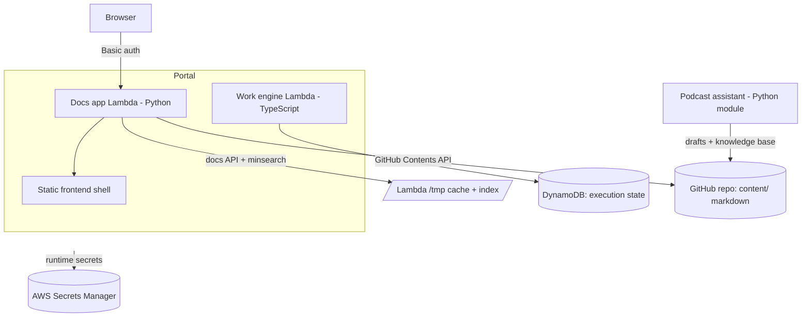
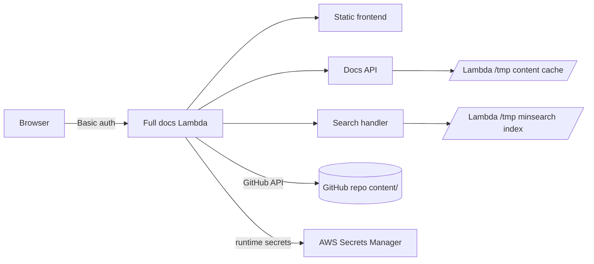

# DataOps

DataOps is the combined DataTalks.Club operations portal.

Version 1 focuses on operations docs and tasks:

- process docs, SOPs, templates, references, playbooks, prompts, and search
- task workflows, bundles, recurring work, required links, and execution state
- AWS Lambda deployment with GitHub Actions OIDC

The deployed V1 app is the DataTalks.Club operations portal for
`ops.dtcdev.click`, served from the `DataTalksClub/dataops` repository and the
`dataops-v1` stack. The work engine lives under `work-engine/` as an internal
DataOps task/workflow module, and the podcast assistant lives under
`assistants/podcast/` as a DataOps assistant module for the podcast operations
workflow.

## Layout

- `content/` — operational documentation (SOPs, templates, references,
  playbooks, prompts) and its image assets.
- `work-engine/` — DataOps task/workflow execution module.
- `assistants/podcast/` — DataOps podcast workflow assistant module, process docs,
  guest-intake template, knowledge-base builder, and tests.
- `docs/` — repo-meta docs (this README, `STRUCTURE.md`, `sop-format*.md`,
  archived materials).
- `_docs/` — DataOps merge plan, development process, and planning notes.
- `frontend/` — static vanilla-JS app and its Dockerfile.
- `lambda-functions/` — AWS Lambda backend (docs API + search index).
- `scripts/` — repo tooling (SOP parser/linter/normalizer, migration scripts,
  the dev server).

## Architecture

DataOps is a portal assembled from four runtime components that share one
repository and one deployment pipeline. GitHub is the source of truth for all
markdown content; execution state lives in DynamoDB.

| Component | Path | Runtime | Responsibility |
|---|---|---|---|
| Frontend shell | `frontend/` | Static vanilla JS | SOP block editor, search UI, filters, publish dialog. No build step; served as static assets. |
| Docs app (Lambda) | `lambda-functions/` | Python (AWS Lambda) | Serves the frontend, docs API, same-origin `minsearch` search, and GitHub-backed content editing from a single Function URL. |
| Work engine | `work-engine/` | TypeScript / Node (Lambda) | Task and workflow execution — bundles, recurring work, required links — backed by DynamoDB. |
| Podcast assistant | `assistants/podcast/` | Python module | Guest-intake, knowledge-base builder, and draft generation for the podcast operations workflow. |



How the pieces fit:

- **Content is GitHub-backed.** Edits made in the UI are committed straight to
  GitHub by the docs Lambda through the Contents API; the Lambda keeps a `/tmp`
  cache and rebuilds the `minsearch` index from it. No SQLite, no EFS.
- **The frontend has no build pipeline** in this milestone — it is static
  vanilla JS served by the Python Lambda in production and by
  `scripts/serve_frontend.py` (the Docker Compose `frontend` service) locally,
  which proxies `/docs`, `/search`, `/health`, `/images`, `/folders`, and
  `/lint` to the docs Lambda.
- **The work engine is the only stateful service**, persisting task/workflow
  execution to DynamoDB; it ships as its own Lambda with a local dev server and
  Playwright E2E suite.
- **The podcast assistant runs as a Python module**, not a web service — it
  drives the podcast intake/drafting workflow and writes into the knowledge base.
- **Infra is SAM/CloudFormation** (templates under `lambda-functions/`),
  deployed by GitHub Actions through an AWS OIDC role; runtime secrets live in
  AWS Secrets Manager rather than GitHub Actions secrets.

The [Architecture Review](#architecture-review) section below covers the
deployed docs Lambda in more detail.

## Planning

- [Portal Analysis](PORTAL_ANALYSIS.md)
- [Shared Project Plan](PROJECT_PLAN.md)
- [Merge Plan](_docs/MERGE_PLAN.md)
- [Development Process](_docs/PROCESS.md)

## Running locally

Use the root Makefile as the preferred command surface:

```bash
make help
make setup
```

For the full local Operations Home path, run the long-lived servers in separate
terminals:

```bash
make dev-work-engine
WORK_ENGINE_DEV_URL=http://127.0.0.1:3000 make dev-docs
make dev-frontend
```

The Docker Compose stack remains available through the Makefile:

```bash
make dev-compose
# Frontend:           http://127.0.0.1:5173
# Lambda upstream:    http://127.0.0.1:8787
```

The frontend container proxies `/docs`, `/search`, `/health`, `/images`,
`/folders`, and `/lint` to the lambda container, and exposes its own
`/git/status` and `/git/commit` so the UI can commit + push using the host's
SSH key (mounted read-only).

## Development commands

`make help` lists the current setup, dev, search, SOP lint, test, SAM
validation/build, and CI-parity targets. These targets are thin wrappers around
the package-local commands documented below so failures stay visible and package
commands remain useful for troubleshooting.

Common verification targets:

```bash
make search-index
make test-docs
make seed-work-engine
make test-work-engine
make typecheck-work-engine
make build-work-engine
make test-work-engine-e2e
make test-assistant
make smoke-docs
make sam-validate
make sam-build
make ci
```

Run `make sop-lint FILES="content/path/to/sop.md"` for marked SOP files.
`make sam-validate` is local template validation only: it uses empty AWS config
and credentials files under `.tmp/aws-empty/`, disables EC2 metadata lookup, and
does not require live AWS credentials or run `sam deploy`.

## Node workspace

DataOps uses npm workspaces from the repository root for Node tooling. The
current workspace is `work-engine/`; `frontend/` remains the static vanilla-JS
portal shell served by the Python Lambda app and does not have a separate Node
package or build pipeline in this milestone.

Install Node dependencies from the repo root:

```bash
npm ci
```

Common work-engine lifecycle commands are available from the root:

```bash
npm run dev:work-engine
npm run test:work-engine
npm run test:e2e:work-engine
npm run typecheck:work-engine
npm run build:work-engine
npm run seed:work-engine
npm run export:templates:work-engine
npm run validate:export:work-engine -- <export-dir>
npm run dry-run:import:work-engine -- <export-dir>
npm run clean:work-engine
```

The Makefile uses these root workspace scripts where they are the daily entry
point, while work-engine test, typecheck, build, and E2E targets continue to
preserve the package-local `npm --prefix work-engine ...` commands required for
debugging and CI parity.

`package-lock.json` at the repo root is the npm lockfile for the workspace. The
work-engine Lambda packaging, CI cache, and Docker Lambda image all use that
root lockfile; there is no nested `work-engine/package-lock.json`.

## Architecture Review

The deployed v1 app is a single protected Lambda app. It serves the frontend,
the docs API, GitHub-backed content editing, and same-origin search from one
Lambda Function URL. GitHub is the source of truth for markdown content;
Lambda keeps a `/tmp` cache and rebuilds the `minsearch` index from that cache.



Content changes made in the UI are committed directly to GitHub by Lambda
through the GitHub Contents API. After a successful save, Lambda refreshes its
GitHub tree cache and rebuilds the local search index. There is no separate
SQLite service and no EFS filesystem in the current design.

CI/CD is split by lifecycle:

- `content/**` changes run content validation, search-index smoke tests, and
  refresh the deployed Lambda cache without redeploying code.
- app, Lambda, infra, and test changes run the full test/build/deploy workflow.
- GitHub Actions deploys through an AWS OIDC role managed by CloudFormation.
- Runtime secrets live in AWS Secrets Manager, not in GitHub Actions secrets.

For the inherited docs-app architecture, see [`docs/architecture.md`](docs/architecture.md).

## What the editor does

- Opens every SOP in a **block view** — Section / Group / Step / Free-form /
  Screenshot / TODO. Click any text to edit inline; Cmd/Ctrl+Enter to commit.
- Add, delete, drag-reorder steps; cross-group moves; convert flat ↔ grouped
  procedures; renumber automatically. Roundtrips through `sop_lint.py`.
- Image upload via file picker, drag-and-drop onto a step, or clipboard paste.
- Frontmatter editor: `doc_type`, summary, tags, systems (chips).
- Pending-changes panel aggregates every local draft; **Save all** from the
  sidebar, then review lint and commit from the publish dialog.
- Search (server-side), tag/system/domain/type filters, quick-nav palette
  (`Cmd/Ctrl+P`), sidebar tree filter, "Recently edited" + "Pinned" sections.
- Diff view between draft and saved version. Lint dashboard for the whole
  corpus in the publish dialog. Loom + YouTube + Vimeo embeds. Lightbox for screenshots.
- Dark mode, resizable sidebar, mobile layout.

## Keyboard shortcuts

- `/` focuses sidebar search.
- `Cmd/Ctrl + K` focuses search from anywhere.
- `Cmd/Ctrl + P` opens quick navigation.
- `Cmd/Ctrl + S` saves the current doc.
- `Cmd/Ctrl + Shift + S` saves all drafts.
- `Cmd/Ctrl + Enter` commits an inline edit.
- `Esc` cancels inline edits and closes modals.
- `?` shows keyboard shortcut help.

## SOP format

Every SOP is structured-markdown with HTML-comment markers (`<!-- sop-section-start: ... -->`
etc.) — invisible on GitHub but machine-readable. See
[`docs/sop-format.md`](docs/sop-format.md) for the strict spec and
[`docs/sop-format-design.md`](docs/sop-format-design.md) for the design log.

Tooling:

- `scripts/sop_parse.py` — parse a marked-up SOP → structured JSON.
- `scripts/sop_lint.py` — validate against the spec.
- `scripts/sop_normalize.py` — convert a legacy SOP into the marker format.

All three share their implementation with `lambda-functions/src/lambda_functions/sop_parse.py`
+ `sop_lint.py`, so the deployed Lambda enforces the same rules as the CLI.
