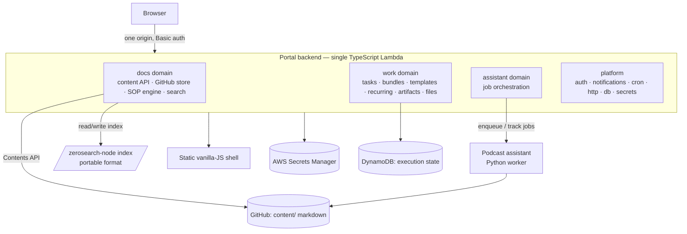

# Target Architecture

Status: proposed (supersedes the "Long-term backend: Python" direction in
`CLAUDE.md` and `_docs/MERGE_PLAN.md` Phase 5).

This document defines the **end state** DataOps is converging toward: one
backend, one deployable runtime, and a clear language boundary only where a
worker genuinely needs it. It is the reference for the backend-consolidation
issue.

> Search libraries — two distinct Python libraries, both maintained by Alexey:
> - **`minsearch`** — TF-IDF + cosine similarity via scikit-learn; pulls in
>   `numpy`/`scipy`/`pandas`; pickled index. This is what the docs backend uses
>   **today**.
> - **`zerosearch`** — a tiny, **zero-dependency** BM25-lite index (pure stdlib,
>   portable `save`/`load`). This is the **target** search engine.
>
> Consolidation migrates docs search from `minsearch` → **`zerosearch-node`**
> (the Node port of `zerosearch`), whose index is compatible with Python
> `zerosearch`. This both removes the heavy scientific-Python stack and gives an
> easy port (BM25-lite is small and dependency-free). Note: rankings shift from
> TF-IDF to BM25-lite; per the `zerosearch` README, recall is on par with
> `minsearch`, ordering differs — an acceptable, deliberate change.

## Decision

**One TypeScript/Node backend.** The work engine (already TypeScript) is the
survivor; the Python docs/SOP backend is ported into it. Search moves from the
Python-only `zerosearch` (TF-IDF via scikit-learn, pickled index) to
**`zerosearch-node`**, a Node port with a **portable, cross-language index
format** so an index built by either implementation loads in the other.

### Why TypeScript, not Python

The earlier plan targeted Python. The dependency analysis reversed it:

- The work engine — the larger (~11.7k src + ~15k tests + Playwright e2e),
  stateful, actively-developed core — is already TypeScript. Porting it to
  Python is the bigger, riskier rewrite.
- The Python backend's only **runtime** third-party deps are `minsearch` and
  `python-frontmatter`. `frontmatter` has a drop-in Node equivalent
  (`gray-matter`); `sop_parse`/`sop_lint` are pure stdlib logic.
- `minsearch` is the heaviest dependency in the whole system — it pulls in
  `scikit-learn` + `numpy` + `scipy` + `pandas`. Replacing it with
  `zerosearch-node` (zero-dependency BM25-lite) **removes** the single largest
  contributor to Lambda package size, cold-start latency, and baseline memory.
- Porting search is **easy**, not hard: `zerosearch` is a single small,
  dependency-free module with a portable `save`/`load`. So no bespoke
  numerical-library reimplementation is required.

Net: TypeScript is the cheaper, lower-risk consolidation **and** the lighter
Lambda, and the search migration is a clean swap rather than a heavy port.

## System



Unchanged from today:

- **GitHub markdown is the source of truth for content.** UI edits commit
  directly via the GitHub Contents API; the Lambda keeps a `/tmp` cache.
- **DynamoDB holds execution state** (tasks, bundles, templates, recurring,
  artifacts, files, sessions, notifications).
- **The frontend stays static vanilla JS**, served by the backend. No framework.
- **Runtime secrets live in AWS Secrets Manager**, not GitHub Actions secrets.
- **Deploy is SAM/CloudFormation via GitHub Actions OIDC.**

Key change: the cross-service `/work/api` proxy disappears — docs and work are
one process. The only remaining language boundary is the **podcast assistant**,
which stays a Python worker (it does AI drafting, not request serving) invoked
through assistant-job records.

## Target repository structure

```
backend/                 # single TS Lambda app  ←  work-engine/ + lambda-functions/ merged
  src/
    docs/                #   content API, GitHub store, SOP parse/lint, search wiring
    work/                #   tasks, bundles, templates, recurring, artifacts, files
    assistant/           #   assistant-job orchestration (enqueue, status, review)
    platform/            #   auth, sessions, notifications, cron, http, db, secrets
    router.ts  handler.ts
  scripts/               # seed, export, migration, + sop CLI (Node; replaces scripts/*.py)
  tests/   e2e/          # node:test + Playwright
frontend/                # static vanilla-JS shell                  (unchanged)
assistants/podcast/      # Python assistant worker                  (unchanged)
content/                 # SOPs & markdown — GitHub source of truth  (unchanged)
infra/                   # SAM/CloudFormation, OIDC, secrets         ←  moved from lambda-functions/
docs/  _docs/            # repo-meta + planning/process docs
```

Removed at the end of consolidation: `lambda-functions/` (ported into
`backend/docs/` + `infra/`), the `work-engine/` name (promoted to `backend/`),
`scripts/*.py` (→ `backend/scripts` TS CLI), `serve_frontend.py` (→ backend dev
server).

## Migration map (old → new)

| Today | Target |
|---|---|
| `work-engine/src/{routes,db,...}` | `backend/src/{work,platform}` |
| `lambda-functions/src/.../{api_handler,github_store,docs_index,local_server}.py` | `backend/src/docs/*` (TS) |
| `lambda-functions/.../{sop_parse,sop_lint}.py` + `scripts/sop_*.py` | `backend/src/docs/sop/*` + `backend/scripts` CLI (TS) |
| `python-frontmatter` | `gray-matter` (npm) |
| `minsearch` (Python, scikit-learn, pickle) | `zerosearch-node` (BM25-lite, portable index) |
| `lambda-functions/template.*.yaml` | `infra/` |
| Python migration tooling (`Pillow`, `openpyxl`, `slugify`, `httpx`) | not ported (one-time); replace only if still needed (`sharp`, `exceljs`, `slugify`, `fetch`) |

## Dependency footprint

**Backend runtime deps after consolidation:** AWS SDK v3
(`@aws-sdk/client-dynamodb`, `lib-dynamodb`, `client-s3`,
`client-secrets-manager`) + `zerosearch-node` + `gray-matter`. Everything else
the docs backend used is Node stdlib (`crypto`, `zlib`, `path`, `url`, etc.).

**Lambda resource impact:** replacing `minsearch` with `zerosearch-node` drops
`scikit-learn`/`numpy`/`scipy`/`pandas` — ~100–250 MB of dependencies and the
multi-second cold start caused by importing them. `zerosearch-node` is
dependency-free, so the backend's runtime tree stays at AWS SDK + `gray-matter`
+ `zerosearch-node`. Node cold start for such a package is typically
~150–300 ms.

## zerosearch-node

Tracked as its own project (`~/git/zerosearch-node`), separate from the in-repo
consolidation. This is the enabling dependency, not a hard numerical port —
`zerosearch` is a small, zero-dependency BM25-lite engine, so the work is a
faithful re-implementation plus index compatibility.

### Requirement

An index built by Python `zerosearch` must load and search in `zerosearch-node`,
and vice versa. `zerosearch` already serializes with a portable `save`/`load`
(it has `save`, `loads(bytes)`, and `load(path)` over a plain `state` dict:
vocab, postings, document store, field config, params) — so cross-language
compatibility is achievable without a pickle problem. `zerosearch-node` reads
and writes the same format.

### What must be built (in `zerosearch-node`)

1. The `Index` API mirroring Python `zerosearch`: `Index(text_fields,
   keyword_fields, ...)`, `.fit(docs)`, `.search(query, filter_dict, boost_dict,
   num_results)`.
2. The BM25-lite scoring used by `zerosearch`: per text field,
   `boost * idf * (term_frequency / sqrt(field_length))`, summed across fields,
   with the same tokenizer (lowercasing, token rules, stop-word list).
3. `save`/`load`/`loads` over the **same portable `state` format** as Python
   `zerosearch`, validated by a cross-language parity test.
4. Keyword-field exact-match filtering and per-field boosts.

The exact scoring constants, tokenizer, and `state` schema are taken from
`~/git/zerosearch/zerosearch/index.py` (the source of truth), not re-derived.

### Validation

Cross-language parity: build an index with Python `zerosearch`, load it in
`zerosearch-node`, and assert identical top-k results for a fixed query set, and
the reverse. That parity suite is the definition of done.

### DataOps adoption

Within DataOps, the docs domain swaps `minsearch` for `zerosearch-node`. Field
config carries over from today's `docs_index.py`:

- text fields & boosts: title(4), summary(3), description(3), purpose(3),
  headings(2), body(1), tags, systems
- keyword fields: path, id, domain, doc_type

Because TF-IDF → BM25-lite changes ranking, re-check the search smoke
tests/fixtures during adoption; recall is expected to hold, ordering may shift.
