# Add books to the Airtable form

<!-- sop-section-start: summary -->
## Summary

- Purpose: Add a Book of the Week book record through the Airtable form.
- Outcome: The book is submitted to the database and ready for the follow-up website script.
- Trigger: A book has been selected for Book of the Week and the author/person record exists.
- Frequency: Whenever a new Book of the Week book is added.
<!-- sop-section-end -->

<!-- sop-section-start: prerequisites -->
## Prerequisites

- Access: Book of the Week Airtable form and the schedule spreadsheet.
- Tools: Airtable form, publisher or book website, schedule spreadsheet.
- Inputs: Author email, title, description, event start date, book page, cover URL or cover file, publisher page, and optional Amazon/GitHub links.
<!-- sop-section-end -->

<!-- sop-section-start: procedure -->
## Procedure

<!-- sop-prose-start -->
How to add books to the Airtable forms
This procedure will show you the steps on how to add books to the Airtable forms.

Step-by-step Instructions
<!-- sop-prose-end -->

<!-- sop-step-start id=1 -->
1.  The first thing you need to do is fill up the "Author's email"

    Note: Adding the [“person” form](https://docs.google.com/document/d/1GsoZjajThPDXm2Nnb98k79Fzg3JSI9cL/edit?usp=sharing&ouid=117889684806099286252&rtpof=true&sd=true) is a prerequisite.

    <!-- sop-screenshot-start -->
    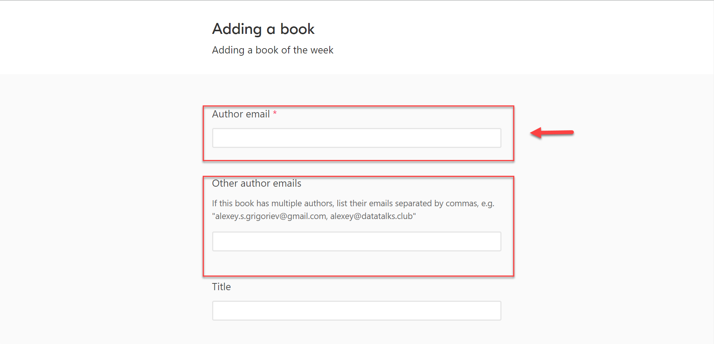
    <!-- sop-caption-start -->
    This screenshot anchors step 1 of the Add books to the Airtable form process by showing the screen for fill up the "Author's email". Look for the red box or arrow around "Author's email", then use that highlighted area as the target for the action before continuing.
    <!-- sop-caption-end -->
    <!-- sop-screenshot-end -->
<!-- sop-step-end -->

<!-- sop-step-start id=2 -->
2.  Next is to add the "Title" and "Description" of the book.

    Note: “Titles” and “Descriptions” of the book can be seen on the publisher's website. You just copy them directly from the website. Normally, the description of the book can be found under the "About the book" column of the website.

    <!-- sop-screenshot-start -->
    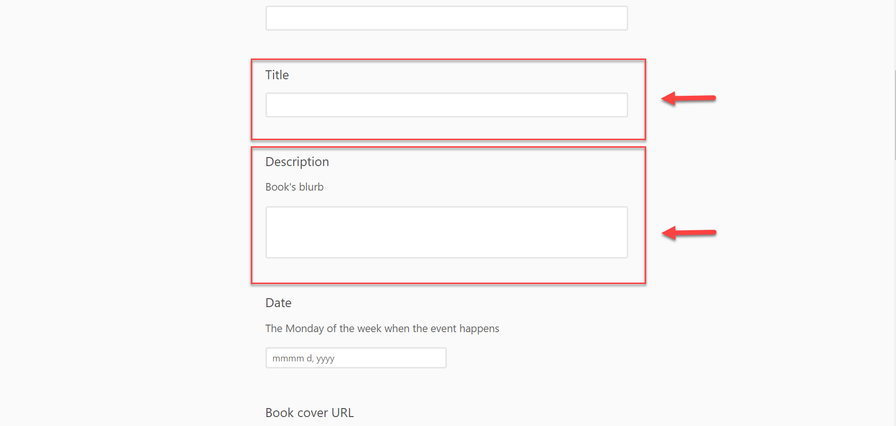
    <!-- sop-caption-start -->
    This screenshot anchors step 2 of the Add books to the Airtable form process by showing the screen for add the "Title" and "Description" of the book. Look for the red boxes or arrows around "Title", "Description", then use that highlighted area as the target for the action before continuing.
    <!-- sop-caption-end -->
    <!-- sop-screenshot-end -->
<!-- sop-step-end -->

<!-- sop-step-start id=3 -->
3.  After, select the "Date" of the event.

    Note: It must be the Monday of the week when the event happens.
    <!-- sop-screenshot-start -->
    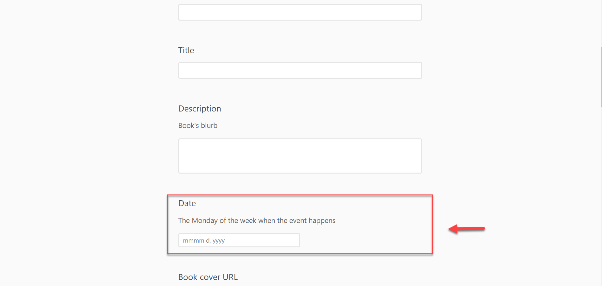
    <!-- sop-caption-start -->
    This screenshot anchors step 3 of the Add books to the Airtable form process by showing the screen for select the "Date" of the event. Look for the red box or arrow around "Date", then use that highlighted area as the target for the action before continuing.
    <!-- sop-caption-end -->
    <!-- sop-screenshot-end -->
<!-- sop-step-end -->

<!-- sop-step-start id=4 -->
4.  And then proceed publisher's website for the “Book cover URL”

    <!-- sop-screenshot-start -->
    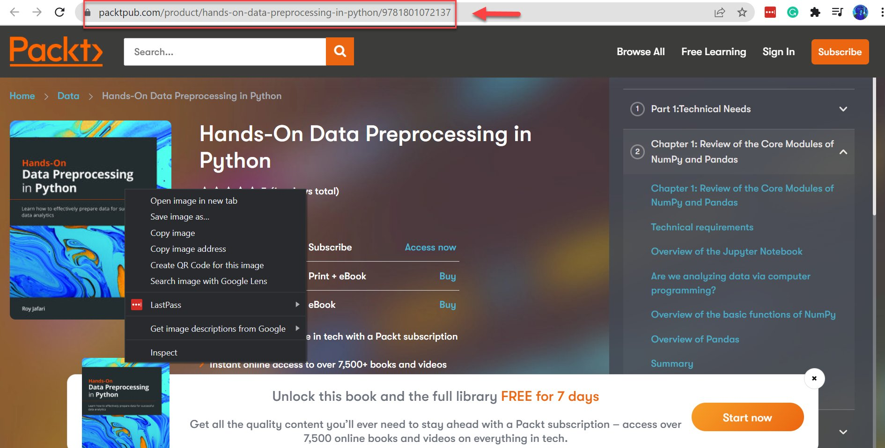
    <!-- sop-caption-start -->
    This screenshot anchors step 4 of the Add books to the Airtable form process by showing the screen for proceed publisher's website for the "Book cover URL". Look for the red box or arrow around "Book cover URL", then use that highlighted area as the target for the action before continuing.
    <!-- sop-caption-end -->
    <!-- sop-screenshot-end -->
<!-- sop-step-end -->

<!-- sop-step-start id=5 -->
5.  To copy the book cover URL, right-click on the image or the book cover and select
    "Copy Image Address"
    <!-- sop-screenshot-start -->
    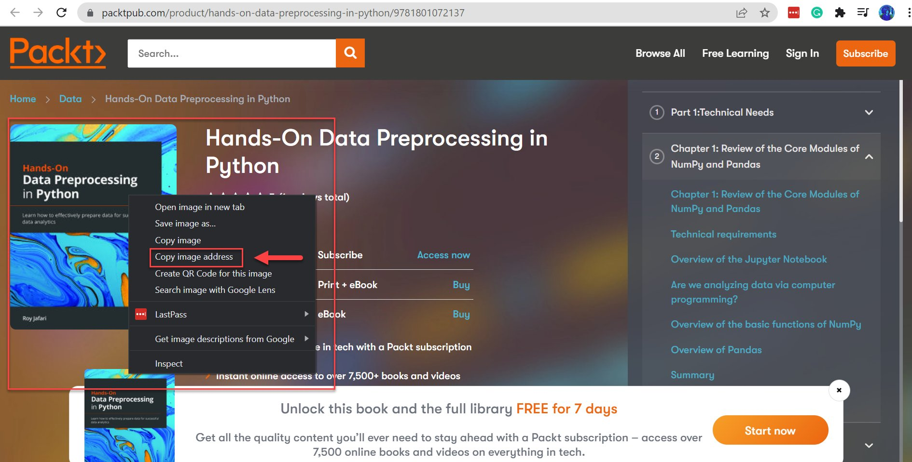
    <!-- sop-caption-start -->
    This screenshot anchors step 5 of the Add books to the Airtable form process by showing the screen for to copy the book cover URL, right click on the image or the book cover and select "Copy Image Address". Look for the red box or arrow around "Copy Image Address", then use that highlighted area as the target for the action before continuing.
    <!-- sop-caption-end -->
    <!-- sop-screenshot-end -->
<!-- sop-step-end -->

<!-- sop-step-start id=6 -->
6.  Then paste it below the "Book cover URL"

    <!-- sop-screenshot-start -->
    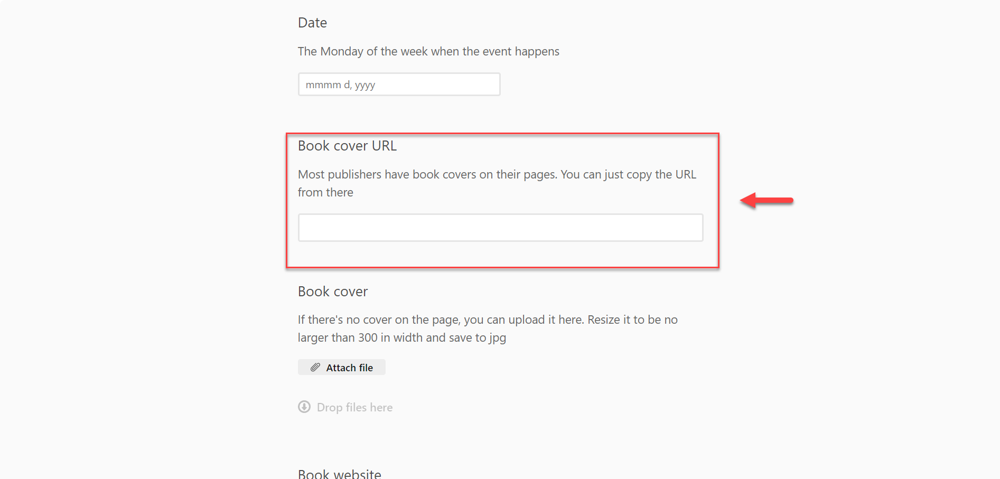
    <!-- sop-caption-start -->
    This screenshot anchors step 6 of the Add books to the Airtable form process by showing the screen for then paste it below the "Book cover URL". Look for the red box or arrow around "Book cover URL", then use that highlighted area as the target for the action before continuing.
    <!-- sop-caption-end -->
    <!-- sop-screenshot-end -->
<!-- sop-step-end -->

<!-- sop-step-start id=7 -->
7.  If there's no cover on the page, you can upload the cover by clicking "Attach file"

    <!-- sop-screenshot-start -->
    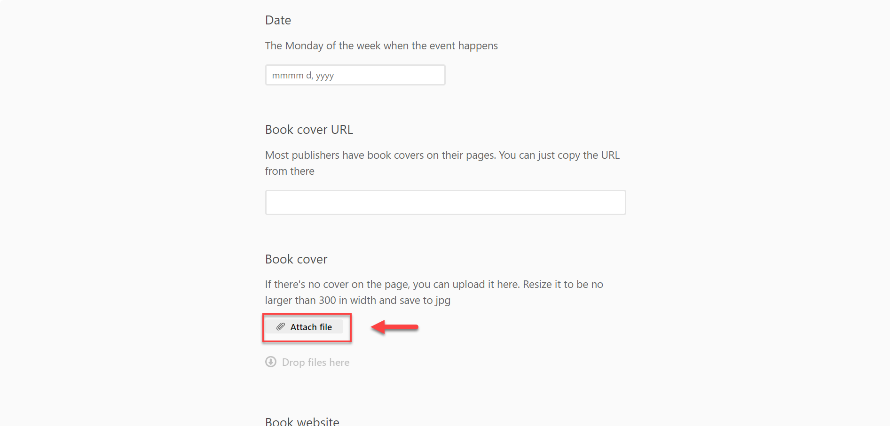
    <!-- sop-caption-start -->
    This screenshot anchors step 7 of the Add books to the Airtable form process by showing the screen for if there's no cover on the page, you can upload the cover by clicking "Attach file". Look for the red box or arrow around "Attach file", then use that highlighted area as the target for the action before continuing.
    <!-- sop-caption-end -->
    <!-- sop-screenshot-end -->
<!-- sop-step-end -->

<!-- sop-step-start id=8 -->
8.  Drag the book cover from your computer.
    Note: If the size of the cover is above 300 pixels in width and height, resize it and save it as .jpg.

    <!-- sop-screenshot-start -->
    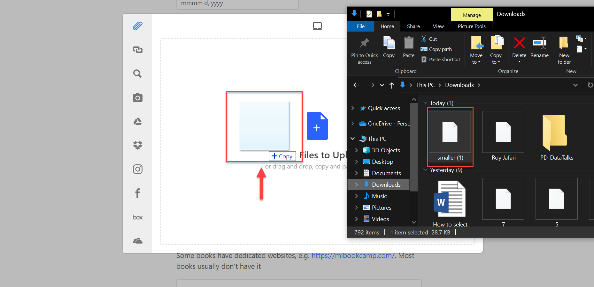
    <!-- sop-caption-start -->
    This screenshot anchors step 8 of the Add books to the Airtable form process by showing the screen for drag the book cover from your computer. Look for the red box, arrow, selected row, or highlighted screen area, then use that highlighted area as the target for the action before continuing.
    <!-- sop-caption-end -->
    <!-- sop-screenshot-end -->
<!-- sop-step-end -->

<!-- sop-step-start id=9 -->
9.  Afterward, paste the book website URL.

    Note: Book websites are dedicated websites for the book. You may ask for the book page URL from the authors. If none, just leave it blank.

    <!-- sop-screenshot-start -->
    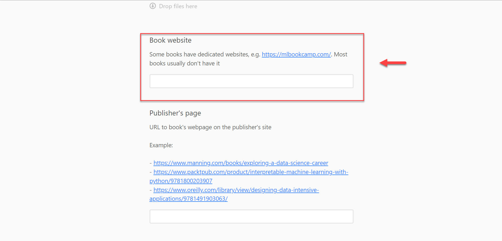
    <!-- sop-caption-start -->
    This screenshot anchors step 9 of the Add books to the Airtable form process by showing the screen for paste the book website URL. Look for the red box, arrow, selected row, or highlighted screen area, then use that highlighted area as the target for the action before continuing.
    <!-- sop-caption-end -->
    <!-- sop-screenshot-end -->
<!-- sop-step-end -->

<!-- sop-step-start id=10 -->
10. Don't forget to paste the publisher's page.

    Note: There is no publisher's page for self-published books. If there is a publisher, you can copy the URL of the book from the publsiher itself. Publishers include: Packt, Manning, O’Reilly.

    <!-- sop-screenshot-start -->
    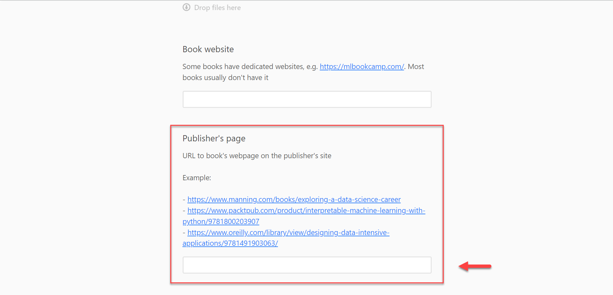
    <!-- sop-caption-start -->
    This screenshot anchors step 10 of the Add books to the Airtable form process by showing the screen for don't forget to paste the publisher's page. Look for the red box or arrow around Publish, then use that highlighted area as the target for the action before continuing.
    <!-- sop-caption-end -->
    <!-- sop-screenshot-end -->
<!-- sop-step-end -->

<!-- sop-step-start id=11 -->
11. The next thing you will be doing is paste the URL of the book's page from Amazon.

    Note: If the book can't be found on amazon, just leave it blank.

    <!-- sop-screenshot-start -->
    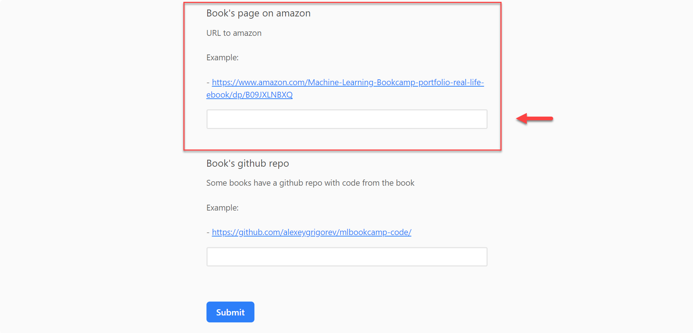
    <!-- sop-caption-start -->
    This screenshot anchors step 11 of the Add books to the Airtable form process by showing the screen for the next thing you will be doing is paste the URL of the book's page from Amazon. Look for the red box or arrow around Next, then use that highlighted area as the target for the action before continuing.
    <!-- sop-caption-end -->
    <!-- sop-screenshot-end -->
<!-- sop-step-end -->

<!-- sop-step-start id=12 -->
12. Next, paste the book's Github repo.

    Note: You may search the GitHub repo through Google or you may ask the author for the link.

    <!-- sop-screenshot-start -->
    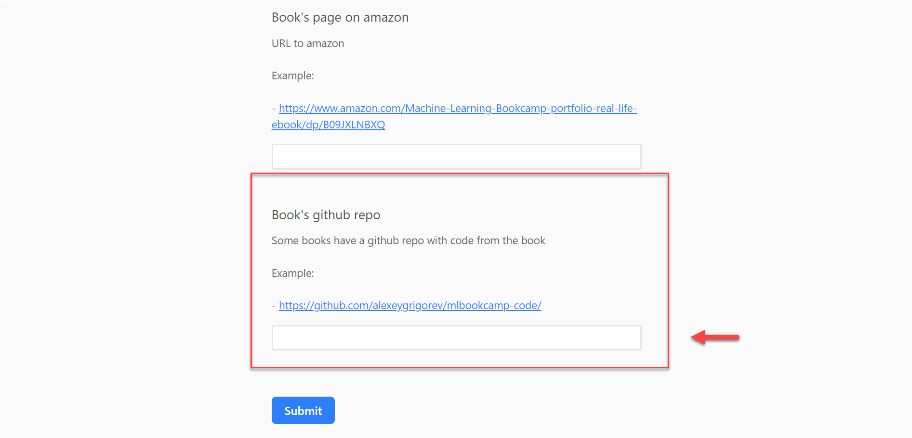
    <!-- sop-caption-start -->
    This screenshot anchors step 12 of the Add books to the Airtable form process by showing the screen for paste the book's Github repo. Look for the red box or arrow around Next, then use that highlighted area as the target for the action before continuing.
    <!-- sop-caption-end -->
    <!-- sop-screenshot-end -->
<!-- sop-step-end -->

<!-- sop-step-start id=13 -->
13. After reviewing your work, click “Submit”

    <!-- sop-screenshot-start -->
    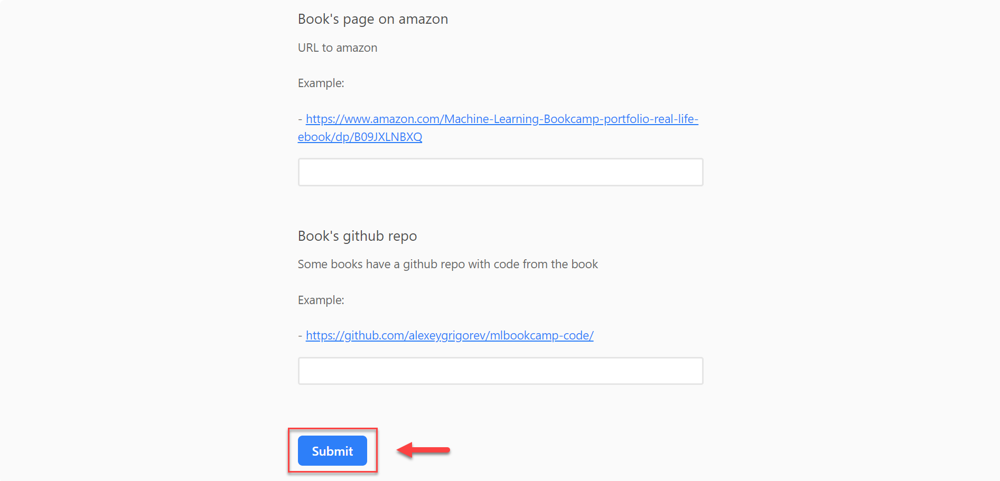
    <!-- sop-caption-start -->
    This screenshot anchors step 13 of the Add books to the Airtable form process by showing the screen for after reviewing your work, click "Submit". Look for the red box or arrow around "Submit", then use that highlighted area as the target for the action before continuing.
    <!-- sop-caption-end -->
    <!-- sop-screenshot-end -->
<!-- sop-step-end -->
<!-- sop-section-end -->

<!-- sop-section-start: validation -->
## Validation

-
<!-- sop-section-end -->

<!-- sop-section-start: troubleshooting -->
## Troubleshooting

-
<!-- sop-section-end -->

<!-- sop-section-start: references -->
## References

-
<!-- sop-section-end -->
