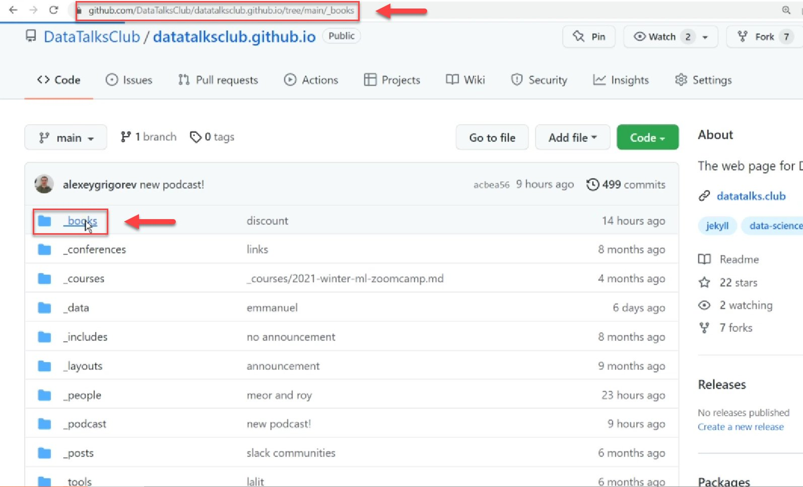
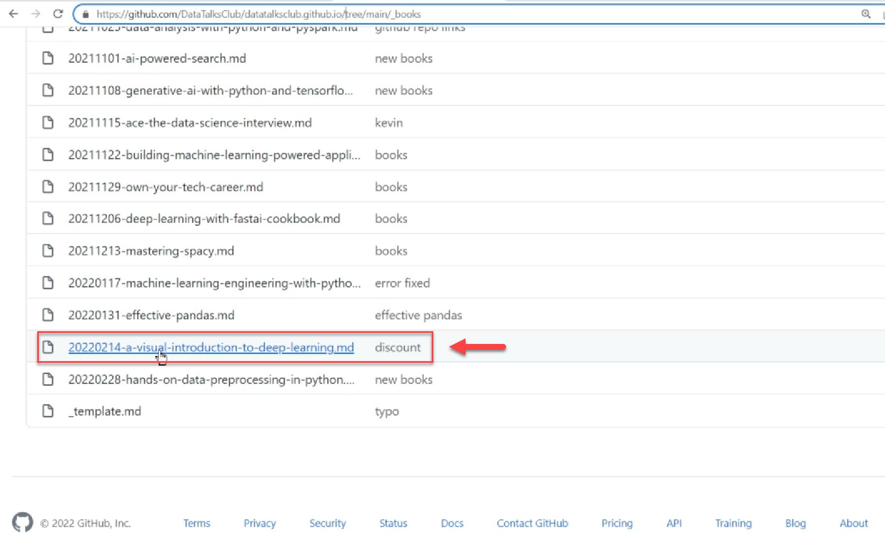
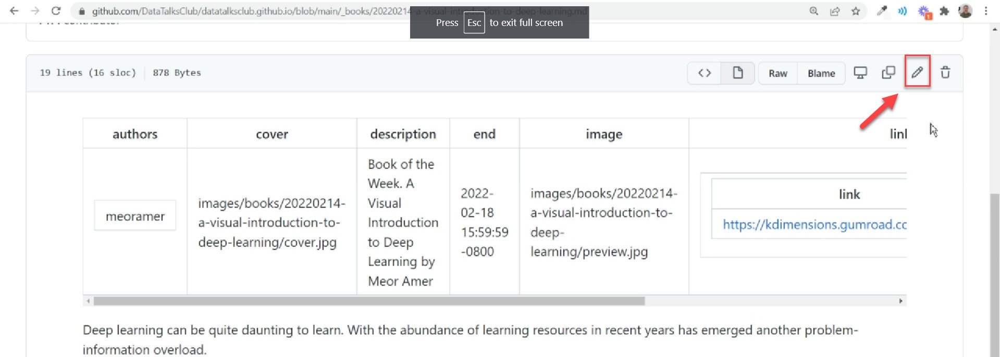
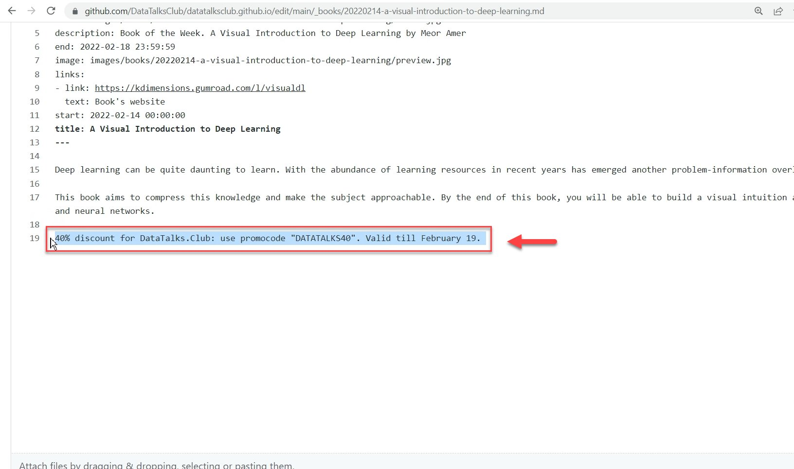
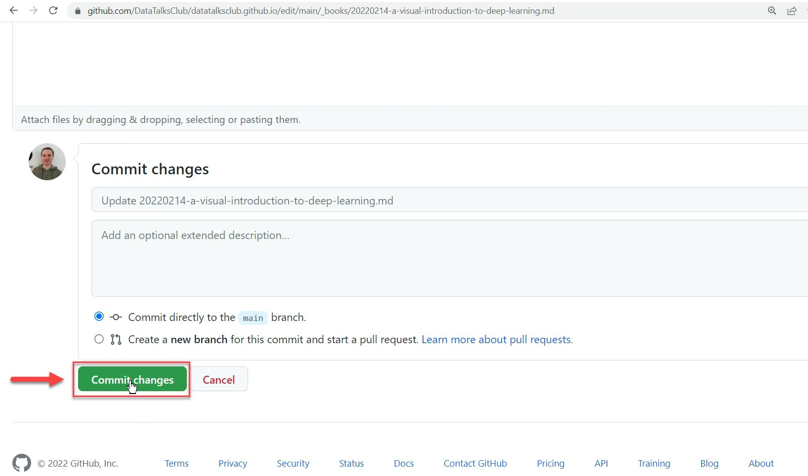

# Add links and edit description

<!-- sop-section-start: summary -->
## Summary

- Purpose:
- Outcome:
- Trigger:
- Frequency:
<!-- sop-section-end -->

<!-- sop-section-start: prerequisites -->
## Prerequisites

- Access:
- Tools:
- Inputs:
<!-- sop-section-end -->

<!-- sop-section-start: procedure -->
## Procedure

<!-- sop-prose-start -->
How to add links and edit descriptions
This procedure will show you the steps on how to add links and edit descriptions

Step-by-step Instructions
<!-- sop-prose-end -->

<!-- sop-step-start id=1 -->
1.  The first thing you need to do is visit DataTalksClub's GitHub and select "\_books"

    <!-- sop-screenshot-start -->
    
    <!-- sop-caption-start -->
    This screenshot anchors step 1 of the Add links and edit description process by showing the screen for visit DataTalksClub's GitHub and select "\ books". Look for the red box or arrow around "\ books", then use that highlighted area as the target for the action before continuing.
    <!-- sop-caption-end -->
    <!-- sop-screenshot-end -->
<!-- sop-step-end -->

<!-- sop-step-start id=2 -->
2.  And then, click the book you want to add the link and description.

    Note: Make sure to double-check the name of the book and the date of the event.

    <!-- sop-screenshot-start -->
    
    <!-- sop-caption-start -->
    This screenshot anchors step 2 of the Add links and edit description process by showing the screen for , click the book you want to add the link and description. Look for the red box or arrow around Add, then use that highlighted area as the target for the action before continuing.
    <!-- sop-caption-end -->
    <!-- sop-screenshot-end -->
<!-- sop-step-end -->

<!-- sop-step-start id=3 -->
3.  Next is select the pen tool icon on the upper right of your screen.

    <!-- sop-screenshot-start -->
    
    <!-- sop-caption-start -->
    This screenshot anchors step 3 of the Add links and edit description process by showing the screen for next is select the pen tool icon on the upper right of your screen. Look for the red box or arrow around Next, then use that highlighted area as the target for the action before continuing.
    <!-- sop-caption-end -->
    <!-- sop-screenshot-end -->
<!-- sop-step-end -->

<!-- sop-step-start id=4 -->
4.  And now, add the links and edit the description of the book.

    <!-- sop-screenshot-start -->
    
    <!-- sop-caption-start -->
    This screenshot anchors step 4 of the Add links and edit description process by showing the screen for and now, add the links and edit the description of the book. Look for the red box or arrow around Add, Edit, then use that highlighted area as the target for the action before continuing.
    <!-- sop-caption-end -->
    <!-- sop-screenshot-end -->
<!-- sop-step-end -->

<!-- sop-step-start id=5 -->
5.  Lastly, click on " Commit changes"

    <!-- sop-screenshot-start -->
    
    <!-- sop-caption-start -->
    This screenshot anchors step 5 of the Add links and edit description process by showing the screen for click on " Commit changes". Look for the red box or arrow around "Commit changes", then use that highlighted area as the target for the action before continuing.
    <!-- sop-caption-end -->
    <!-- sop-screenshot-end -->
<!-- sop-step-end -->
<!-- sop-section-end -->

<!-- sop-section-start: validation -->
## Validation

-
<!-- sop-section-end -->

<!-- sop-section-start: troubleshooting -->
## Troubleshooting

-
<!-- sop-section-end -->

<!-- sop-section-start: references -->
## References

-
<!-- sop-section-end -->
