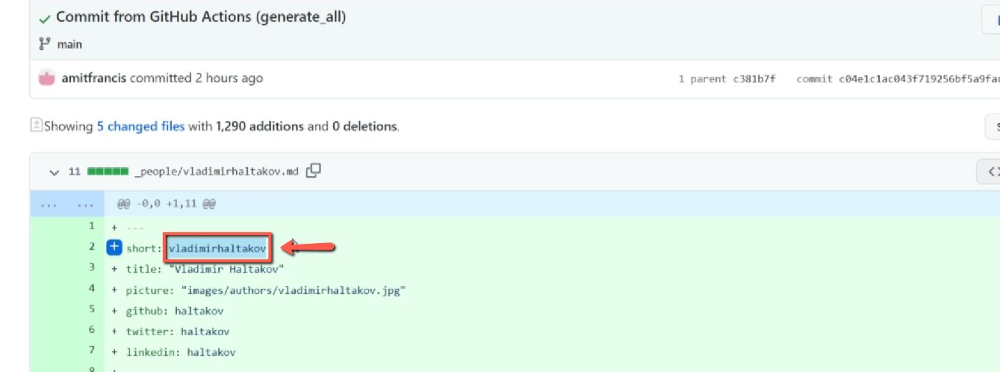
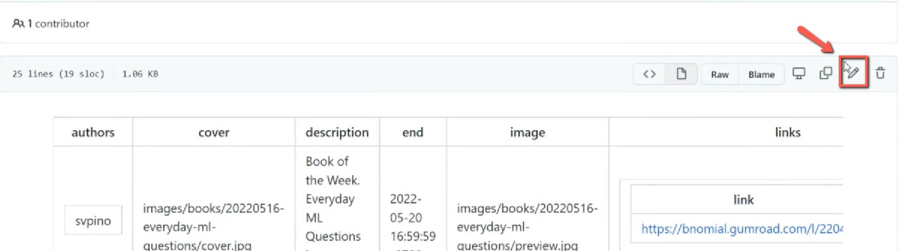
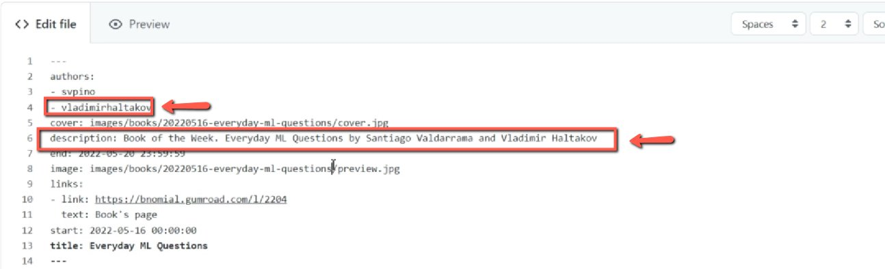
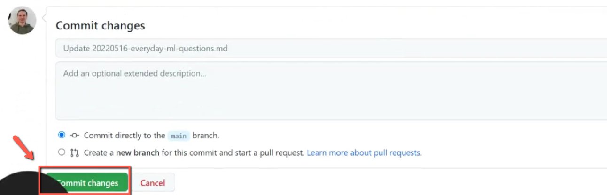

# Adding an author to book of the week pages

<!-- sop-section-start: summary -->
## Summary

- Purpose: Add a Book of the Week author to the DataTalks.Club website book page.
- Outcome: The book page includes the new author and the change is committed in GitHub.
- Trigger: An author has been added through the Airtable form.
- Frequency: Whenever a Book of the Week page needs a new author.
<!-- sop-section-end -->

<!-- sop-section-start: prerequisites -->
## Prerequisites

- Access: DataTalks.Club GitHub repository and the Airtable author record.
- Tools: GitHub, Airtable.
- Inputs: Author name and the book page to update.
<!-- sop-section-end -->

<!-- sop-section-start: procedure -->
## Procedure

<!-- sop-prose-start -->
How to add an author to the book of the week pages
This procedure will show you the steps on how to add an author to book of the week pages

Step-by-step Instructions
<!-- sop-prose-end -->

<!-- sop-step-start id=1 -->
1.  After adding an author form via Airtable the next thing you will do is open DataTalks.Club's Github repo and copy the name of the added author

    <!-- sop-screenshot-start -->
    
    <!-- sop-caption-start -->
    This screenshot anchors step 1 of the Adding an author to book of the week pages process by showing the screen for after adding an author form via Airtable the next thing you will do is open DataTalks.Club's Github repo and copy. Look for the red box or arrow around Next, Open, then use that highlighted area as the target for the action before continuing.
    <!-- sop-caption-end -->
    <!-- sop-screenshot-end -->
<!-- sop-step-end -->

<!-- sop-step-start id=2 -->
2.  And then, go to "\_books"

    <!-- sop-screenshot-start -->
    
    <!-- sop-caption-start -->
    This screenshot anchors step 2 of the Adding an author to book of the week pages process by showing the screen for , go to "\ books". Look for the red box or arrow around "\ books", then use that highlighted area as the target for the action before continuing.
    <!-- sop-caption-end -->
    <!-- sop-screenshot-end -->
<!-- sop-step-end -->

<!-- sop-step-start id=3 -->
3.  Find and select the book you want to edit

    <!-- sop-screenshot-start -->
    
    <!-- sop-caption-start -->
    This screenshot anchors step 3 of the Adding an author to book of the week pages process by showing the screen for find and select the book you want to edit. Look for the red box or arrow around Edit, then use that highlighted area as the target for the action before continuing.
    <!-- sop-caption-end -->
    <!-- sop-screenshot-end -->
<!-- sop-step-end -->

<!-- sop-step-start id=4 -->
4.  After, click the pen edit tool icon on the right side of your screen

    <!-- sop-screenshot-start -->
    
    <!-- sop-caption-start -->
    This screenshot anchors step 4 of the Adding an author to book of the week pages process by showing the screen for click the pen edit tool icon on the right side of your screen. Look for the red box or arrow around Edit, then use that highlighted area as the target for the action before continuing.
    <!-- sop-caption-end -->
    <!-- sop-screenshot-end -->
<!-- sop-step-end -->

<!-- sop-step-start id=5 -->
5.  Under "authors:". add the name of the new author and in the "description" add also

    the name.

    <!-- sop-screenshot-start -->
    
    <!-- sop-caption-start -->
    This screenshot anchors step 5 of the Adding an author to book of the week pages process by showing the screen for under "authors:". add the name of the new author and in the "description" add also the name. Look for the red boxes or arrows around "authors", "description", then use that highlighted area as the target for the action before continuing.
    <!-- sop-caption-end -->
    <!-- sop-screenshot-end -->
<!-- sop-step-end -->

<!-- sop-step-start id=6 -->
6.  After adding, click "Commit changes"

    <!-- sop-screenshot-start -->
    
    <!-- sop-caption-start -->
    This screenshot anchors step 6 of the Adding an author to book of the week pages process by showing the screen for after adding, click "Commit changes". Look for the red box or arrow around "Commit changes", then use that highlighted area as the target for the action before continuing.
    <!-- sop-caption-end -->
    <!-- sop-screenshot-end -->
<!-- sop-step-end -->
<!-- sop-section-end -->

<!-- sop-section-start: validation -->
## Validation

-
<!-- sop-section-end -->

<!-- sop-section-start: troubleshooting -->
## Troubleshooting

-
<!-- sop-section-end -->

<!-- sop-section-start: references -->
## References

-
<!-- sop-section-end -->
