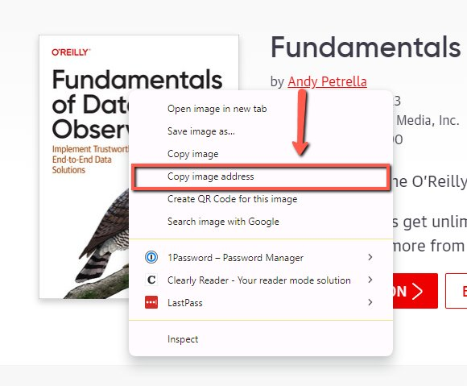

# Adding Book Covers

<!-- sop-section-start: summary -->
## Summary

- Purpose:
- Outcome:
- Trigger:
- Frequency:
<!-- sop-section-end -->

<!-- sop-section-start: prerequisites -->
## Prerequisites

- Access:
- Tools:
- Inputs:
<!-- sop-section-end -->

<!-- sop-section-start: procedure -->
## Procedure

<!-- sop-prose-start -->
How to Add Book Covers
This procedure will show you the steps on how to add Book Covers

Step-by-step Instructions
<!-- sop-prose-end -->

<!-- sop-step-start id=1 -->
1.  The first thing you need to do is open the book’s publisher page.

    <!-- sop-screenshot-start -->
    
    <!-- sop-caption-start -->
    This screenshot anchors step 1 of the Adding Book Covers process by showing the screen for open the book's publisher page. Look for the red box or arrow around Publish, Open, then use that highlighted area as the target for the action before continuing.
    <!-- sop-caption-end -->
    <!-- sop-screenshot-end -->
<!-- sop-step-end -->

<!-- sop-step-start id=2 -->
2.  And then, right-click the book cover, and select “Copy Image address”

    Note: You also have an option to save the image.

    <!-- sop-screenshot-start -->
    
    <!-- sop-caption-start -->
    This screenshot anchors step 2 of the Adding Book Covers process by showing the screen for , right click the book cover, and select "Copy Image address". Look for the red box or arrow around "Copy Image address", then use that highlighted area as the target for the action before continuing.
    <!-- sop-caption-end -->
    <!-- sop-screenshot-end -->
<!-- sop-step-end -->

<!-- sop-step-start id=3 -->
3.  And paste the copied link in the [airtable](https://airtable.com/app7NCWvFj6Wz0ASm/shrtjCro3oCs3NgpA) form for adding books in the book of the week event.

    <!-- sop-screenshot-start -->
    
    <!-- sop-caption-start -->
    This screenshot anchors step 3 of the Adding Book Covers process by showing the screen for and paste the copied link in the airtable form for adding books in the book of the week event. Look for the red box or arrow around Add, then use that highlighted area as the target for the action before continuing.
    <!-- sop-caption-end -->
    <!-- sop-screenshot-end -->
<!-- sop-step-end -->
<!-- sop-section-end -->

<!-- sop-section-start: validation -->
## Validation

-
<!-- sop-section-end -->

<!-- sop-section-start: troubleshooting -->
## Troubleshooting

-
<!-- sop-section-end -->

<!-- sop-section-start: references -->
## References

-
<!-- sop-section-end -->
