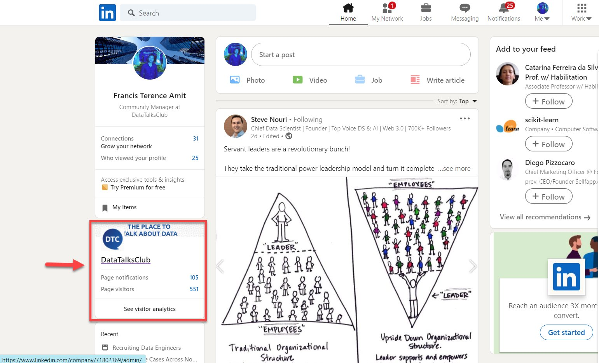
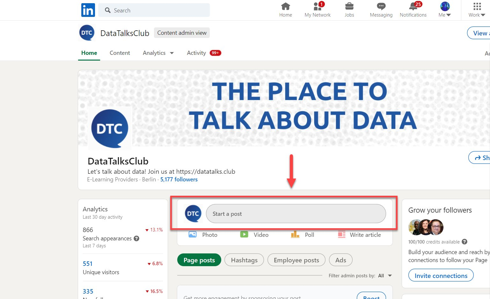
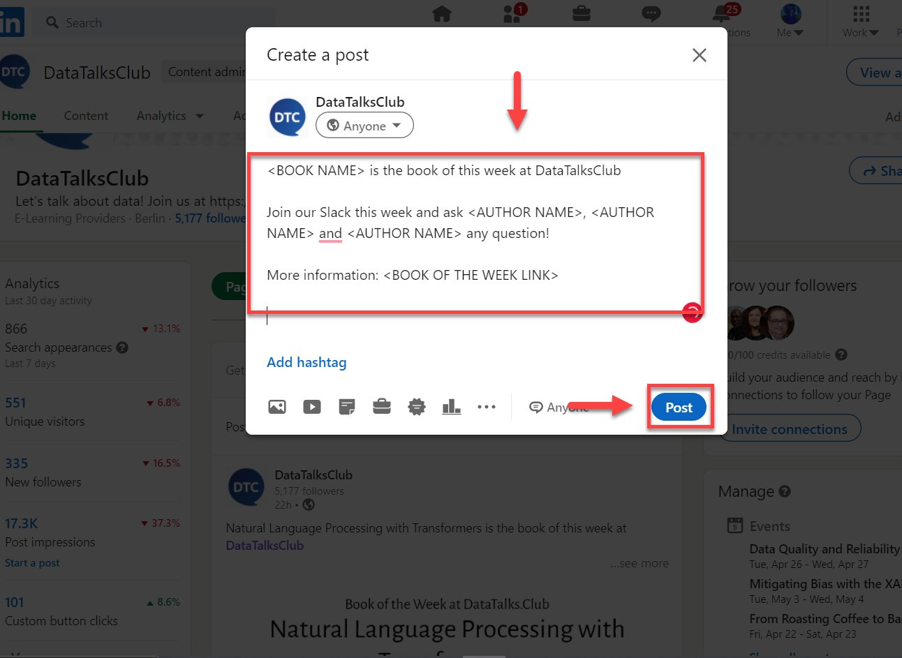

# Announce book of the week announcement on LinkedIn

<!-- sop-section-start: summary -->
## Summary

- Purpose:
- Outcome:
- Trigger:
- Frequency:
<!-- sop-section-end -->

<!-- sop-section-start: prerequisites -->
## Prerequisites

- Access:
- Tools:
- Inputs:
<!-- sop-section-end -->

<!-- sop-section-start: procedure -->
## Procedure

<!-- sop-prose-start -->
How to announce the book of the week announcement on LinkedIn
This procedure will show you the steps on how to announce the book of the week announcement on LinkedIn

Step-by-step Instructions
<!-- sop-prose-end -->

<!-- sop-step-start id=1 -->
1.  The first thing you need to do is open DataTalks.Club LinkedIn account

    <!-- sop-screenshot-start -->
    
    <!-- sop-caption-start -->
    This screenshot anchors step 1 of the Announce book of the week announcement on LinkedIn process by showing the screen for open DataTalks.Club LinkedIn account. Look for the red box or arrow around Open, then use that highlighted area as the target for the action before continuing.
    <!-- sop-caption-end -->
    <!-- sop-screenshot-end -->
<!-- sop-step-end -->

<!-- sop-step-start id=2 -->
2.  And then click on “Start a post”

    <!-- sop-screenshot-start -->
    
    <!-- sop-caption-start -->
    This screenshot anchors step 2 of the Announce book of the week announcement on LinkedIn process by showing the screen for click on "Start a post". Look for the red box or arrow around "Start a post", then use that highlighted area as the target for the action before continuing.
    <!-- sop-caption-end -->
    <!-- sop-screenshot-end -->
<!-- sop-step-end -->

<!-- sop-step-start id=3 -->
3.  Paste the [template](https://docs.google.com/document/d/1VCRVVhI7Lo4OOAg7Blkab94gyoJrjNRgBVKw3tjbxW4/edit?usp=sharing) and edit the necessary information. This includes the Title of the book, the author's name, and the link to the book from [DataTalks.Club website](https://datatalks.club/) and then click “Post”

    Note: Follow punctuation mark rules and space in editing the description.

    <!-- sop-screenshot-start -->
    
    <!-- sop-caption-start -->
    This screenshot anchors step 3 of the Announce book of the week announcement on LinkedIn process by showing the screen for paste the template and edit the necessary information. This includes the Title of the book, the author's name, and. Look for the red box or arrow around "Post", then use that highlighted area as the target for the action before continuing.
    <!-- sop-caption-end -->
    <!-- sop-screenshot-end -->

    Loom link: no loom link
<!-- sop-step-end -->
<!-- sop-section-end -->

<!-- sop-section-start: validation -->
## Validation

-
<!-- sop-section-end -->

<!-- sop-section-start: troubleshooting -->
## Troubleshooting

-
<!-- sop-section-end -->

<!-- sop-section-start: references -->
## References

-
<!-- sop-section-end -->
