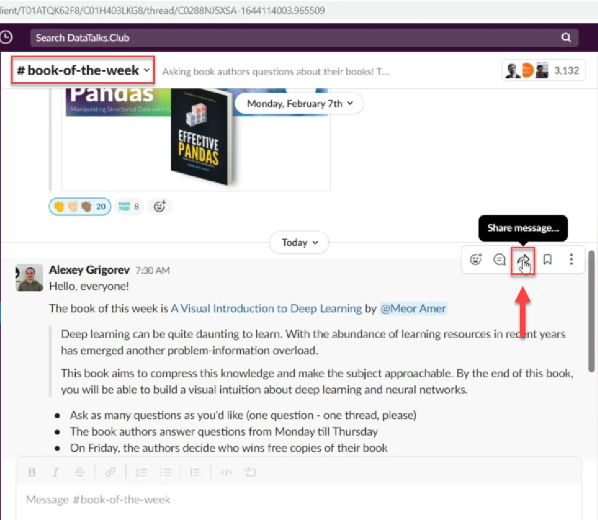
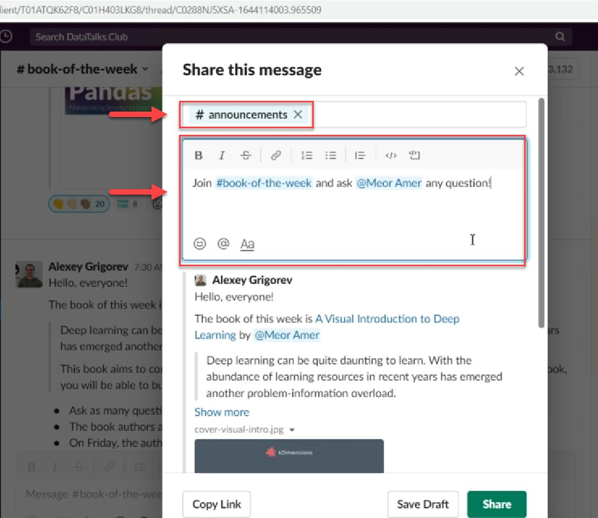
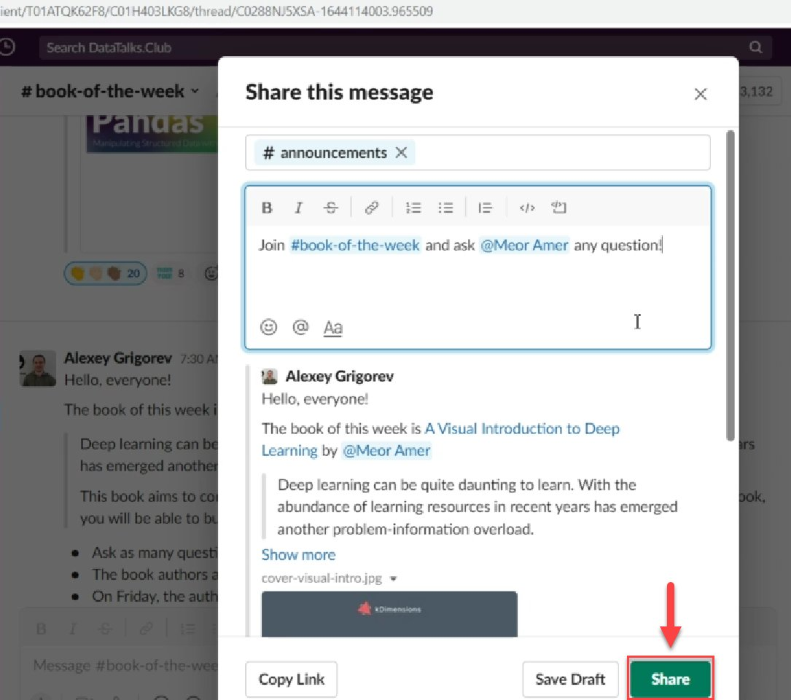

# Announce the book-of-the-week event

<!-- sop-section-start: summary -->
## Summary

- Purpose:
- Outcome:
- Trigger:
- Frequency:
<!-- sop-section-end -->

<!-- sop-section-start: prerequisites -->
## Prerequisites

- Access:
- Tools:
- Inputs:
<!-- sop-section-end -->

<!-- sop-section-start: procedure -->
## Procedure

<!-- sop-prose-start -->
How to announce the book-of-the-week event
This procedure will show you the steps on how to announce the book-of-the-week event.

Step-by-step Instructions
<!-- sop-prose-end -->

<!-- sop-step-start id=1 -->
1.  In the channel “#book-of-the-week”, hover on the announcement and click on the "Share message" icon.

    <!-- sop-screenshot-start -->
    
    <!-- sop-caption-start -->
    This screenshot anchors step 1 of the Announce the book of the week event process by showing the screen for in the channel " book of the week", hover on the announcement and click on the "Share message" icon. Look for the red boxes or arrows around "book of the week", "Share message", then use that highlighted area as the target for the action before continuing.
    <!-- sop-caption-end -->
    <!-- sop-screenshot-end -->
<!-- sop-step-end -->

<!-- sop-step-start id=2 -->
2.  After, enter "#announcement" on the space provided and then add some information about the book-of-the-week event.

    <!-- sop-screenshot-start -->
    
    <!-- sop-caption-start -->
    This screenshot anchors step 2 of the Announce the book of the week event process by showing the screen for enter " announcement" on the space provided and then add some information about the book of the week event. Look for the red box or arrow around "announcement", then use that highlighted area as the target for the action before continuing.
    <!-- sop-caption-end -->
    <!-- sop-screenshot-end -->
<!-- sop-step-end -->

<!-- sop-step-start id=3 -->
3.  Lastly, click "Share"

    <!-- sop-screenshot-start -->
    
    <!-- sop-caption-start -->
    This screenshot anchors step 3 of the Announce the book of the week event process by showing the screen for click "Share". Look for the red box or arrow around "Share", then use that highlighted area as the target for the action before continuing.
    <!-- sop-caption-end -->
    <!-- sop-screenshot-end -->
<!-- sop-step-end -->
<!-- sop-section-end -->

<!-- sop-section-start: validation -->
## Validation

-
<!-- sop-section-end -->

<!-- sop-section-start: troubleshooting -->
## Troubleshooting

-
<!-- sop-section-end -->

<!-- sop-section-start: references -->
## References

-
<!-- sop-section-end -->
