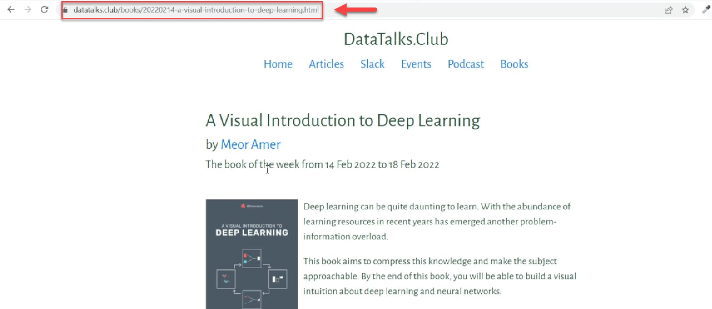
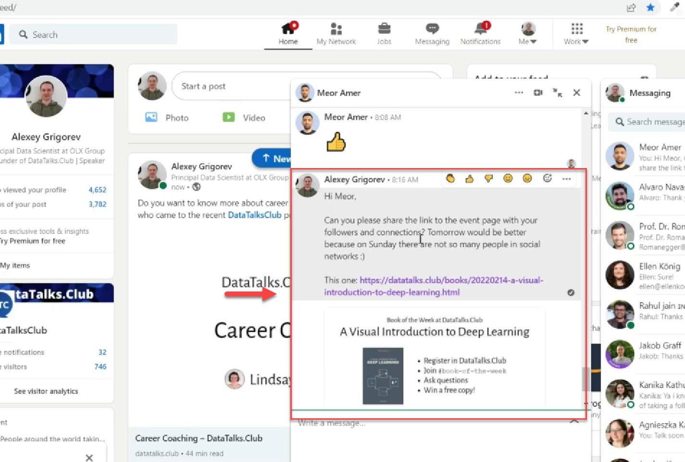

# Ask book authors to share their the event page

<!-- sop-section-start: summary -->
## Summary

- Purpose:
- Outcome:
- Trigger:
- Frequency:
<!-- sop-section-end -->

<!-- sop-section-start: prerequisites -->
## Prerequisites

- Access:
- Tools:
- Inputs:
<!-- sop-section-end -->

<!-- sop-section-start: procedure -->
## Procedure

<!-- sop-prose-start -->
How to ask book authors to share the event page
This procedure will show you the steps on how to ask book authors to share the event page.

Step-by-step Instructions
<!-- sop-prose-end -->

<!-- sop-step-start id=1 -->
1.  The first thing you will be doing is copy the URL of the event page from the webpage:
    DataTalks.Club.
    <!-- sop-screenshot-start -->
    
    <!-- sop-caption-start -->
    This screenshot anchors step 1 of the Ask book authors to share their the event page process by showing the screen for the first thing you will be doing is copy the URL of the event page from the webpage: DataTalks.Club. Look for the red box, arrow, selected row, or highlighted screen area, then use that highlighted area as the target for the action before continuing.
    <!-- sop-caption-end -->
    <!-- sop-screenshot-end -->
<!-- sop-step-end -->

<!-- sop-step-start id=2 -->
2.  And then, ask the book author to share the event page with the link copied and

    Note: You can contact the author through email, LinkedIn, or any other platform.

    <!-- sop-screenshot-start -->
    
    <!-- sop-caption-start -->
    This screenshot anchors step 2 of the Ask book authors to share their the event page process by showing the screen for , ask the book author to share the event page with the link copied and. Look for the red box or arrow around Share, then use that highlighted area as the target for the action before continuing.
    <!-- sop-caption-end -->
    <!-- sop-screenshot-end -->
<!-- sop-step-end -->
<!-- sop-section-end -->

<!-- sop-section-start: validation -->
## Validation

-
<!-- sop-section-end -->

<!-- sop-section-start: troubleshooting -->
## Troubleshooting

-
<!-- sop-section-end -->

<!-- sop-section-start: references -->
## References

-
<!-- sop-section-end -->
