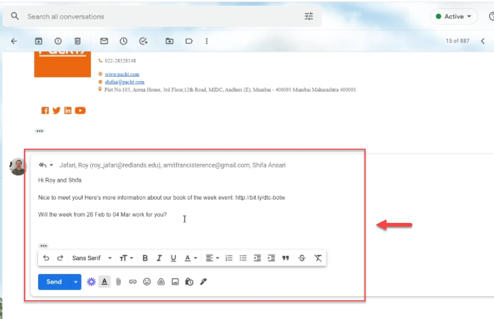
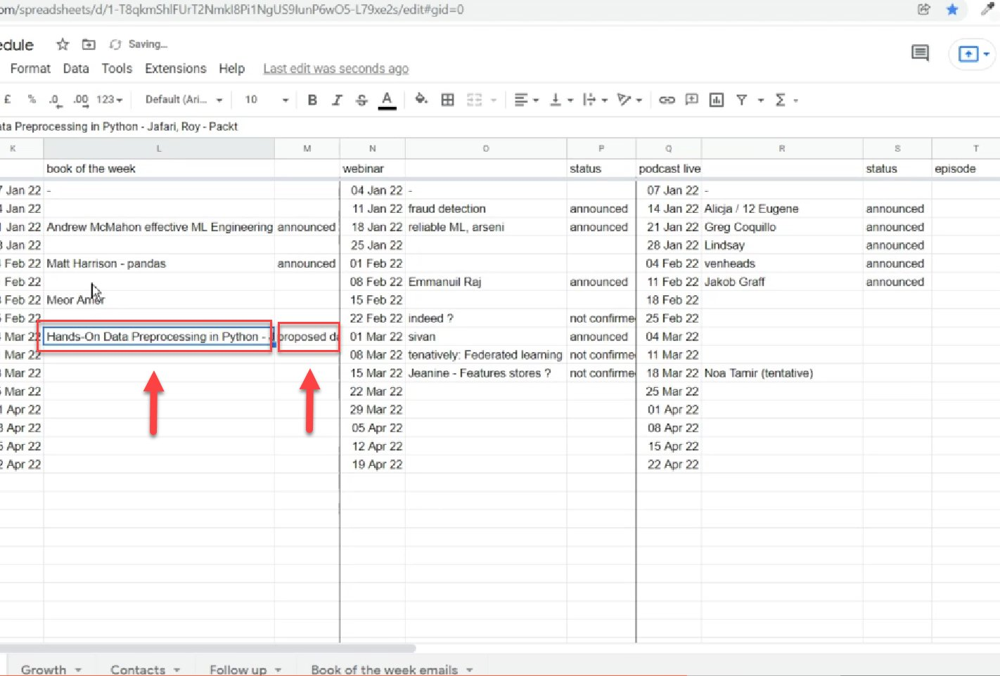
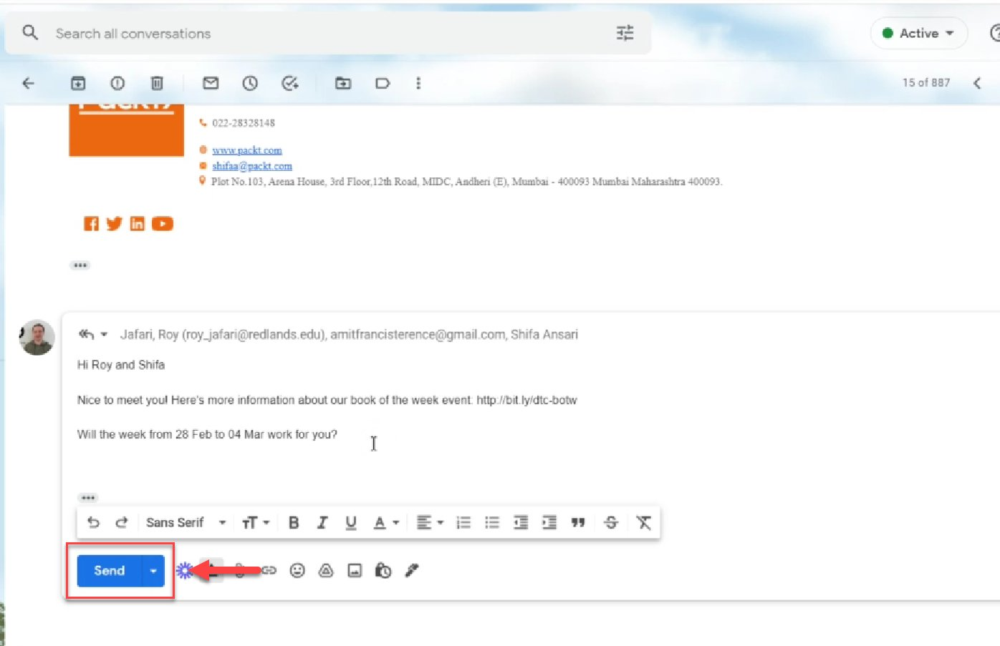

# Have a first contact with the author

<!-- sop-section-start: summary -->
## Summary

- Purpose:
- Outcome:
- Trigger:
- Frequency:
<!-- sop-section-end -->

<!-- sop-section-start: prerequisites -->
## Prerequisites

- Access:
- Tools:
- Inputs:
<!-- sop-section-end -->

<!-- sop-section-start: procedure -->
## Procedure

<!-- sop-prose-start -->
How to have a first contact with the author
This procedure will show you the steps on how to have a first contact with the author.

Step-by-step Instructions
<!-- sop-prose-end -->

<!-- sop-step-start id=1 -->
1.  The first thing you will be doing is email the book author and propose the tentative
    the date that is suitable for the book-of-the-week event.
    Note: You can navigate the dates by going to the google spreadsheet: [DataTalks.Club schedule](https://docs.google.com/spreadsheets/d/1-T8qkmShlFUrT2NmkI8Pi1NgUS9IunP6wO5-L79xe2s/edit?usp=drive_link)

    When proposing a date for the next Book of the Week event, ensure there is at least a one-week gap after the previous event.

    Example:

    If Machine Learning Algorithms in Depth is scheduled for September 08–12, the next available slot should be September 22–26.

    <!-- sop-screenshot-start -->
    
    <!-- sop-caption-start -->
    This screenshot anchors step 1 of the Have a first contact with the author process by showing the screen for the first thing you will be doing is email the book author and propose the tentative the date that is suitable for. Look for the red box or arrow around Next, then use that highlighted area as the target for the action before continuing.
    <!-- sop-caption-end -->
    <!-- sop-screenshot-end -->
<!-- sop-step-end -->

<!-- sop-step-start id=2 -->
2.  And then, update the google spreadsheet by typing the name of the author and the name of the book beside the proposed date and type "proposed date”

    <!-- sop-screenshot-start -->
    
    <!-- sop-caption-start -->
    This screenshot anchors step 2 of the Have a first contact with the author process by showing the screen for , update the google spreadsheet by typing the name of the author and the name of the book beside the proposed date. Look for the red box or arrow around "proposed date", then use that highlighted area as the target for the action before continuing.
    <!-- sop-caption-end -->
    <!-- sop-screenshot-end -->
<!-- sop-step-end -->

<!-- sop-step-start id=3 -->
3.  After proposing the tentative date, click "Send"

    <!-- sop-screenshot-start -->
    
    <!-- sop-caption-start -->
    This screenshot anchors step 3 of the Have a first contact with the author process by showing the screen for after proposing the tentative date, click "Send". Look for the red box or arrow around "Send", then use that highlighted area as the target for the action before continuing.
    <!-- sop-caption-end -->
    <!-- sop-screenshot-end -->
<!-- sop-step-end -->
<!-- sop-section-end -->

<!-- sop-section-start: validation -->
## Validation

-
<!-- sop-section-end -->

<!-- sop-section-start: troubleshooting -->
## Troubleshooting

-
<!-- sop-section-end -->

<!-- sop-section-start: references -->
## References

-
<!-- sop-section-end -->
