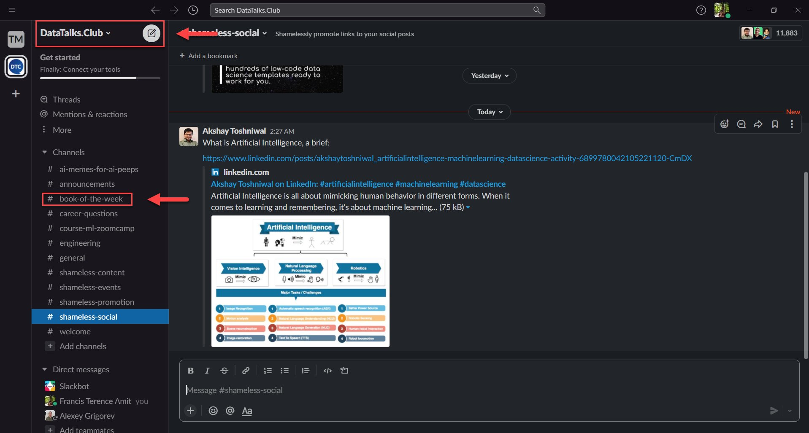
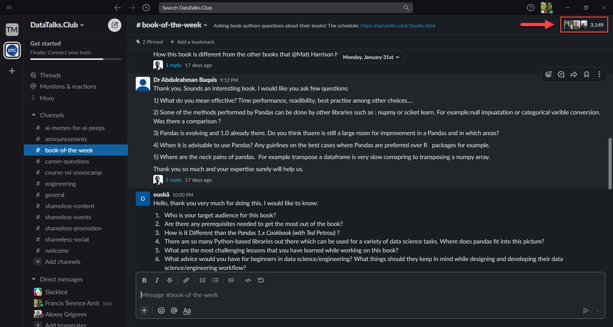
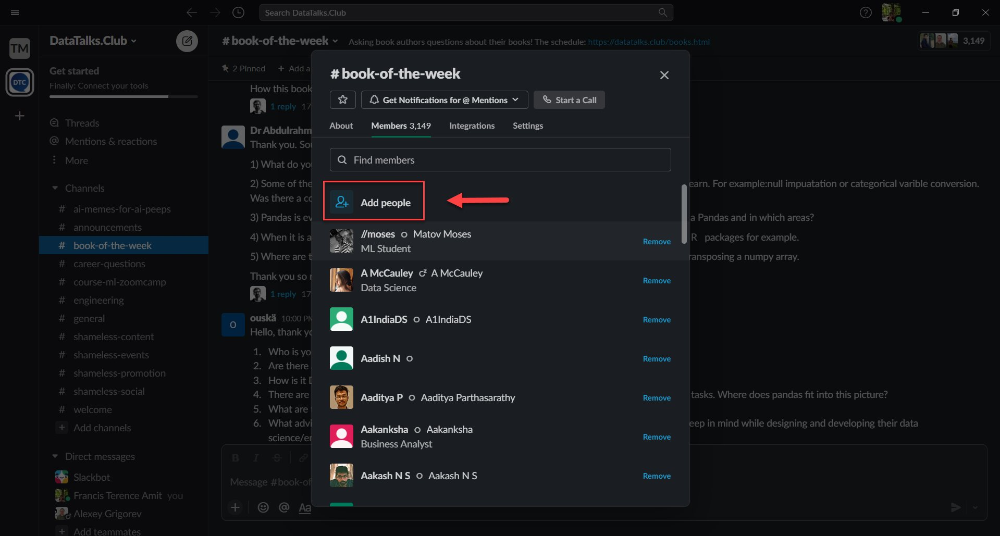
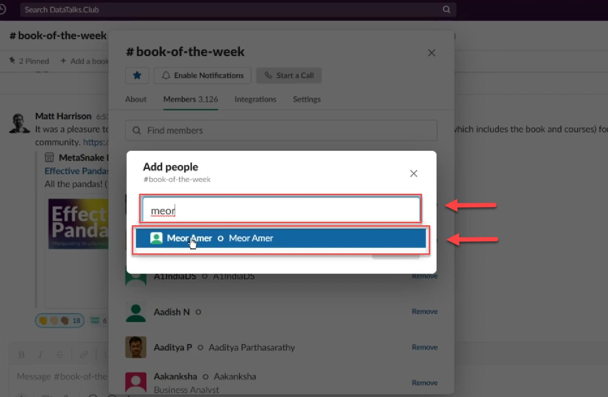
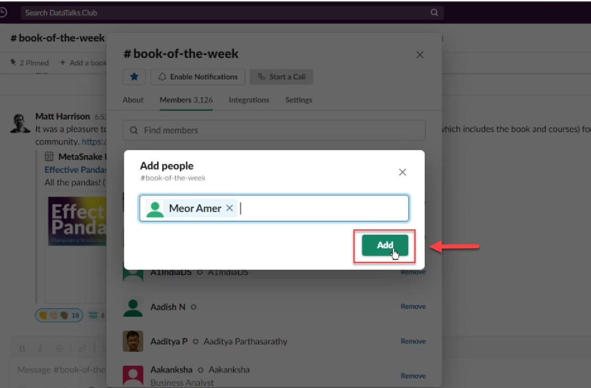

# Invite people to channels in slack

<!-- sop-section-start: summary -->
## Summary

- Purpose:
- Outcome:
- Trigger:
- Frequency:
<!-- sop-section-end -->

<!-- sop-section-start: prerequisites -->
## Prerequisites

- Access:
- Tools:
- Inputs:
<!-- sop-section-end -->

<!-- sop-section-start: procedure -->
## Procedure

<!-- sop-prose-start -->
How to invite people to channels in slack
This procedure will show you the steps on how to invite people to channels in slack.

Step-by-step Instructions
<!-- sop-prose-end -->

<!-- sop-step-start id=1 -->
1.  The first thing you need to do is visit DataTalks.Club slack community and click
    "#book of the week" channel.

    <!-- sop-screenshot-start -->
    
    <!-- sop-caption-start -->
    This screenshot anchors step 1 of the Invite people to channels in slack process by showing the screen for visit DataTalks.Club slack community and click " book of the week" channel. Look for the red box or arrow around "book of the week", then use that highlighted area as the target for the action before continuing.
    <!-- sop-caption-end -->
    <!-- sop-screenshot-end -->
<!-- sop-step-end -->

<!-- sop-step-start id=2 -->
2.  Next is to click the member's icon on the top right of your screen.

    <!-- sop-screenshot-start -->
    
    <!-- sop-caption-start -->
    This screenshot anchors step 2 of the Invite people to channels in slack process by showing the screen for click the member's icon on the top right of your screen. Look for the red box or arrow around Next, then use that highlighted area as the target for the action before continuing.
    <!-- sop-caption-end -->
    <!-- sop-screenshot-end -->
<!-- sop-step-end -->

<!-- sop-step-start id=3 -->
3.  After, select "Add people"

    <!-- sop-screenshot-start -->
    
    <!-- sop-caption-start -->
    This screenshot anchors step 3 of the Invite people to channels in slack process by showing the screen for select "Add people". Look for the red box or arrow around "Add people", then use that highlighted area as the target for the action before continuing.
    <!-- sop-caption-end -->
    <!-- sop-screenshot-end -->
<!-- sop-step-end -->

<!-- sop-step-start id=4 -->
4.  And then, type the name of the author that you want to add to the channel and select the name of the author.

    Note: In this example, “Meor Amer “ is the name of the author that you want to add.

    <!-- sop-screenshot-start -->
    
    <!-- sop-caption-start -->
    This screenshot anchors step 4 of the Invite people to channels in slack process by showing the screen for , type the name of the author that you want to add to the channel and select the name of the author. Look for the red box or arrow around Add, then use that highlighted area as the target for the action before continuing.
    <!-- sop-caption-end -->
    <!-- sop-screenshot-end -->
<!-- sop-step-end -->

<!-- sop-step-start id=5 -->
5.  And finally, click “Add”

    <!-- sop-screenshot-start -->
    
    <!-- sop-caption-start -->
    This screenshot anchors step 5 of the Invite people to channels in slack process by showing the screen for and finally, click "Add". Look for the red box or arrow around Add, then use that highlighted area as the target for the action before continuing.
    <!-- sop-caption-end -->
    <!-- sop-screenshot-end -->
<!-- sop-step-end -->
<!-- sop-section-end -->

<!-- sop-section-start: validation -->
## Validation

-
<!-- sop-section-end -->

<!-- sop-section-start: troubleshooting -->
## Troubleshooting

-
<!-- sop-section-end -->

<!-- sop-section-start: references -->
## References

-
<!-- sop-section-end -->
