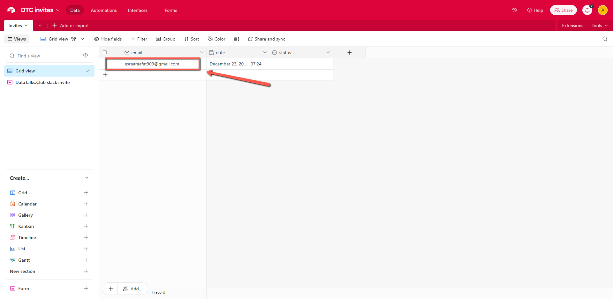
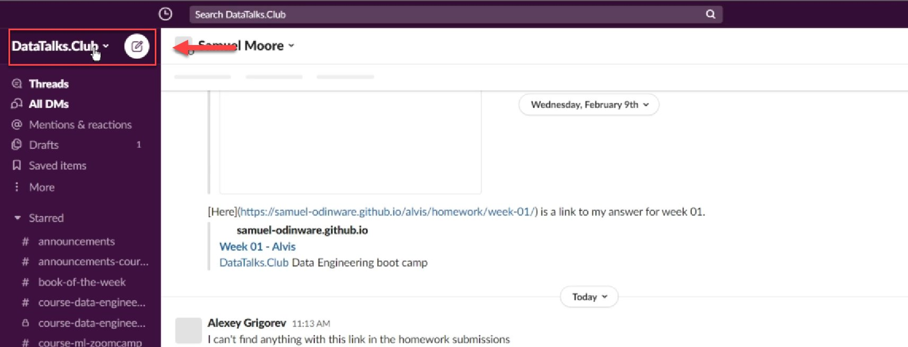
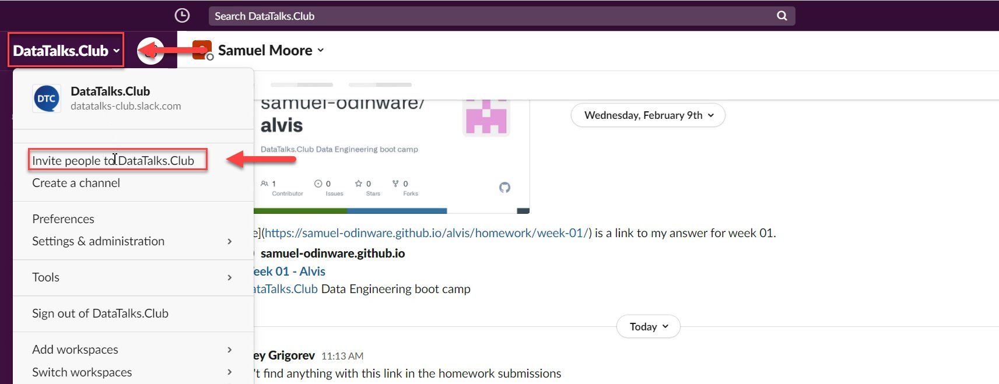
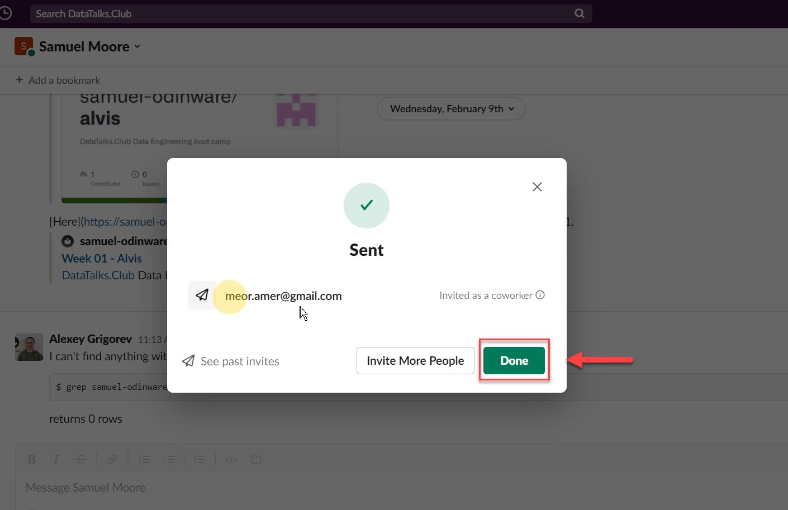
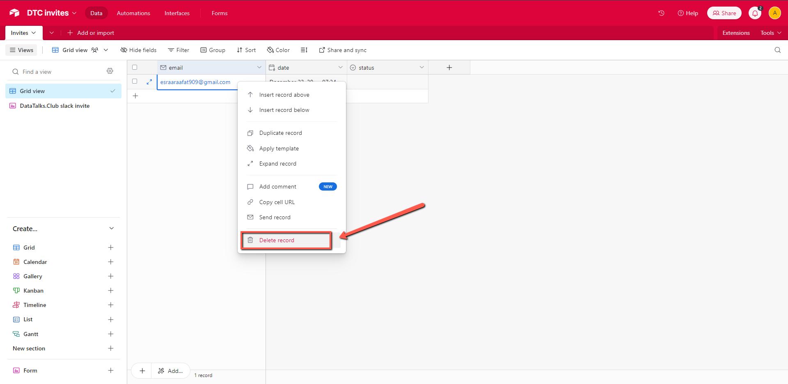

# Invite people to Slack from the Airtable form

<!-- sop-section-start: summary -->
## Summary

- Purpose: Manually invite people to the DataTalks.Club Slack when the normal invite link did not work.
- Outcome: The person receives a Slack invitation or gets a response explaining that they are already registered.
- Trigger: Someone emails that they cannot join Slack or did not receive the invite.
- Frequency: Whenever Slack invite problems are reported.
<!-- sop-section-end -->

<!-- sop-section-start: prerequisites -->
## Prerequisites

- Access: DataTalks.Club Slack workspace and the requester email.
- Tools: Slack invite flow and email.
- Inputs: Requester email address and any error or context from their message.
<!-- sop-section-end -->

<!-- sop-section-start: procedure -->
## Procedure

<!-- sop-prose-start -->
How to invite people to Slack

This procedure will show you the steps on how to invite people to Slack.

TODO: Insert steps for airtable

Step-by-step Instructions
<!-- sop-prose-end -->

<!-- sop-step-start id=1 -->
1.  Open Airtable DTC Invites and copy all email addresses.

    <!-- sop-screenshot-start -->
    
    <!-- sop-caption-start -->
    This screenshot anchors step 1 of the Invite people to Slack from the Airtable form process by showing the screen for open Airtable DTC Invites and copy all email addresses. Look for the red box or arrow around Open, Add, then use that highlighted area as the target for the action before continuing.
    <!-- sop-caption-end -->
    <!-- sop-screenshot-end -->
<!-- sop-step-end -->

<!-- sop-step-start id=2 -->
2.  Next, open the DataTalksClub slack community.

    <!-- sop-screenshot-start -->
    
    <!-- sop-caption-start -->
    This screenshot anchors step 2 of the Invite people to Slack from the Airtable form process by showing the screen for open the DataTalksClub slack community. Look for the red box or arrow around Next, Open, then use that highlighted area as the target for the action before continuing.
    <!-- sop-caption-end -->
    <!-- sop-screenshot-end -->
<!-- sop-step-end -->

<!-- sop-step-start id=3 -->
3.  On the upper left of your screen, click the drag-down button and select "Invite people to DataTalks. Club"

    <!-- sop-screenshot-start -->
    
    <!-- sop-caption-start -->
    This screenshot anchors step 3 of the Invite people to Slack from the Airtable form process by showing the screen for on the upper left of your screen, click the drag down button and select "Invite people to DataTalks. Club". Look for the red box or arrow around "Invite people to DataTalks. Club", then use that highlighted area as the target for the action before continuing.
    <!-- sop-caption-end -->
    <!-- sop-screenshot-end -->
<!-- sop-step-end -->

<!-- sop-step-start id=4 -->
4.  After, paste all the records copied from AirTable and then click "Send"

    <!-- sop-screenshot-start -->
    
    <!-- sop-caption-start -->
    This screenshot anchors step 4 of the Invite people to Slack from the Airtable form process by showing the screen for paste all the records copied from AirTable and then click "Send". Look for the red box or arrow around "Send", then use that highlighted area as the target for the action before continuing.
    <!-- sop-caption-end -->
    <!-- sop-screenshot-end -->
<!-- sop-step-end -->

<!-- sop-step-start id=5 -->
5.  Lastly, go back to AirTable and Delete all records

    <!-- sop-screenshot-start -->
    
    <!-- sop-caption-start -->
    This screenshot anchors step 5 of the Invite people to Slack from the Airtable form process by showing the screen for go back to AirTable and Delete all records. Look for the red box, arrow, selected row, or highlighted screen area, then use that highlighted area as the target for the action before continuing.
    <!-- sop-caption-end -->
    <!-- sop-screenshot-end -->
<!-- sop-step-end -->
<!-- sop-section-end -->

<!-- sop-section-start: validation -->
## Validation

-
<!-- sop-section-end -->

<!-- sop-section-start: troubleshooting -->
## Troubleshooting

-
<!-- sop-section-end -->

<!-- sop-section-start: references -->
## References

-
<!-- sop-section-end -->
