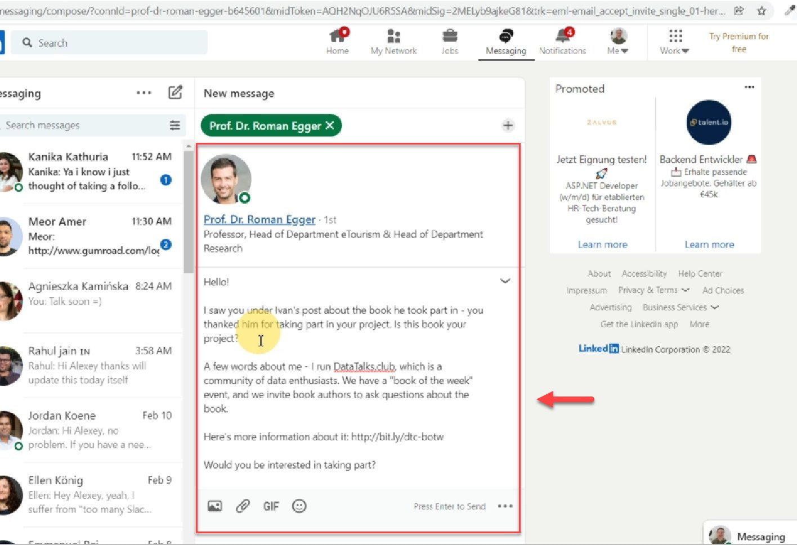
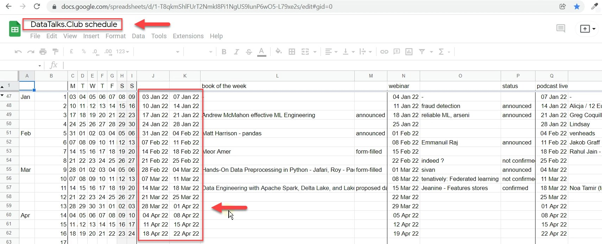
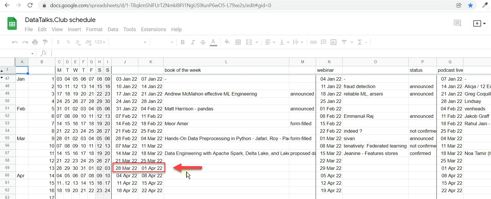

# Reach out to book authors

<!-- sop-section-start: summary -->
## Summary

- Purpose:
- Outcome:
- Trigger:
- Frequency:
<!-- sop-section-end -->

<!-- sop-section-start: prerequisites -->
## Prerequisites

- Access:
- Tools:
- Inputs:
<!-- sop-section-end -->

<!-- sop-section-start: procedure -->
## Procedure

<!-- sop-prose-start -->
How to reach out to book authors
This procedure will show you the steps on \<insert title only capitalizing proper nouns\>.

Step-by-step Instructions
<!-- sop-prose-end -->

<!-- sop-step-start id=1 -->
1.  The first thing you need to do is contact and introduce the author to what the book-of-the-week event is.

    Note: You may contact the author through LinkedIn or other platforms.

    <!-- sop-screenshot-start -->
    
    <!-- sop-caption-start -->
    This screenshot anchors step 1 of the Reach out to book authors process by showing the screen for contact and introduce the author to what the book of the week event is. Look for the red box, arrow, selected row, or highlighted screen area, then use that highlighted area as the target for the action before continuing.
    <!-- sop-caption-end -->
    <!-- sop-screenshot-end -->
<!-- sop-step-end -->

<!-- sop-step-start id=2 -->
2.  After, visit the google spreadsheet: "DataTalks. Club schedule" and pick a slot
    on the schedule

    <!-- sop-screenshot-start -->
    
    <!-- sop-caption-start -->
    This screenshot anchors step 2 of the Reach out to book authors process by showing the screen for visit the google spreadsheet: "DataTalks. Club schedule" and pick a slot on the schedule. Look for the red box or arrow around "DataTalks. Club schedule", then use that highlighted area as the target for the action before continuing.
    <!-- sop-caption-end -->
    <!-- sop-screenshot-end -->
<!-- sop-step-end -->

<!-- sop-step-start id=3 -->
3.  After picking a slot, contact the author and propose a date that is available.

    <!-- sop-screenshot-start -->
    
    <!-- sop-caption-start -->
    This screenshot anchors step 3 of the Reach out to book authors process by showing the screen for after picking a slot, contact the author and propose a date that is available. Look for the red box, arrow, selected row, or highlighted screen area, then use that highlighted area as the target for the action before continuing.
    <!-- sop-caption-end -->
    <!-- sop-screenshot-end -->
<!-- sop-step-end -->
<!-- sop-section-end -->

<!-- sop-section-start: validation -->
## Validation

-
<!-- sop-section-end -->

<!-- sop-section-start: troubleshooting -->
## Troubleshooting

-
<!-- sop-section-end -->

<!-- sop-section-start: references -->
## References

-
<!-- sop-section-end -->
