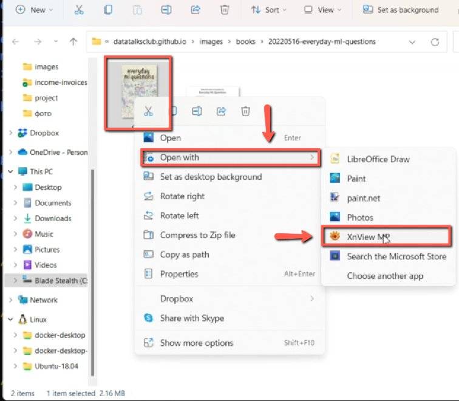
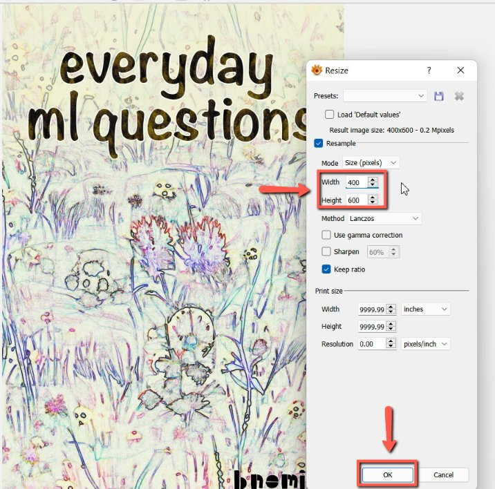

# Resize the book cover

<!-- sop-section-start: summary -->
## Summary

- Purpose: Resize oversized book cover images before uploading them.
- Outcome: The book cover is reduced to a web-friendly size, such as 400x600.
- Trigger: A downloaded book cover image is too large for the website.
- Frequency: Whenever a book cover image is prepared for upload.
<!-- sop-section-end -->

<!-- sop-section-start: prerequisites -->
## Prerequisites

- Access: Local access to the downloaded book cover file.
- Tools: XnView MP or another image editor.
- Inputs: Original book cover image.
<!-- sop-section-end -->

<!-- sop-section-start: procedure -->
## Procedure

<!-- sop-prose-start -->
How to resize the book cover

This procedure will show you the steps on how to resize the book cover

Step-by-step Instructions
<!-- sop-prose-end -->

<!-- sop-step-start id=1 -->
1.  The first thing you need to do is right-click the book cover page and then click "Open with" and select "XnView MP"

    <!-- sop-screenshot-start -->
    
    <!-- sop-caption-start -->
    This screenshot anchors step 1 of the Resize the book cover process by showing the screen for right click the book cover page and then click "Open with" and select "XnView MP". Look for the red boxes or arrows around "Open with", "XnView MP", then use that highlighted area as the target for the action before continuing.
    <!-- sop-caption-end -->
    <!-- sop-screenshot-end -->
<!-- sop-step-end -->

<!-- sop-step-start id=2 -->
2.  On the edit tab, change the size of the book cover and then click “Ok”

    Note: In this example, we resize the width to 400 while the height is 600. 400x600

    <!-- sop-screenshot-start -->
    
    <!-- sop-caption-start -->
    This screenshot anchors step 2 of the Resize the book cover process by showing the screen for on the edit tab, change the size of the book cover and then click "Ok". Look for the red box or arrow around Edit, then use that highlighted area as the target for the action before continuing.
    <!-- sop-caption-end -->
    <!-- sop-screenshot-end -->
<!-- sop-step-end -->
<!-- sop-section-end -->

<!-- sop-section-start: validation -->
## Validation

-
<!-- sop-section-end -->

<!-- sop-section-start: troubleshooting -->
## Troubleshooting

-
<!-- sop-section-end -->

<!-- sop-section-start: references -->
## References

-
<!-- sop-section-end -->
