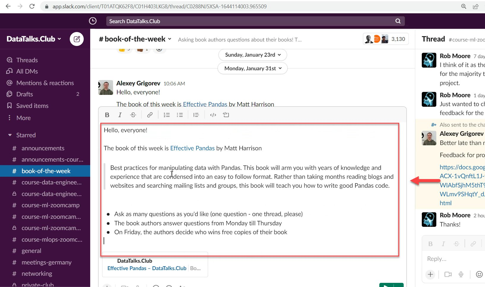
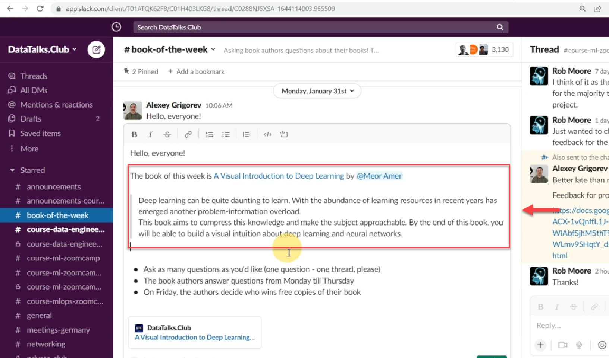
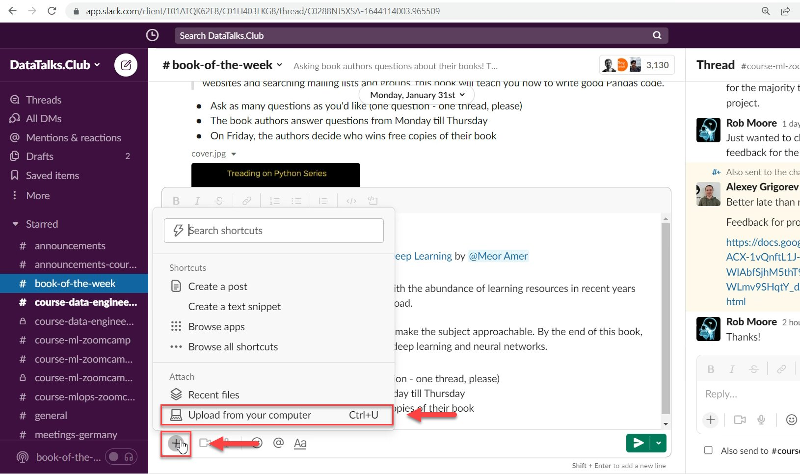
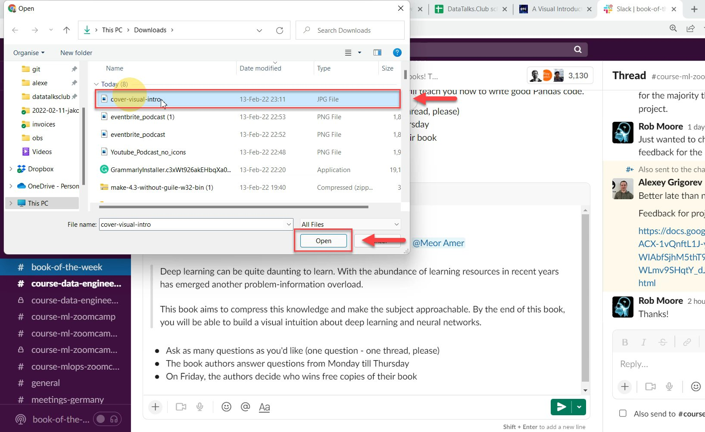

# Schedule the announcement in Slack

<!-- sop-section-start: summary -->
## Summary

- Purpose:
- Outcome:
- Trigger:
- Frequency:
<!-- sop-section-end -->

<!-- sop-section-start: prerequisites -->
## Prerequisites

- Access:
- Tools:
- Inputs:
<!-- sop-section-end -->

<!-- sop-section-start: procedure -->
## Procedure

<!-- sop-prose-start -->
How to schedule the announcement in Slack
This procedure will show you the steps on how to schedule the announcement in Slack.

Step-by-step Instructions
<!-- sop-prose-end -->

<!-- sop-step-start id=1 -->
1.  First, copy and paste the previous book-of-the-week event announcement.

    Note: This will serve as the template for the announcement.

    <!-- sop-screenshot-start -->
    
    <!-- sop-caption-start -->
    This screenshot anchors step 1 of the Schedule the announcement in Slack process by showing the screen for first, copy and paste the previous book of the week event announcement. Look for the red box, arrow, selected row, or highlighted screen area, then use that highlighted area as the target for the action before continuing.
    <!-- sop-caption-end -->
    <!-- sop-screenshot-end -->
<!-- sop-step-end -->

<!-- sop-step-start id=2 -->
2.  Next, edit the description of the announcement. This includes the name and author of the book.

    <!-- sop-screenshot-start -->
    
    <!-- sop-caption-start -->
    This screenshot anchors step 2 of the Schedule the announcement in Slack process by showing the screen for edit the description of the announcement. This includes the name and author of the book. Look for the red box or arrow around Next, Edit, then use that highlighted area as the target for the action before continuing.
    <!-- sop-caption-end -->
    <!-- sop-screenshot-end -->
<!-- sop-step-end -->

<!-- sop-step-start id=3 -->
3.  After editing the description, add the picture of the book by clicking on the plus icon and selecting "Upload from your computer"

    <!-- sop-screenshot-start -->
    
    <!-- sop-caption-start -->
    This screenshot anchors step 3 of the Schedule the announcement in Slack process by showing the screen for after editing the description, add the picture of the book by clicking on the plus icon and selecting "Upload from. Look for the red box or arrow around "Upload from your computer", then use that highlighted area as the target for the action before continuing.
    <!-- sop-caption-end -->
    <!-- sop-screenshot-end -->
<!-- sop-step-end -->

<!-- sop-step-start id=4 -->
4.  And then choose the picture of the book and click "Open"

    <!-- sop-screenshot-start -->
    
    <!-- sop-caption-start -->
    This screenshot anchors step 4 of the Schedule the announcement in Slack process by showing the screen for choose the picture of the book and click "Open". Look for the red box or arrow around "Open", then use that highlighted area as the target for the action before continuing.
    <!-- sop-caption-end -->
    <!-- sop-screenshot-end -->
<!-- sop-step-end -->

<!-- sop-step-start id=5 -->
5.  Once the picture of the book is attached, hover and click the drag-down button and click “Custom time”

    <!-- sop-screenshot-start -->
    
    <!-- sop-caption-start -->
    This screenshot anchors step 5 of the Schedule the announcement in Slack process by showing the screen for once the picture of the book is attached, hover and click the drag down button and click "Custom time". Look for the red box or arrow around "Custom time", then use that highlighted area as the target for the action before continuing.
    <!-- sop-caption-end -->
    <!-- sop-screenshot-end -->
<!-- sop-step-end -->

<!-- sop-step-start id=6 -->
6.  After, select the scheduled date of the book to be announced and click "Schedule message"

    <!-- sop-screenshot-start -->
    
    <!-- sop-caption-start -->
    This screenshot anchors step 6 of the Schedule the announcement in Slack process by showing the screen for select the scheduled date of the book to be announced and click "Schedule message". Look for the red box or arrow around "Schedule message", then use that highlighted area as the target for the action before continuing.
    <!-- sop-caption-end -->
    <!-- sop-screenshot-end -->
<!-- sop-step-end -->
<!-- sop-section-end -->

<!-- sop-section-start: validation -->
## Validation

-
<!-- sop-section-end -->

<!-- sop-section-start: troubleshooting -->
## Troubleshooting

-
<!-- sop-section-end -->

<!-- sop-section-start: references -->
## References

-
<!-- sop-section-end -->
