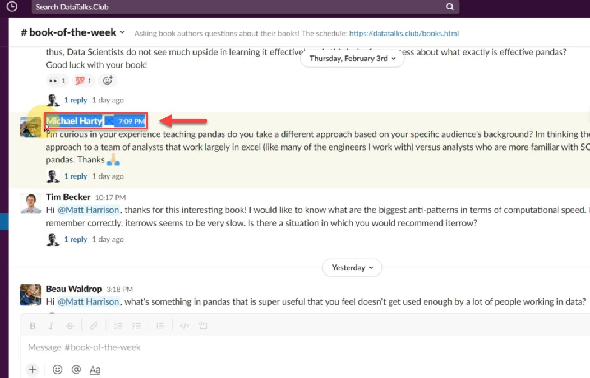
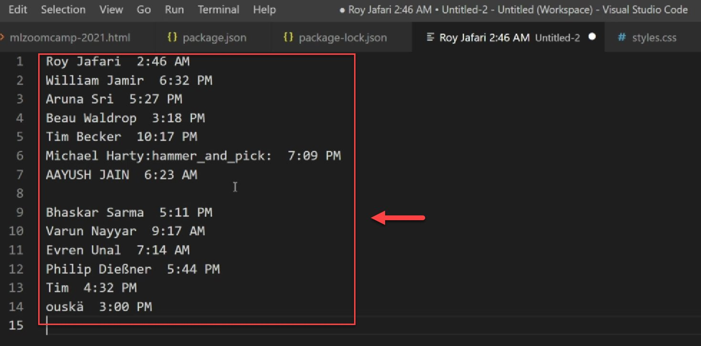
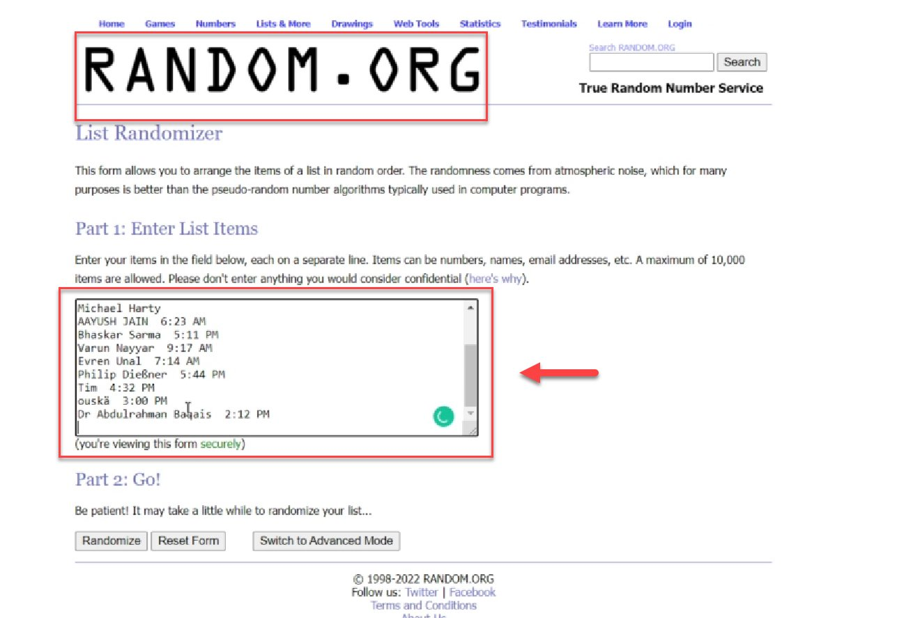
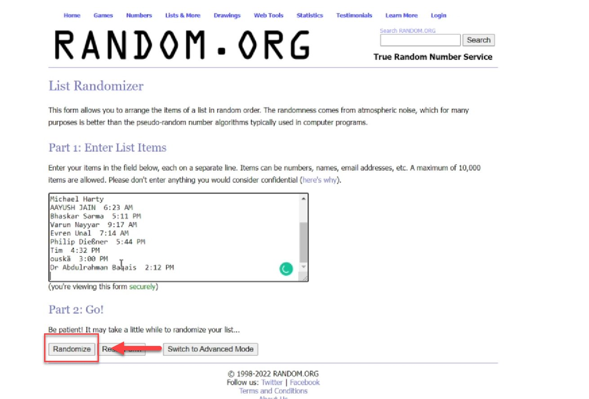
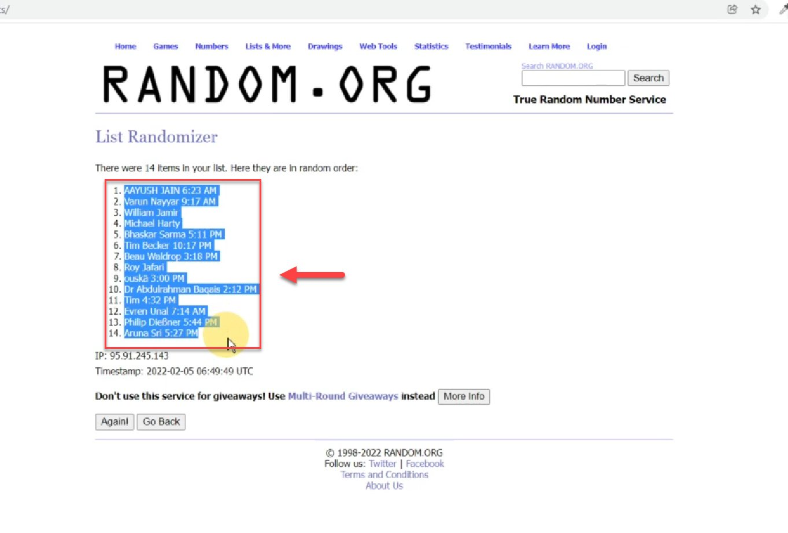
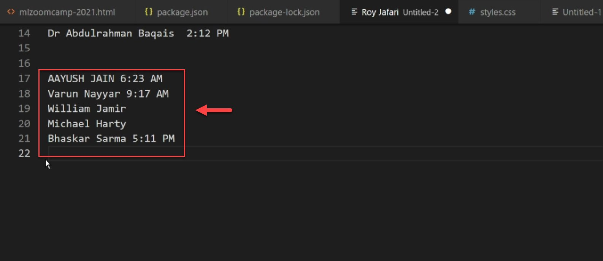
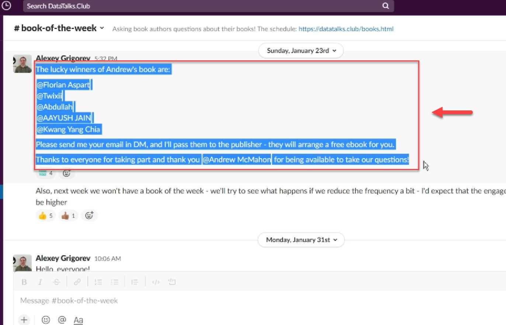
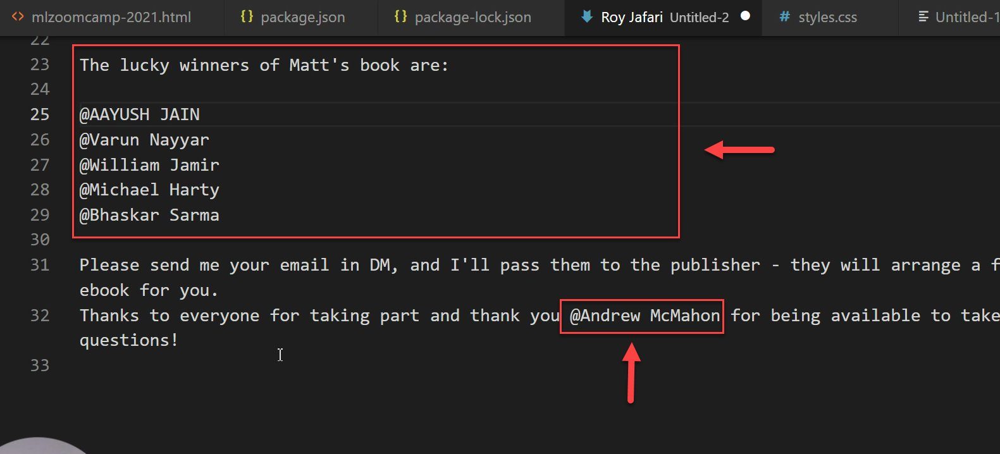
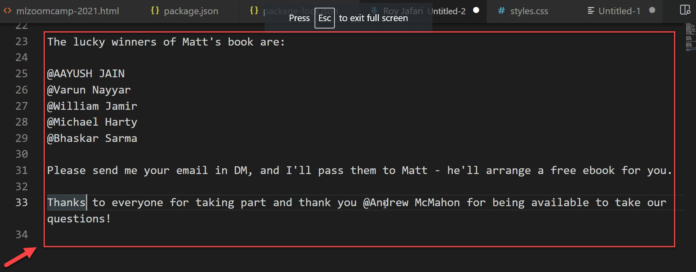
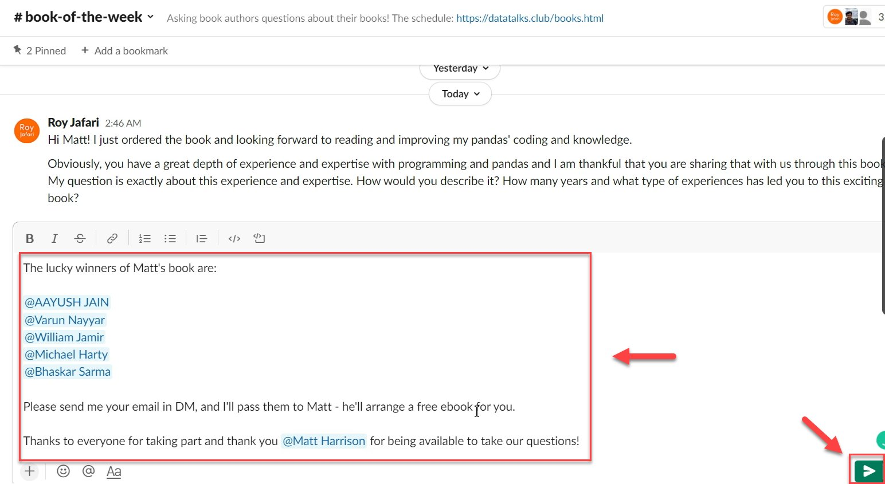

# Select book of the week winners

<!-- sop-section-start: summary -->
## Summary

- Purpose: Select and announce Book of the Week giveaway winners.
- Outcome: Winners are chosen or confirmed, announced in Slack, and asked to send their emails.
- Trigger: Before the Friday winner announcement for a Book of the Week event.
- Frequency: Weekly for Book of the Week giveaways.
<!-- sop-section-end -->

<!-- sop-section-start: prerequisites -->
## Prerequisites

- Access: Slack and the Book of the Week email tracking spreadsheet.
- Tools: Slack, random.org List Randomizer, text editor, Book of the Week announcement template.
- Inputs: Participant names, author preference for random or author-selected winners, book title, author, and publisher.
<!-- sop-section-end -->

<!-- sop-section-start: procedure -->
## Procedure

<!-- sop-prose-start -->
How to select book of the week winners
This procedure will show you the steps on how to select book of the week winners.

Step-by-step Instructions
<!-- sop-prose-end -->

<!-- sop-step-start id=1 -->
1.  The first thing you need to do is copy the names on the slack community

    Note: If someone asked to keep them out of the book of the week winners, don’t include them on the randomizer.

    <!-- sop-screenshot-start -->
    
    <!-- sop-caption-start -->
    This screenshot anchors step 1 of the Select book of the week winners process by showing the screen for copy the names on the slack community. Look for the red box, arrow, selected row, or highlighted screen area, then use that highlighted area as the target for the action before continuing.
    <!-- sop-caption-end -->
    <!-- sop-screenshot-end -->
<!-- sop-step-end -->

<!-- sop-step-start id=2 -->
2.  (Step 2 to 6 are not included) Next is to paste the names on a list.

    Note: In this example, the names are pasted in the Visual Studio code. You may also use notepad to paste the names temporarily. Moreover, edit some unnecessary text included beside the name.

    <!-- sop-screenshot-start -->
    
    <!-- sop-caption-start -->
    This screenshot anchors step 2 of the Select book of the week winners process by showing the screen for (Step 2 to 6 are not included) Next is to paste the names on a list. Look for the red box or arrow around Next, then use that highlighted area as the target for the action before continuing.
    <!-- sop-caption-end -->
    <!-- sop-screenshot-end -->
<!-- sop-step-end -->

<!-- sop-step-start id=3 -->
3.  After which, copy the list you pasted in the Visual Studio code and paste it on Random. Org’s “List Randomizer”.

    <!-- sop-screenshot-start -->
    
    <!-- sop-caption-start -->
    This screenshot anchors step 3 of the Select book of the week winners process by showing the screen for after which, copy the list you pasted in the Visual Studio code and paste it on Random. Org's "List Randomizer". Look for the red box or arrow around "List Randomizer", then use that highlighted area as the target for the action before continuing.
    <!-- sop-caption-end -->
    <!-- sop-screenshot-end -->
<!-- sop-step-end -->

<!-- sop-step-start id=4 -->
4.  After, click “randomize”

    <!-- sop-screenshot-start -->
    
    <!-- sop-caption-start -->
    This screenshot anchors step 4 of the Select book of the week winners process by showing the screen for click "randomize". Look for the red box or arrow around "randomize", then use that highlighted area as the target for the action before continuing.
    <!-- sop-caption-end -->
    <!-- sop-screenshot-end -->
<!-- sop-step-end -->

<!-- sop-step-start id=5 -->
5.  And then, copy the names that are randomized.

    <!-- sop-screenshot-start -->
    
    <!-- sop-caption-start -->
    This screenshot anchors step 5 of the Select book of the week winners process by showing the screen for , copy the names that are randomized. Look for the red box, arrow, selected row, or highlighted screen area, then use that highlighted area as the target for the action before continuing.
    <!-- sop-caption-end -->
    <!-- sop-screenshot-end -->
<!-- sop-step-end -->

<!-- sop-step-start id=6 -->
6.  After, paste the first five names that are randomized.

    <!-- sop-screenshot-start -->
    
    <!-- sop-caption-start -->
    This screenshot anchors step 6 of the Select book of the week winners process by showing the screen for paste the first five names that are randomized. Look for the red box, arrow, selected row, or highlighted screen area, then use that highlighted area as the target for the action before continuing.
    <!-- sop-caption-end -->
    <!-- sop-screenshot-end -->
<!-- sop-step-end -->

<!-- sop-step-start id=7 -->
7.  The next thing to do is copy the announcement format from the previous dates. [Template](https://docs.google.com/document/d/10SYeHAEvf7wt026t93dSD0ZtQZ82g0qMOQwodTTQvbM/edit?usp=sharing).

    <!-- sop-screenshot-start -->
    
    <!-- sop-caption-start -->
    This screenshot anchors step 7 of the Select book of the week winners process by showing the screen for the next thing to do is copy the announcement format from the previous dates. Template. Look for the red box or arrow around Next, then use that highlighted area as the target for the action before continuing.
    <!-- sop-caption-end -->
    <!-- sop-screenshot-end -->
<!-- sop-step-end -->

<!-- sop-step-start id=8 -->
8.  Next is to paste the announcement you copied earlier together with the 5 lucky winner names and edit the name of the author and the publisher.

    Note: Don’t forget to add “@” before the name of the winners.

    <!-- sop-screenshot-start -->
    
    <!-- sop-caption-start -->
    This screenshot anchors step 8 of the Select book of the week winners process by showing the screen for paste the announcement you copied earlier together with the 5 lucky winner names and edit the name of the author. Look for the red box or arrow around Next, Publish, then use that highlighted area as the target for the action before continuing.
    <!-- sop-caption-end -->
    <!-- sop-screenshot-end -->
<!-- sop-step-end -->

<!-- sop-step-start id=9 -->
9.  Afterward, copy the edited announcement.

    <!-- sop-screenshot-start -->
    
    <!-- sop-caption-start -->
    This screenshot anchors step 9 of the Select book of the week winners process by showing the screen for copy the edited announcement. Look for the red box or arrow around Edit, then use that highlighted area as the target for the action before continuing.
    <!-- sop-caption-end -->
    <!-- sop-screenshot-end -->
<!-- sop-step-end -->

<!-- sop-step-start id=10 -->
10. Lastly, paste the announcement into the slack community and click the send icon below.

    <!-- sop-screenshot-start -->
    
    <!-- sop-caption-start -->
    This screenshot anchors step 10 of the Select book of the week winners process by showing the screen for paste the announcement into the slack community and click the send icon below. Look for the red box or arrow around Send, then use that highlighted area as the target for the action before continuing.
    <!-- sop-caption-end -->
    <!-- sop-screenshot-end -->
<!-- sop-step-end -->
<!-- sop-section-end -->

<!-- sop-section-start: validation -->
## Validation

-
<!-- sop-section-end -->

<!-- sop-section-start: troubleshooting -->
## Troubleshooting

-
<!-- sop-section-end -->

<!-- sop-section-start: references -->
## References

-
<!-- sop-section-end -->
