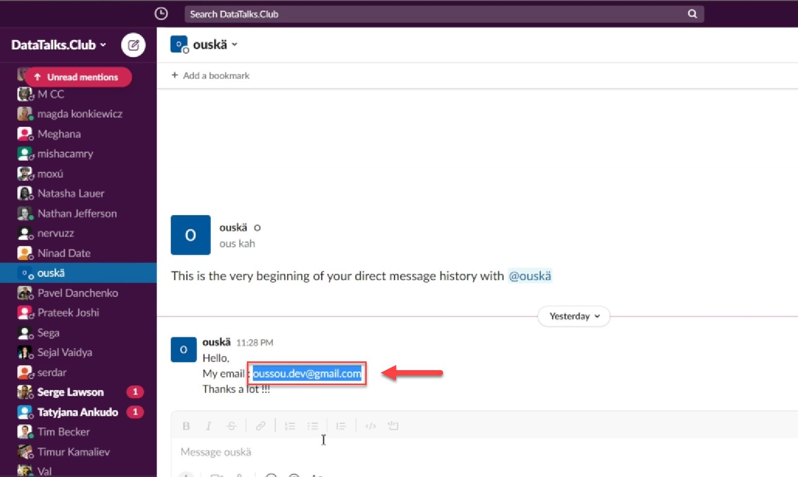
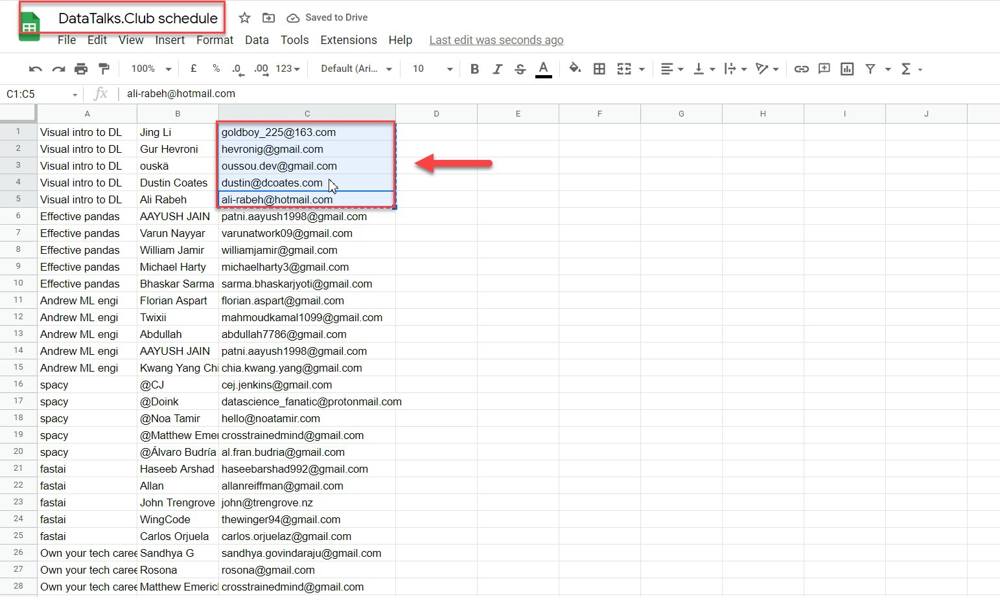
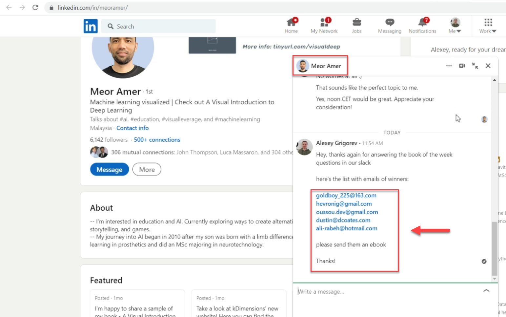

# Send winners emails

<!-- sop-section-start: summary -->
## Summary

- Purpose:
- Outcome:
- Trigger:
- Frequency:
<!-- sop-section-end -->

<!-- sop-section-start: prerequisites -->
## Prerequisites

- Access:
- Tools:
- Inputs:
<!-- sop-section-end -->

<!-- sop-section-start: procedure -->
## Procedure

<!-- sop-prose-start -->
How to send winners’ emails
This procedure will show you the steps on how to send winners’ emails.

Step-by-step Instructions
<!-- sop-prose-end -->

<!-- sop-step-start id=1 -->
1.  The first thing to do is copy the email of the winners.

    <!-- sop-screenshot-start -->
    
    <!-- sop-caption-start -->
    This screenshot anchors step 1 of the Send winners emails process by showing the screen for the first thing to do is copy the email of the winners. Look for the red box, arrow, selected row, or highlighted screen area, then use that highlighted area as the target for the action before continuing.
    <!-- sop-caption-end -->
    <!-- sop-screenshot-end -->
<!-- sop-step-end -->

<!-- sop-step-start id=2 -->
2.  Second, paste the email on the [DataTalks.Club spreadsheet.](https://docs.google.com/spreadsheets/d/1-T8qkmShlFUrT2NmkI8Pi1NgUS9IunP6wO5-L79xe2s/edit?usp=sharing)

    Note: If a winner hasn’t sent his email, wait until Tuesday to Wednesday. If not, send the winners to the publisher directly and just follow up the email. Or you can check in slack if the winner had already won before and copied his email.

    <!-- sop-screenshot-start -->
    
    <!-- sop-caption-start -->
    This screenshot anchors step 2 of the Send winners emails process by showing the screen for second, paste the email on the DataTalks.Club spreadsheet. Look for the red box, arrow, selected row, or highlighted screen area, then use that highlighted area as the target for the action before continuing.
    <!-- sop-caption-end -->
    <!-- sop-screenshot-end -->
<!-- sop-step-end -->

<!-- sop-step-start id=3 -->
3.  Next, copy all the emails that you pasted in the spreadsheet and send those emails
    to the speaker.

    Note: If the book has a publisher, send the emails to Shifa and the author via email.

    <!-- sop-screenshot-start -->
    
    <!-- sop-caption-start -->
    This screenshot anchors step 3 of the Send winners emails process by showing the screen for copy all the emails that you pasted in the spreadsheet and send those emails to the speaker. Look for the red box or arrow around Next, Send, then use that highlighted area as the target for the action before continuing.
    <!-- sop-caption-end -->
    <!-- sop-screenshot-end -->
<!-- sop-step-end -->
<!-- sop-section-end -->

<!-- sop-section-start: validation -->
## Validation

-
<!-- sop-section-end -->

<!-- sop-section-start: troubleshooting -->
## Troubleshooting

-
<!-- sop-section-end -->

<!-- sop-section-start: references -->
## References

-
<!-- sop-section-end -->
