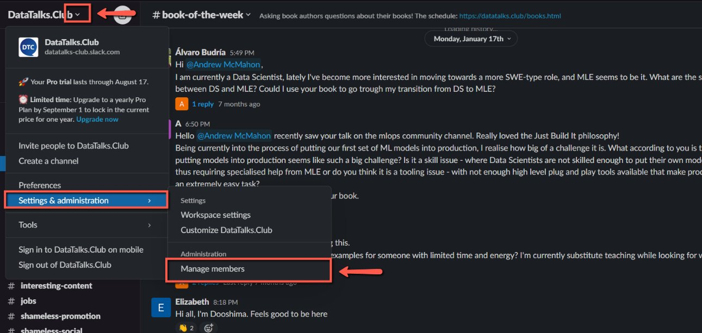
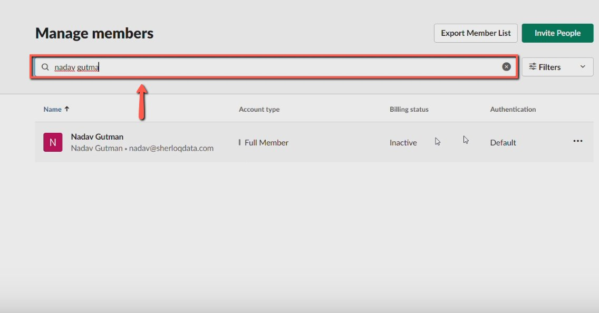
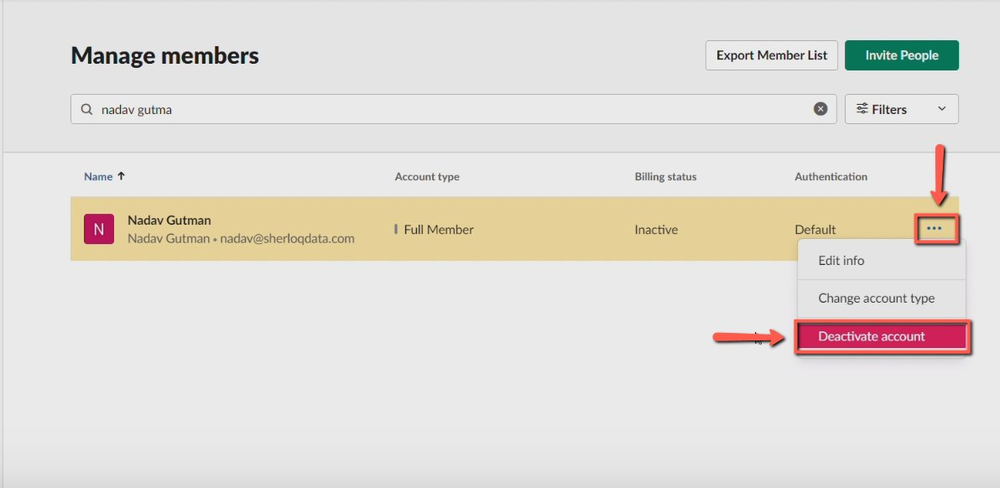
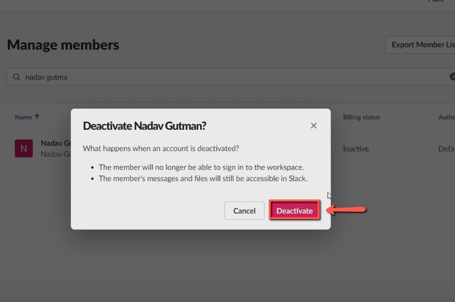

# Banning people on Slack for unsolicited promotions

<!-- sop-section-start: summary -->
## Summary

- Purpose: Remove Slack users who post unsolicited promotions.
- Outcome: The confirmed user account is deactivated in Slack.
- Trigger: A specific Slack user needs to be banned for unsolicited promotion.
- Frequency: As needed.
<!-- sop-section-end -->

<!-- sop-section-start: prerequisites -->
## Prerequisites

- Access: Slack admin access to manage members.
- Tools: Slack workspace administration.
- Inputs: User name and profile details to confirm the correct account.
<!-- sop-section-end -->

<!-- sop-section-start: procedure -->
## Procedure

<!-- sop-prose-start -->
How to Ban People on Slack for Unsolicited promotions
This procedure will show you the steps on how to Ban People on Slack for Unsolicited promotions.

Step-by-step Instructions
<!-- sop-prose-end -->

<!-- sop-step-start id=1 -->
1.  The first thing you need to do is click the dropdown list beside “DataTalksClub” hover your mouse to “Settings and Administration” and click “Manage members”

    <!-- sop-screenshot-start -->
    
    <!-- sop-caption-start -->
    This screenshot anchors the step to click the dropdown list beside “DataTalksClub” hover your mouse to “Settings and Administration” and click “Manage members” so you can match the documented UI before acting. Look for “DataTalksClub” and “Settings and Administration”, then use those cues to complete or verify the step before continuing.
    <!-- sop-caption-end -->
    <!-- sop-screenshot-end -->
<!-- sop-step-end -->

<!-- sop-step-start id=2 -->
2.  Then, search for the name of the user in the search field.

    <!-- sop-screenshot-start -->
    
    <!-- sop-caption-start -->
    This screenshot anchors the step about search for the name of the user in the search field so you can match the documented UI before acting. Look for the relevant screen area shown there, then use it to confirm you are in the correct place before continuing.
    <!-- sop-caption-end -->
    <!-- sop-screenshot-end -->
<!-- sop-step-end -->

<!-- sop-step-start id=3 -->
3.  After, click the three-dotted button and select “Deactivate account”

    <!-- sop-screenshot-start -->
    
    <!-- sop-caption-start -->
    This screenshot anchors the step to click the three-dotted button and select “Deactivate account” so you can match the documented UI before acting. Look for “Deactivate account”, then use that cue to complete or verify the step before continuing.
    <!-- sop-caption-end -->
    <!-- sop-screenshot-end -->
<!-- sop-step-end -->

<!-- sop-step-start id=4 -->
4.  Lastly, select “Deactivate”

    <!-- sop-screenshot-start -->
    
    <!-- sop-caption-start -->
    This screenshot anchors the step to select “Deactivate” so you can match the documented UI before acting. Look for “Deactivate”, then use that cue to complete or verify the step before continuing.
    <!-- sop-caption-end -->
    <!-- sop-screenshot-end -->
<!-- sop-step-end -->
<!-- sop-section-end -->

<!-- sop-section-start: validation -->
## Validation

-
<!-- sop-section-end -->

<!-- sop-section-start: troubleshooting -->
## Troubleshooting

-
<!-- sop-section-end -->

<!-- sop-section-start: references -->
## References

-
<!-- sop-section-end -->
