# Export Create a dump of Slack Data

<!-- sop-section-start: summary -->
## Summary

- Purpose: Downloading all the data from Slack
- Outcome: We perform monthly data dumps so that the community members can access our Slack data for their analytics and other purposes.
- Trigger: When the monthly reminder is triggered or per request when we need to generate a data dump.
- Frequency: Monthly, or as requested.
<!-- sop-section-end -->

<!-- sop-section-start: prerequisites -->
## Prerequisites

- Access: Slack workspace settings and export page.
- Tools: Slack workspace administration and email notification.
- Inputs: Export date range and destination for the downloaded dump.
<!-- sop-section-end -->

<!-- sop-section-start: procedure -->
## Procedure

<!-- sop-group-start: "Requesting the dump" -->
### Requesting the dump

<!-- sop-step-start id=1 -->
1.  The first thing you need to do is open Slack and select “DataTalksClub” on the upper left.

    <!-- sop-screenshot-start -->
    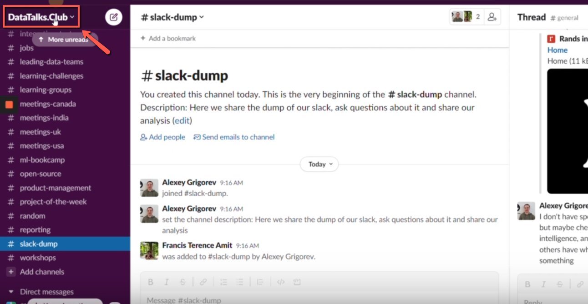
    <!-- sop-caption-start -->
    This screenshot anchors the step to open Slack and select “DataTalksClub” on the upper left so you can match the documented UI before acting. Look for “DataTalksClub”, then use that cue to complete or verify the step before continuing.
    <!-- sop-caption-end -->
    <!-- sop-screenshot-end -->
<!-- sop-step-end -->

<!-- sop-step-start id=2 -->
2.  Then, click “Tools and Settings” and select “Workplace settings”

    <!-- sop-screenshot-start -->
    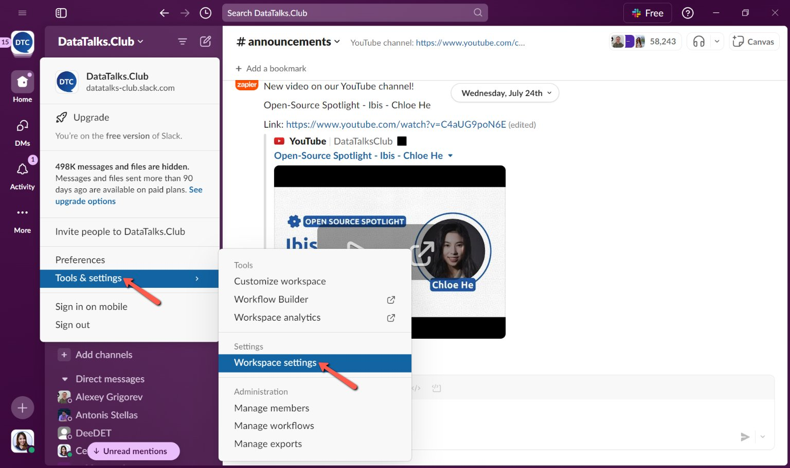
    <!-- sop-caption-start -->
    This screenshot anchors the step to click “Tools and Settings” and select “Workplace settings” so you can match the documented UI before acting. Look for “Tools and Settings” and “Workplace settings”, then use those cues to complete or verify the step before continuing.
    <!-- sop-caption-end -->
    <!-- sop-screenshot-end -->
<!-- sop-step-end -->

<!-- sop-step-start id=3 -->
3.  Next, click “Import/Export Data”

    <!-- sop-screenshot-start -->
    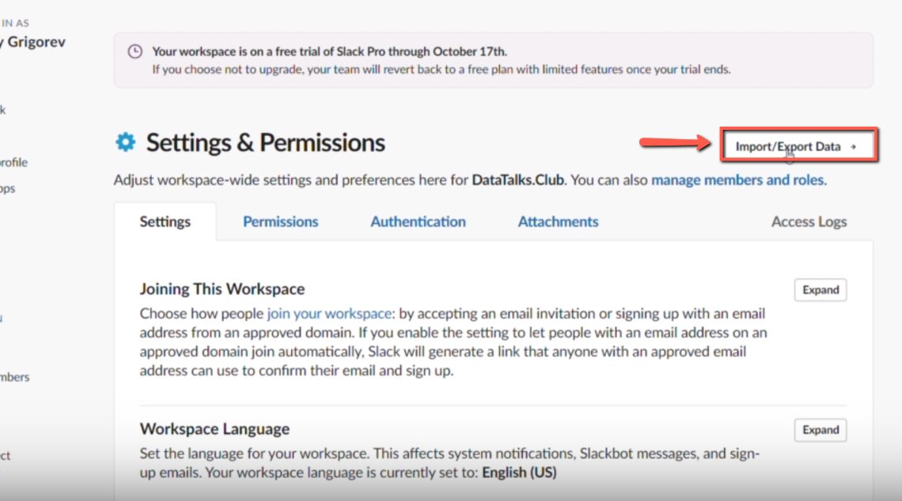
    <!-- sop-caption-start -->
    This screenshot anchors the step to click “Import/Export Data” so you can match the documented UI before acting. Look for “Import/Export Data”, then use that cue to complete or verify the step before continuing.
    <!-- sop-caption-end -->
    <!-- sop-screenshot-end -->
<!-- sop-step-end -->

<!-- sop-step-start id=4 -->
4.  Then, click “Export”

    <!-- sop-screenshot-start -->
    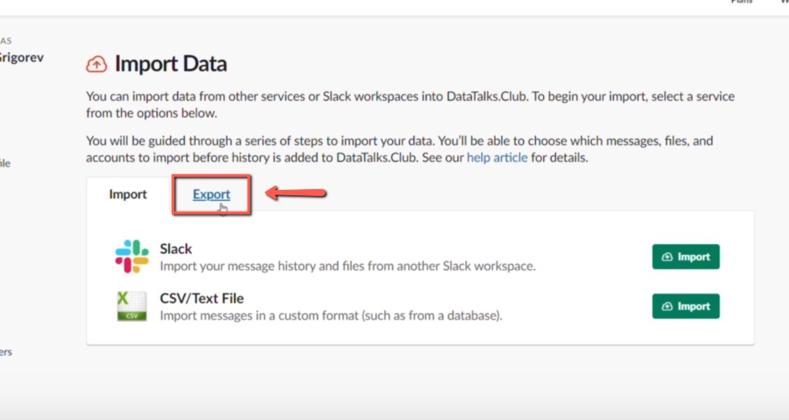
    <!-- sop-caption-start -->
    This screenshot anchors the step to click “Export” so you can match the documented UI before acting. Look for “Export”, then use that cue to complete or verify the step before continuing.
    <!-- sop-caption-end -->
    <!-- sop-screenshot-end -->
<!-- sop-step-end -->

<!-- sop-step-start id=5 -->
5.  On the ‘Export Data Range”, click the dropdown button and select “Entire History”

    <!-- sop-screenshot-start -->
    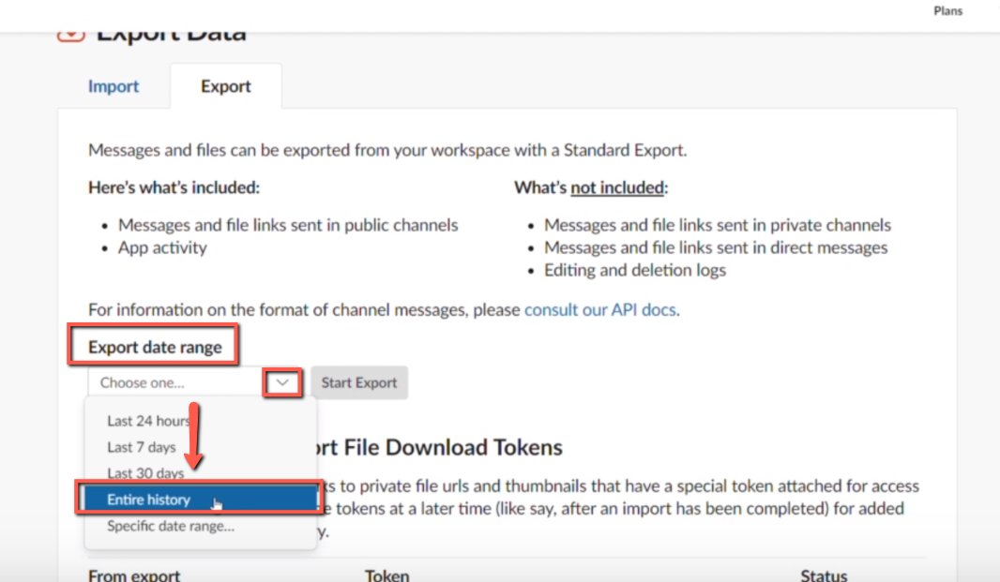
    <!-- sop-caption-start -->
    This screenshot anchors the step about on the ‘Export Data Range”, click the dropdown button and select “Entire History” so you can match the documented UI before acting. Look for “Entire History”, then use that cue to complete or verify the step before continuing.
    <!-- sop-caption-end -->
    <!-- sop-screenshot-end -->
<!-- sop-step-end -->

<!-- sop-step-start id=6 -->
6.  Then, click “Start Export”

    Note: Exporting will usually take around 5-10 minutes to complete.
    <!-- sop-screenshot-start -->
    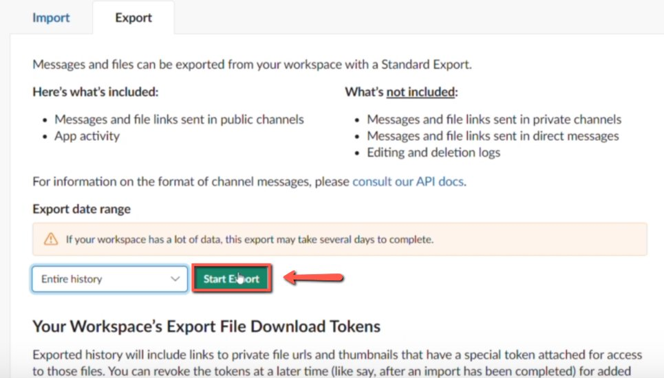
    <!-- sop-caption-start -->
    This screenshot anchors the step to click “Start Export” so you can match the documented UI before acting. Look for “Start Export”, then use that cue to complete or verify the step before continuing.
    <!-- sop-caption-end -->
    <!-- sop-screenshot-end -->
<!-- sop-step-end -->

<!-- sop-group-end -->

<!-- sop-group-start: "Downloading the dump" -->
### Downloading the dump

<!-- sop-step-start id=7 -->
7.  Once the export is done, an email from slack will send you a notification. Click “Visit your workplace’s export page”

    <!-- sop-screenshot-start -->
    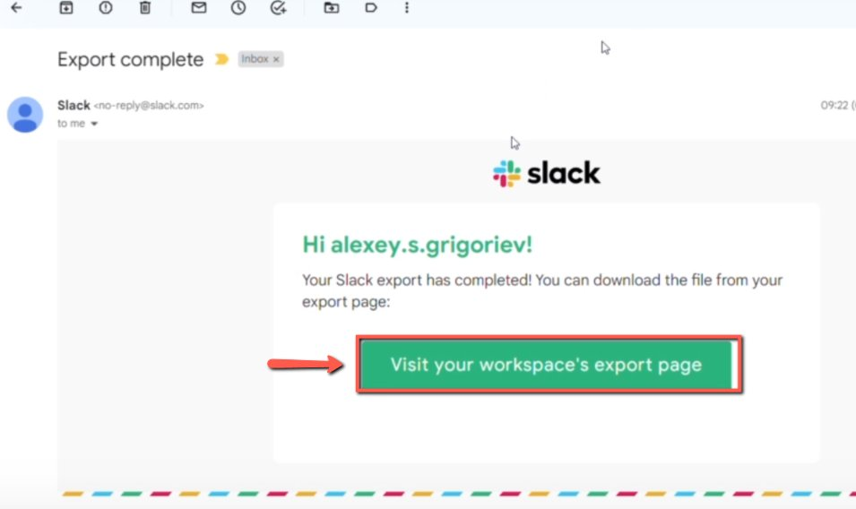
    <!-- sop-caption-start -->
    This screenshot anchors the step about once the export is done, an email from slack will send you a notification. Click “Visit your workplace’s export page” so you can match the documented UI before acting. Look for “Visit your workplace’s export page”, then use that cue to complete or verify the step before continuing.
    <!-- sop-caption-end -->
    <!-- sop-screenshot-end -->

    You will also get a notification from Slack bot. You can click on the link there too – both links lead to the samepage

    <!-- sop-screenshot-start -->
    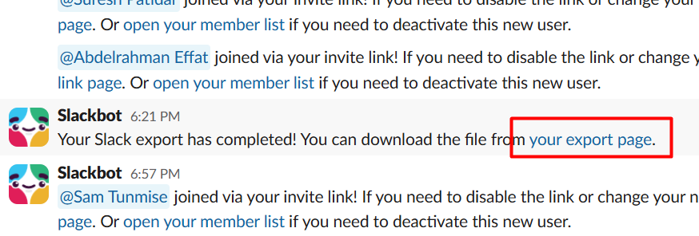
    <!-- sop-caption-start -->
    This screenshot anchors the step about you will also get a notification from Slack bot. You can click on the link there too – both links lead to the samepage so you can match the documented UI before acting. Look for the link, copy, or paste target shown there, then use it to confirm you are in the correct place before continuing.
    <!-- sop-caption-end -->
    <!-- sop-screenshot-end -->
<!-- sop-step-end -->

<!-- sop-step-start id=8 -->
8.  On the new page, scroll down, and on the “Past Exports” click the file to be downloaded under “Status”

    <!-- sop-screenshot-start -->
    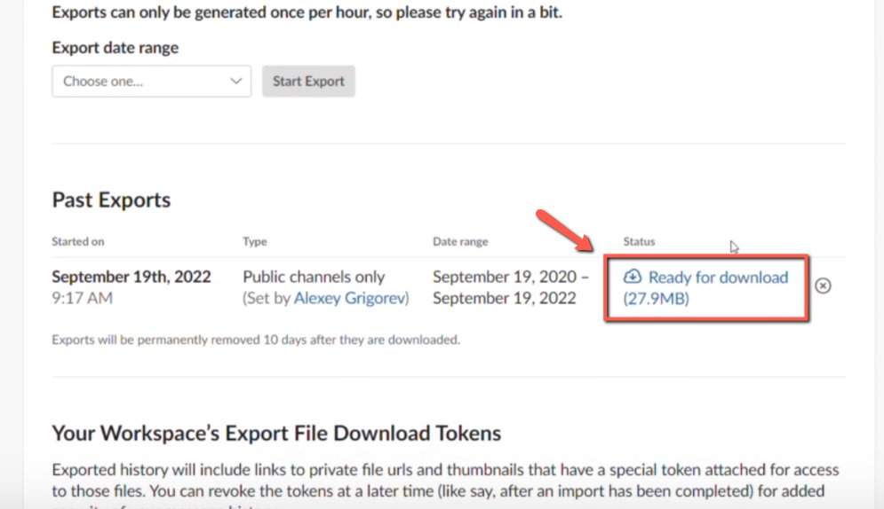
    <!-- sop-caption-start -->
    This screenshot anchors the step about on the new page, scroll down, and on the “Past Exports” click the file to be downloaded under “Status” so you can match the documented UI before acting. Look for “Past Exports” and “Status”, then use those cues to complete or verify the step before continuing.
    <!-- sop-caption-end -->
    <!-- sop-screenshot-end -->
<!-- sop-step-end -->

<!-- sop-group-end -->

<!-- sop-group-start: "Sharing it in \#slack-dump" -->
### Sharing it in \#slack-dump

<!-- sop-step-start id=9 -->
9.  Once the file has been downloaded

    - open the [“#slack-dump” channel](https://app.slack.com/client/T01ATQK62F8/C042X0VTADR)
    - upload the downloaded file on the channel (drag-and-drop it there)
    - use the text “Fresh slack dump with all the data! 📢”
    - click the send icon
    <!-- sop-screenshot-start -->
    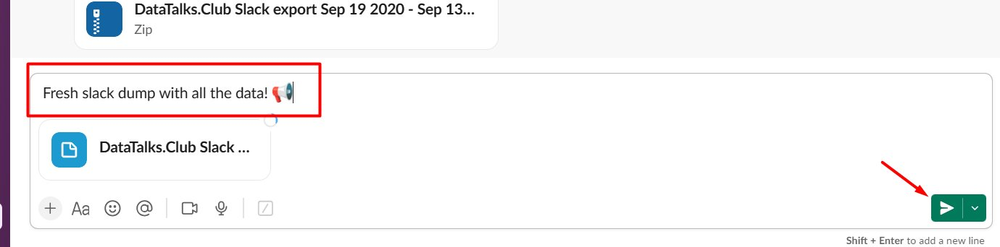
    <!-- sop-caption-start -->
    This screenshot anchors the step to click the send icon so you can match the documented UI before acting. Look for the reporting value or action control shown there, then use it to confirm you are in the correct place before continuing.
    <!-- sop-caption-end -->
    <!-- sop-screenshot-end -->
<!-- sop-step-end -->

<!-- sop-group-end -->

<!-- sop-group-start: "Making the announcement" -->
### Making the announcement

<!-- sop-step-start id=10 -->
10. After posting the dump on the special channel, repost it to \#general.

    To do this, hover over the message you sent until icons appear on the right, then click the ‘Forward message’ icon.

    <!-- sop-screenshot-start -->
    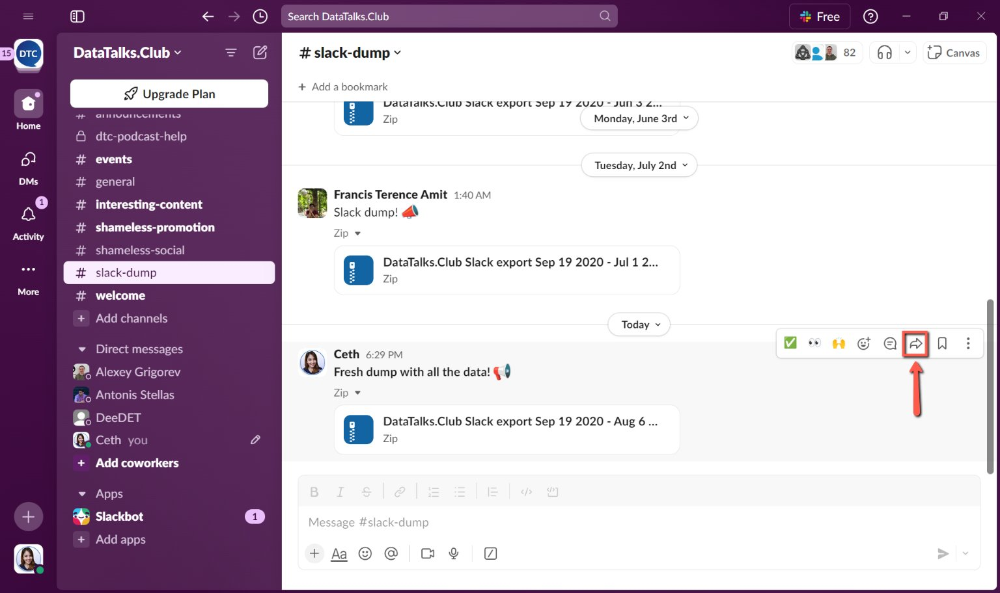
    <!-- sop-caption-start -->
    This screenshot anchors the step about to do this, hover over the message you sent until icons appear on the right, then click the ‘Forward message’ icon so you can match the documented UI before acting. Look for the reporting value or action control shown there, then use it to confirm you are in the correct place before continuing.
    <!-- sop-caption-end -->
    <!-- sop-screenshot-end -->
<!-- sop-step-end -->

<!-- sop-step-start id=11 -->
11. And then, use the following text
    📢 You can find the fresh Slack dump in \#slack-dump!

    add “#announcements” as the channel and click “Forward”
    <!-- sop-screenshot-start -->
    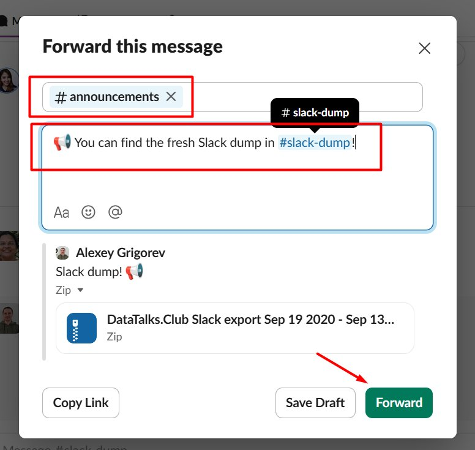
    <!-- sop-caption-start -->
    This screenshot anchors the step to add “#announcements” as the channel and click “Forward” so you can match the documented UI before acting. Look for “#announcements” and “Forward”, then use those cues to complete or verify the step before continuing.
    <!-- sop-caption-end -->
    <!-- sop-screenshot-end -->

    Loom links:
<!-- sop-step-end -->

<!-- sop-group-end -->
<!-- sop-section-end -->

<!-- sop-section-start: validation -->
## Validation

-
<!-- sop-section-end -->

<!-- sop-section-start: troubleshooting -->
## Troubleshooting

-
<!-- sop-section-end -->

<!-- sop-section-start: references -->
## References

-
<!-- sop-section-end -->
