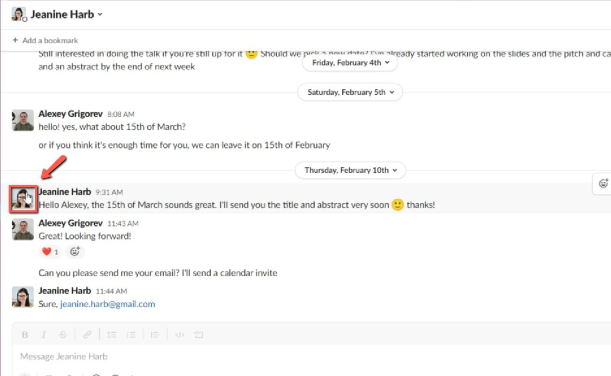
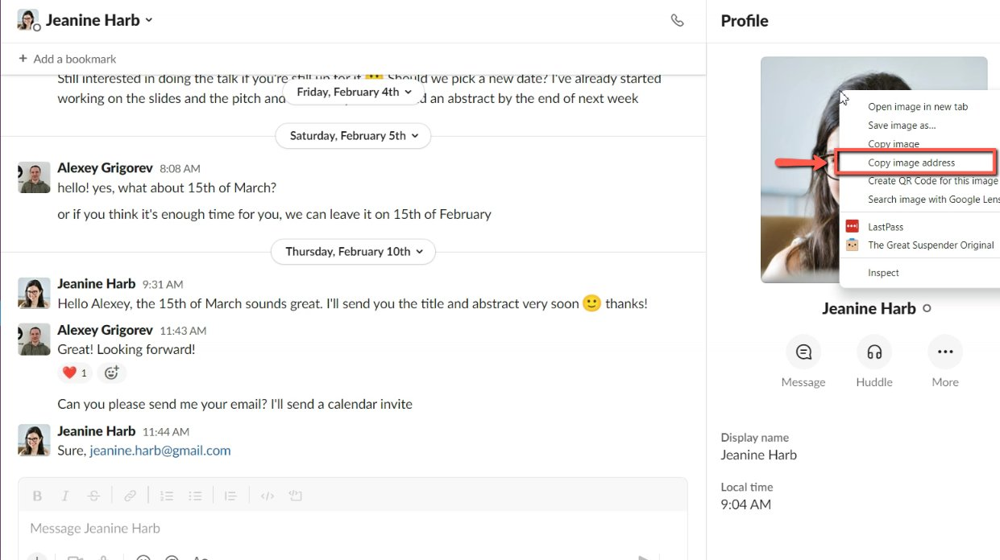

# Get speaker image from Slack

<!-- sop-section-start: summary -->
## Summary

- Purpose: Retrieve a speaker profile image from Slack.
- Outcome: The speaker image is saved or copied for use in the speaker profile.
- Trigger: A speaker approves using their Slack profile image.
- Frequency: Whenever a speaker profile image is needed from Slack.
<!-- sop-section-end -->

<!-- sop-section-start: prerequisites -->
## Prerequisites

- Access: Slack workspace and the speaker profile workflow.
- Tools: Slack profile search, browser image save or copy action.
- Inputs: Speaker name and permission to use the Slack profile image.
<!-- sop-section-end -->

<!-- sop-section-start: procedure -->
## Procedure

<!-- sop-prose-start -->
How to get speaker image from Slack

This procedure will show you the steps on how to get speaker image from Slack.

Step-by-step Instructions
<!-- sop-prose-end -->

<!-- sop-step-start id=1 -->
1.  The first thing you need to do is click on the picture of the guest.

    <!-- sop-screenshot-start -->
    
    <!-- sop-caption-start -->
    This screenshot anchors the step to click on the picture of the guest so you can match the documented UI before acting. Look for the reporting value or action control shown there, then use it to confirm you are in the correct place before continuing.
    <!-- sop-caption-end -->
    <!-- sop-screenshot-end -->
<!-- sop-step-end -->

<!-- sop-step-start id=2 -->
2.  After, click on “Copy image address” and then paste it on the Speaker profile.

    Note: You can also download the picture of the speaker by clicking “Save image as”

    <!-- sop-screenshot-start -->
    
    <!-- sop-caption-start -->
    This screenshot anchors the step about you can also download the picture of the speaker by clicking “Save image as” so you can match the documented UI before acting. Look for “Save image as”, then use that cue to complete or verify the step before continuing.
    <!-- sop-caption-end -->
    <!-- sop-screenshot-end -->
<!-- sop-step-end -->
<!-- sop-section-end -->

<!-- sop-section-start: validation -->
## Validation

-
<!-- sop-section-end -->

<!-- sop-section-start: troubleshooting -->
## Troubleshooting

-
<!-- sop-section-end -->

<!-- sop-section-start: references -->
## References

-
<!-- sop-section-end -->
