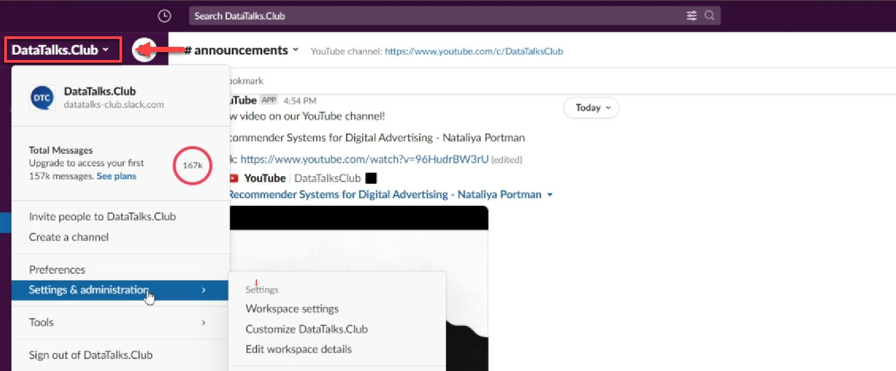
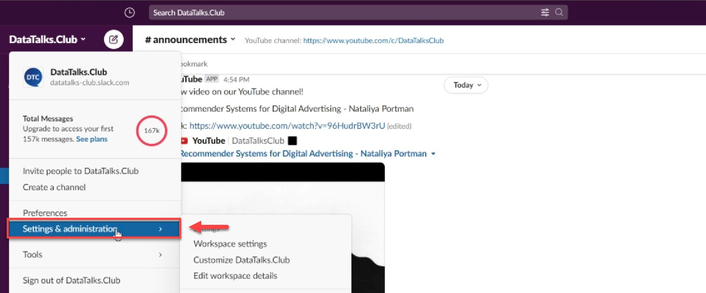
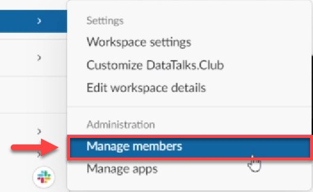
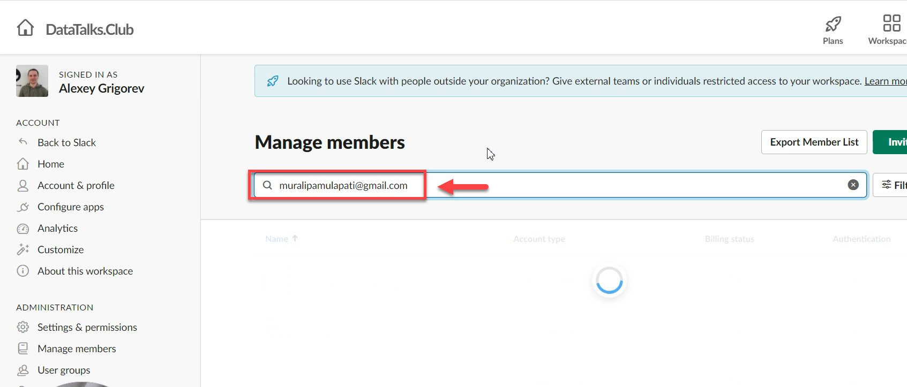
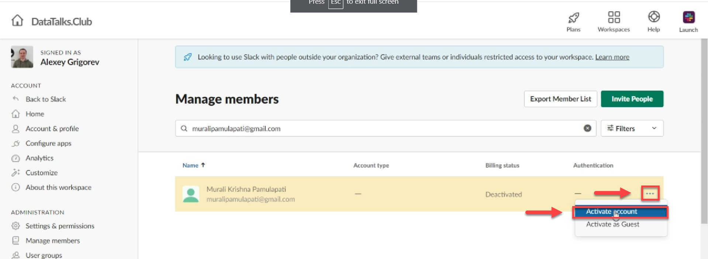

# Reactivate a Slack account

<!-- sop-section-start: summary -->
## Summary

- Purpose: Reactivate a deactivated Slack member account.
- Outcome: The selected member account is active again in Slack.
- Trigger: A member needs their Slack account restored.
- Frequency: As needed.
<!-- sop-section-end -->

<!-- sop-section-start: prerequisites -->
## Prerequisites

- Access: Slack admin access to manage members.
- Tools: Slack workspace administration.
- Inputs: Member email address or account details.
<!-- sop-section-end -->

<!-- sop-section-start: procedure -->
## Procedure

<!-- sop-prose-start -->
How to reactivate a Slack account
This procedure will show you the steps on how to reactive slack account

Step-by-step Instructions
<!-- sop-prose-end -->

<!-- sop-step-start id=1 -->
1.  The first thing you need to do is open DataTalks.Club slack community and on the top left side of your screen, select “DataTalks.Club”

    <!-- sop-screenshot-start -->
    
    <!-- sop-caption-start -->
    This screenshot anchors the step to open DataTalks.Club slack community and on the top left side of your screen, select “DataTalks.Club” so you can match the documented UI before acting. Look for “DataTalks.Club”, then use that cue to complete or verify the step before continuing.
    <!-- sop-caption-end -->
    <!-- sop-screenshot-end -->
<!-- sop-step-end -->

<!-- sop-step-start id=2 -->
2.  And then select “Settings & administration”

    <!-- sop-screenshot-start -->
    
    <!-- sop-caption-start -->
    This screenshot anchors the step to select “Settings & administration” so you can match the documented UI before acting. Look for “Settings & administration”, then use that cue to complete or verify the step before continuing.
    <!-- sop-caption-end -->
    <!-- sop-screenshot-end -->
<!-- sop-step-end -->

<!-- sop-step-start id=3 -->
3.  After, click “Manage members”

    <!-- sop-screenshot-start -->
    
    <!-- sop-caption-start -->
    This screenshot anchors the step to click “Manage members” so you can match the documented UI before acting. Look for “Manage members”, then use that cue to complete or verify the step before continuing.
    <!-- sop-caption-end -->
    <!-- sop-screenshot-end -->
<!-- sop-step-end -->

<!-- sop-step-start id=4 -->
4.  To proceed, enter the email of the member

    Note: In this example, the email is muralipamulapati@gmail.com

    <!-- sop-screenshot-start -->
    
    <!-- sop-caption-start -->
    This screenshot anchors the example shown in the procedure so you can match the documented UI before acting. Look for the email or message detail shown there, then use it to confirm you are in the correct place before continuing.
    <!-- sop-caption-end -->
    <!-- sop-screenshot-end -->
<!-- sop-step-end -->

<!-- sop-step-start id=5 -->
5.  After finding the email account, select the three-dotted button and press “Activate account”

    <!-- sop-screenshot-start -->
    
    <!-- sop-caption-start -->
    This screenshot anchors the step about finding the email account, select the three-dotted button and press “Activate account” so you can match the documented UI before acting. Look for “Activate account”, then use that cue to complete or verify the step before continuing.
    <!-- sop-caption-end -->
    <!-- sop-screenshot-end -->
<!-- sop-step-end -->
<!-- sop-section-end -->

<!-- sop-section-start: validation -->
## Validation

-
<!-- sop-section-end -->

<!-- sop-section-start: troubleshooting -->
## Troubleshooting

-
<!-- sop-section-end -->

<!-- sop-section-start: references -->
## References

-
<!-- sop-section-end -->
