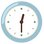

# Announce event in Slack in #announcements template

## Usage

- Use when:
- Audience:
- Required inputs:

## Template

Image note: This image is a reusable visual cue in the Slack announcement template, not a process screenshot. Look for the megaphone icon for the event title line; keep it paired with this field when replacing the Join us for the "Title" Event! placeholder or example value.
Join us for the "Title" Event!

Image note: This image is a reusable visual cue in the Slack announcement template, not a process screenshot. Look for the microphone icon for the speaker line; keep it paired with this field when replacing the Speaker placeholder or example value.
Speaker:

Image note: This image is a reusable visual cue in the Slack announcement template, not a process screenshot. Look for the calendar icon for the date line; keep it paired with this field when replacing the Date placeholder or example value.
Date:

Image note: This image is a reusable visual cue in the Slack announcement template, not a process screenshot. Look for the clock icon for the time line; keep it paired with this field when replacing the Time: 24:00 (CET) placeholder or example value.
Time: 24:00 (CET)

This event focuses on XX

Image note: This image is a reusable visual cue in the Slack announcement template, not a process screenshot. Look for the link icon for the registration link line; keep it paired with this field when replacing the Register here: (Luma Link) placeholder or example value.
Register here: (Luma Link)

–
Example:

Francis Terence Amit

11:27 PM

Image note: This image is a reusable visual cue in the Slack announcement template, not a process screenshot. Look for the megaphone icon for the event title line; keep it paired with this field when replacing the Join us for the "Inventory Optimization in E commerce" Event! placeholder or example value.
Join us for the "Inventory Optimization in E-commerce" Event!

Image note: This image is a reusable visual cue in the Slack announcement template, not a process screenshot. Look for the microphone icon for the speaker line; keep it paired with this field when replacing the Speaker: Hagop Dippel & Andreas Syrén placeholder or example value.
Speaker: Hagop Dippel & Andreas Syrén

Image note: This image is a reusable visual cue in the Slack announcement template, not a process screenshot. Look for the calendar icon for the date line; keep it paired with this field when replacing the Date: Tuesday, July 2, 2024 placeholder or example value.
Date: Tuesday, July 2, 2024

Image note: This image is a reusable visual cue in the Slack announcement template, not a process screenshot. Look for the clock icon for the time line; keep it paired with this field when replacing the Time: 5:00 PM (CET) placeholder or example value.
Time: 5:00 PM (CET)

This event focuses on e-commerce inventory optimization using Monte Carlo simulations, gradient-free optimization, Numba, and cloud infrastructure.

Image note: This image is a reusable visual cue in the Slack announcement template, not a process screenshot. Look for the link icon for the registration link line; keep it paired with this field when replacing the Register here: https://lu.ma/blpa8il4 placeholder or example value.
Register here: [https://lu.ma/blpa8il4](https://lu.ma/blpa8il4)

–

Image note: This image is a reusable visual cue in the Slack announcement template, not a process screenshot. Look for the megaphone icon for the event title line; keep it paired with this field when replacing the Join us for the "Developing your career in ML by studying" Event! placeholder or example value.
Join us for the "Developing your career in ML by studying" Event!

Image note: This image is a reusable visual cue in the Slack announcement template, not a process screenshot. Look for the microphone icon for the speaker line; keep it paired with this field when replacing the Speaker: Ella (Wati) Sahnan placeholder or example value.
Speaker: Ella (Wati) Sahnan

Image note: This image is a reusable visual cue in the Slack announcement template, not a process screenshot. Look for the calendar icon for the date line; keep it paired with this field when replacing the Date: Monday, Aug 19, 2024 placeholder or example value.
Date: Monday, Aug 19, 2024

Image note: This image is a reusable visual cue in the Slack announcement template, not a process screenshot. Look for the clock icon for the time line; keep it paired with this field when replacing the Time: 12:25 PM (CET) placeholder or example value.
Time: 12:25 PM (CET)

This event focuses on advancing your ML career through continuous learning, effective Zoomcamp participation, and public knowledge sharing.

Image note: This image is a reusable visual cue in the Slack announcement template, not a process screenshot. Look for the link icon for the registration link line; keep it paired with this field when replacing the Register here: https://lu.ma/bm01veg6 placeholder or example value.
Register here: https://lu.ma/bm01veg6

## Notes

-
