# Creating Course Databases in Airtable

<!-- sop-section-start: summary -->
## Summary

- Purpose: The process involves creating a database for a new course.
- Outcome: To collect registrations from the students of the course.
- Trigger: Before the course begins, for registration and updates.
- Frequency: Once per course or cohort setup.
<!-- sop-section-end -->

<!-- sop-section-start: prerequisites -->
## Prerequisites

- Access: Airtable template base.
- Tools: Airtable.
- Inputs: Course name, form title, sponsor fields, and branding preferences.
<!-- sop-section-end -->

<!-- sop-section-start: procedure -->
## Procedure

<!-- sop-prose-start -->
Creating Course Databases in Airtable
This document shows the steps to creating Course Databases in Airtable.

Step-by-step Instructions
<!-- sop-prose-end -->

<!-- sop-step-start id=1 -->
1.  The first thing you need to do is go to the [Airtable](https://airtable.com/) and find the “\[TEMPLATE\] Zoomcamp”

    Note: The template can sometimes be located at the top but may also appear anywhere at the bottom.

    <!-- sop-screenshot-start -->
    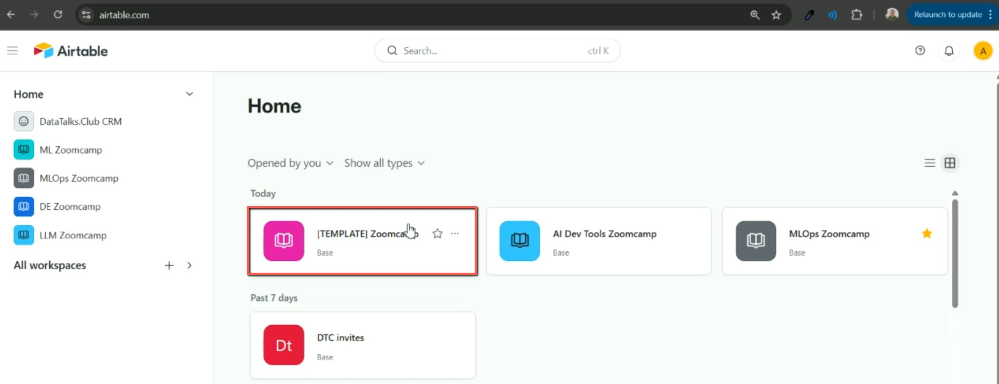
    <!-- sop-caption-start -->
    This Airtable home screen highlights the `[TEMPLATE] Zoomcamp` base. Start from this template so the new course inherits the expected views, form, and fields.
    <!-- sop-caption-end -->
    <!-- sop-screenshot-end -->
<!-- sop-step-end -->

<!-- sop-step-start id=2 -->
2.  Click on the three dots, and in the pop-up box, select “Duplicate base.”

    <!-- sop-screenshot-start -->
    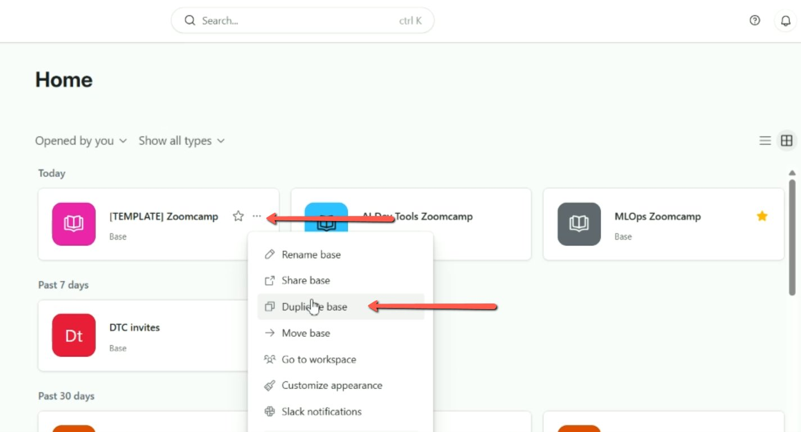
    <!-- sop-caption-start -->
    This base menu highlights Duplicate base. Use this action to create a course-specific copy without changing the shared template.
    <!-- sop-caption-end -->
    <!-- sop-screenshot-end -->
<!-- sop-step-end -->

<!-- sop-step-start id=3 -->
3.  Replace the template name by typing the name of the course. Then uncheck or turn off the "Duplicate records" option. Finally, click “Duplicate base.”

    Note: In this example the name of the course is , “Open-Source LLM Zoomcamp.”

    <!-- sop-screenshot-start -->
    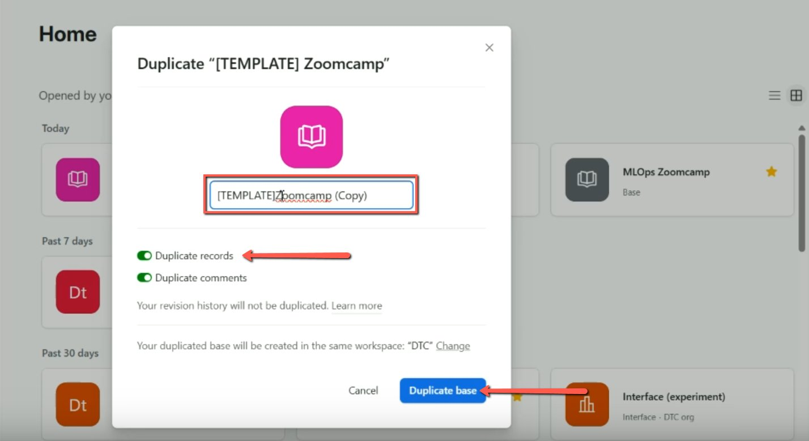
    <!-- sop-caption-start -->
    This duplicate dialog shows the new course name field and the Duplicate records toggle. Turn records off before duplicating so the new course starts with empty registration data.
    <!-- sop-caption-end -->
    <!-- sop-screenshot-end -->
<!-- sop-step-end -->

<!-- sop-step-start id=4 -->
4.  After duplicating, click on “Open base”.

    <!-- sop-screenshot-start -->
    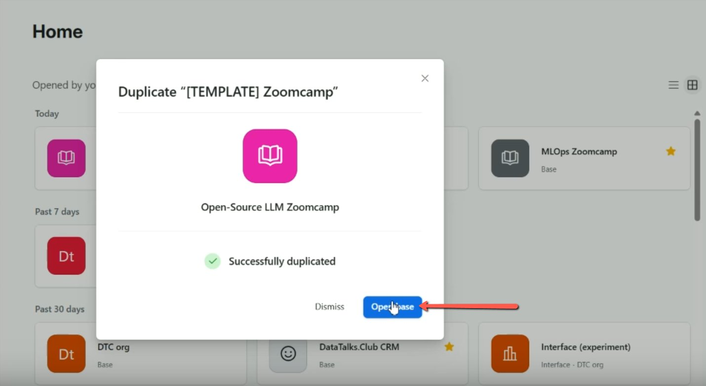
    <!-- sop-caption-start -->
    This success dialog confirms the base was duplicated and offers Open base. Open it immediately to continue configuring the form and fields in the new course base.
    <!-- sop-caption-end -->
    <!-- sop-screenshot-end -->
<!-- sop-step-end -->

<!-- sop-step-start id=5 -->
5.  On the sidebar, click on the form “TODO: TITLE”.

    <!-- sop-screenshot-start -->
    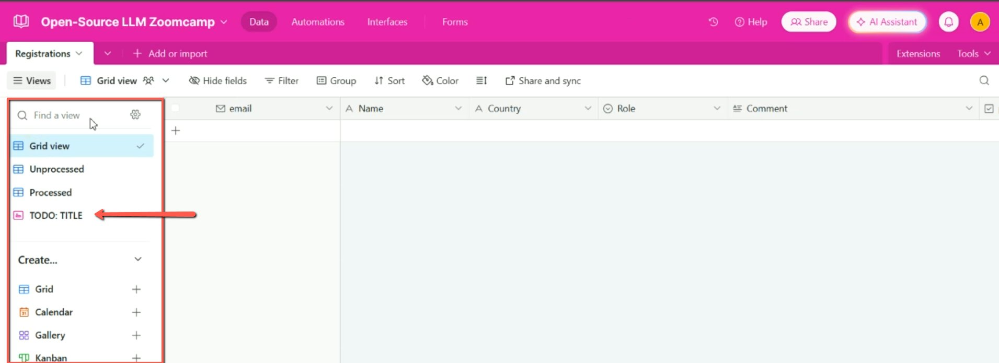
    <!-- sop-caption-start -->
    This shows the copied base sidebar with the placeholder form title. Select the TODO form so the public registration page can be renamed for the course.
    <!-- sop-caption-end -->
    <!-- sop-screenshot-end -->
<!-- sop-step-end -->

<!-- sop-step-start id=6 -->
6.  Update the name of the title.

    <!-- sop-screenshot-start -->
    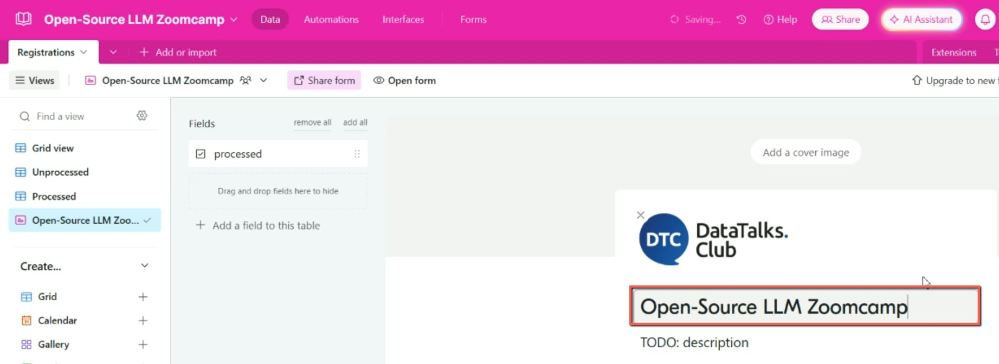
    <!-- sop-caption-start -->
    This form editor shows the course title replacing the placeholder. Verify the title students will see before adjusting the rest of the form.
    <!-- sop-caption-end -->
    <!-- sop-screenshot-end -->
<!-- sop-step-end -->

<!-- sop-step-start id=7 -->
7.  Scroll down.

    Note: You might need to change other settings by toggling options as per instructions, but in this example, no changes are required.

    <!-- sop-screenshot-start -->
    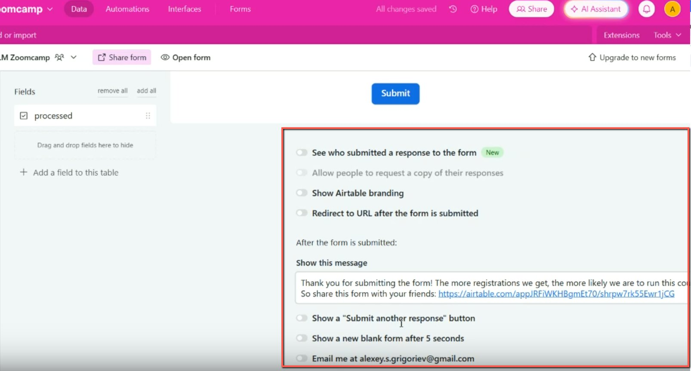
    <!-- sop-caption-start -->
    This form settings area shows follow-up and branding options. Check these settings while scrolling so the copied template behavior still matches the course requirements.
    <!-- sop-caption-end -->
    <!-- sop-screenshot-end -->
<!-- sop-step-end -->

<!-- sop-step-start id=8 -->
8.  There are cases where additional data is required. In this case, the course is sponsored, and the sponsor has requested the emails of those who signed up for the course.

    On the side bar, select the “Grid View”.

    <!-- sop-screenshot-start -->
    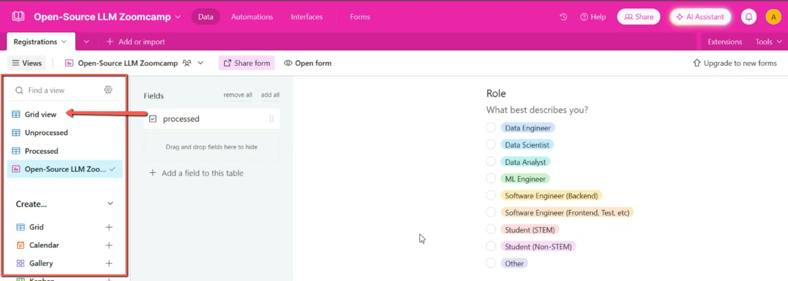
    <!-- sop-caption-start -->
    This shows the Grid View selected from the sidebar. Switch here when you need to add database fields that support the registration form.
    <!-- sop-caption-end -->
    <!-- sop-screenshot-end -->
<!-- sop-step-end -->

<!-- sop-step-start id=9 -->
9.  Click on the “+” sign, then select the “Checkbox”.

    <!-- sop-screenshot-start -->
    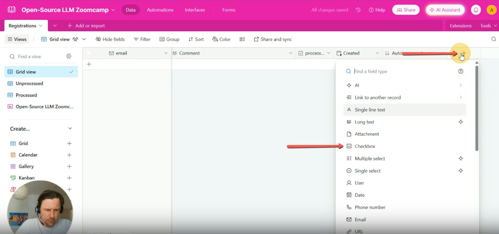
    <!-- sop-caption-start -->
    This field type menu highlights Checkbox. Choose it for sponsor email consent because the form needs a clear yes/no response.
    <!-- sop-caption-end -->
    <!-- sop-screenshot-end -->
<!-- sop-step-end -->

<!-- sop-step-start id=10 -->
10. Type “Sponsor share email” in the “Field name (optional)”. Then click on “Create Field”.

    <!-- sop-screenshot-start -->
    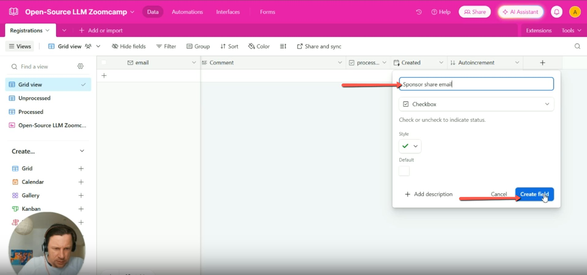
    <!-- sop-caption-start -->
    This create-field dialog shows `Sponsor share email` as a checkbox field. Confirm the field name and type before creating it so the sponsor consent field appears in the base.
    <!-- sop-caption-end -->
    <!-- sop-screenshot-end -->
<!-- sop-step-end -->

<!-- sop-step-start id=11 -->
11. Go to the side bar and select the form “Open-Source LLM Zoomcamp”.

    In the “Fields” click the field we just created and drag it above the Blue submit button.
    <!-- sop-screenshot-start -->
    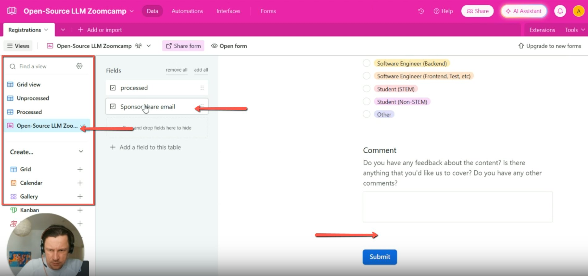
    <!-- sop-caption-start -->
    This form editor shows the new sponsor field being positioned before the submit button. Drag it into the visible form section so registrants answer it before submitting.
    <!-- sop-caption-end -->
    <!-- sop-screenshot-end -->
<!-- sop-step-end -->

<!-- sop-step-start id=12 -->
12. Rename the Field name with “Share my email with the course sponsor”

    <!-- sop-screenshot-start -->
    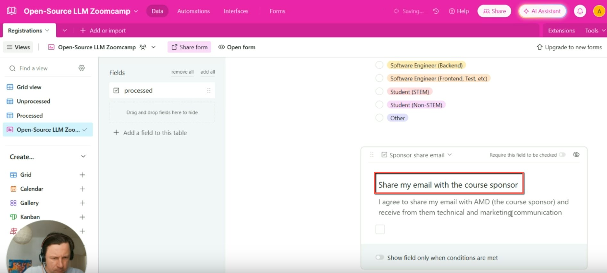
    <!-- sop-caption-start -->
    This field editor shows the public-facing consent label and helper text. Verify the wording makes the sponsor-sharing decision explicit to registrants.
    <!-- sop-caption-end -->
    <!-- sop-screenshot-end -->
<!-- sop-step-end -->

<!-- sop-step-start id=13 -->
13. Lastly, go back to the Home page, click on the three dots of the database we created, and select “Customize appearance.”

    <!-- sop-screenshot-start -->
    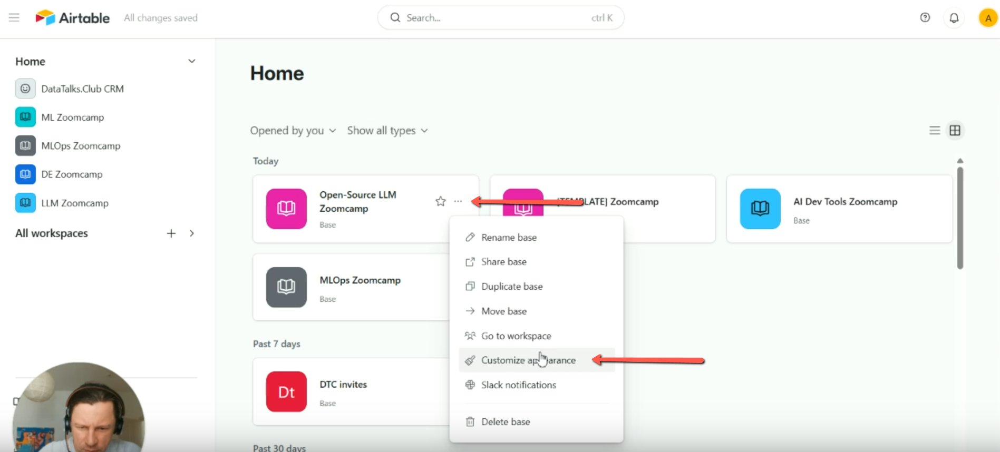
    <!-- sop-caption-start -->
    This Airtable base menu highlights Customize appearance. Use it after setup so the new base has a recognizable course color in the workspace.
    <!-- sop-caption-end -->
    <!-- sop-screenshot-end -->
<!-- sop-step-end -->

<!-- sop-step-start id=14 -->
14. Select the light pink color.

    <!-- sop-screenshot-start -->
    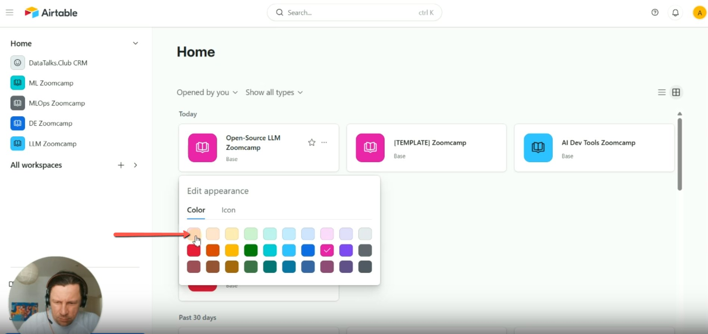
    <!-- sop-caption-start -->
    This color picker shows the appearance palette for the course base. Select the intended color so the course base is easy to distinguish from templates and other cohorts.
    <!-- sop-caption-end -->
    <!-- sop-screenshot-end -->
<!-- sop-step-end -->
<!-- sop-section-end -->

<!-- sop-section-start: validation -->
## Validation

-
<!-- sop-section-end -->

<!-- sop-section-start: troubleshooting -->
## Troubleshooting

-
<!-- sop-section-end -->

<!-- sop-section-start: references -->
## References

-
<!-- sop-section-end -->
