# Pulling contacts from Airtable form to Mailchip for Courses

<!-- sop-section-start: summary -->
## Summary

- Purpose: The process involves transferring participant contact information submitted via Airtable forms to MailChimp for email campaigns
- Outcome: To streamline communication and automation of course-related emails to participants
- Trigger: Before the course begins for registration and updates
- Frequency: Once per course launch or cohort setup.
<!-- sop-section-end -->

<!-- sop-section-start: prerequisites -->
## Prerequisites

- Access: Mailchimp, Airtable, and the MailChimpPoller GitHub repository.
- Tools: Mailchimp, Airtable, GitHub Actions.
- Inputs: Course tag, Airtable form/view details, and welcome email content.
<!-- sop-section-end -->

<!-- sop-section-start: procedure -->
## Procedure

<!-- sop-group-start: "Configuring Automated Emails" -->
### Configuring Automated Emails

<!-- sop-step-start id=1 -->
1.  Go to [https://us19.admin.mailchimp.com/audience/tags/](https://us19.admin.mailchimp.com/audience/tags/) and click “Create new tag” on the top right side of the screen.

    <!-- sop-screenshot-start -->
    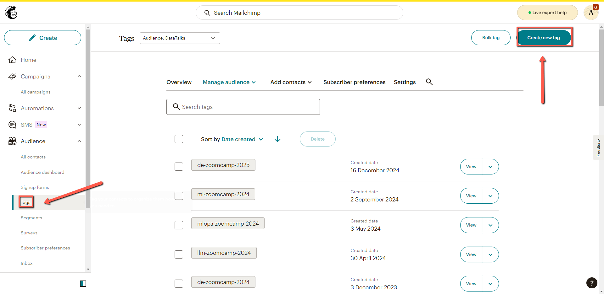
    <!-- sop-caption-start -->
    The screenshot shows the Mailchimp audience tags page with the Create new tag button. This is where the course-specific tag is created before automation setup.
    <!-- sop-caption-end -->
    <!-- sop-screenshot-end -->
<!-- sop-step-end -->

<!-- sop-step-start id=2 -->
2.  Name the layer using the same format from the past tags and click “create”.

    Note: for example: de-zoomcamp-2024

    <!-- sop-screenshot-start -->
    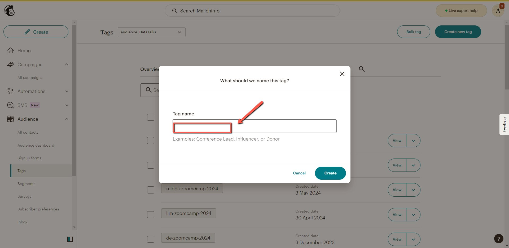
    <!-- sop-caption-start -->
    The screenshot shows the tag creation dialog in Mailchimp. It helps confirm the new tag follows the existing course-year naming pattern before you create it.
    <!-- sop-caption-end -->
    <!-- sop-screenshot-end -->
<!-- sop-step-end -->

<!-- sop-step-start id=3 -->
3.  Hover over the tab on the left, select “All journeys” and click “Classic Automations”.

    <!-- sop-screenshot-start -->
    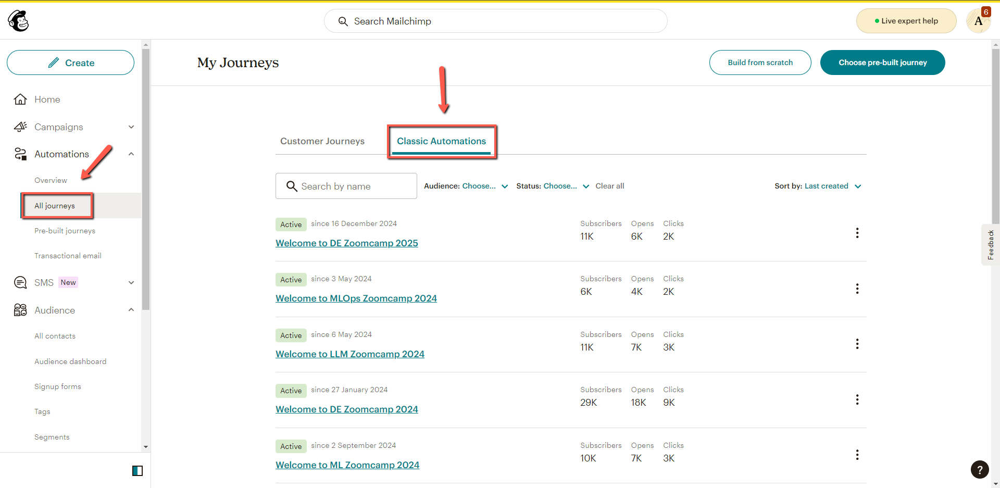
    <!-- sop-caption-start -->
    The screenshot shows the Mailchimp navigation path to Classic Automations. This is the section where existing course email automations can be reused.
    <!-- sop-caption-end -->
    <!-- sop-screenshot-end -->

    ##
<!-- sop-step-end -->

<!-- sop-step-start id=4 -->
4.  Find the past automation for the course and select “Replicate”.

    <!-- sop-screenshot-start -->
    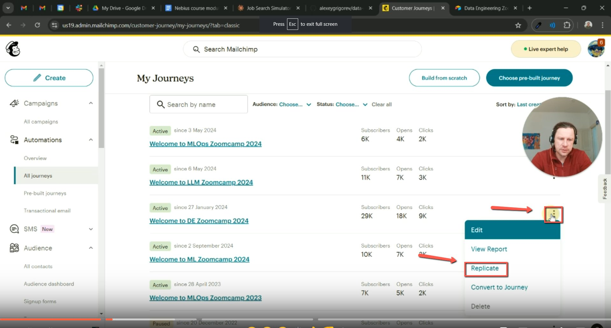
    <!-- sop-caption-start -->
    The screenshot shows a previous course automation with the Replicate option. Replicating keeps the campaign structure while letting you update it for the new course.
    <!-- sop-caption-end -->
    <!-- sop-screenshot-end -->
<!-- sop-step-end -->

<!-- sop-step-start id=5 -->
5.  It would bring you to a new page and click “Edit Settings” below the course name.

    <!-- sop-screenshot-start -->
    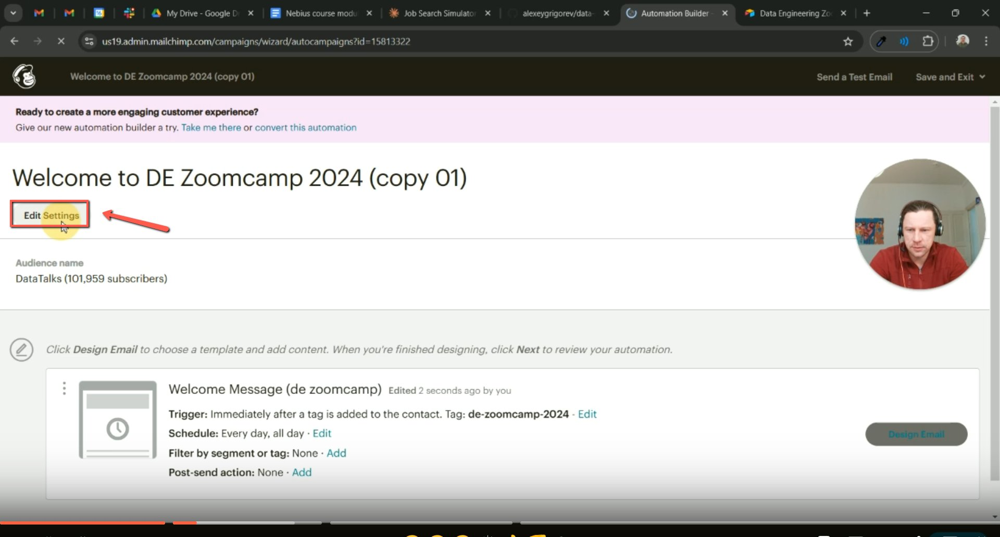
    <!-- sop-caption-start -->
    The screenshot shows the replicated automation page with Edit Settings under the course name. This is where the workflow name and course metadata are adjusted.
    <!-- sop-caption-end -->
    <!-- sop-screenshot-end -->
<!-- sop-step-end -->

<!-- sop-step-start id=6 -->
6.  Under Workflow name, edit the year to the year of the course you are working on and click “Save.

    <!-- sop-screenshot-start -->
    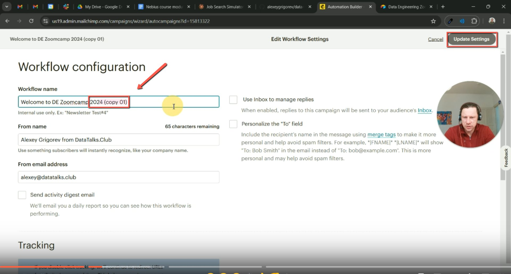
    <!-- sop-caption-start -->
    The screenshot shows the Mailchimp workflow name field and Save control. Updating the year here keeps the replicated automation aligned with the current course cohort.
    <!-- sop-caption-end -->
    <!-- sop-screenshot-end -->
<!-- sop-step-end -->

<!-- sop-step-start id=7 -->
7.  It would bring you the the default page and click “Edit”

    <!-- sop-screenshot-start -->
    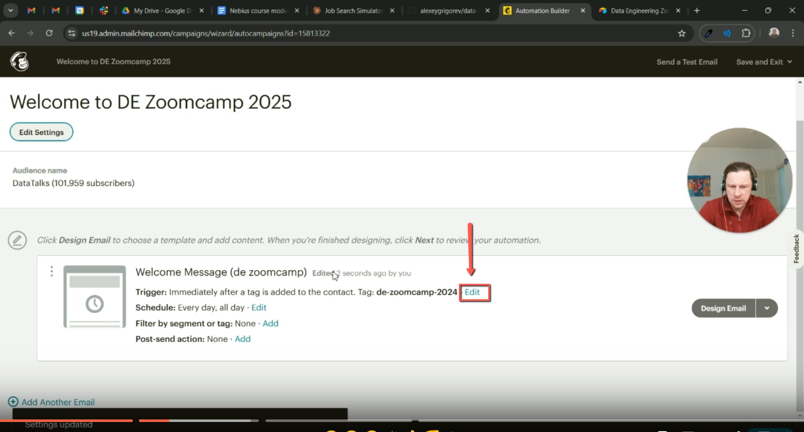
    <!-- sop-caption-start -->
    The screenshot shows the automation overview with the Edit button. Opening it lets you update the trigger settings and email content for the new tag.
    <!-- sop-caption-end -->
    <!-- sop-screenshot-end -->
<!-- sop-step-end -->

<!-- sop-group-end -->

<!-- sop-group-start: "Checking Links and Updates" -->
### Checking Links and Updates

<!-- sop-step-start id=8 -->
8.  Select the right tag under “Settings” and click “Save”

    <!-- sop-screenshot-start -->
    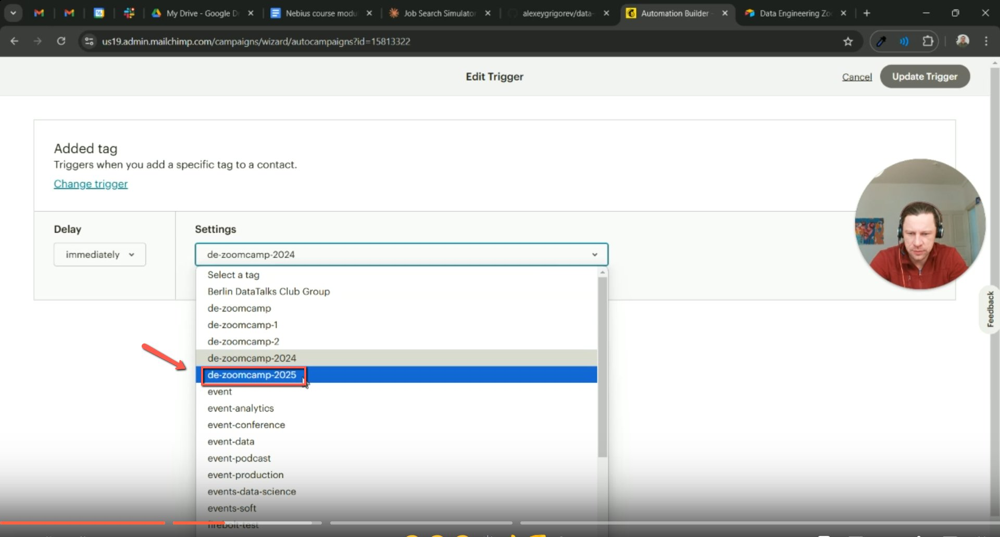
    <!-- sop-caption-start -->
    The screenshot shows the automation settings where the audience tag is selected. Choosing the new course tag ensures only the intended Airtable contacts enter the campaign.
    <!-- sop-caption-end -->
    <!-- sop-screenshot-end -->
<!-- sop-step-end -->

<!-- sop-step-start id=9 -->
9.  After, click “Design Email". 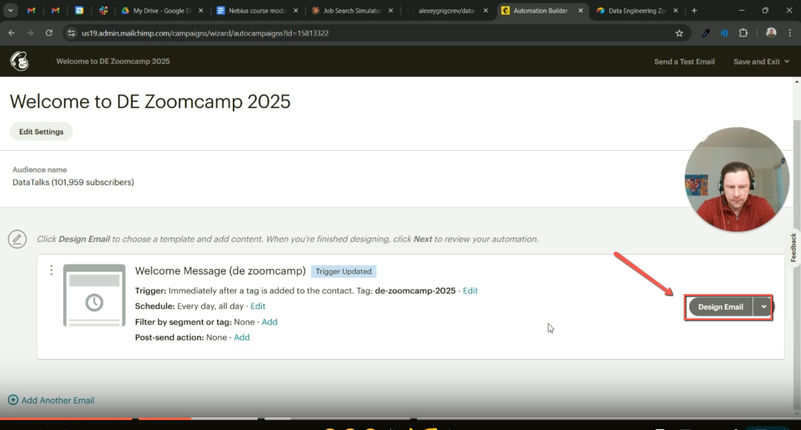
    Image note: The screenshot shows the Design Email control in the Mailchimp automation. This opens the email content editor where links and copy are checked.
<!-- sop-step-end -->

<!-- sop-step-start id=10 -->
10. Check if all links are correct and update if necessary.

    <!-- sop-screenshot-start -->
    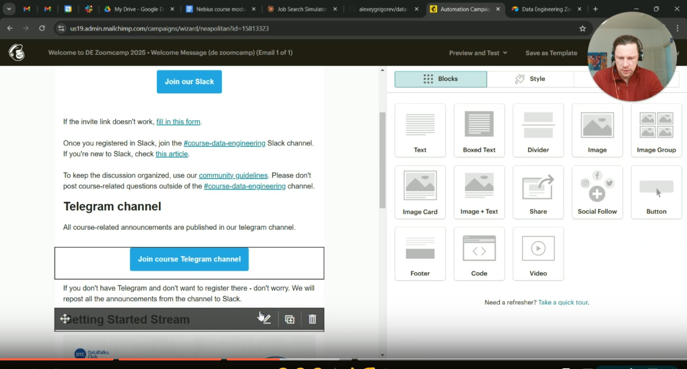
    <!-- sop-caption-start -->
    The screenshot shows the Mailchimp email editor with linked content. It highlights where course links need to be reviewed and corrected.
    <!-- sop-caption-end -->
    <!-- sop-screenshot-end -->
<!-- sop-step-end -->

<!-- sop-step-start id=11 -->
11. For “Watch here”, change it to “Sign up here” and change the link to the Luma URL of the event.

    Note: After the live stream, update the registration link with the YouTube recording link and change back to “Watch here”.

    <!-- sop-screenshot-start -->
    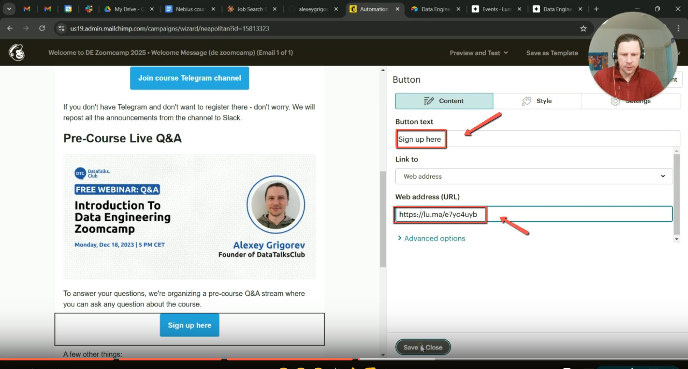
    <!-- sop-caption-start -->
    The screenshot shows the email button text and link settings. Change the button to Sign up here and point it to the Luma registration URL before launch.
    <!-- sop-caption-end -->
    <!-- sop-screenshot-end -->
<!-- sop-step-end -->

<!-- sop-step-start id=12 -->
12. Select “Next” and click “Save and Continue”

    <!-- sop-screenshot-start -->
    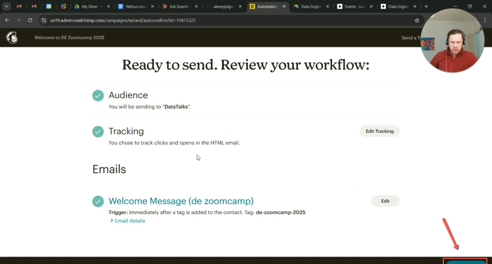
    <!-- sop-caption-start -->
    The screenshot shows the final Mailchimp editor controls for Next and Save and Continue. These save the email edits and return you to the automation flow.
    <!-- sop-caption-end -->
    <!-- sop-screenshot-end -->
<!-- sop-step-end -->

<!-- sop-group-end -->

<!-- sop-group-start: "Finalizing Automation" -->
### Finalizing Automation

<!-- sop-step-start id=13 -->
13. Go to [https://github.com/alexeygrigorev/airtable-mailchimp-poller](https://github.com/alexeygrigorev/airtable-mailchimp-poller) and select “config.yaml”.

    <!-- sop-screenshot-start -->
    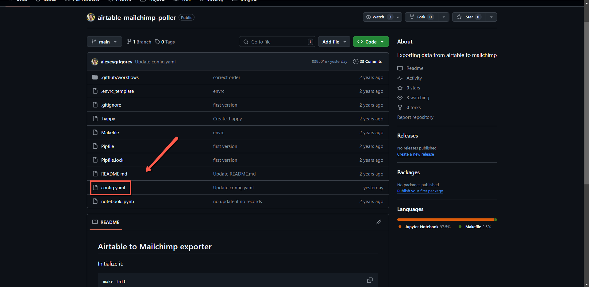
    <!-- sop-caption-start -->
    The screenshot shows the airtable-mailchimp-poller repository with config.yaml selected. This file controls which Airtable tags the poller syncs to Mailchimp.
    <!-- sop-caption-end -->
    <!-- sop-screenshot-end -->
<!-- sop-step-end -->

<!-- sop-step-start id=14 -->
14. Find the appropriate tag and update the year.

    <!-- sop-screenshot-start -->
    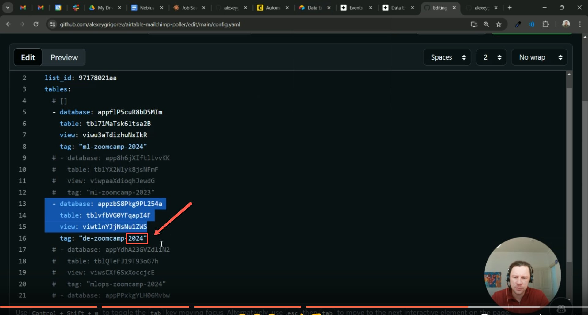
    <!-- sop-caption-start -->
    The screenshot shows the config.yaml tag entry that needs a year update. Matching this value to the Mailchimp tag keeps the poller and automation connected.
    <!-- sop-caption-end -->
    <!-- sop-screenshot-end -->
<!-- sop-step-end -->

<!-- sop-step-start id=15 -->
15. Select “Actions” and Click “Run Workflow”.

    <!-- sop-screenshot-start -->
    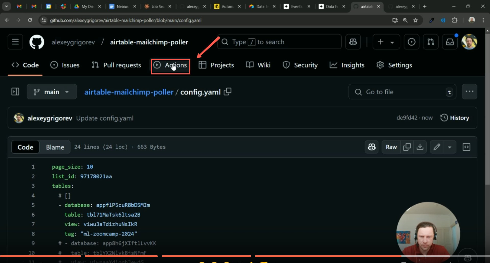
    <!-- sop-caption-start -->
    The screenshot shows the GitHub Actions page with Run Workflow. Running it triggers the Airtable-to-Mailchimp sync after the configuration update.
    <!-- sop-caption-end -->
    <!-- sop-screenshot-end -->
<!-- sop-step-end -->

<!-- sop-step-start id=16 -->
16. After running the workflow, go back to Mailchimp and now you can click “View Queue” to verify that emails are being pulled properly.

    <!-- sop-screenshot-start -->
    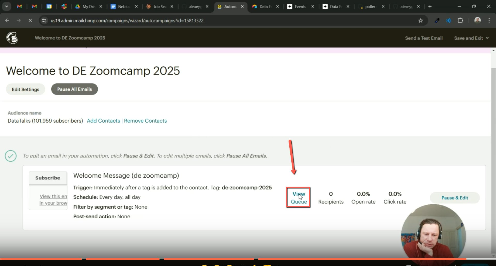
    <!-- sop-caption-start -->
    The screenshot shows Mailchimp's View Queue control for the automation. The queue confirms whether contacts from Airtable are being added to the email flow.
    <!-- sop-caption-end -->
    <!-- sop-screenshot-end -->
<!-- sop-step-end -->

<!-- sop-group-end -->
<!-- sop-section-end -->

<!-- sop-section-start: validation -->
## Validation

-
<!-- sop-section-end -->

<!-- sop-section-start: troubleshooting -->
## Troubleshooting

-
<!-- sop-section-end -->

<!-- sop-section-start: references -->
## References

-
<!-- sop-section-end -->
