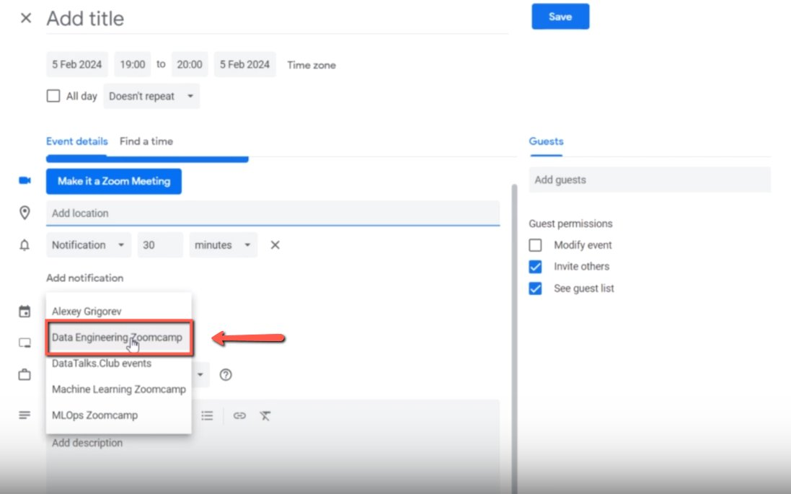
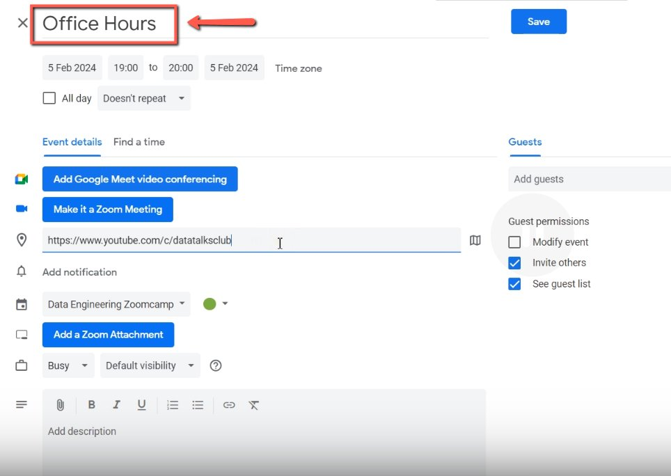
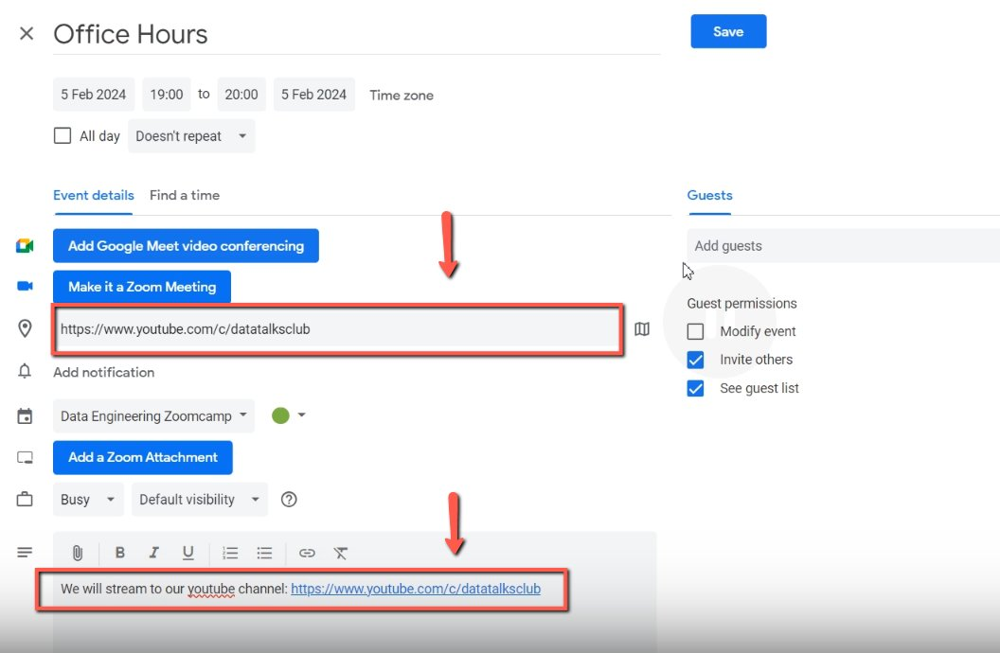

# Creating a Calendar in the Course

<!-- sop-section-start: summary -->
## Summary

- Purpose: Create public course calendar events for course sessions.
- Outcome: Course participants see the event on the correct course calendar.
- Trigger: A course event or office-hours session is scheduled.
- Frequency: Per course event.
<!-- sop-section-end -->

<!-- sop-section-start: prerequisites -->
## Prerequisites

- Access: Course Google Calendar.
- Tools: Google Calendar, YouTube.
- Inputs: Event title, date, time, course calendar, and public stream link.
<!-- sop-section-end -->

<!-- sop-section-start: procedure -->
## Procedure

<!-- sop-prose-start -->
Creating a Calendar in the Course
This procedure will show you the steps on how to Create a Calendar in the Course

Step-by-step Instructions
<!-- sop-prose-end -->

<!-- sop-step-start id=1 -->
1.  First, select the “Data Engineering Zoomcamp” calendar

    Note: Don’t add any guests.

    <!-- sop-screenshot-start -->
    
    <!-- sop-caption-start -->
    This shows the calendar dropdown with the course calendar selected and no guest entry required. Verify the event is assigned to the course calendar rather than a personal or unrelated calendar.
    <!-- sop-caption-end -->
    <!-- sop-screenshot-end -->
<!-- sop-step-end -->

<!-- sop-step-start id=2 -->
2.  After, change the title of the zoom calendar.

    <!-- sop-screenshot-start -->
    
    <!-- sop-caption-start -->
    This shows the event title field updated to the session name and the YouTube channel in the location field. Use it to check that participants will see the correct public title before saving.
    <!-- sop-caption-end -->
    <!-- sop-screenshot-end -->
<!-- sop-step-end -->

<!-- sop-step-start id=3 -->
3.  On the location, add the link to our YouTube channel and the notes. Once done, click “Save”

    <!-- sop-screenshot-start -->
    
    <!-- sop-caption-start -->
    This confirms both the YouTube channel link in Location and the streaming note in Description. Check these fields together so calendar subscribers know where the session will be streamed.
    <!-- sop-caption-end -->
    <!-- sop-screenshot-end -->
<!-- sop-step-end -->
<!-- sop-section-end -->

<!-- sop-section-start: validation -->
## Validation

-
<!-- sop-section-end -->

<!-- sop-section-start: troubleshooting -->
## Troubleshooting

-
<!-- sop-section-end -->

<!-- sop-section-start: references -->
## References

-
<!-- sop-section-end -->
