# Backing Up Data for Disabled Course

<!-- sop-section-start: summary -->
## Summary

- Purpose: backing up data after disabling the MailChimp+Airtable Integration.
- Outcome: Processed Airtable records are exported to Google Drive and removed from the processed view.
- Trigger: A course Mailchimp/Airtable integration has been disabled.
- Frequency: When disabling a course cohort.
<!-- sop-section-end -->

<!-- sop-section-start: prerequisites -->
## Prerequisites

- Access: Airtable course base and course backup folder in Google Drive.
- Tools: Airtable, Google Drive.
- Inputs: Processed registration records and target backup location.
<!-- sop-section-end -->

<!-- sop-section-start: procedure -->
## Procedure

<!-- sop-prose-start -->
Backing Up Data for Disabled Course
This document shows the steps to Backing Up Data for Disabled Course.

Step-by-step Instructions
<!-- sop-prose-end -->

<!-- sop-step-start id=1 -->
1.  Go to [Airtable](https://airtable.com/). Find and click on the course.
    In this example is the Mlops Zoomcamp Course.

    <!-- sop-screenshot-start -->
    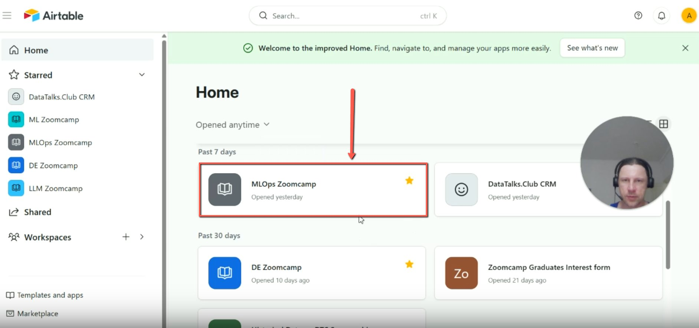
    <!-- sop-caption-start -->
    This shows the Airtable home screen with the MLOps Zoomcamp base highlighted. Confirm the disabled course base before exporting or deleting any registration records.
    <!-- sop-caption-end -->
    <!-- sop-screenshot-end -->
<!-- sop-step-end -->

<!-- sop-step-start id=2 -->
2.  In this process we want to save the registrations and to remove it from the database. So go to “processed”.

    <!-- sop-screenshot-start -->
    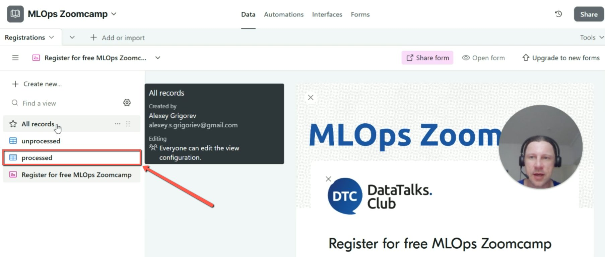
    <!-- sop-caption-start -->
    This shows the course base views and highlights the processed view. Use this view because these records have already received the Mailchimp email and are the ones safe to back up and remove.
    <!-- sop-caption-end -->
    <!-- sop-screenshot-end -->
<!-- sop-step-end -->

<!-- sop-step-start id=3 -->
3.  Click the dropdown option beside “processed” and select “Download CSV”.

    <!-- sop-screenshot-start -->
    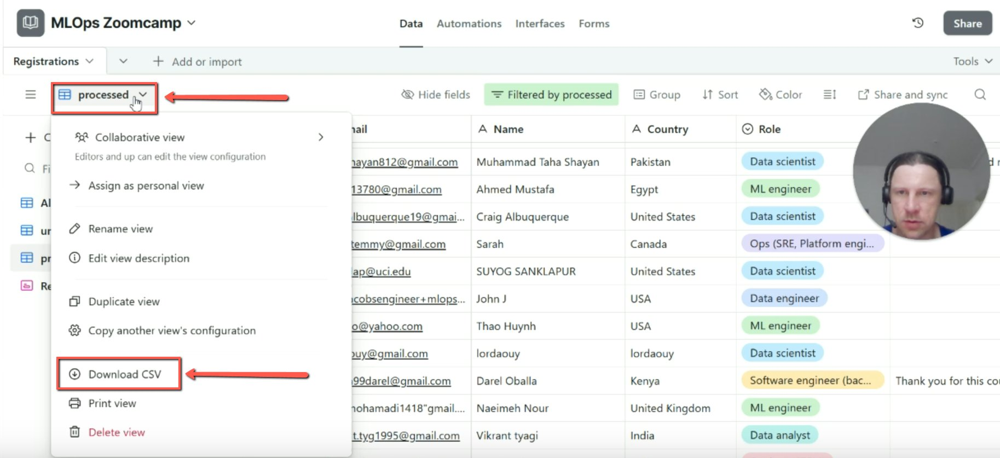
    <!-- sop-caption-start -->
    This dropdown shows the Download CSV action for the processed view. Export from this exact view so the backup contains the same records that will later be deleted.
    <!-- sop-caption-end -->
    <!-- sop-screenshot-end -->
<!-- sop-step-end -->

<!-- sop-step-start id=4 -->
4.  Go to [config.yaml](https://github.com/alexeygrigorev/airtable-mailchimp-poller/blob/main/config.yaml) in [airtable-mailchimp-poller](https://github.com/alexeygrigorev/airtable-mailchimp-poller) in the Github Repository and copy the tag course.
    In this example is “mlops-zoomcamp-2025”

    <!-- sop-screenshot-start -->
    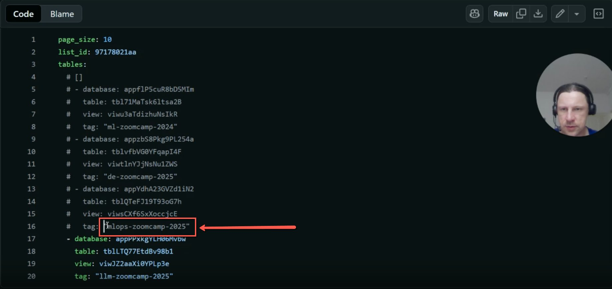
    <!-- sop-caption-start -->
    This GitHub config view highlights the course tag used by the poller. Copy this tag for the backup filename so the exported CSV matches the disabled integration name.
    <!-- sop-caption-end -->
    <!-- sop-screenshot-end -->
<!-- sop-step-end -->

<!-- sop-step-start id=5 -->
5.  Go to the File Manager and rename the downloaded CSV using the copied course tag name.

    <!-- sop-screenshot-start -->
    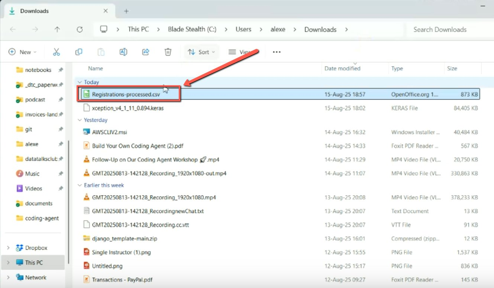
    <!-- sop-caption-start -->
    This file manager view shows the freshly downloaded Airtable CSV before renaming. Use it to identify the correct download and avoid renaming an unrelated file.
    <!-- sop-caption-end -->
    <!-- sop-screenshot-end -->
<!-- sop-step-end -->

<!-- sop-step-start id=6 -->
6.  To check if the file is complete and records are all in there, click on it.

    <!-- sop-screenshot-start -->
    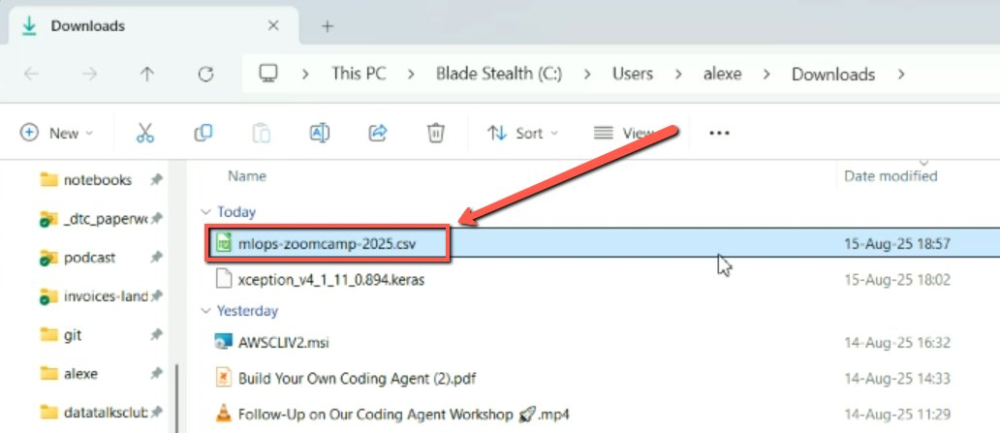
    <!-- sop-caption-start -->
    This shows the renamed CSV using the course tag. Confirm the filename matches the poller tag before opening it for record-count validation.
    <!-- sop-caption-end -->
    <!-- sop-screenshot-end -->
<!-- sop-step-end -->

<!-- sop-step-start id=7 -->
7.  Scroll down to the last number.
    Then go back to the [course in Airtable](https://airtable.com/). Scroll down to the last number and check if it matches. In this example we had 8,607.

    Note: There may be a difference of 1 due to the header row.

    <!-- sop-screenshot-start -->
    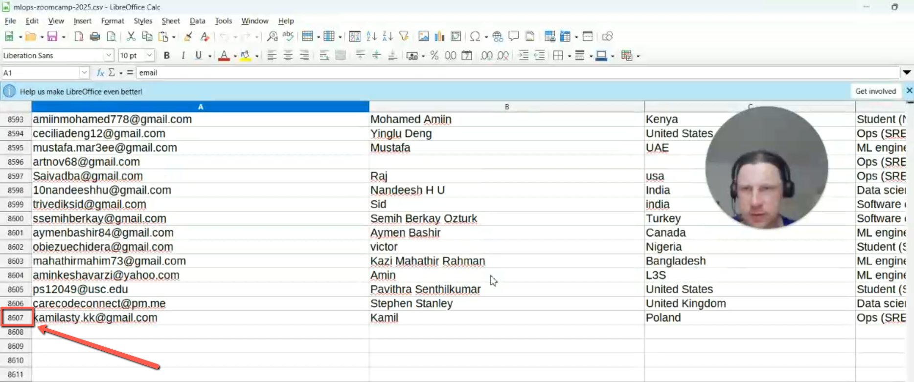
    <!-- sop-caption-start -->
    This spreadsheet view shows the bottom row count of the exported CSV. Compare this count with Airtable so you know the backup is complete before deleting processed records.
    <!-- sop-caption-end -->
    <!-- sop-screenshot-end -->
<!-- sop-step-end -->

<!-- sop-step-start id=8 -->
8.  Go to [courses](https://drive.google.com/drive/folders/1ptsZ7m1aGTvj7fJLH_BNXjf8bOlGoNPN) in the backup of DTC Files drive.

    <!-- sop-screenshot-start -->
    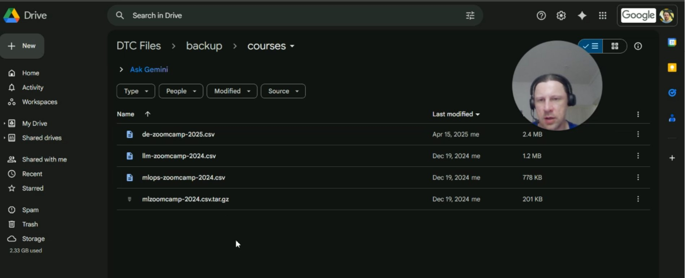
    <!-- sop-caption-start -->
    This Google Drive folder shows the course backup location and existing cohort CSVs. Upload the new export here so disabled-course backups stay grouped by course tag and year.
    <!-- sop-caption-end -->
    <!-- sop-screenshot-end -->
<!-- sop-step-end -->

<!-- sop-step-start id=9 -->
9.  Upload or drag the file from the File Manager into the Drive.

    <!-- sop-screenshot-start -->
    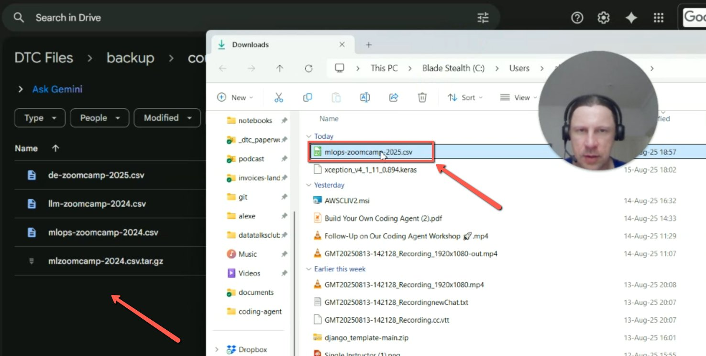
    <!-- sop-caption-start -->
    This shows the renamed CSV being placed alongside existing backup files in Drive. Confirm the uploaded file appears in the folder before returning to Airtable for deletion.
    <!-- sop-caption-end -->
    <!-- sop-screenshot-end -->
<!-- sop-step-end -->

<!-- sop-step-start id=10 -->
10. Go back to the [course in Airtable](https://airtable.com/). Click the checkbox on top to select all. Right click on your mouse and select “Delete all selected records”.

    <!-- sop-screenshot-start -->
    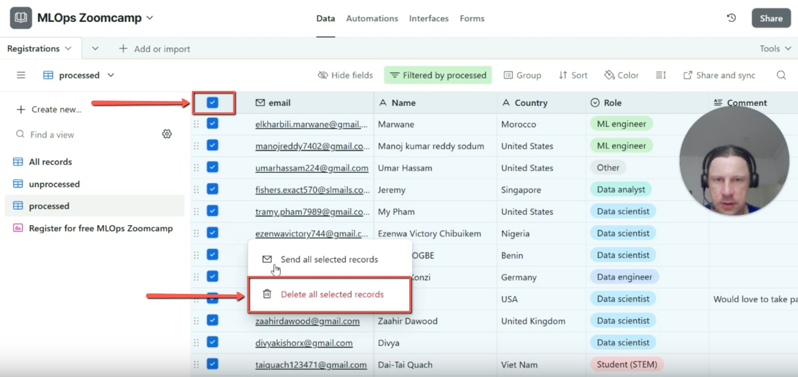
    <!-- sop-caption-start -->
    This Airtable view shows all processed records selected and the delete action highlighted. Use it only after the CSV has been uploaded and validated, because this removes processed registration rows.
    <!-- sop-caption-end -->
    <!-- sop-screenshot-end -->
<!-- sop-step-end -->

<!-- sop-step-start id=11 -->
11. Click on “Delete” in the pop up window.

    Note: This applies only to people from this table to whom we already sent an email. It’s important that we only do it for this “processed”, because the “unprocessed “ ones have not received an email yet, they are fresh people.

    <!-- sop-screenshot-start -->
    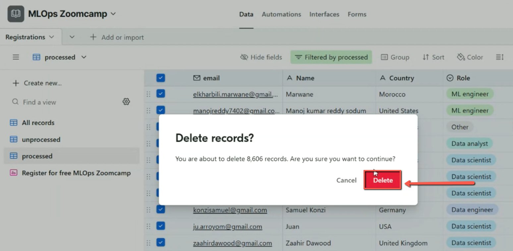
    <!-- sop-caption-start -->
    This delete confirmation shows the number of records that will be removed. Check that the count matches the processed export before confirming Delete.
    <!-- sop-caption-end -->
    <!-- sop-screenshot-end -->
<!-- sop-step-end -->
<!-- sop-section-end -->

<!-- sop-section-start: validation -->
## Validation

-
<!-- sop-section-end -->

<!-- sop-section-start: troubleshooting -->
## Troubleshooting

-
<!-- sop-section-end -->

<!-- sop-section-start: references -->
## References

-
<!-- sop-section-end -->
