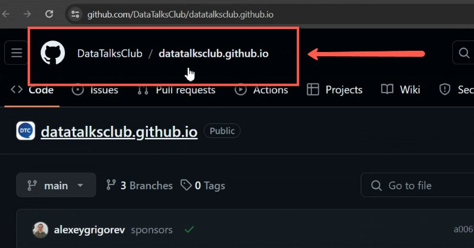
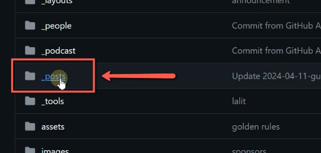
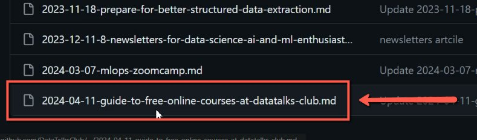
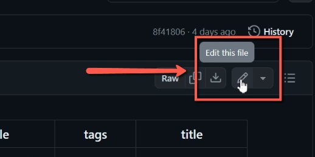
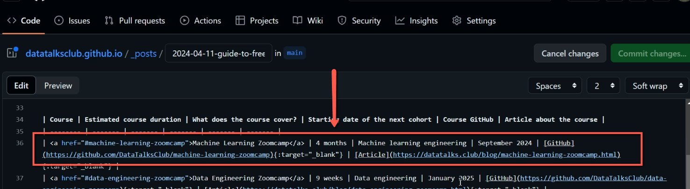
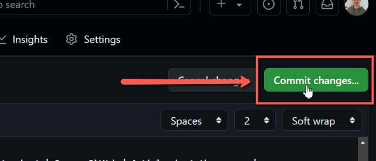

# Updating the Timetable of the Courses at Data Talks Club

<!-- sop-section-start: summary -->
## Summary

- Purpose: Update course timetable information on the DataTalks.Club website.
- Outcome: The course schedule post is edited and committed in GitHub.
- Trigger: Course dates or timetable details change.
- Frequency: As needed when course schedules are updated.
<!-- sop-section-end -->

<!-- sop-section-start: prerequisites -->
## Prerequisites

- Access: GitHub access to datatalksclub.github.io.
- Tools: GitHub web editor.
- Inputs: Course post, updated schedule details, and course title.
<!-- sop-section-end -->

<!-- sop-section-start: procedure -->
## Procedure

<!-- sop-prose-start -->
How to Update the Time Table of the Courses at Data Talks Club
At Data Talks Club, multiple courses scheduled at specific dates are being ran which needs constant updating in the website to keep the information up to date.

Step-by-step Instructions
<!-- sop-prose-end -->

<!-- sop-step-start id=1 -->
1.  First, proceed to the website repository, “datatalksclub,github.io” and navigate through the page and click “posts”.

    <!-- sop-screenshot-start -->
    
    <!-- sop-caption-start -->
    This screenshot anchors step 1 of the Updating the Timetable of the Courses at Data Talks Club process by showing the screen for first, proceed to the website repository, "datatalksclub,github.io" and navigate through the page and click "posts". Look for the red boxes or arrows around "datatalksclub,github.io", "posts", then use that highlighted area as the target for the action before continuing.
    <!-- sop-caption-end -->
    <!-- sop-screenshot-end -->

    <!-- sop-screenshot-start -->
    
    <!-- sop-caption-start -->
    This screenshot anchors step 1 of the Updating the Timetable of the Courses at Data Talks Club process by showing the screen for first, proceed to the website repository, "datatalksclub,github.io" and navigate through the page and click "posts". Look for the red boxes or arrows around "datatalksclub,github.io", "posts", then use that highlighted area as the target for the action before continuing.
    <!-- sop-caption-end -->
    <!-- sop-screenshot-end -->
<!-- sop-step-end -->

<!-- sop-step-start id=2 -->
2.  Then, scroll down and look for the post that you wish to update.

    Note: In here, the post entitled “A Guide to Free Online Courses at Data Talks Club” is being selected.

    <!-- sop-screenshot-start -->
    
    <!-- sop-caption-start -->
    This screenshot anchors step 2 of the Updating the Timetable of the Courses at Data Talks Club process by showing the screen for scroll down and look for the post that you wish to update. Look for the red box, arrow, selected row, or highlighted screen area, then use that highlighted area as the target for the action before continuing.
    <!-- sop-caption-end -->
    <!-- sop-screenshot-end -->
<!-- sop-step-end -->

<!-- sop-step-start id=3 -->
3.  Then, click on “Edit this file” (pen icon) at the top right corner of the page.

    <!-- sop-screenshot-start -->
    
    <!-- sop-caption-start -->
    This screenshot anchors step 3 of the Updating the Timetable of the Courses at Data Talks Club process by showing the screen for click on "Edit this file" (pen icon) at the top right corner of the page. Look for the red box or arrow around "Edit this file", then use that highlighted area as the target for the action before continuing.
    <!-- sop-caption-end -->
    <!-- sop-screenshot-end -->
<!-- sop-step-end -->

<!-- sop-step-start id=4 -->
4.  After, navigate through the page and look for the part where you wish to update.

    Note: In here, the “Machine Learning Zoomcamp - September 2024” schedule was chosen as the data to be updated.

    Make sure that the title of the course are correct before committing the changes

    <!-- sop-screenshot-start -->
    
    <!-- sop-caption-start -->
    This screenshot anchors step 4 of the Updating the Timetable of the Courses at Data Talks Club process by showing the screen for navigate through the page and look for the part where you wish to update. Make sure that the title of the course. Look for the red box, arrow, selected row, or highlighted screen area, then use that highlighted area as the target for the action before continuing.
    <!-- sop-caption-end -->
    <!-- sop-screenshot-end -->
<!-- sop-step-end -->

<!-- sop-step-start id=5 -->
5.  Lastly, click “Commit changes” to save the changes made.

    <!-- sop-screenshot-start -->
    
    <!-- sop-caption-start -->
    This screenshot anchors step 5 of the Updating the Timetable of the Courses at Data Talks Club process by showing the screen for click "Commit changes" to save the changes made. Look for the red box or arrow around "Commit changes", then use that highlighted area as the target for the action before continuing.
    <!-- sop-caption-end -->
    <!-- sop-screenshot-end -->
<!-- sop-step-end -->
<!-- sop-section-end -->

<!-- sop-section-start: validation -->
## Validation

-
<!-- sop-section-end -->

<!-- sop-section-start: troubleshooting -->
## Troubleshooting

-
<!-- sop-section-end -->

<!-- sop-section-start: references -->
## References

-
<!-- sop-section-end -->
