# Adding Homework Assignments for existing Homework Assignments in the Course Management Platform

<!-- sop-section-start: summary -->
## Summary

- Purpose: Add questions to an existing homework in the course management platform.
- Outcome: The homework is open and contains the required assignments.
- Trigger: Homework content is ready to be moved into the platform.
- Frequency: Per homework update.
<!-- sop-section-end -->

<!-- sop-section-start: prerequisites -->
## Prerequisites

- Access: Course management platform admin access.
- Tools: Course management platform.
- Inputs: Homework link, question text, answer options, and point values.
<!-- sop-section-end -->

<!-- sop-section-start: procedure -->
## Procedure

<!-- sop-prose-start -->
Adding Homework Assignments for existing Homework Assignments in the Course Management Platform
This document shows the steps on how to add Homework Assignments for existing Homework Assignments in the Course Management Platform

Step-by-step Instructions
<!-- sop-prose-end -->

<!-- sop-step-start id=1 -->
1.  Go to [https://courses.datatalks.club/admin/](https://courses.datatalks.club/admin/) and log in.

    <!-- sop-screenshot-start -->
    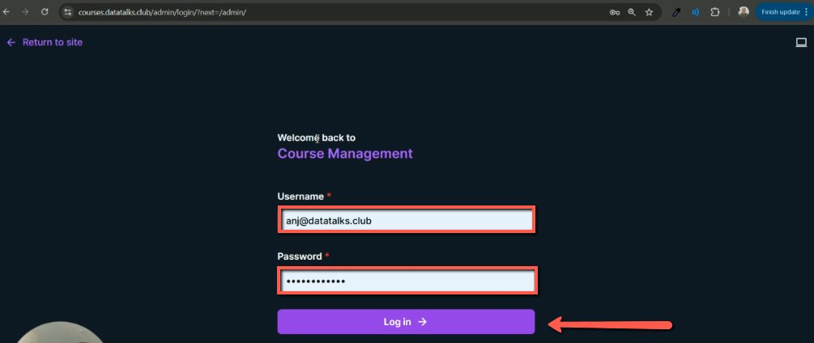
    <!-- sop-caption-start -->
    This is the course management admin login screen with credential fields highlighted. Confirm you are entering the admin portal before changing homework state or questions.
    <!-- sop-caption-end -->
    <!-- sop-screenshot-end -->
<!-- sop-step-end -->

<!-- sop-step-start id=2 -->
2.  Scroll down and click on “Homeworks”.

    <!-- sop-screenshot-start -->
    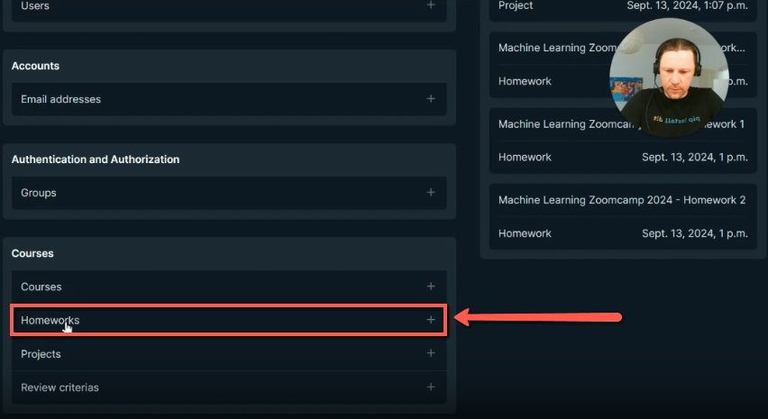
    <!-- sop-caption-start -->
    This admin dashboard highlights the Homeworks section. Open this area to edit existing homework entries rather than course pages or projects.
    <!-- sop-caption-end -->
    <!-- sop-screenshot-end -->
<!-- sop-step-end -->

<!-- sop-step-start id=3 -->
3.  In this example we are going to add assignments in the Homework 2. Click on Homework.

    <!-- sop-screenshot-start -->
    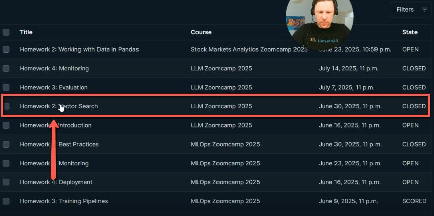
    <!-- sop-caption-start -->
    This homework list highlights the target Homework 2 row and its CLOSED state. Use the course, deadline, and state columns to pick the exact homework to update.
    <!-- sop-caption-end -->
    <!-- sop-screenshot-end -->
<!-- sop-step-end -->

<!-- sop-step-start id=4 -->
4.  Go to [https://courses.datatalks.club/](https://courses.datatalks.club/) and select the course that you want to add a homework into.

    <!-- sop-screenshot-start -->
    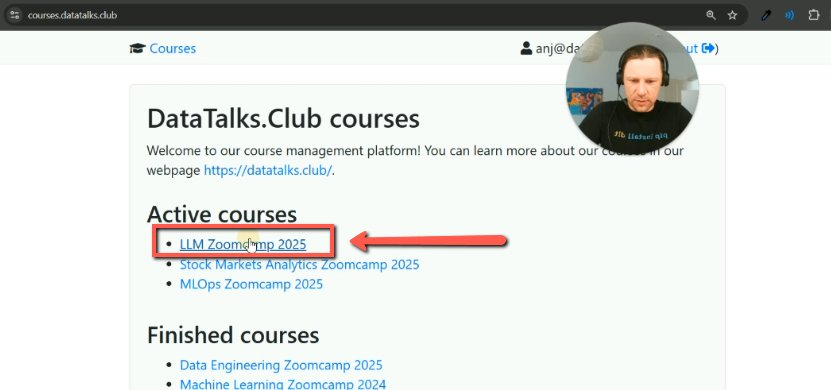
    <!-- sop-caption-start -->
    This public course list highlights the course where the homework will appear. Check the student-facing course page so you can verify the homework status after admin changes.
    <!-- sop-caption-end -->
    <!-- sop-screenshot-end -->
<!-- sop-step-end -->

<!-- sop-step-start id=5 -->
5.  You will see that Homework 2 is closed. To open it go back to step 3 then step 6

    <!-- sop-screenshot-start -->
    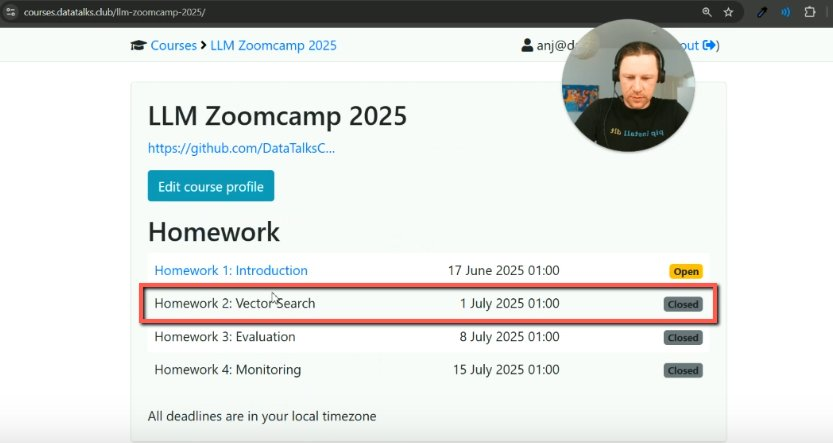
    <!-- sop-caption-start -->
    This student-facing homework list shows Homework 2 still closed. Use it as the before-state that confirms why the admin state needs to be changed.
    <!-- sop-caption-end -->
    <!-- sop-screenshot-end -->
<!-- sop-step-end -->

<!-- sop-step-start id=6 -->
6.  Scroll down and go to “State”. Click on the dropdown option and select “OPEN”. Then click on the “Save” button.

    <!-- sop-screenshot-start -->
    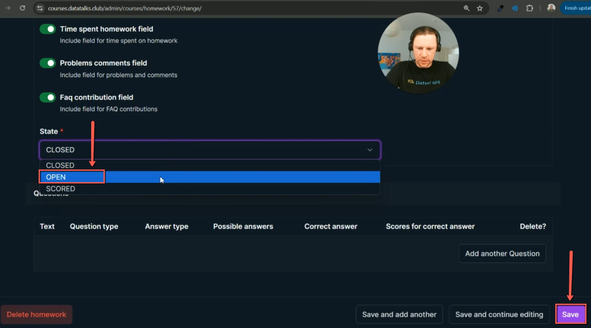
    <!-- sop-caption-start -->
    This admin edit screen shows the State dropdown set to OPEN and the Save button. Change only the target homework state, then save so students can access it.
    <!-- sop-caption-end -->
    <!-- sop-screenshot-end -->
<!-- sop-step-end -->

<!-- sop-step-start id=7 -->
7.  Go back to the course and you will see that the course is now open. Click on it

    <!-- sop-screenshot-start -->
    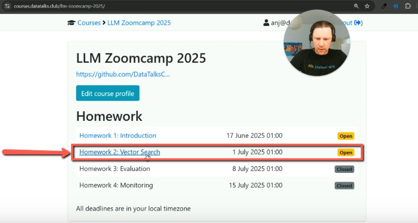
    <!-- sop-caption-start -->
    This public course page shows Homework 2 now marked Open. Use this as validation that the state change is visible to learners before adding question content.
    <!-- sop-caption-end -->
    <!-- sop-screenshot-end -->
<!-- sop-step-end -->

<!-- sop-step-start id=8 -->
8.  There are no tasks and assignments so we need to add questions in it. We need to change TBA.

    Note: Alexey will send a link to the actual tasks for this homework

    <!-- sop-screenshot-start -->
    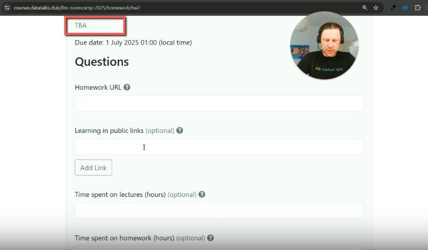
    <!-- sop-caption-start -->
    This homework detail page still shows `TBA` instead of real instructions. Replace that placeholder with the provided GitHub homework link so students can reach the assignment.
    <!-- sop-caption-end -->
    <!-- sop-screenshot-end -->
<!-- sop-step-end -->

<!-- sop-step-start id=9 -->
9.  Go back to the course management platform and scroll down to the Description section and replace TBA with the github homework link.

    <!-- sop-screenshot-start -->
    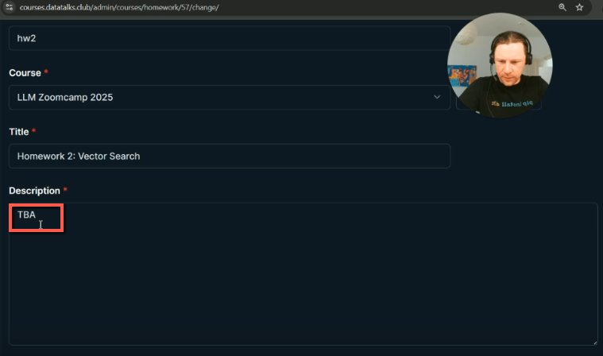
    <!-- sop-caption-start -->
    This admin description field shows the `TBA` placeholder in the homework record. Select this field to replace the placeholder with the actual homework URL.
    <!-- sop-caption-end -->
    <!-- sop-screenshot-end -->

    <!-- sop-screenshot-start -->
    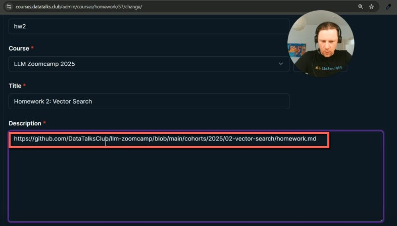
    <!-- sop-caption-start -->
    This shows the GitHub homework URL pasted into the description field. Confirm the URL points to the correct course cohort and homework before continuing.
    <!-- sop-caption-end -->
    <!-- sop-screenshot-end -->
<!-- sop-step-end -->

<!-- sop-step-start id=10 -->
10. Scroll down and click on “Add another question”.

    <!-- sop-screenshot-start -->
    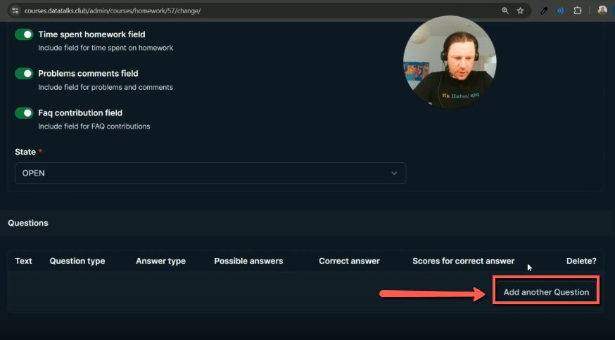
    <!-- sop-caption-start -->
    This shows the empty Questions table and the Add another Question button. Use it to start creating platform questions after the homework description has been updated.
    <!-- sop-caption-end -->
    <!-- sop-screenshot-end -->
<!-- sop-step-end -->

<!-- sop-step-start id=11 -->
11. Go to the github homework link that Alexey provided and scroll down to find the Questions. Copy the question.

    Note: We don't copy Q1. In this example we only copy “Embedding the query”

    <!-- sop-screenshot-start -->
    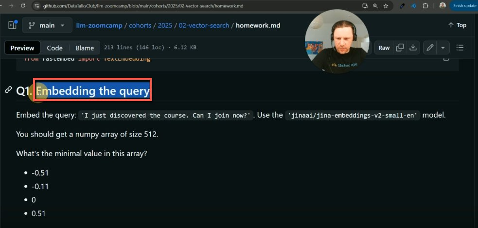
    <!-- sop-caption-start -->
    This GitHub homework page highlights the question title without the `Q1` prefix. Copy only the question text needed for the platform field, not the numbering.
    <!-- sop-caption-end -->
    <!-- sop-screenshot-end -->
<!-- sop-step-end -->

<!-- sop-step-start id=12 -->
12. Go back to the course management platform and paste the question into the “Text” field. Select Multiple Choice for the Question Type and do not change the Answer Type.

    <!-- sop-screenshot-start -->
    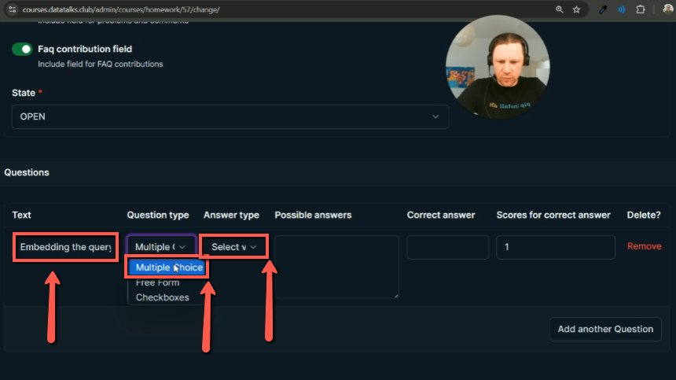
    <!-- sop-caption-start -->
    This admin question row shows the copied question text and Multiple Choice type. Verify the question type before entering answers so grading behaves as expected.
    <!-- sop-caption-end -->
    <!-- sop-screenshot-end -->
<!-- sop-step-end -->

<!-- sop-step-start id=13 -->
13. Copy the possible answers in the Github homework link details.

    <!-- sop-screenshot-start -->
    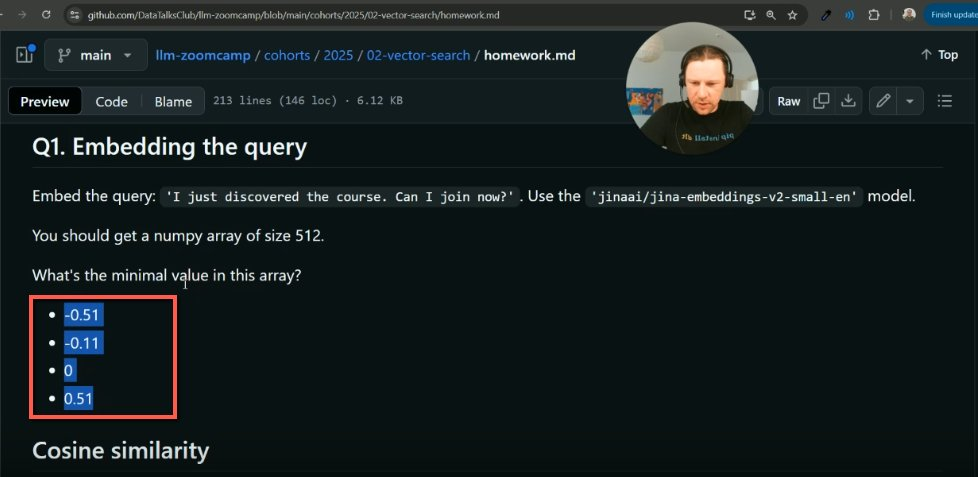
    <!-- sop-caption-start -->
    This GitHub question section highlights the multiple-choice answer options. Copy the options exactly so students see the same choices as in the source homework.
    <!-- sop-caption-end -->
    <!-- sop-screenshot-end -->
<!-- sop-step-end -->

<!-- sop-step-start id=14 -->
14. Paste it on the “Possible Answers”. Then click on “Add another Question”.

    <!-- sop-screenshot-start -->
    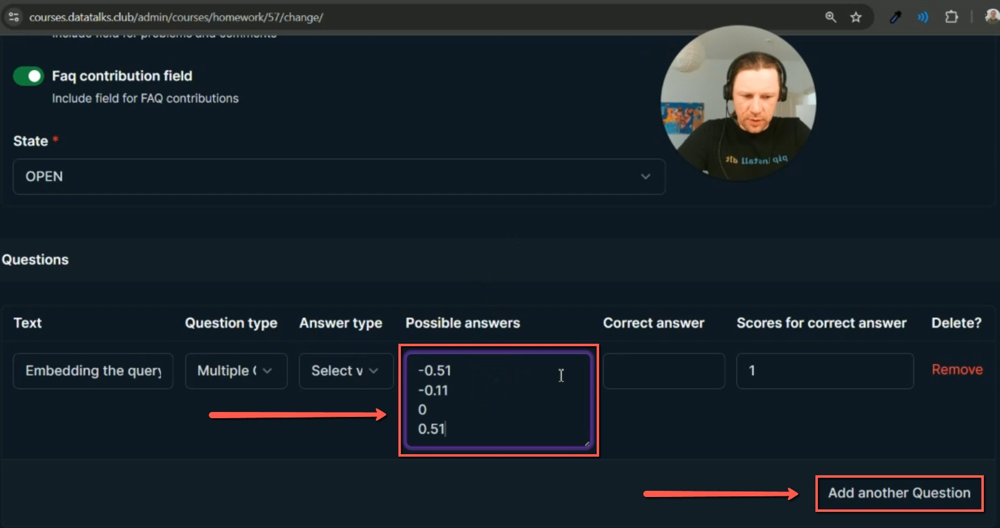
    <!-- sop-caption-start -->
    This admin row shows the possible answers pasted into the answer field. Check each option is on its own line before adding the next question.
    <!-- sop-caption-end -->
    <!-- sop-screenshot-end -->
<!-- sop-step-end -->

<!-- sop-step-start id=15 -->
15. If the question is worth 2 points, change the value in “Scores for correct answer” from 1 to 2.

    <!-- sop-screenshot-start -->
    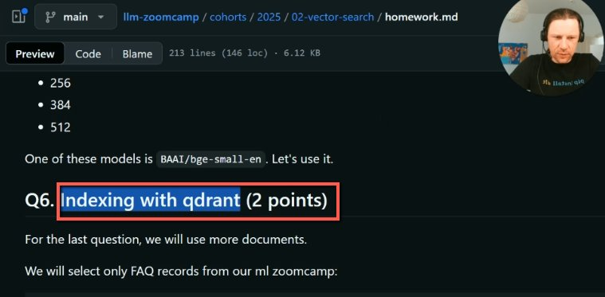
    <!-- sop-caption-start -->
    This GitHub question title shows that the item is worth 2 points. Use the point value from the source homework to set the score correctly in the platform.
    <!-- sop-caption-end -->
    <!-- sop-screenshot-end -->

    <!-- sop-screenshot-start -->
    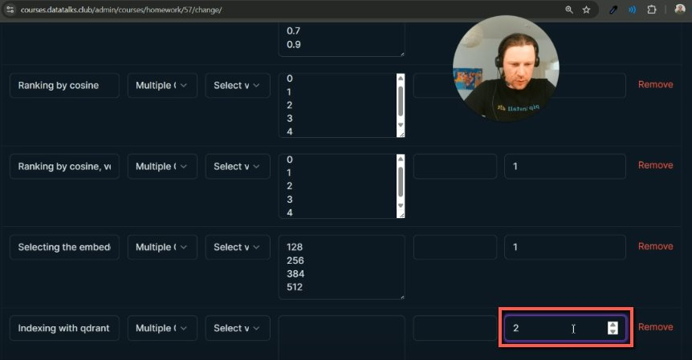
    <!-- sop-caption-start -->
    This admin questions table shows the score field set to 2 for the matching question. Confirm higher-value questions are adjusted before saving the homework.
    <!-- sop-caption-end -->
    <!-- sop-screenshot-end -->
<!-- sop-step-end -->

<!-- sop-step-start id=16 -->
16. If the question has no answer options (e.g., it requires a typed response), set Question type to Free form.

    <!-- sop-screenshot-start -->
    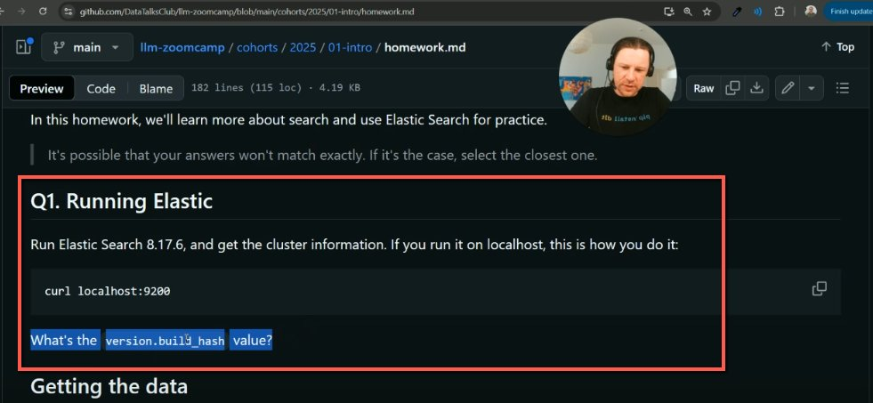
    <!-- sop-caption-start -->
    This GitHub question example has no multiple-choice options and expects a typed answer. Use it to decide that the platform question should be Free Form.
    <!-- sop-caption-end -->
    <!-- sop-screenshot-end -->

    <!-- sop-screenshot-start -->
    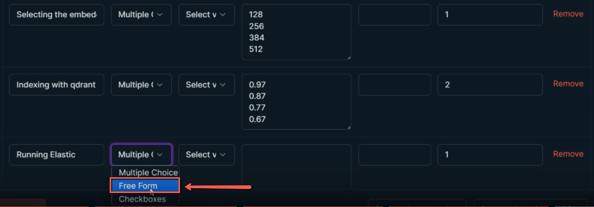
    <!-- sop-caption-start -->
    This admin dropdown shows Free Form selected for the question type. Choose it for typed-response questions so learners are not forced into multiple-choice answers.
    <!-- sop-caption-end -->
    <!-- sop-screenshot-end -->

    Then select “Any” in “Answer type”.
    <!-- sop-screenshot-start -->
    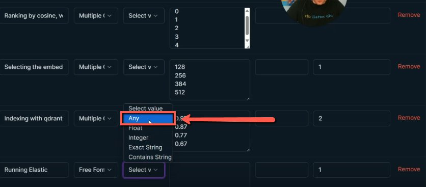
    <!-- sop-caption-start -->
    This admin row shows Answer type set to Any for a free-form question. Use Any when the platform should accept a typed response without exact-answer validation.
    <!-- sop-caption-end -->
    <!-- sop-screenshot-end -->
<!-- sop-step-end -->

<!-- sop-step-start id=17 -->
17. Do the rest of the questions until all are added in the course management platform.
<!-- sop-step-end -->
<!-- sop-section-end -->

<!-- sop-section-start: validation -->
## Validation

-
<!-- sop-section-end -->

<!-- sop-section-start: troubleshooting -->
## Troubleshooting

-
<!-- sop-section-end -->

<!-- sop-section-start: references -->
## References

-
<!-- sop-section-end -->
