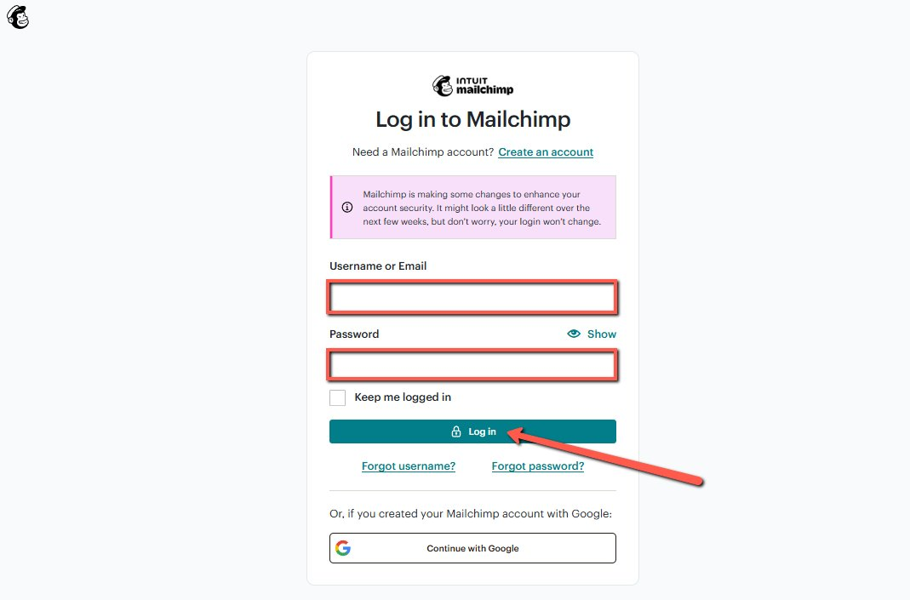
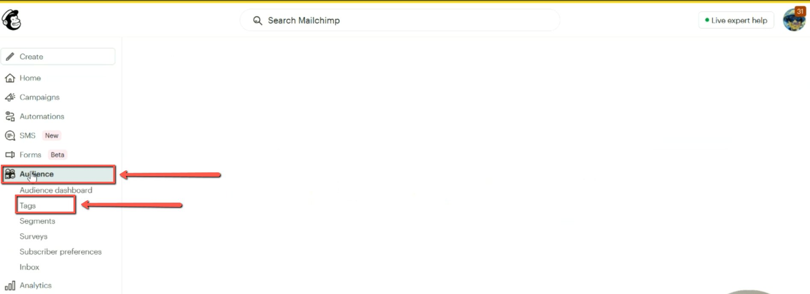
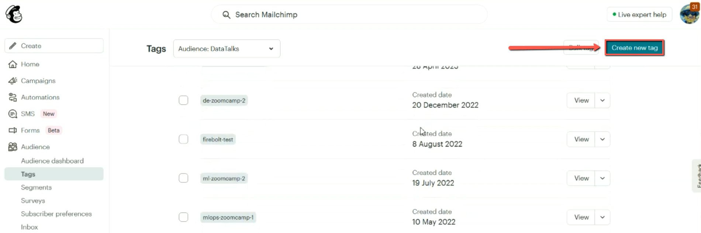
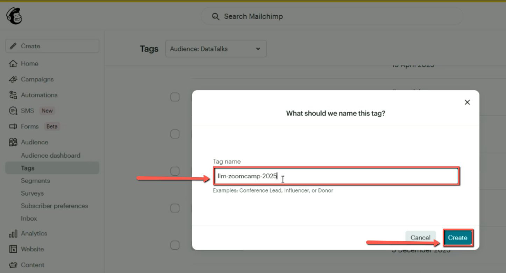

# Adding Tags in MailChimp

<!-- sop-section-start: summary -->
## Summary

- Purpose: The process involves assigning a tag.
- Outcome: To send them link email
- Trigger: When someone signs up for a course.
- Frequency: Once per course cohort.
<!-- sop-section-end -->

<!-- sop-section-start: prerequisites -->
## Prerequisites

- Access: Mailchimp audience access.
- Tools: Mailchimp.
- Inputs: Course name, cohort year, and previous tag naming pattern.
<!-- sop-section-end -->

<!-- sop-section-start: procedure -->
## Procedure

<!-- sop-prose-start -->
Adding Tags in MailChimp
This document shows the steps to Adding Tags in MailChimp.

Step-by-step Instructions
<!-- sop-prose-end -->

<!-- sop-step-start id=1 -->
1.  Go to [Mailchimp](https://login.mailchimp.com/) and log in.

    <!-- sop-screenshot-start -->
    
    <!-- sop-caption-start -->
    This confirms the Mailchimp login entry point and the fields needed before any audience changes can be made. Use it to verify you are signing into the correct Mailchimp account before creating course tags.
    <!-- sop-caption-end -->
    <!-- sop-screenshot-end -->
<!-- sop-step-end -->

<!-- sop-step-start id=2 -->
2.  Click on “Audience”, then click on “Tags”.

    <!-- sop-screenshot-start -->
    
    <!-- sop-caption-start -->
    This shows the Mailchimp navigation path from Audience to Tags, with both sidebar items highlighted. Check this state before proceeding so the tag is created in the correct DataTalks audience area.
    <!-- sop-caption-end -->
    <!-- sop-screenshot-end -->
<!-- sop-step-end -->

<!-- sop-step-start id=3 -->
3.  Click on “Create new tag”.

    <!-- sop-screenshot-start -->
    
    <!-- sop-caption-start -->
    This is the existing tag list and the Create new tag button. Review nearby tag naming patterns here before creating the new course cohort tag.
    <!-- sop-caption-end -->
    <!-- sop-screenshot-end -->
<!-- sop-step-end -->

<!-- sop-step-start id=4 -->
4.  Type the name of the tag and click on “Create”.
    Example: llm-zoomcamp-2025

    Note: Before creating a new tag, review the existing tags to ensure correct spelling. You can use a previous tag as a reference by copying it and update the date if needed.

    <!-- sop-screenshot-start -->
    
    <!-- sop-caption-start -->
    This modal is where the exact course tag is entered and created. Verify the spelling and year in the Tag name field before clicking Create, because this tag will later trigger course automation.
    <!-- sop-caption-end -->
    <!-- sop-screenshot-end -->
<!-- sop-step-end -->
<!-- sop-section-end -->

<!-- sop-section-start: validation -->
## Validation

-
<!-- sop-section-end -->

<!-- sop-section-start: troubleshooting -->
## Troubleshooting

-
<!-- sop-section-end -->

<!-- sop-section-start: references -->
## References

-
<!-- sop-section-end -->
