# Configuring MailChimp + Airtable integration

<!-- sop-section-start: summary -->
## Summary

- Purpose: The process involves getting database from Mailchimp
- Outcome: To collect registrations from the students of the course.
- Trigger: After creating a tag and automation in Airtable.
- Frequency: Once per course cohort or new course setup.
<!-- sop-section-end -->

<!-- sop-section-start: prerequisites -->
## Prerequisites

- Access: Airtable course base and MailChimpPoller GitHub repository.
- Tools: Airtable, GitHub, GitHub Actions, Mailchimp.
- Inputs: Course tag and Airtable database, table, and view IDs.
<!-- sop-section-end -->

<!-- sop-section-start: procedure -->
## Procedure

<!-- sop-prose-start -->
Configuring MailChimp + Airtable integration
This document shows the steps to Configuring MailChimp+Airtable integration.

Step-by-step Instructions
<!-- sop-prose-end -->

<!-- sop-step-start id=1 -->
1.  Go to [Airtable](https://airtable.com/). Find and click on the course.
    In this example is the LLM Zoomcamp Course.

    <!-- sop-screenshot-start -->
    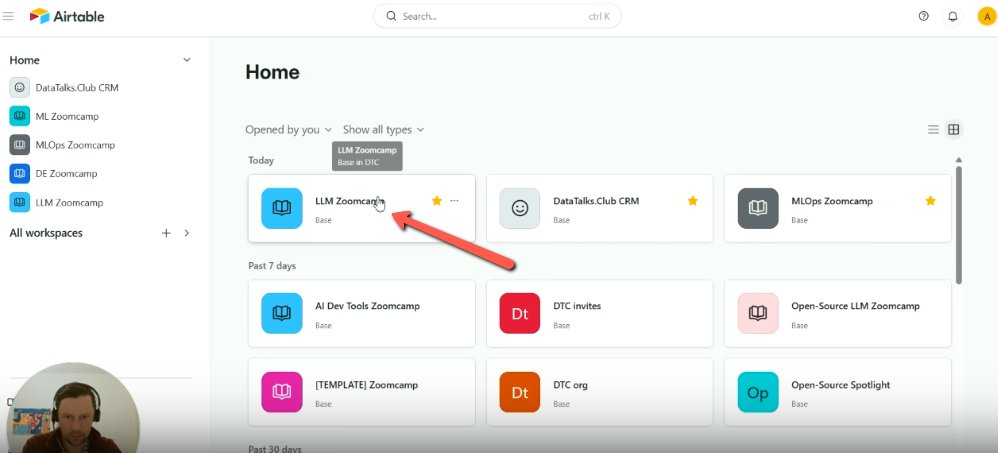
    <!-- sop-caption-start -->
    This identifies the target Airtable course base for the integration setup. Confirm the course base before copying IDs or enabling the poller.
    <!-- sop-caption-end -->
    <!-- sop-screenshot-end -->

    Note: In the airtable there are multiple tabs

    - *Grid view - All the emails that are already processed and tags are already added.*

    - *Unprocessed - Emails that are not added a tag. Means automation is not enabled yet.*

    <!-- sop-screenshot-start -->
    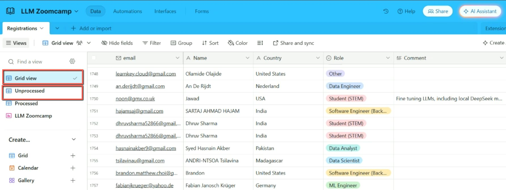
    <!-- sop-caption-start -->
    This shows the processed and unprocessed views inside the course base. Use it to distinguish records already handled by Mailchimp from new sign-ups that the poller should process.
    <!-- sop-caption-end -->
    <!-- sop-screenshot-end -->
<!-- sop-step-end -->

<!-- sop-step-start id=2 -->
2.  Go to Github Repositories [airtable -mailchimp-poller](https://github.com/alexeygrigorev/airtable-mailchimp-poller)

    <!-- sop-screenshot-start -->
    
    <!-- sop-caption-start -->
    This confirms you are in the `airtable-mailchimp-poller` GitHub repository. The integration lives in this repo, so verify the repository before editing configuration.
    <!-- sop-caption-end -->
    <!-- sop-screenshot-end -->
<!-- sop-step-end -->

<!-- sop-step-start id=3 -->
3.  Scroll and Click the “config.yaml” file. These are the automations that are enabled

    <!-- sop-screenshot-start -->
    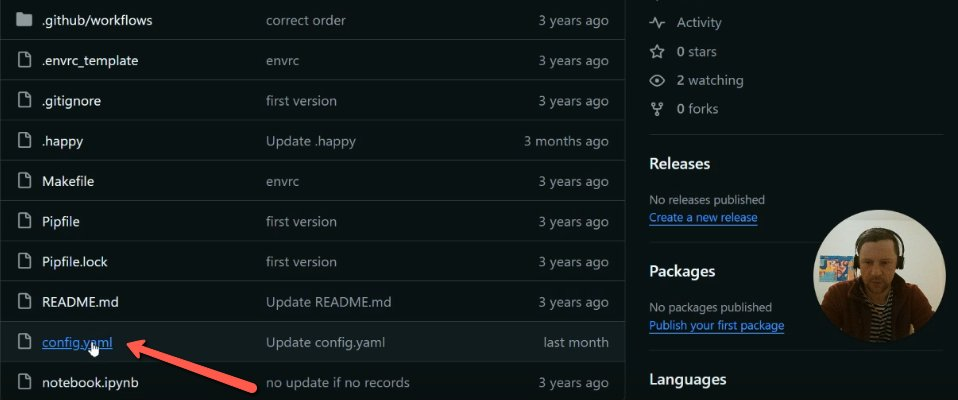
    <!-- sop-caption-start -->
    This highlights `config.yaml`, where Airtable database, table, view, and tag mappings are stored. Open this file to add or enable the course mapping.
    <!-- sop-caption-end -->
    <!-- sop-screenshot-end -->
<!-- sop-step-end -->

<!-- sop-step-start id=4 -->
4.  Click the pencil icon to edit the file.

    <!-- sop-screenshot-start -->
    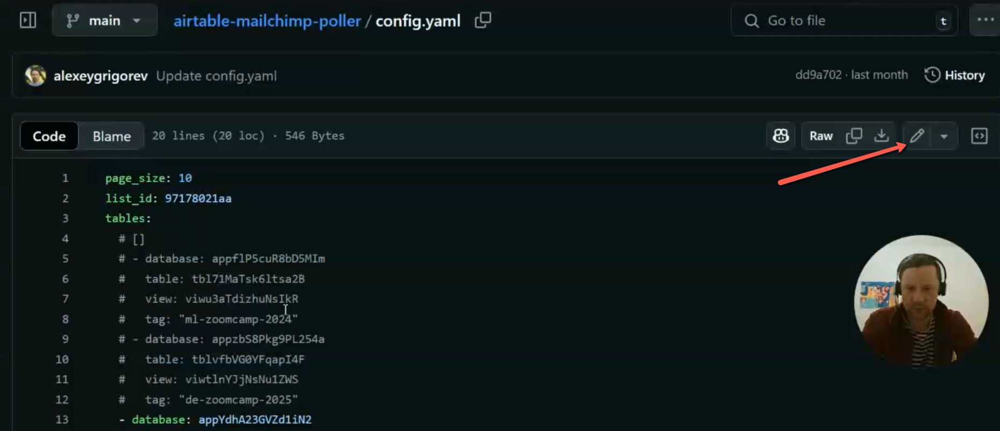
    <!-- sop-caption-start -->
    This shows the edit pencil on the GitHub file view. Click it only after locating the relevant YAML section so the next edits are made in the correct config file.
    <!-- sop-caption-end -->
    <!-- sop-screenshot-end -->
<!-- sop-step-end -->

<!-- sop-step-start id=5 -->
5.  *The only automation that is enabled is when we add something to the Mlops ZoomCamp2025 tag. Then this puller periodically pulls the data from the Airtable and adds a tag to this data to the contacts in MailChimp.*

    In this example, we want to enable LLMZoomCamp. Click on the “#” sign and remove all 4 of them by clicking backspace in your keyboard

    <!-- sop-screenshot-start -->
    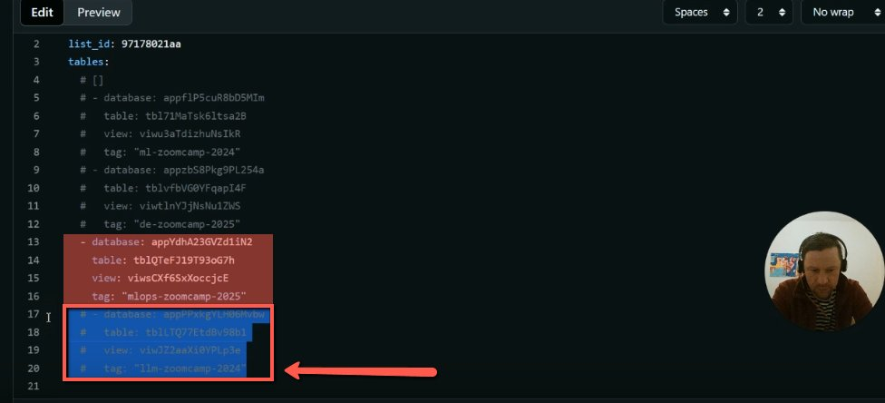
    <!-- sop-caption-start -->
    This shows the commented course block selected for enabling. Remove the leading comment markers only from the target course block so the poller starts processing that course.
    <!-- sop-caption-end -->
    <!-- sop-screenshot-end -->
<!-- sop-step-end -->

<!-- sop-step-start id=6 -->
6.  If it's a new course and you don't see it, copy an existing one and then paste it at the bottom. Replace the tag.

    <!-- sop-screenshot-start -->
    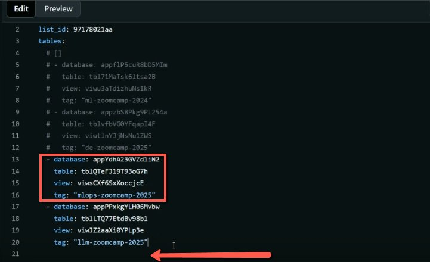
    <!-- sop-caption-start -->
    This edited YAML block shows the database, table, view, and tag fields that define one course integration. Use it as the template when adding a new course mapping.
    <!-- sop-caption-end -->
    <!-- sop-screenshot-end -->
<!-- sop-step-end -->

<!-- sop-step-start id=7 -->
7.  To get the first information for “database” “table” and “view”. Go back to Airtable, check on the link and make sure if it's correct.

    Note: In an Airtable URL: Example:https://airtable.com/appXXXXXXXXXXX/tblYYYYYYYYYYY/viwZZZZZZZZZZZ

    - *The part after the first slash (/) following airtable.com is the Database ID*

    appXXXXXXXXXXX → Database ID

    - *The part after the second slash is the Table ID*

    tblYYYYYYYYYYY → Table ID.

    - *The part after the third slash is the View ID*

    viwZZZZZZZZZZZ → View ID

    <!-- sop-screenshot-start -->
    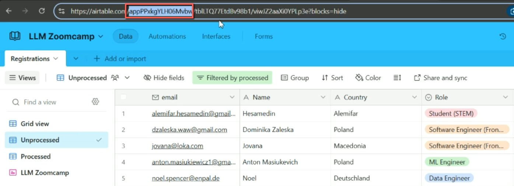
    <!-- sop-caption-start -->
    This Airtable URL highlights the database ID segment. Copy the `app...` value into the YAML `database` field for the target course.
    <!-- sop-caption-end -->
    <!-- sop-screenshot-end -->

    To get the second information for “table”.

    <!-- sop-screenshot-start -->
    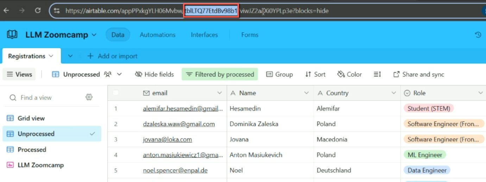
    <!-- sop-caption-start -->
    This Airtable URL highlights the table ID segment. Copy the `tbl...` value into the YAML `table` field so the poller reads the right table.
    <!-- sop-caption-end -->
    <!-- sop-screenshot-end -->

    To get the last information for “view”.

    <!-- sop-screenshot-start -->
    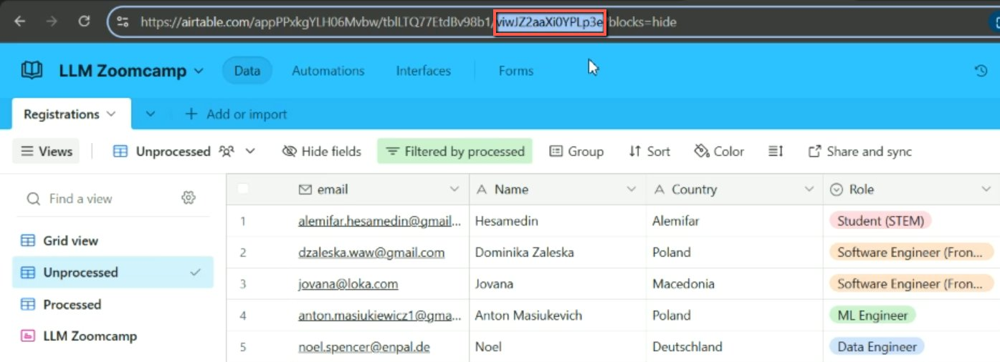
    <!-- sop-caption-start -->
    This Airtable URL highlights the view ID segment. Copy the `viw...` value into the YAML `view` field so only the intended view is processed.
    <!-- sop-caption-end -->
    <!-- sop-screenshot-end -->
<!-- sop-step-end -->

<!-- sop-step-start id=8 -->
8.  Click on Commit changes.

    <!-- sop-screenshot-start -->
    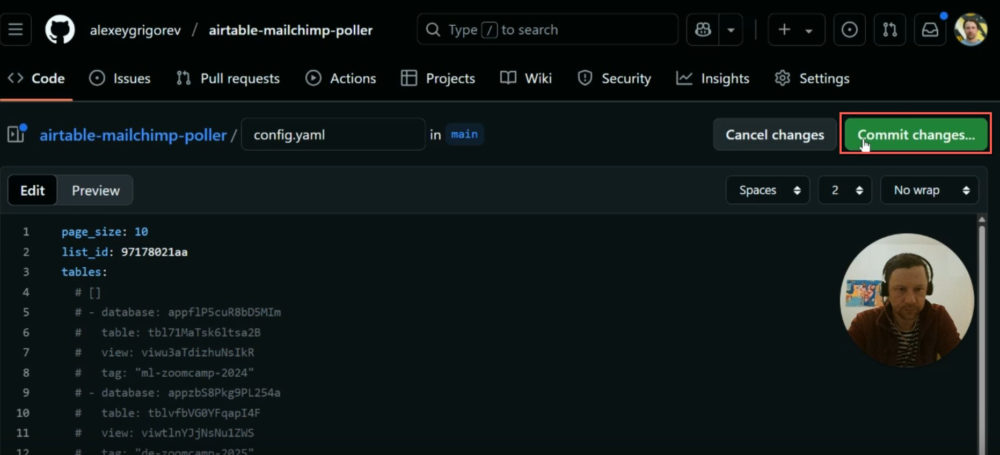
    <!-- sop-caption-start -->
    This shows the GitHub editor with Commit changes highlighted. Review the new IDs and tag in the YAML before opening the commit dialog.
    <!-- sop-caption-end -->
    <!-- sop-screenshot-end -->
<!-- sop-step-end -->

<!-- sop-step-start id=9 -->
9.  Click on Commit changes at the pop up window.

    Note: When the polar will run, it will know that it needs to look in this database and whatever it finds there, whatever context it finds there, it will assign this tag to these contexts.

    <!-- sop-screenshot-start -->
    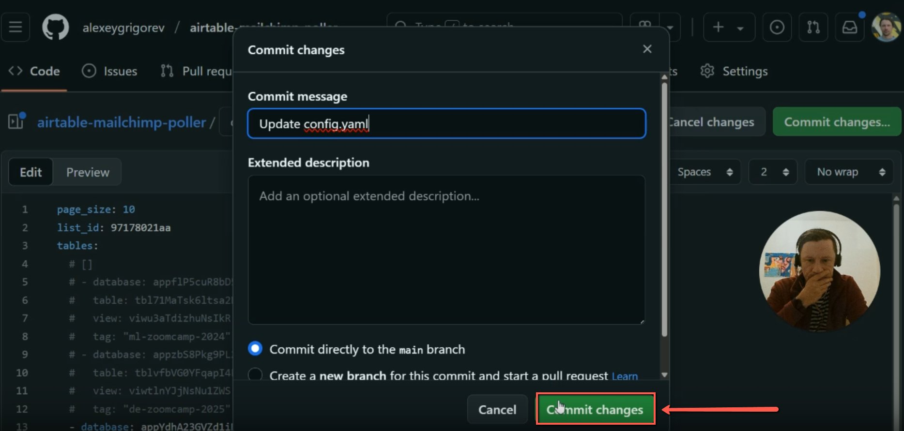
    <!-- sop-caption-start -->
    This commit dialog is the final save point for the poller configuration. Commit to the main branch only after the Airtable IDs and Mailchimp tag are correct.
    <!-- sop-caption-end -->
    <!-- sop-screenshot-end -->
<!-- sop-step-end -->

<!-- sop-step-start id=10 -->
10. Execute an action: Go to “Action” and click on “Poller”.

    <!-- sop-screenshot-start -->
    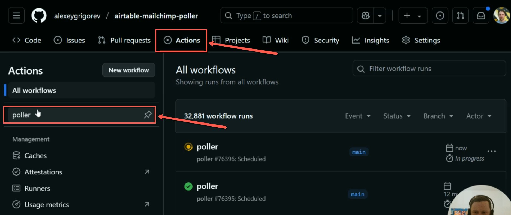
    <!-- sop-caption-start -->
    This GitHub Actions screen shows the poller workflow search and result. Use it to find the workflow that will test or run the new course integration.
    <!-- sop-caption-end -->
    <!-- sop-screenshot-end -->
<!-- sop-step-end -->

<!-- sop-step-start id=11 -->
11. Click on Run Workflow, then click Run Workflow again in the pop-up window.

    Note:
    This step configures the MailChimp Poller, which pulls data from Airtable and assigns each email a tag specified in the YAML file. This is the final step needed for the automation to work.

    Once set up, every time someone signs up using the form, the system will automatically assign the appropriate tag.

    <!-- sop-screenshot-start -->
    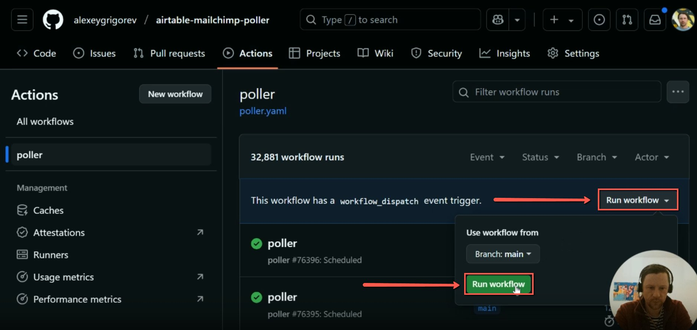
    <!-- sop-caption-start -->
    This shows the Run workflow control for the poller. Trigger it after committing so the configured course can begin assigning the Mailchimp tag.
    <!-- sop-caption-end -->
    <!-- sop-screenshot-end -->
<!-- sop-step-end -->
<!-- sop-section-end -->

<!-- sop-section-start: validation -->
## Validation

-
<!-- sop-section-end -->

<!-- sop-section-start: troubleshooting -->
## Troubleshooting

-
<!-- sop-section-end -->

<!-- sop-section-start: references -->
## References

-
<!-- sop-section-end -->
