# Creating Automation for Course Sign-ups in MailChimp

<!-- sop-section-start: summary -->
## Summary

- Purpose: The process involves creating automation to send email when adding a tag to subscriber
- Outcome: To set up an automation that sends a welcome email
- Trigger: Someone registers for the course
- Frequency: Once per course cohort.
<!-- sop-section-end -->

<!-- sop-section-start: prerequisites -->
## Prerequisites

- Access: Mailchimp, Airtable, and MailChimpPoller GitHub repository.
- Tools: Mailchimp, Airtable, GitHub Actions.
- Inputs: Course tag, welcome email copy, Airtable view details, and course links.
<!-- sop-section-end -->

<!-- sop-section-start: procedure -->
## Procedure

<!-- sop-prose-start -->
Creating Automation for Course Sign-ups in MailChimp
This document shows the steps to creating automation for course sign-ups in MailChimp

Step-by-step Instructions
<!-- sop-prose-end -->

<!-- sop-step-start id=1 -->
1.  Go to [Mailchimp](https://login.mailchimp.com/) and log in.

    <!-- sop-screenshot-start -->
    
    <!-- sop-caption-start -->
    This confirms the Mailchimp login screen used at the start of automation setup. Sign into the correct Mailchimp account before duplicating or editing course emails.
    <!-- sop-caption-end -->
    <!-- sop-screenshot-end -->
<!-- sop-step-end -->

<!-- sop-step-start id=2 -->
2.  On the side bar, click on “Automations”.

    <!-- sop-screenshot-start -->
    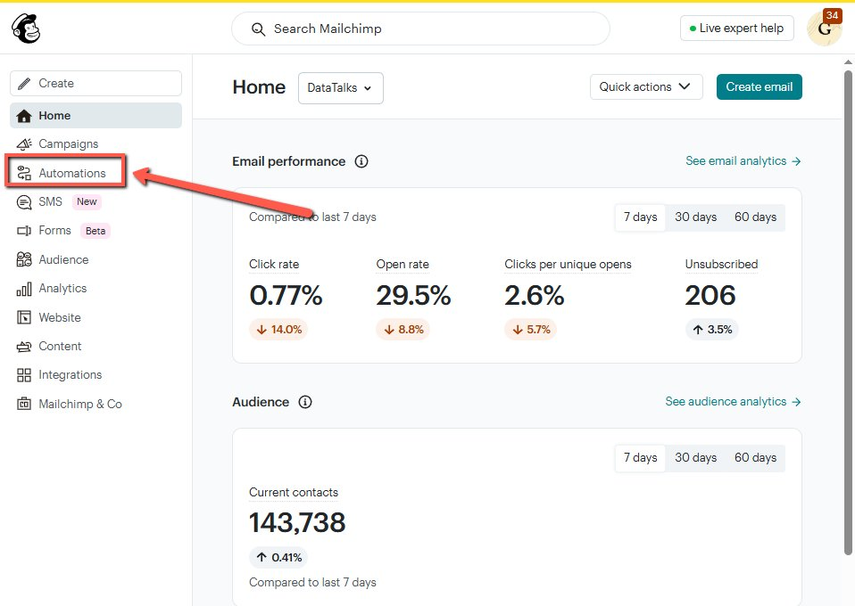
    <!-- sop-caption-start -->
    This Mailchimp dashboard highlights Automations in the sidebar. Use it to navigate away from campaigns and into the journey tools needed for course sign-up emails.
    <!-- sop-caption-end -->
    <!-- sop-screenshot-end -->
<!-- sop-step-end -->

<!-- sop-step-start id=3 -->
3.  Click “All Journeys” and select “Classic Automations”

    <!-- sop-screenshot-start -->
    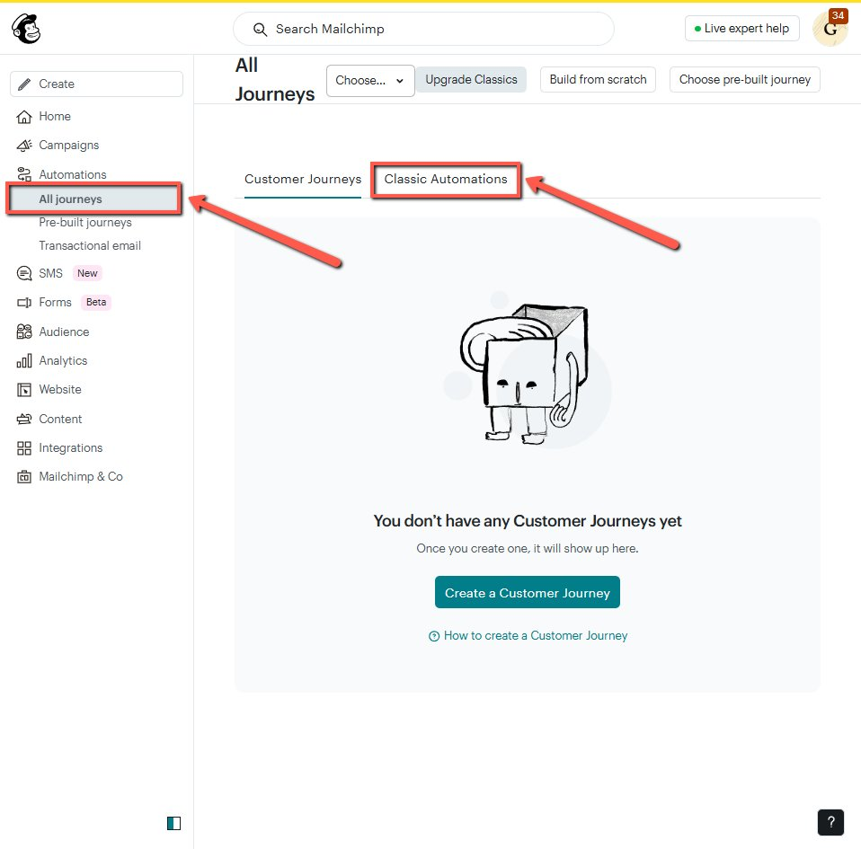
    <!-- sop-caption-start -->
    This automations view highlights Classic Automations under All Journeys. Choose this path because the process replicates an existing classic welcome-email workflow.
    <!-- sop-caption-end -->
    <!-- sop-screenshot-end -->
<!-- sop-step-end -->

<!-- sop-step-start id=4 -->
4.  Click the 3 dot icon and select “Replicate”.

    <!-- sop-screenshot-start -->
    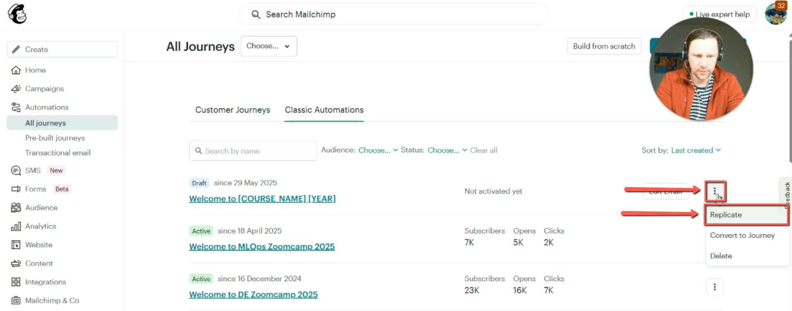
    <!-- sop-caption-start -->
    This journey list highlights the replicate action for an existing course automation. Replicate the closest previous workflow so settings and email structure carry over to the new course.
    <!-- sop-caption-end -->
    <!-- sop-screenshot-end -->
<!-- sop-step-end -->

<!-- sop-step-start id=5 -->
5.  Click on “Edit Settings”.

    <!-- sop-screenshot-start -->
    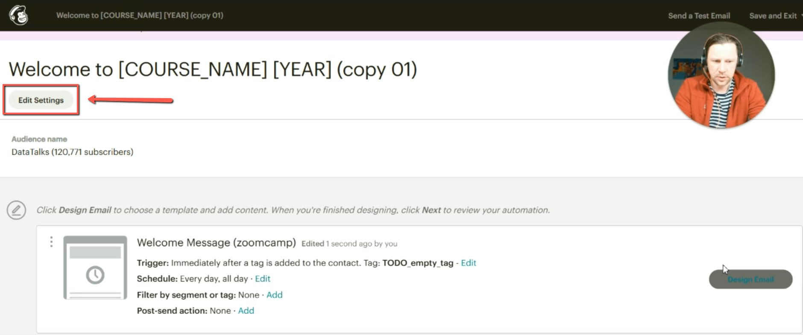
    <!-- sop-caption-start -->
    This copied workflow screen highlights Edit Settings. Open settings first so the workflow name and metadata match the new course before changing content.
    <!-- sop-caption-end -->
    <!-- sop-screenshot-end -->
<!-- sop-step-end -->

<!-- sop-step-start id=6 -->
6.  Rename and type in the name of the course and click on “Update Settings”.

    <!-- sop-screenshot-start -->
    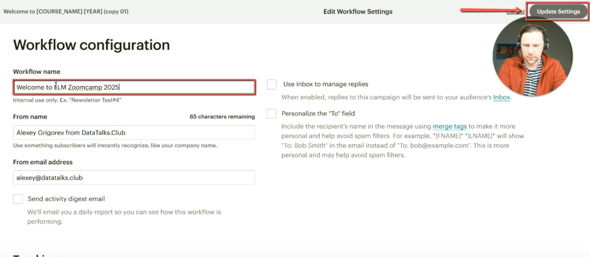
    <!-- sop-caption-start -->
    This workflow configuration screen shows the course-specific workflow name and Update Settings button. Verify the course name and year here because it identifies the automation in Mailchimp.
    <!-- sop-caption-end -->
    <!-- sop-screenshot-end -->
<!-- sop-step-end -->

<!-- sop-step-start id=7 -->
7.  Click on “Edit” to assign a tag.

    <!-- sop-screenshot-start -->
    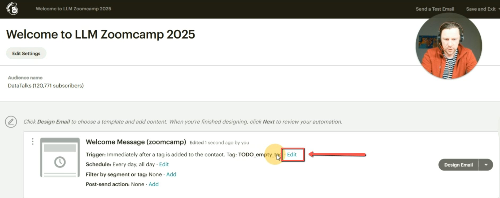
    <!-- sop-caption-start -->
    This workflow overview highlights the trigger Edit link. Open it to change which Mailchimp tag starts the welcome email.
    <!-- sop-caption-end -->
    <!-- sop-screenshot-end -->
<!-- sop-step-end -->

<!-- sop-step-start id=8 -->
8.  Click on the dropdown and select the tag for the course.

    In this example is llm-zoomcam-2025

    <!-- sop-screenshot-start -->
    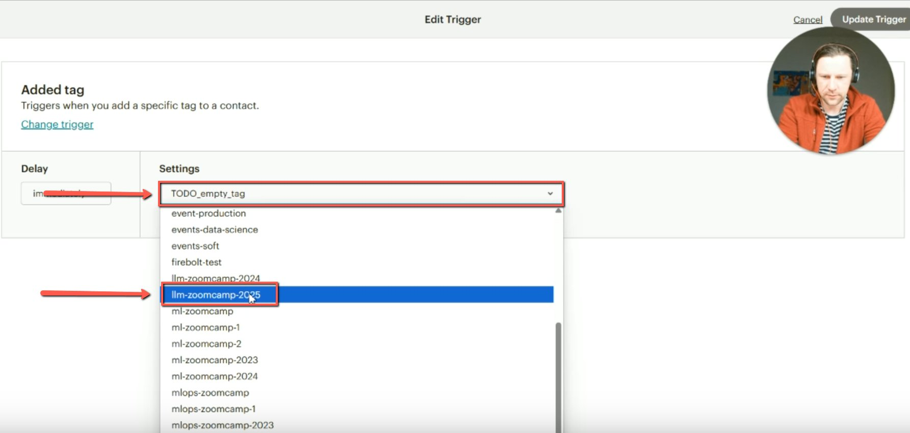
    <!-- sop-caption-start -->
    This trigger editor shows the tag dropdown with the course tag selected. Choose the exact course cohort tag so only new registrants for that course enter the automation.
    <!-- sop-caption-end -->
    <!-- sop-screenshot-end -->
<!-- sop-step-end -->

<!-- sop-step-start id=9 -->
9.  Click on “Update Trigger” at the upper right corner.

    <!-- sop-screenshot-start -->
    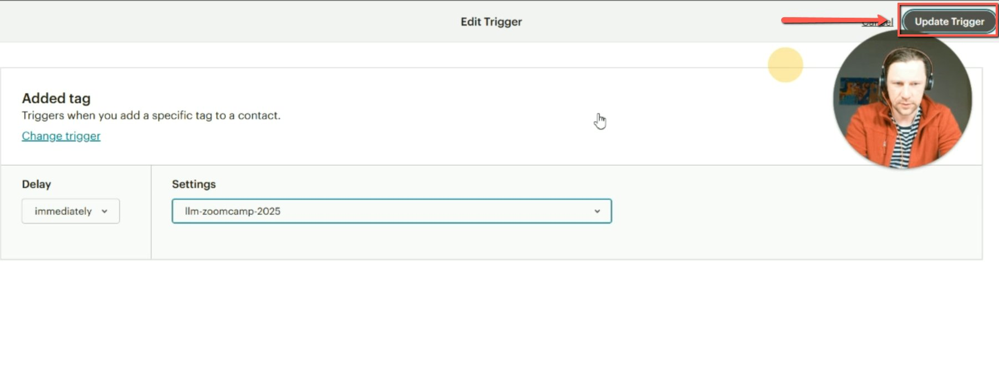
    <!-- sop-caption-start -->
    This trigger editor shows Update Trigger after the tag selection. Save the trigger here before editing the email content so the workflow is connected to the right audience segment.
    <!-- sop-caption-end -->
    <!-- sop-screenshot-end -->
<!-- sop-step-end -->

<!-- sop-step-start id=10 -->
10. Click on the “Design Email”.

    <!-- sop-screenshot-start -->
    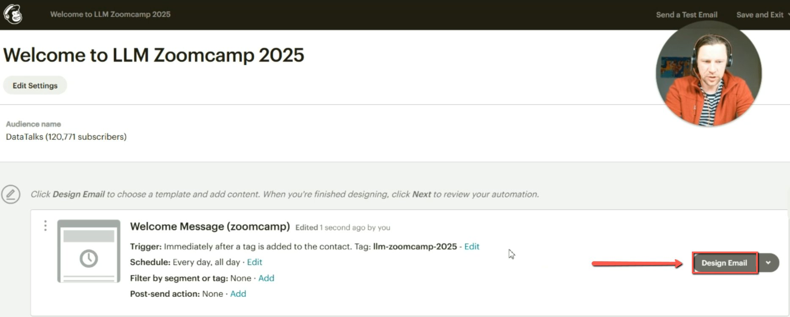
    <!-- sop-caption-start -->
    This workflow overview highlights Design Email. Use it to open the replicated email template and replace all old course-specific content.
    <!-- sop-caption-end -->
    <!-- sop-screenshot-end -->
<!-- sop-step-end -->

<!-- sop-step-start id=11 -->
11. Click the Edit pencil Icon.

    <!-- sop-screenshot-start -->
    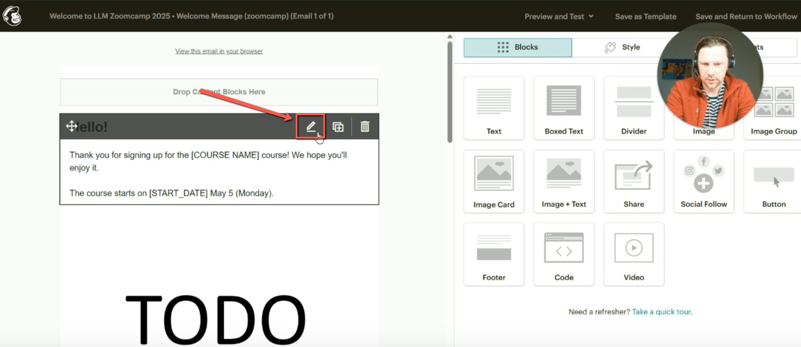
    <!-- sop-caption-start -->
    This email builder highlights the content block edit pencil. Click the pencil for the block you need to update rather than changing unrelated template sections.
    <!-- sop-caption-end -->
    <!-- sop-screenshot-end -->
<!-- sop-step-end -->

<!-- sop-step-start id=12 -->
12. Replace the \[COURSE NAME\] and the \[START_DATE\], Then click on the “Save & Close” button.

    <!-- sop-screenshot-start -->
    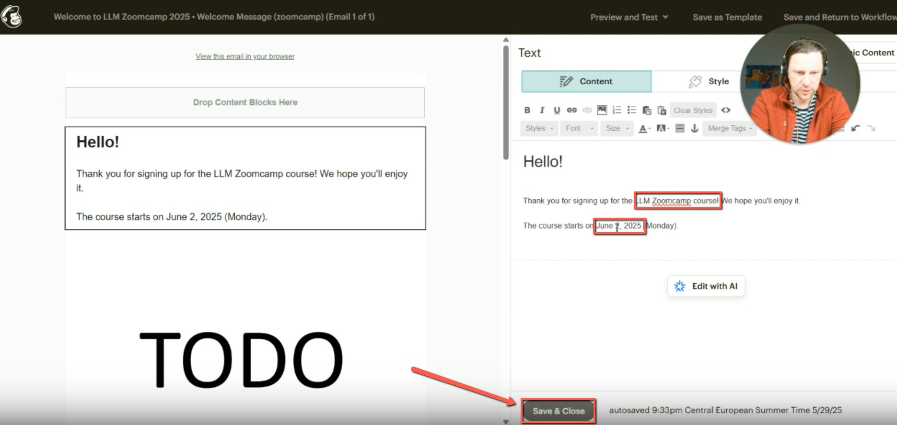
    <!-- sop-caption-start -->
    This text block shows placeholders for course name and start date. Replace both values and save so the welcome message describes the correct cohort.
    <!-- sop-caption-end -->
    <!-- sop-screenshot-end -->
<!-- sop-step-end -->

<!-- sop-step-start id=13 -->
13. Scroll down and click on the Edit pencil icon to add an image.

    <!-- sop-screenshot-start -->
    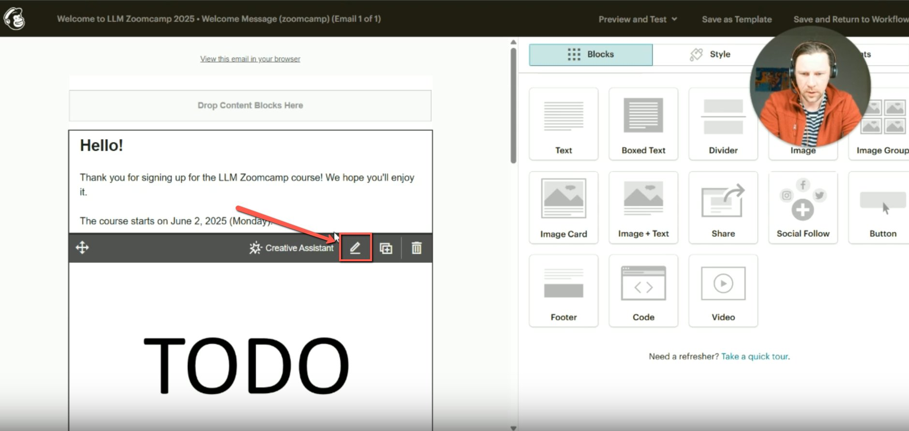
    <!-- sop-caption-start -->
    This image block edit control indicates where the course banner is replaced. Update the banner before linking it so the email visual matches the course being promoted.
    <!-- sop-caption-end -->
    <!-- sop-screenshot-end -->
<!-- sop-step-end -->

<!-- sop-step-start id=14 -->
14. In this case the image was in the github, click on the image and save.

    <!-- sop-screenshot-start -->
    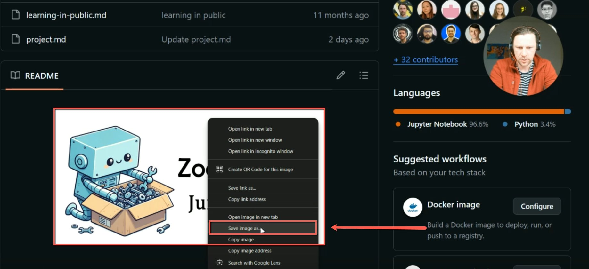
    <!-- sop-caption-start -->
    This GitHub page shows the course image file and save option. Download the image from the course repository when it is the source asset for the Mailchimp email.
    <!-- sop-caption-end -->
    <!-- sop-screenshot-end -->
<!-- sop-step-end -->

<!-- sop-step-start id=15 -->
15. Go back to Mailchimp and click on “Replace”.

    <!-- sop-screenshot-start -->
    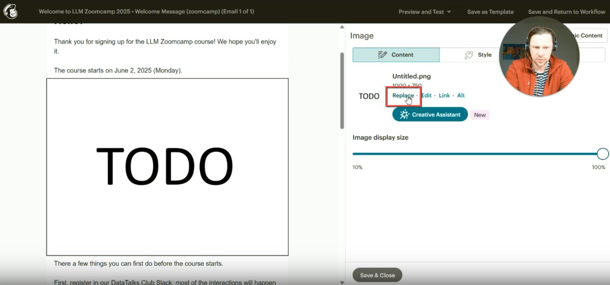
    <!-- sop-caption-start -->
    This Mailchimp image settings panel highlights Replace. Use Replace to swap the copied workflow image instead of adding a second image block.
    <!-- sop-caption-end -->
    <!-- sop-screenshot-end -->
<!-- sop-step-end -->

<!-- sop-step-start id=16 -->
16. Click on Upload.

    <!-- sop-screenshot-start -->
    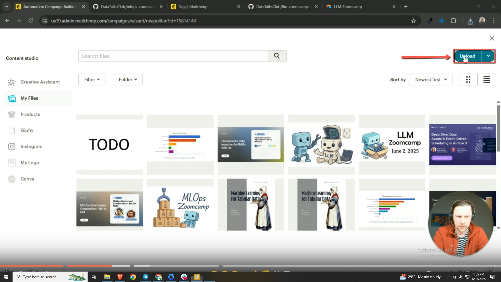
    <!-- sop-caption-start -->
    This content studio screen highlights Upload. Upload the downloaded course image so it becomes available for insertion into the email.
    <!-- sop-caption-end -->
    <!-- sop-screenshot-end -->
<!-- sop-step-end -->

<!-- sop-step-start id=17 -->
17. Select the image and click on “Open”.

    <!-- sop-screenshot-start -->
    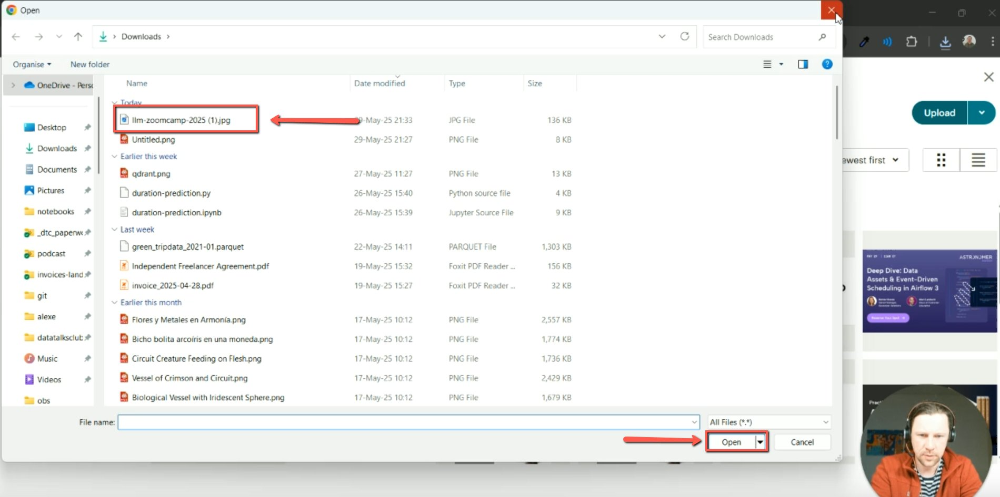
    <!-- sop-caption-start -->
    This file picker highlights the local course image file. Select the correct downloaded image before opening it in Mailchimp.
    <!-- sop-caption-end -->
    <!-- sop-screenshot-end -->
<!-- sop-step-end -->

<!-- sop-step-start id=18 -->
18. Now, select the image and click on “Insert”.

    <!-- sop-screenshot-start -->
    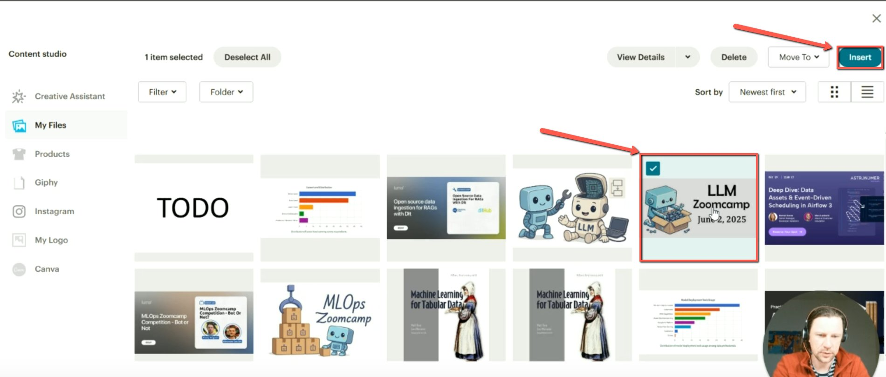
    <!-- sop-caption-start -->
    This content studio view shows the uploaded image selected and Insert highlighted. Insert only after confirming the thumbnail matches the current course.
    <!-- sop-caption-end -->
    <!-- sop-screenshot-end -->
<!-- sop-step-end -->

<!-- sop-step-start id=19 -->
19. If this notification shows up, click on “Let’s fix it”.

    <!-- sop-screenshot-start -->
    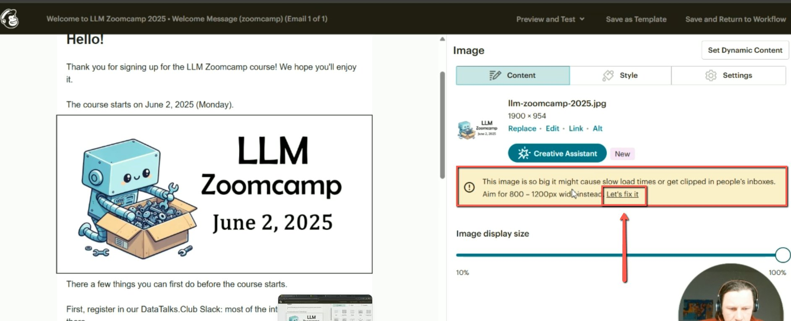
    <!-- sop-caption-start -->
    This Mailchimp warning indicates the inserted image may be too large. Use the fix prompt so the email image is optimized before sending.
    <!-- sop-caption-end -->
    <!-- sop-screenshot-end -->
<!-- sop-step-end -->

<!-- sop-step-start id=20 -->
20. Click on “Save” on the pop up window.

    <!-- sop-screenshot-start -->
    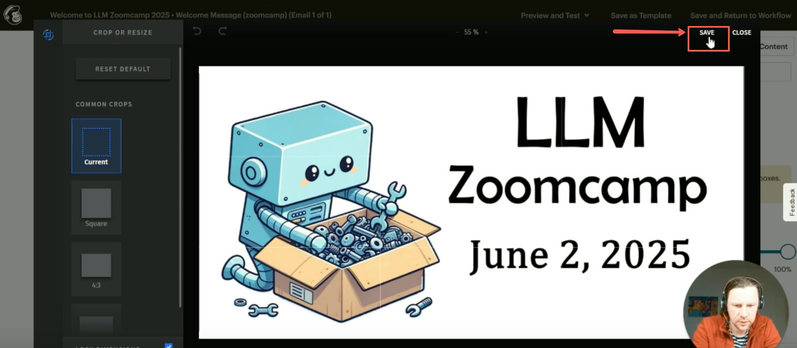
    <!-- sop-caption-start -->
    This image editor shows the resized course banner and Save button. Save the optimized image so the email keeps the right visual without loading issues.
    <!-- sop-caption-end -->
    <!-- sop-screenshot-end -->
<!-- sop-step-end -->

<!-- sop-step-start id=21 -->
21. Click on “Link” to add a link.

    <!-- sop-screenshot-start -->
    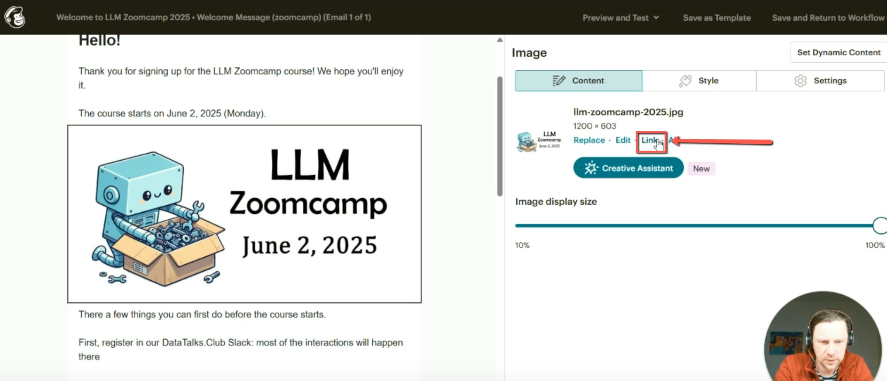
    <!-- sop-caption-start -->
    This image block menu highlights Link. Add the link here so clicking the banner sends registrants to the course repository or landing page.
    <!-- sop-caption-end -->
    <!-- sop-screenshot-end -->
<!-- sop-step-end -->

<!-- sop-step-start id=22 -->
22. Go to Github course repo and copy the link.

    <!-- sop-screenshot-start -->
    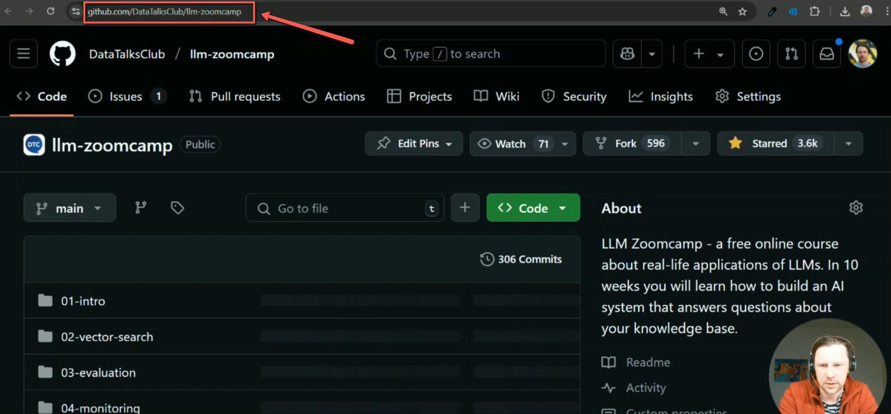
    <!-- sop-caption-start -->
    This GitHub repository page shows the course URL in the browser. Copy this URL as the destination for the course image link.
    <!-- sop-caption-end -->
    <!-- sop-screenshot-end -->
<!-- sop-step-end -->

<!-- sop-step-start id=23 -->
23. Paste the link and click on “Insert”.

    <!-- sop-screenshot-start -->
    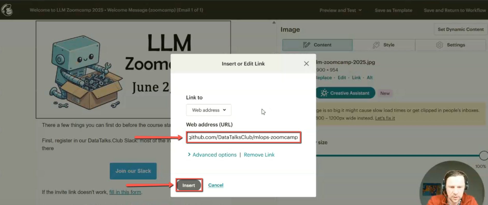
    <!-- sop-caption-start -->
    This Mailchimp link dialog shows the course URL field and Insert button. Confirm the URL is the new course repository before inserting it.
    <!-- sop-caption-end -->
    <!-- sop-screenshot-end -->
<!-- sop-step-end -->

<!-- sop-step-start id=24 -->
24. To check if the link is working, right click on the image and click on “Open link in new tab”.

    Note: This is very important to do so we don't accidentally have the old links when we copy. Do this in other phrases that have attached links to it to double check.

    <!-- sop-screenshot-start -->
    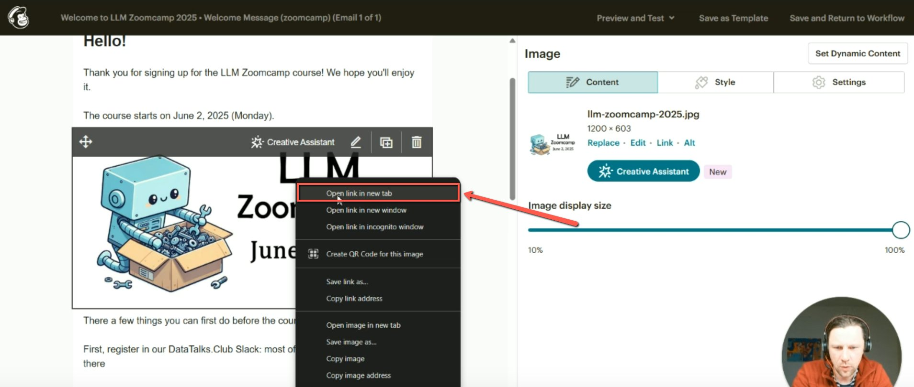
    <!-- sop-caption-start -->
    This image context menu highlights opening the linked image in a new tab. Use it to test the banner link and catch any copied-workflow URL that still points to an old course.
    <!-- sop-caption-end -->
    <!-- sop-screenshot-end -->
<!-- sop-step-end -->

<!-- sop-step-start id=25 -->
25. Scroll down and click on the Edit pencil Icon.

    <!-- sop-screenshot-start -->
    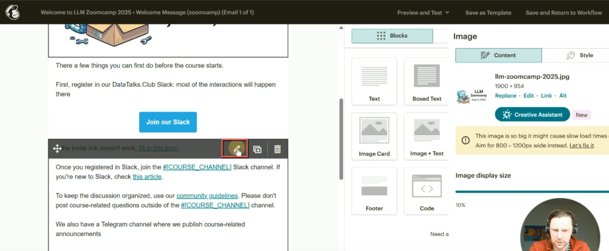
    <!-- sop-caption-start -->
    This email section highlights the edit pencil near the Slack invitation text. Edit this block to replace copied Slack links and channel names.
    <!-- sop-caption-end -->
    <!-- sop-screenshot-end -->
<!-- sop-step-end -->

<!-- sop-step-start id=26 -->
26. Go to Slack and copy the Slack course link.

    <!-- sop-screenshot-start -->
    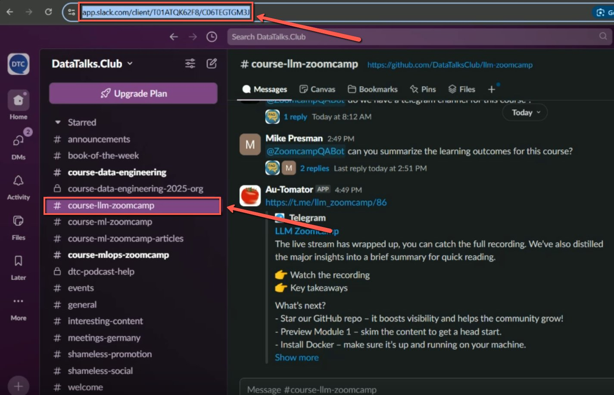
    <!-- sop-caption-start -->
    This Slack screen highlights the course channel link in the browser. Copy it from the actual course channel so the welcome email sends learners to the right Slack space.
    <!-- sop-caption-end -->
    <!-- sop-screenshot-end -->
<!-- sop-step-end -->

<!-- sop-step-start id=27 -->
27. Click on the phrase to attach the link on then click on the link icon.

    <!-- sop-screenshot-start -->
    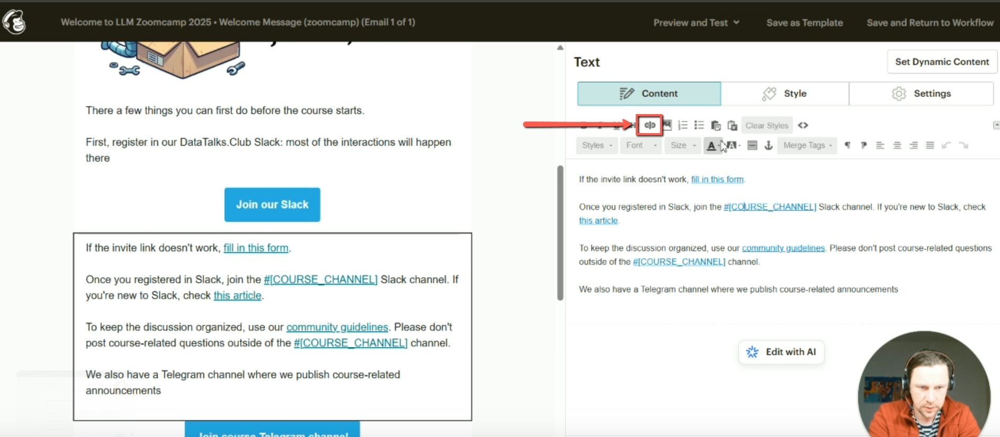
    <!-- sop-caption-start -->
    This Mailchimp text editor highlights the link icon for the Slack channel phrase. Select the intended phrase before inserting the new Slack URL.
    <!-- sop-caption-end -->
    <!-- sop-screenshot-end -->
<!-- sop-step-end -->

<!-- sop-step-start id=28 -->
28. Paste the link and click on “Insert”.

    <!-- sop-screenshot-start -->
    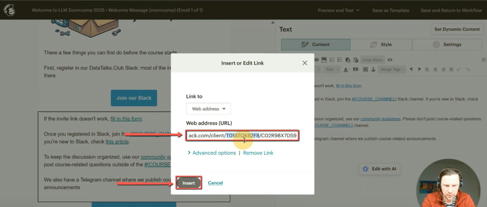
    <!-- sop-caption-start -->
    This link dialog shows the Slack channel URL ready to insert. Verify it points to the current course channel before saving the link.
    <!-- sop-caption-end -->
    <!-- sop-screenshot-end -->
<!-- sop-step-end -->

<!-- sop-step-start id=29 -->
29. Go to Slack and copy the Slack course channel name.

    <!-- sop-screenshot-start -->
    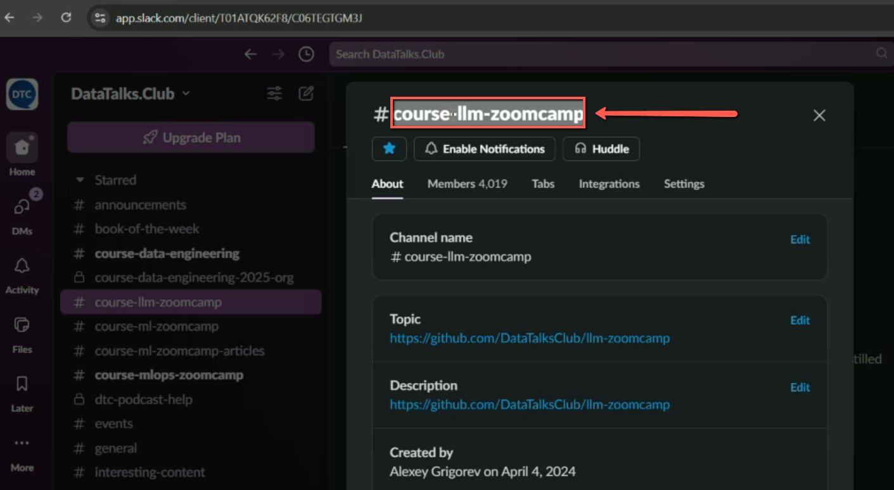
    <!-- sop-caption-start -->
    This Slack channel details panel highlights the course channel name. Copy the channel name exactly so the email text matches the linked Slack destination.
    <!-- sop-caption-end -->
    <!-- sop-screenshot-end -->
<!-- sop-step-end -->

<!-- sop-step-start id=30 -->
30. Replace \[COURSE_CHANNEL\] and paste the Course name channel.

    Note: Paste using Ctrl + Shift + V to copy it in the same format. It's important that both links are replaced.

    <!-- sop-screenshot-start -->
    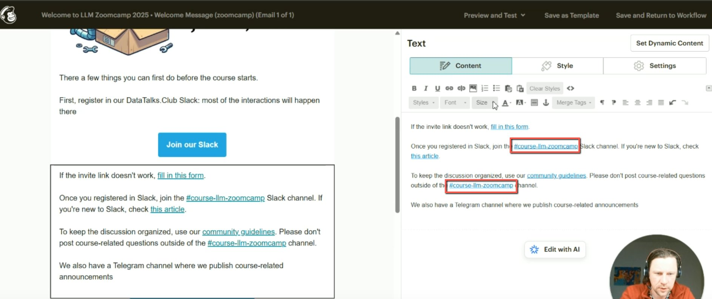
    <!-- sop-caption-start -->
    This Mailchimp text block shows the course channel placeholder replaced in the invitation copy. Check both the visible channel name and the attached link before moving on.
    <!-- sop-caption-end -->
    <!-- sop-screenshot-end -->
<!-- sop-step-end -->

<!-- sop-step-start id=31 -->
31. Scroll down and hover your mouse to “Join course Telegram Channel” and click on the Pencil icon.

    <!-- sop-screenshot-start -->
    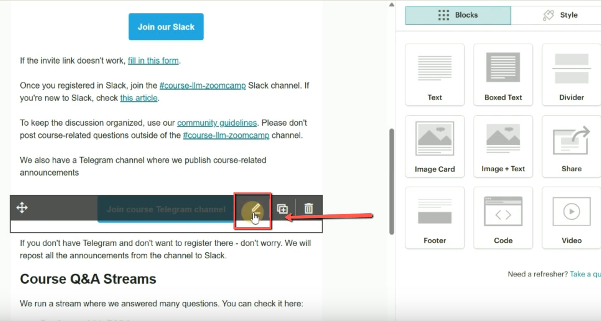
    <!-- sop-caption-start -->
    This email builder highlights the Telegram button edit pencil. Open this button block to replace the copied Telegram announcement link.
    <!-- sop-caption-end -->
    <!-- sop-screenshot-end -->
<!-- sop-step-end -->

<!-- sop-step-start id=32 -->
32. Go back to Github course repo and scroll down until you see the “Telegram Announcements”,then right click and copy the link.

    Note: You can also get the other links in these github repo for the slack and the course channels.

    <!-- sop-screenshot-start -->
    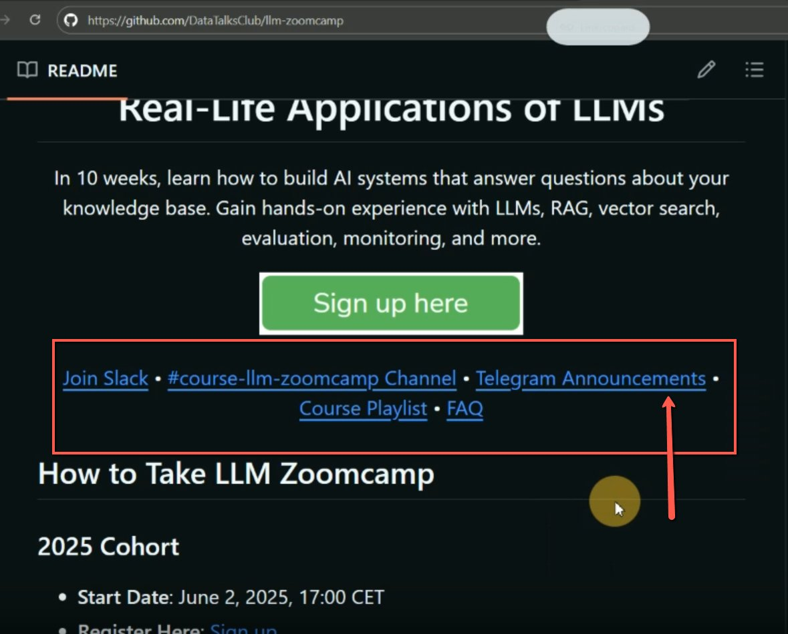
    <!-- sop-caption-start -->
    This course README highlights the Telegram Announcements link. Copy this source link so the welcome email points to the official course announcements channel.
    <!-- sop-caption-end -->
    <!-- sop-screenshot-end -->
<!-- sop-step-end -->

<!-- sop-step-start id=33 -->
33. Go back to Mailchimp and replace the Web address (URL). Then click on “Save & Close”.

    <!-- sop-screenshot-start -->
    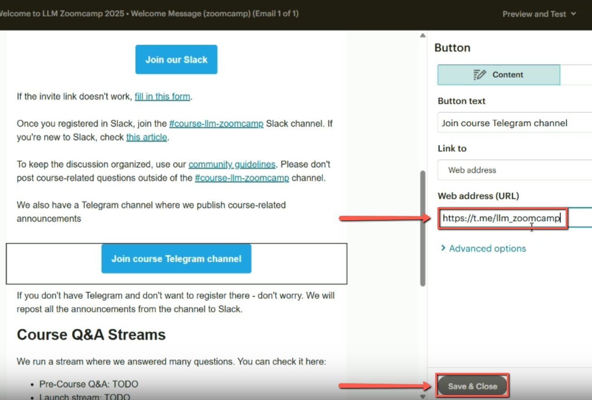
    <!-- sop-caption-start -->
    This button settings panel shows the Telegram URL and Save & Close. Confirm the URL is pasted into the button destination before saving the block.
    <!-- sop-caption-end -->
    <!-- sop-screenshot-end -->
<!-- sop-step-end -->

<!-- sop-step-start id=34 -->
34. Scroll down and hover your mouse to “Course Q&A Streams” and click on the Pencil icon.

    Note: In this case we already have two, but if you had only one just remove Launch Stream and keep Pre-course Q&A

    <!-- sop-screenshot-start -->
    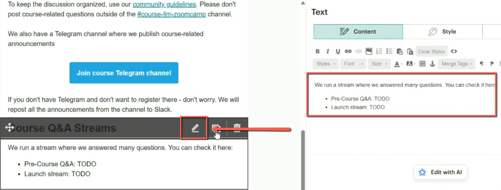
    <!-- sop-caption-start -->
    This Q&A Streams block highlights the edit pencil and current stream entries. Use it to decide whether to keep both stream links or remove a placeholder for the current course.
    <!-- sop-caption-end -->
    <!-- sop-screenshot-end -->
<!-- sop-step-end -->

<!-- sop-step-start id=35 -->
35. Go to the DTC Youtube channel and select the course video.

    <!-- sop-screenshot-start -->
    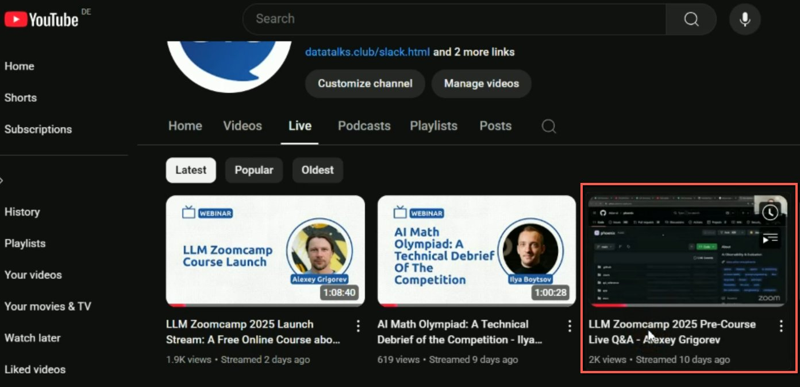
    <!-- sop-caption-start -->
    This YouTube channel view highlights the relevant course live video. Select the correct course stream before copying any watch URL.
    <!-- sop-caption-end -->
    <!-- sop-screenshot-end -->
<!-- sop-step-end -->

<!-- sop-step-start id=36 -->
36. Edit the link to remove “&” and copy.

    <!-- sop-screenshot-start -->
    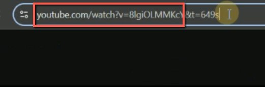
    <!-- sop-caption-start -->
    This browser address bar highlights the YouTube watch URL and the extra parameter to remove. Clean the URL before linking it so Mailchimp receives the stable video link.
    <!-- sop-caption-end -->
    <!-- sop-screenshot-end -->
<!-- sop-step-end -->

<!-- sop-step-start id=37 -->
37. Go back to Mailchimp and paste it. Then click on the link icon to turn it into a link.

    <!-- sop-screenshot-start -->
    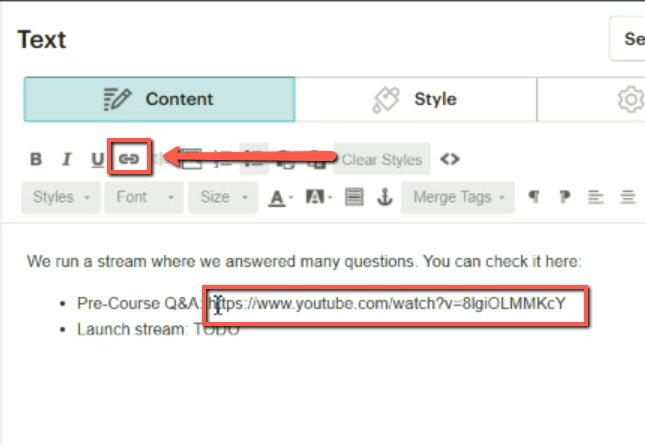
    <!-- sop-caption-start -->
    This Mailchimp editor shows the stream URL pasted into the text and the link icon highlighted. Turn the visible URL into an actual hyperlink before saving.
    <!-- sop-caption-end -->
    <!-- sop-screenshot-end -->
<!-- sop-step-end -->

<!-- sop-step-start id=38 -->
38. Paste the link and click on “Insert”

    <!-- sop-screenshot-start -->
    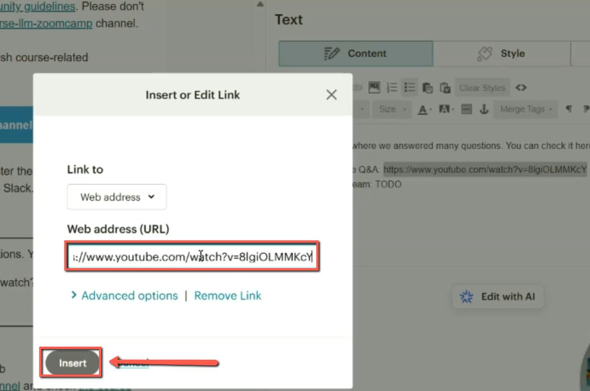
    <!-- sop-caption-start -->
    This link dialog shows the YouTube URL and Insert button. Confirm the cleaned video URL before inserting it into the Q&A stream entry.
    <!-- sop-caption-end -->
    <!-- sop-screenshot-end -->
<!-- sop-step-end -->

<!-- sop-step-start id=39 -->
39. Do the same for copying the link from Youtube and paste it for the Launch Course. Then click on “Save and Close”.

    Note: Check if the link is working by opening it in new tab

    <!-- sop-screenshot-start -->
    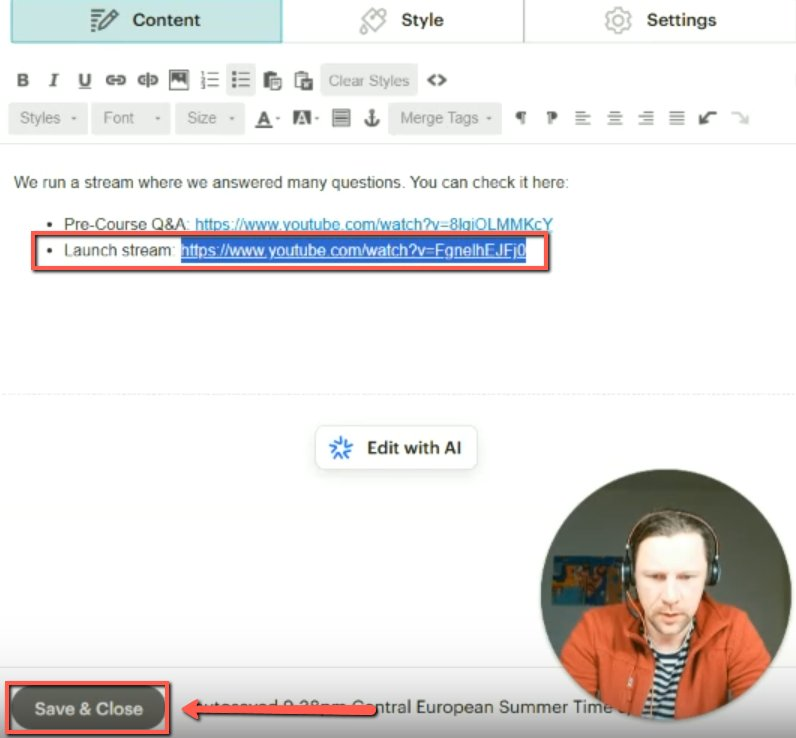
    <!-- sop-caption-start -->
    This text block shows both stream links and Save & Close. Use it to verify the pre-course and launch stream links are present before leaving the block.
    <!-- sop-caption-end -->
    <!-- sop-screenshot-end -->
<!-- sop-step-end -->

<!-- sop-step-start id=40 -->
40. Scroll down and hover your mouse to “A few other things” and click on the Pencil icon.

    <!-- sop-screenshot-start -->
    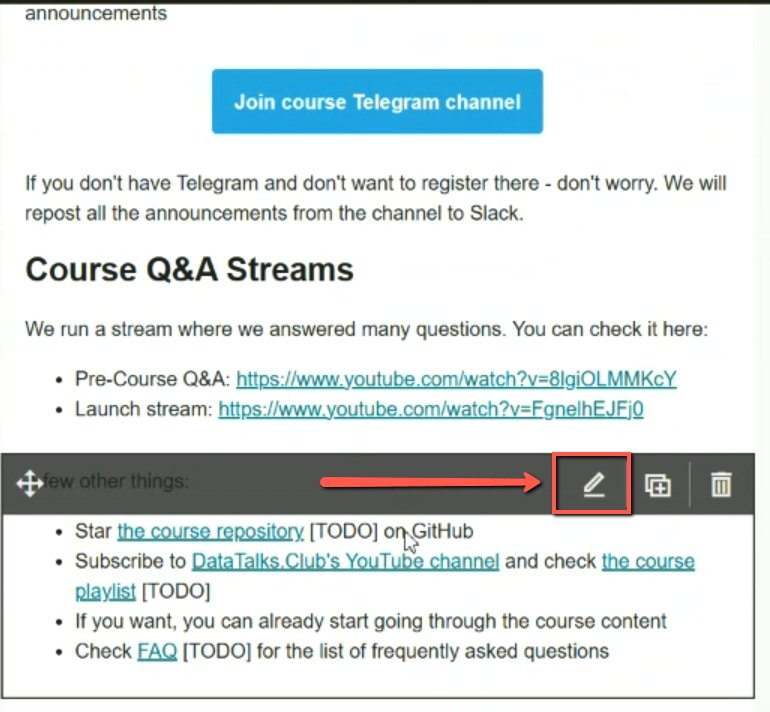
    <!-- sop-caption-start -->
    This email section highlights the edit pencil for the “A few other things” list. Edit this block to replace repository, playlist, and FAQ links from the copied automation.
    <!-- sop-caption-end -->
    <!-- sop-screenshot-end -->
<!-- sop-step-end -->

<!-- sop-step-start id=41 -->
41. Go back to the Github course repository and copy the link.

    <!-- sop-screenshot-start -->
    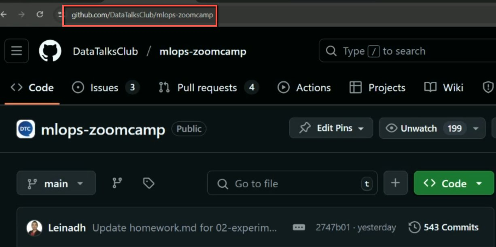
    <!-- sop-caption-start -->
    This GitHub repository page shows the course repo URL. Copy it for the “course repository” link in the welcome email.
    <!-- sop-caption-end -->
    <!-- sop-screenshot-end -->
<!-- sop-step-end -->

<!-- sop-step-start id=42 -->
42. Go back to Mailchimp and click on the link then click on the link icon.

    <!-- sop-screenshot-start -->
    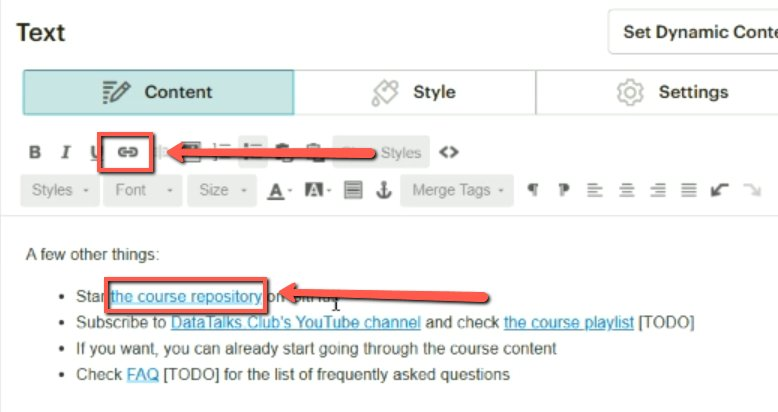
    <!-- sop-caption-start -->
    This Mailchimp editor highlights the course repository text and link icon. Select the exact phrase before opening the link dialog so only that item is updated.
    <!-- sop-caption-end -->
    <!-- sop-screenshot-end -->
<!-- sop-step-end -->

<!-- sop-step-start id=43 -->
43. Paste the link and click on “Insert”

    <!-- sop-screenshot-start -->
    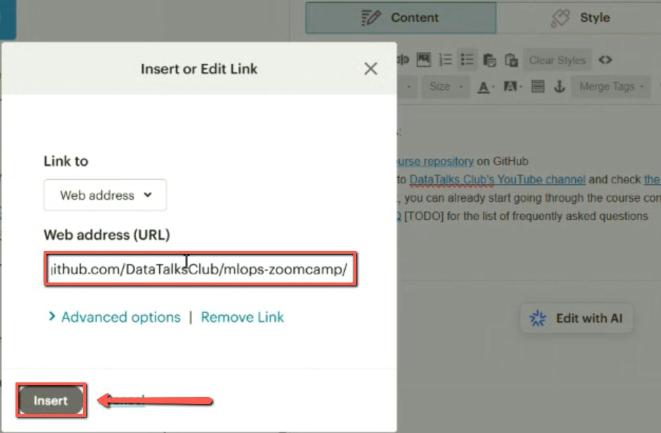
    <!-- sop-caption-start -->
    This link dialog shows the repository URL ready to insert. Verify the course slug in the URL before applying it to the email text.
    <!-- sop-caption-end -->
    <!-- sop-screenshot-end -->
<!-- sop-step-end -->

<!-- sop-step-start id=44 -->
44. Click on the course playlist and go back to Course repo to copy the link.

    <!-- sop-screenshot-start -->
    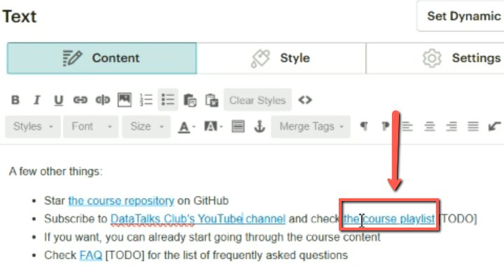
    <!-- sop-caption-start -->
    This Mailchimp editor highlights the course playlist text. Use this as the next link target after the repository link is corrected.
    <!-- sop-caption-end -->
    <!-- sop-screenshot-end -->
<!-- sop-step-end -->

<!-- sop-step-start id=45 -->
45. Go to DTC Youtube Channel and look for the course playlist. Click on “View Playlist”

    <!-- sop-screenshot-start -->
    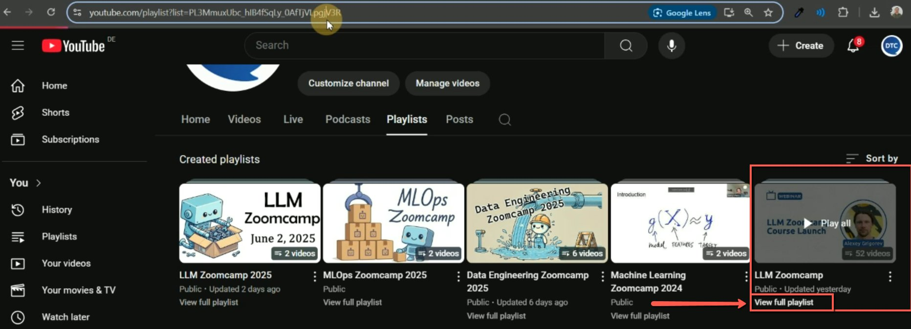
    <!-- sop-caption-start -->
    This YouTube playlists view highlights the course playlist. Open the correct playlist rather than copying a single video URL.
    <!-- sop-caption-end -->
    <!-- sop-screenshot-end -->
<!-- sop-step-end -->

<!-- sop-step-start id=46 -->
46. Copy the link.

    <!-- sop-screenshot-start -->
    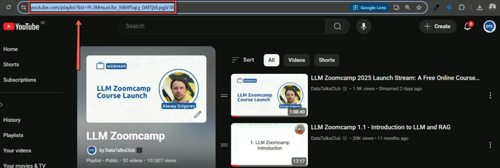
    <!-- sop-caption-start -->
    This YouTube playlist page shows the playlist URL in the browser. Copy this page link for the email playlist item.
    <!-- sop-caption-end -->
    <!-- sop-screenshot-end -->
<!-- sop-step-end -->

<!-- sop-step-start id=47 -->
47. Paste the link and click on “Insert”

    <!-- sop-screenshot-start -->
    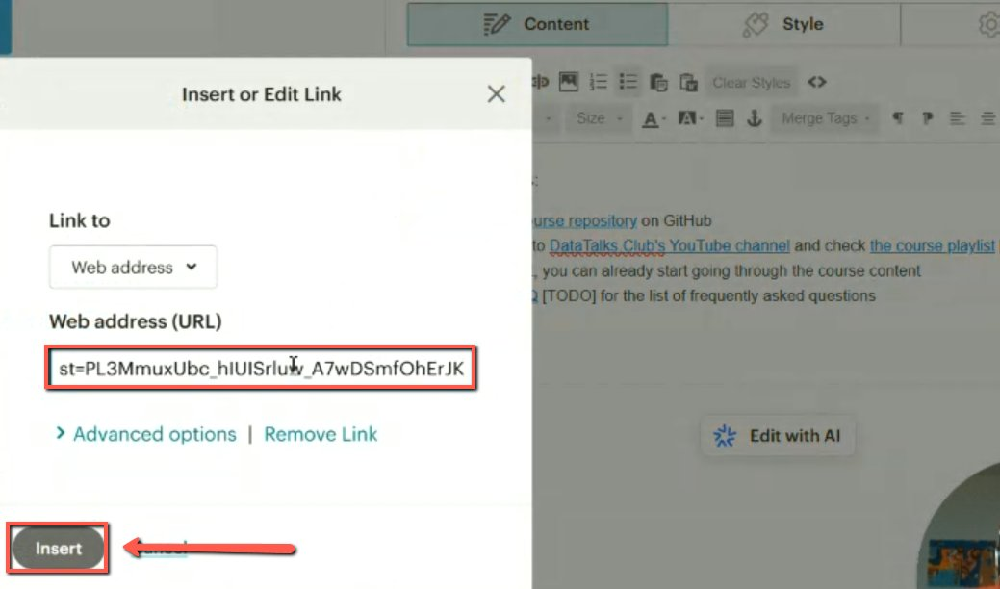
    <!-- sop-caption-start -->
    This link dialog shows the playlist URL before insertion. Confirm it includes the playlist ID and belongs to the current course.
    <!-- sop-caption-end -->
    <!-- sop-screenshot-end -->
<!-- sop-step-end -->

<!-- sop-step-start id=48 -->
48. Go to Github Course repo to copy the FAQ link.

    <!-- sop-screenshot-start -->
    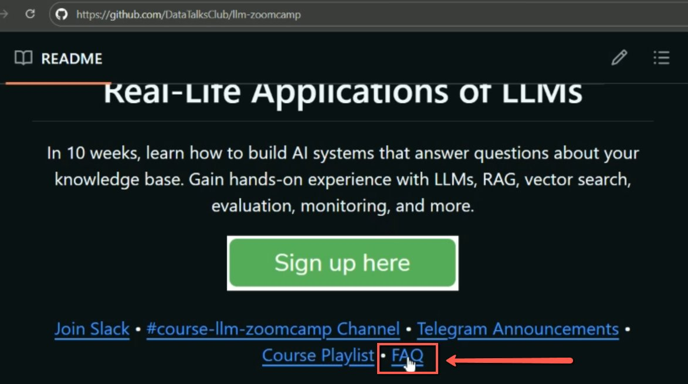
    <!-- sop-caption-start -->
    This course README highlights the FAQ link. Copy this URL so the welcome email points learners to the right course FAQ resource.
    <!-- sop-caption-end -->
    <!-- sop-screenshot-end -->
<!-- sop-step-end -->

<!-- sop-step-start id=49 -->
49. Go to Mailchimp and click on the FAQ link then click on the link icon.

    <!-- sop-screenshot-start -->
    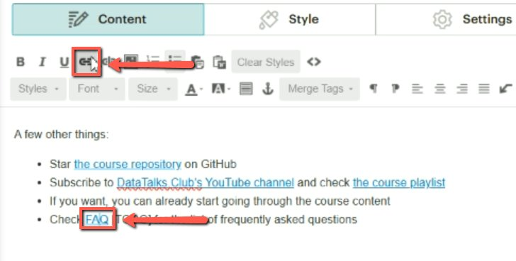
    <!-- sop-caption-start -->
    This Mailchimp editor highlights the FAQ text and link icon. Select the FAQ phrase before updating its destination.
    <!-- sop-caption-end -->
    <!-- sop-screenshot-end -->
<!-- sop-step-end -->

<!-- sop-step-start id=50 -->
50. Paste the link and click on “Insert”

    <!-- sop-screenshot-start -->
    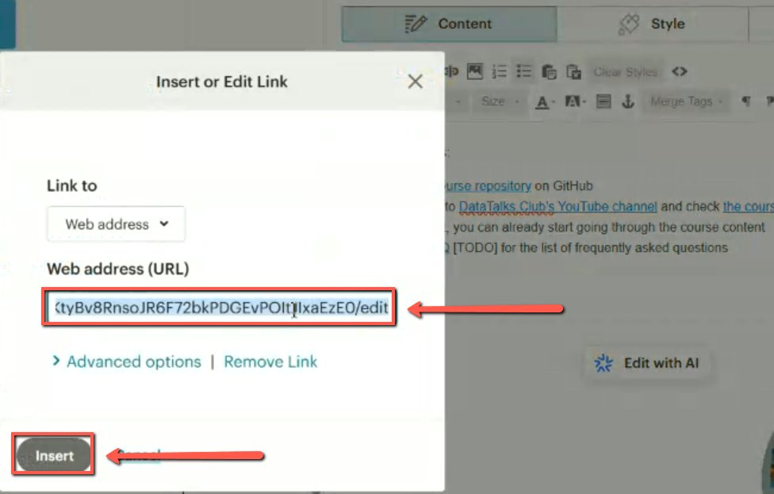
    <!-- sop-caption-start -->
    This link dialog shows the FAQ URL and Insert button. Verify the copied FAQ link before inserting it into the final resource list.
    <!-- sop-caption-end -->
    <!-- sop-screenshot-end -->
<!-- sop-step-end -->

<!-- sop-step-start id=51 -->
51. Click on “Save & Close” and click on the “Save And Continue” button.

    Note: Check if the link is working by opening it in new tab

    <!-- sop-screenshot-start -->
    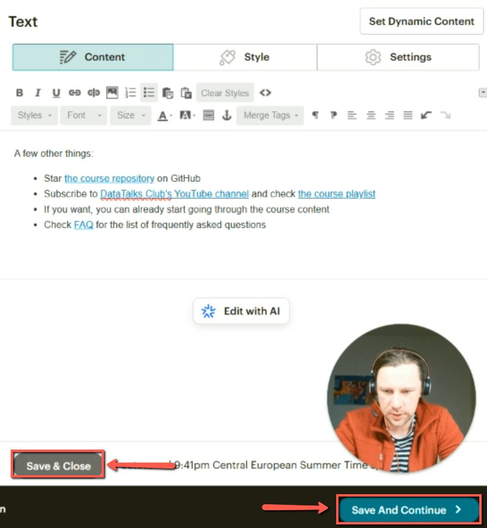
    <!-- sop-caption-start -->
    This final email editor view highlights Save & Close and Save And Continue. Use this checkpoint to confirm all course-specific links are replaced before leaving the design step.
    <!-- sop-caption-end -->
    <!-- sop-screenshot-end -->
<!-- sop-step-end -->

<!-- sop-step-start id=52 -->
52. Click on the Next button.

    <!-- sop-screenshot-start -->
    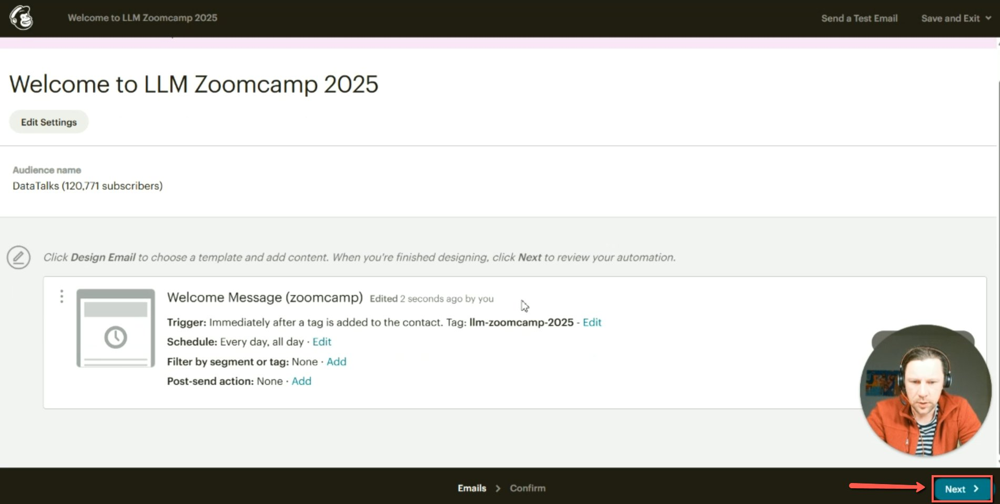
    <!-- sop-caption-start -->
    This workflow step highlights the Next button. Continue only after the design step has been saved so the final review uses the updated email.
    <!-- sop-caption-end -->
    <!-- sop-screenshot-end -->
<!-- sop-step-end -->

<!-- sop-step-start id=53 -->
53. Click on “Edit”

    <!-- sop-screenshot-start -->
    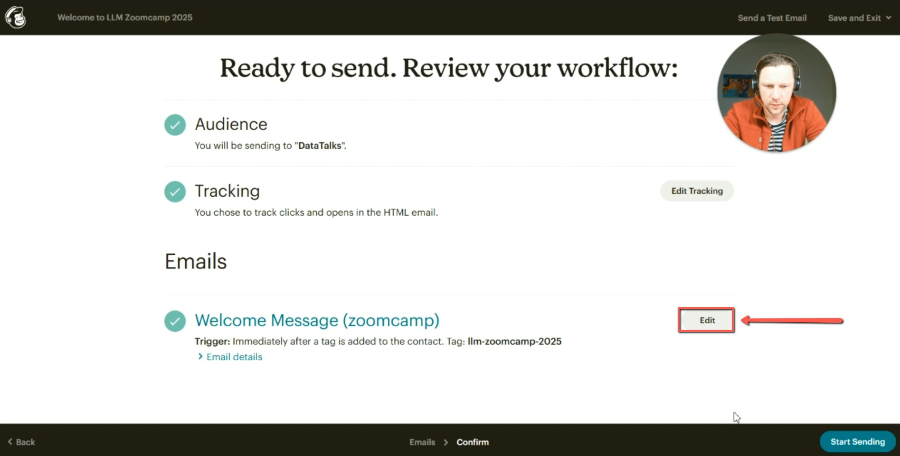
    <!-- sop-caption-start -->
    This review screen highlights Edit for Email Details. Open it to update subject and preview text before starting the automation.
    <!-- sop-caption-end -->
    <!-- sop-screenshot-end -->
<!-- sop-step-end -->

<!-- sop-step-start id=54 -->
54. For Email Subject, replace the Course Name and Course Year
    In this example is should be “Welcome to LLM Zoomcamp 2024”

    For Preview Text, replace it with the Course Name without the Zoomcamp
    In this example it should be “Thanks for signing up for our LLM course!”

    Then click on “Next” button.

    <!-- sop-screenshot-start -->
    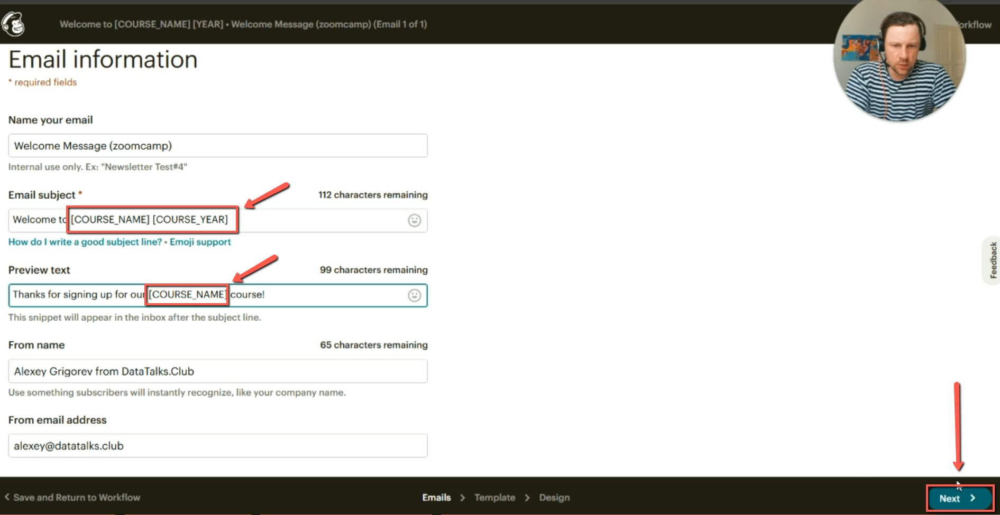
    <!-- sop-caption-start -->
    This email information screen highlights subject and preview placeholders. Replace them with the course name and short preview text so recipients see accurate inbox copy.
    <!-- sop-caption-end -->
    <!-- sop-screenshot-end -->
<!-- sop-step-end -->

<!-- sop-step-start id=55 -->
55. Click on “Save and Continue”.

    <!-- sop-screenshot-start -->
    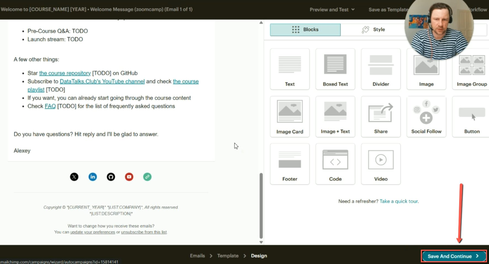
    <!-- sop-caption-start -->
    This design screen highlights Save and Continue after email detail updates. Save here to return to the workflow review with the final email metadata.
    <!-- sop-caption-end -->
    <!-- sop-screenshot-end -->
<!-- sop-step-end -->

<!-- sop-step-start id=56 -->
56. Click on “Email Details”.

    <!-- sop-screenshot-start -->
    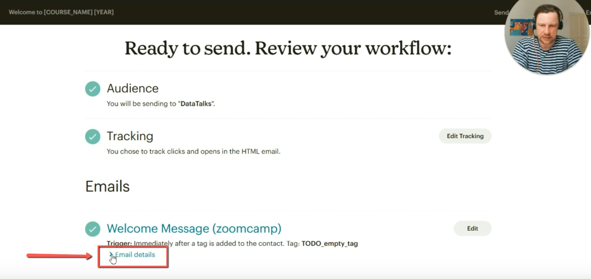
    <!-- sop-caption-start -->
    This review screen highlights Email Details. Open it as a final check that trigger, subject, preview text, and reply settings are all correct.
    <!-- sop-caption-end -->
    <!-- sop-screenshot-end -->
<!-- sop-step-end -->

<!-- sop-step-start id=57 -->
57. Check if the details are correct and if everything is good then click on “Start Sending”.

    <!-- sop-screenshot-start -->
    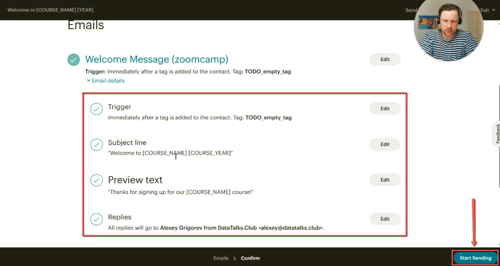
    <!-- sop-caption-start -->
    This final review screen highlights Start Sending after all checklist items pass. Start the automation only when the trigger tag and email details match the current course.
    <!-- sop-caption-end -->
    <!-- sop-screenshot-end -->
<!-- sop-step-end -->
<!-- sop-section-end -->

<!-- sop-section-start: validation -->
## Validation

-
<!-- sop-section-end -->

<!-- sop-section-start: troubleshooting -->
## Troubleshooting

-
<!-- sop-section-end -->

<!-- sop-section-start: references -->
## References

-
<!-- sop-section-end -->
