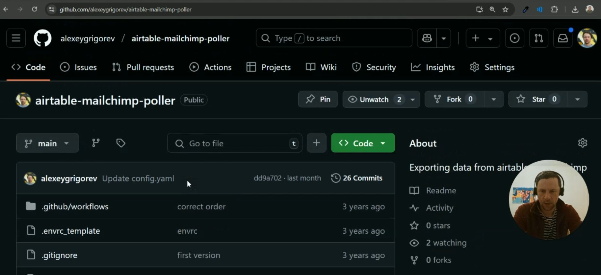
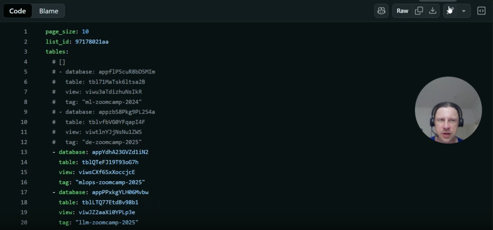
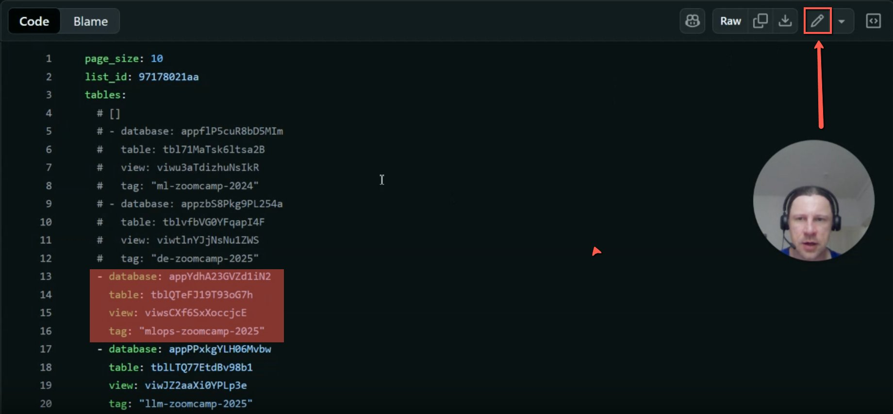
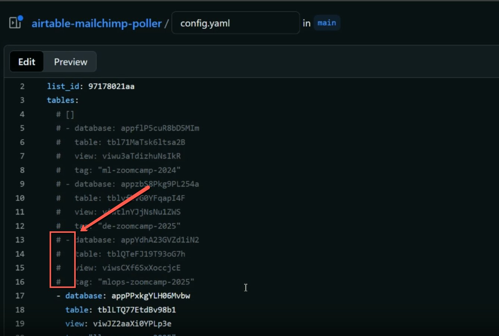
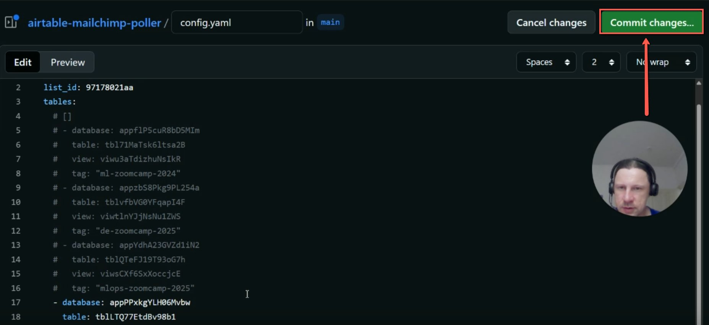
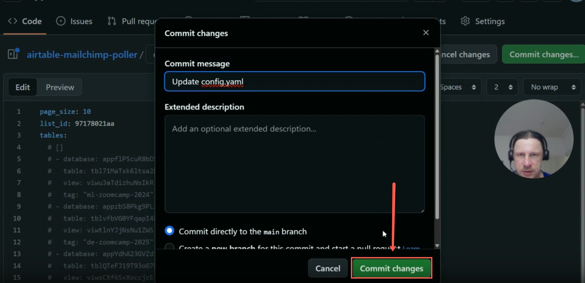

# Disabling MailChimp+Airtable Integration

<!-- sop-section-start: summary -->
## Summary

- Purpose: The process involves disabling a course in Airtable and to back up the database from that course.
- Outcome: The course integration is commented out in the poller configuration.
- Trigger: A course cohort should stop sending automated sign-up emails.
- Frequency: When a course cohort is retired or paused.
<!-- sop-section-end -->

<!-- sop-section-start: prerequisites -->
## Prerequisites

- Access: MailChimpPoller GitHub repository.
- Tools: GitHub.
- Inputs: Course integration entry in `config.yaml`.
<!-- sop-section-end -->

<!-- sop-section-start: procedure -->
## Procedure

<!-- sop-prose-start -->
Disabling MailChimp+Airtable Integration
This document shows the steps to Disable MailChimp+Airtable Integration.

Step-by-step Instructions
<!-- sop-prose-end -->

<!-- sop-step-start id=1 -->
1.  Go to Github Repositories [airtable -mailchimp-poller](https://github.com/alexeygrigorev/airtable-mailchimp-poller)

    In this example is the mlops Zoomcamp Course.

    <!-- sop-screenshot-start -->
    
    <!-- sop-caption-start -->
    This identifies the correct `airtable-mailchimp-poller` GitHub repository before editing automation configuration. Confirm you are in this repo and on the main branch so the course integration is disabled in the right place.
    <!-- sop-caption-end -->
    <!-- sop-screenshot-end -->
<!-- sop-step-end -->

<!-- sop-step-start id=2 -->
2.  Scroll and click the “config.yaml” file. These are the automations that are enabled.

    <!-- sop-screenshot-start -->
    
    <!-- sop-caption-start -->
    This shows `config.yaml` with the active Airtable/Mailchimp mappings. Use it to locate the course block that currently enables the poller automation.
    <!-- sop-caption-end -->
    <!-- sop-screenshot-end -->
<!-- sop-step-end -->

<!-- sop-step-start id=3 -->
3.  Click the pencil icon to edit the file.

    <!-- sop-screenshot-start -->
    
    <!-- sop-caption-start -->
    The pencil icon is highlighted on the `config.yaml` file view. Click it only after confirming the course block, because the next step edits production automation configuration.
    <!-- sop-caption-end -->
    <!-- sop-screenshot-end -->
<!-- sop-step-end -->

<!-- sop-step-start id=4 -->
4.  Select the integration you want to disable. In this example, we are going to disable the MLOps Zoomcamp Course.

    Type “# ” (hashtag followed by a space) on your keyboard before each entry. It will turn gray, indicating that the integration between mlops zoomcamp in Airtable that is collecting registrations and Mailchimp is now disabled.

    <!-- sop-screenshot-start -->
    
    <!-- sop-caption-start -->
    This shows the course block commented out with `#` markers. Check that every line in the target integration block is greyed out so the poller no longer processes that course.
    <!-- sop-caption-end -->
    <!-- sop-screenshot-end -->
<!-- sop-step-end -->

<!-- sop-step-start id=5 -->
5.  Click on “Commit changes”.

    <!-- sop-screenshot-start -->
    
    <!-- sop-caption-start -->
    This is the edited GitHub file with the Commit changes button highlighted. Use it to confirm the commented block is still visible before opening the commit dialog.
    <!-- sop-caption-end -->
    <!-- sop-screenshot-end -->
<!-- sop-step-end -->

<!-- sop-step-start id=6 -->
6.  Click on “Commit changes” at the pop up window.

    <!-- sop-screenshot-start -->
    
    <!-- sop-caption-start -->
    This commit dialog is the final confirmation for disabling the integration. Keep the commit on the main branch and commit only after the target course block has been commented correctly.
    <!-- sop-caption-end -->
    <!-- sop-screenshot-end -->
<!-- sop-step-end -->
<!-- sop-section-end -->

<!-- sop-section-start: validation -->
## Validation

-
<!-- sop-section-end -->

<!-- sop-section-start: troubleshooting -->
## Troubleshooting

-
<!-- sop-section-end -->

<!-- sop-section-start: references -->
## References

-
<!-- sop-section-end -->
