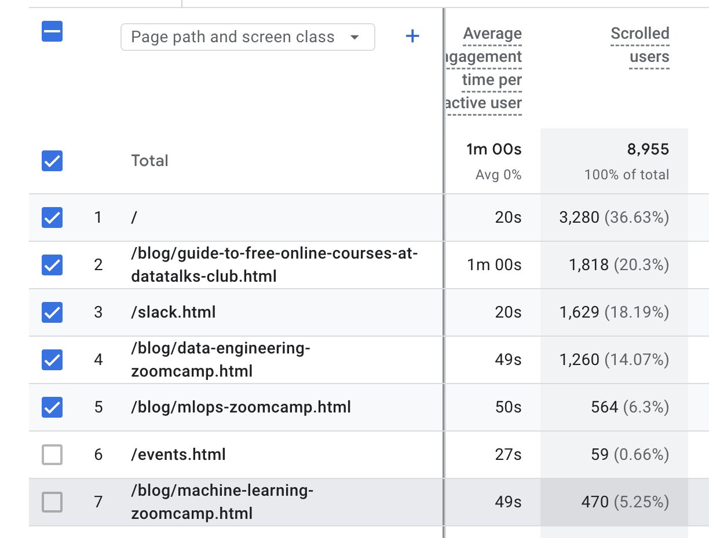
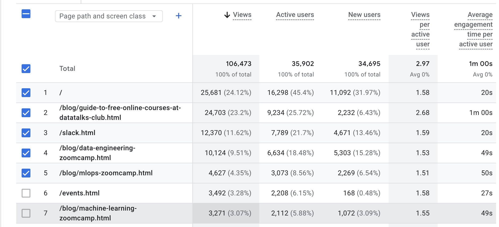

# Copy of ML Zoomcamp 2025 Promotion Playbook

## Summary

## Content

ML Zoomcamp 2025

Launch date: Sep 15, 2025

Current number of registrations (July 14, 2025): 2273

Days until the start of the ML Zoomcamp: 2 months

Goal for the number of registrations: 6000-8000? (10,000 is ideal) (Alexey: “7000”)

### Regular activities

### 1. Update course GitHub page with the exact date of the new cohort and other information listed (done)

- A date of the next cohort where it’s mentioned

- Any changes in the curriculum

  - If there’s a diagram for curriculum, update it

[https://github.com/DataTalksClub/machine-learning-zoomcamp](https://github.com/DataTalksClub/machine-learning-zoomcamp)

### 2. Update course article with the same information (done)

Check:

- Title, subtitle, description

- Main body

- Images

- FAQ

- Button text

[https://datatalks.club/blog/machine-learning-zoomcamp.html](https://datatalks.club/blog/machine-learning-zoomcamp.html)

### 3. Update the article about all DTC courses with the same information (done)

[https://datatalks.club/blog/guide-to-free-online-courses-at-datatalks-club.html](https://datatalks.club/blog/guide-to-free-online-courses-at-datatalks-club.html)

### 4. Update landing pages (to do)

[https://datatalks.club/courses/](https://datatalks.club/courses/)

[https://datatalks.club/courses/ml-zoomcamp/](https://datatalks.club/courses/ml-zoomcamp/)

### 5. Update a welcome email for everyone who register (done, on review by Alexey)

On Mailchimp

### 6. Create a new cohort course folder on GitHub and YouTube (to do)

[https://github.com/DataTalksClub/machine-learning-zoomcamp](https://github.com/DataTalksClub/machine-learning-zoomcamp)

[https://www.youtube.com/@DataTalksClub](https://www.youtube.com/@DataTalksClub)

### 7. Update the CTA banner at the top of the DTC website (ask Alexey)

[https://datatalks.club/](https://datatalks.club/)

### 8. Pre-course live events (done, on review by Alexey)

#### 8.1 Create 1-3 workshops on the course-related topics (4-6 weeks before the course start)

[ML Zoomcamp 2025, Pre-Course Workshops](https://docs.google.com/document/d/15ENlteDAkPfGA69ibHYk0hzPh8SO3-v2l13FfmS2sd0/edit?usp=sharing)

#### 8.2 Pre-course live Q&A (2 weeks before the course start)

You need to create an event following the process for the webinar event as usual. Here is the information you’ll need

Date: Two weeks before the Course start date (Example: if the course starts on Sept 16, this event should be on Sep 2)

Title: \[COURSE NAME\] \[YEAR\] Pre-Course Live Q&A (Example: LLM Zoomcamp 2024 Pre-Course Live Q&A)

Guest: Usually with Alexey, but other instructors can be invited

Description of the event: this will be created by Valeriia

[ML Zoomcamp 2025, Pre-Course Live Q&A](https://docs.google.com/document/d/1RWkLWWJI-B5LeRjYgebQa3IP2YbWmFU-MehXIA6VC1A/edit?tab=t.0)

#### 8.3 Create launch stream

[ML Zoomcamp 2025, Launch Stream](https://docs.google.com/document/d/1dbCKDezB37EAh3EKMLXVLaWQh4FRMJP9VD5SsNl8ACI/edit?tab=t.0)

#### 8.4 Podcasts with graduates from the previous course cohorts

Create podcasts with graduates of the previous cohorts

Reach out to them on Telegram channel, in Alexey’s social media, via email. Create a simple form for collecting their contact information or tell how they can write to us.

Alexey also said he has a repo with their emails

[Posts for inviting ML Zoomcamp graduates to join podcasts/blog posts](https://docs.google.com/document/d/1EjxULNpMB35jJkjhyUPCqBjilW35-ui69w10YvgQH_4/edit?tab=t.0#heading=h.u23a12an9rje)

### Other activities

### 9. Social media posts

As usual create social media posts about live events and new course cohort for Alexey's and DTC's accounts:

- Workshop 1

- Workshop 2

- Workshop 3

- Q&A when the event is ready on lu.ma
- Launch Stream when the event is ready on lu.ma
- Announce the course start ±1 month before the start
- Announce the course start ±2 weeks before the start (You can be creative here and start with an educational content about the topic of the course or give some resources or make an interesting carousel about the topic)

- Feedback posts ±1 week before the start
Experiment: publish gifs, carousels, diagrams and other visual content based on course content

- Start 2 months before the course start
- 1 post/week on DTC accounts

### 10. Reach out to LinkedIn and X (Twitter) influencers for course promotion – start reaching out 2 months before the course start (to do)

[Influencers](https://docs.google.com/spreadsheets/d/1FgypyG7vGDQQsrMnj-JEIzP_N3Y7bUX2t1k7701ajVI/edit?usp=sharing)

Post for influencers: [https://docs.google.com/document/d/13-hg1loJ4Ih9LZP6JbwIk7TPpWjnFXXvxNn9-cnDqcQ/edit?usp=sharing](https://docs.google.com/document/d/13-hg1loJ4Ih9LZP6JbwIk7TPpWjnFXXvxNn9-cnDqcQ/edit?usp=sharing)

What’s in it for them?

Ideas:

- Promote them on LinkedIn, Twitter: Thanks to \[Influencer\] for supporting open education!

- Include them in recap blog posts or course landing pages

- Invite them as guest speakers on the course for some special event. Like AMA, webinar or other events

- Co-author a blog post with a link to their resource and publish on DTC blog

- Do a podcast together

- Feature their names in the Q&A stream or Launch Stream on YouTube

Important points:

- It’s a free, community-driven course

- DTC community size and engagement metrics

- Asking for just a share/tweet/post, not full ad

### 11. Alexey participates in podcasts and other events to promote a course - 2 months before the course start

[A list of podcasts and other events where Alexey can participate](https://docs.google.com/spreadsheets/d/1baJnt6siAX5U8ULzbpV5dt09IQSw3b9NtGC-ccqnaLo/edit?usp=sharing)

### 12. Make blog posts with alumni about their story with the ML Zoomcamp, what it gave them, their final project, etc.

[Posts for inviting ML Zoomcamp graduates to join podcasts/blog posts](https://docs.google.com/document/d/1EjxULNpMB35jJkjhyUPCqBjilW35-ui69w10YvgQH_4/edit?tab=t.0#heading=h.u23a12an9rje)

### 13. Write to people who registered for previous Zoomcamp to ask for feedback or ask to recommend the course

### 14. Maintain notes website

Add notes for ML Zoomcamp. 1 note/week. Start now, Jul 16, 2025

### 15. Content marketing & SEO

Define a list of topics for blog posts to promote the course based on keyword analytics.

Examples:

- Take one module and transform it into a guide and cross-link to the course article

- ML engineering courses listicle

- FAQ blog post about certification: Top 10 Q&A covering questions like “How long will it take?”, “What format is the certificate?”, and “Who grades my project?”

- Think about content at the bottom of the funnel (in blog): course reviews, students’ success stories as videos and articles, course listicles, course project overviews

- A tutorial blog post explaining how to work on the final project for ML Zoomcamp: through starting, building, and submitting the capstone project—concluding with “Register to submit yours and earn the certificate.”

### Less probable but possible ideas

15\. Downloadables

- Offer a downloadable cheatsheet (PDF) gated behind email capture; funnel new leads into the welcome-email sequence.

16\. Try a peer-mentor scheme: pair returning alumni with 2-3 newcomers; provide a mentor guide Google Doc template.

17\. Create an alumni directory

Think about ways we can visually present our graduates and their projects as a directory or a simple website. Publish a public “talent directory” of alumni to feature their GitHub/LinkedIn profiles with their skills and short descriptions.

18\. Create a referral system

Make a referral system that allows people to win prizes when reaching a certain milestone or selecting the winners of a prize.

Potential sponsors: [ML Zoomcamp Potential Sponsors](https://docs.google.com/document/d/1B-_bT043qw_U1KhlxTvPtf_fL-fV3FEmdta1KD33h0Y/edit?tab=t.0)

ML Zoomcamp experiments and goals

For ML Zoomcamp, we have these key pages

ML Zoomcamp article:

ML Zoomcamp GitHub:

ML Zoomcamp landing page:

The final outcome for us is the number of people registered. It’s done through this form: [https://airtable.com/appflP5cuR8bD5MIm/shryxwLd0COOEaqXo](https://airtable.com/appflP5cuR8bD5MIm/shryxwLd0COOEaqXo)

ML Zoomcamp GitHub is trackable only for the last two weeks which is a limitation.

ML Zoomcamp landing page is a new page and it’s hard to use it to track registrations but rather as a proxy for registrations.

Image note: This Google Analytics table isolates the ML Zoomcamp page row and engagement columns. Use it as the baseline view for deciding which course pages are meaningful promotion metrics.

Image note: This wider analytics view shows views, users, and engagement for the selected course-related pages. Use it to capture comparable before/after numbers for the promotion targets.

So we’ll use these key metrics in terms of the content to measure success for promoting ML Zoomcamp:

Numbers for the last 90 days. Course starts in 1,5 months, today is Jul 30, 2025

For ML Zoomcamp article, [https://datatalks.club/blog/machine-learning-zoomcamp.html](https://datatalks.club/blog/machine-learning-zoomcamp.html)
|                                      | Before | After |
|--------------------------------------|--------|-------|
| Number of views for the last 90 days | 3271   | 5000  |
| Number of active users               | 2112   |       |
| Average engagement time              | 49s    |       |
| Scrolled users                       | 470    |       |

For landing page, [https://datatalks.club/courses/ml-zoomcamp/](https://datatalks.club/courses/ml-zoomcamp/)
Currently 0 visits -\> 300 visits per month
To reach these numbers for ML Zoomcamp article, I will:

- Do social media posts about this course: 3 posts per week [Typefully](https://typefully.com/)

- ~~Add CTA to relevant YouTube videos~~

- Make 5 blog posts with alumni about their story with the ML Zoomcamp, what it gave them, their final project, etc. [ML Zoomcamp Graduates from Leaderboards](https://docs.google.com/spreadsheets/d/1xNjAOJRHsxuzJUPDpJUkt4qa_byE_fGPsFiOJxMHDxE/edit?gid=0#gid=0) (2 out of 5!)

  - ~~1.1 [How to Build a Blood Cell Classifier for Cancer Prediction: A Case Study from ML Zoomcamp](https://datatalks.club/blog/how-to-build-blood-cell-classifier-for-cancer-prediction-case-study-from-ml-zoomcamp.html) by [Alexander Daniel Rios](https://datatalks.club/people/alexanderdanielrios.html), [Valeriia Kuka](https://datatalks.club/people/valeriiakuka.html)~~

  - ~~1.2 [Building Discipline in Machine Learning with ML Zoomcamp](https://datatalks.club/blog/building-discipline-in-machine-learning-with-ml-zoomcamp.html) by [Alexander Daniel Rios](https://datatalks.club/people/alexanderdanielrios.html), [Valeriia Kuka](https://datatalks.club/people/valeriiakuka.html)~~

  - ~~2.1 [Key Lessons from ML Zoomcamp: Serena Haidar](https://datatalks.club/blog/key-lessons-from-ml-zoomcamp-serena-haidar.html) by [Serena Haidar](https://datatalks.club/people/serenahaidar.html), [Valeriia Kuka](https://datatalks.club/people/valeriiakuka.html)~~

  - ~~2.2 [How to Build a Waste Classifier: A Case Study from ML Zoomcamp](https://datatalks.club/blog/how-to-build-waste-classifier-case-study-from-ml-zoomcamp.html) by [Serena Haidar](https://datatalks.club/people/serenahaidar.html), [Valeriia Kuka](https://datatalks.club/people/valeriiakuka.html)~~

  - 3 [https://www.linkedin.com/in/sumedhakoranga/](https://www.linkedin.com/in/sumedhakoranga/)

  - 4 [https://www.linkedin.com/in/siddhartha-gogoi/](https://www.linkedin.com/in/siddhartha-gogoi/)

  - 5 [https://www.linkedin.com/in/abdulkabir-subair-20114148/](https://www.linkedin.com/in/abdulkabir-subair-20114148/)

  - 6 [https://www.linkedin.com/in/egbodaniel/](https://www.linkedin.com/in/egbodaniel/)

  - 7 [https://www.linkedin.com/in/daniel-takeshi/](https://www.linkedin.com/in/daniel-takeshi/)

- ~~Make 5 podcasts with alumni [ML Zoomcamp Graduates from Leaderboards](https://docs.google.com/spreadsheets/d/1xNjAOJRHsxuzJUPDpJUkt4qa_byE_fGPsFiOJxMHDxE/edit?gid=0#gid=0) (5 alumni found!)~~

  - ~~1 [https://www.linkedin.com/in/pastorsoto/](https://www.linkedin.com/in/pastorsoto/)~~

  - ~~2 [https://www.linkedin.com/in/egbodaniel/](https://www.linkedin.com/in/egbodaniel/)~~

  - ~~3 [https://www.linkedin.com/in/rileen-sinha-a644692/](https://www.linkedin.com/in/rileen-sinha-a644692/)~~

  - ~~4 [https://www.linkedin.com/in/dashel-ruiz-perez-2b036172/](https://www.linkedin.com/in/dashel-ruiz-perez-2b036172/)~~

  - ~~5 [https://www.linkedin.com/in/sayalaruano/](https://www.linkedin.com/in/sayalaruano/)~~

- Make 5 influencers post about the course [Influencers](https://docs.google.com/spreadsheets/d/1FgypyG7vGDQQsrMnj-JEIzP_N3Y7bUX2t1k7701ajVI/edit?usp=sharing)

  - ~~1 [https://www.linkedin.com/feed/update/urn:li:activity:7358935062802812928/](https://www.linkedin.com/feed/update/urn:li:activity:7358935062802812928/)~~

  - ~~2 [https://www.linkedin.com/feed/update/urn:li:activity:7356678134445862912/](https://www.linkedin.com/feed/update/urn:li:activity:7356678134445862912/)~~

  - 3 [https://www.linkedin.com/in/xinranwaibel/](https://www.linkedin.com/in/xinranwaibel/)

  - ~~4 [https://www.linkedin.com/posts/vsmolyakov_check-out-this-free-ml-engineering-4-month-activity-7360690437180792832-dofK](https://www.linkedin.com/posts/vsmolyakov_check-out-this-free-ml-engineering-4-month-activity-7360690437180792832-dofK?utm_source=share&utm_medium=member_desktop&rcm=ACoAADJu9vMBW6iyIYswCQnN6t8UJLkXH2tQPi4)~~

  - 5 ?

- Make 5 posts for the end of the funnel

  - ~~ML engineering courses listicle~~
  - Collect questions from all previous Q&A sessions and make a blog post
  - Think about content at the bottom of the funnel (in blog): course reviews, students’ success stories as videos and articles, course listicles, course project overviews

  - A tutorial blog post explaining how to work on the final project for ML Zoomcamp: through starting, building, and submitting the capstone project—concluding with “Register to submit yours and earn the certificate.”

- Make notes for ML Zoomcamp each leading to registration or course article

  - Make vocabulary

  - Make quizzes

  - Add internal links

Ideas for later:

- Make 5 SEO blog posts

Registrations

Current number of registrations (July 14, 2025): 2273 people

Days until the start of the ML Zoomcamp: 2 months

Goal for the number of registrations: 6000-8000? (10,000 is ideal) (Alexey: “7000”)

Current number of registrations (July 30, 2025): 3985 people

July 30, 2025: Around 1712 per 15 days. Means we can potentially attract 1712\*3 = 5136 new people until the course start

Current number of registrations (July 30, 2025): 4054 people

Current number of registrations (August 1, 2025): 4210 people

Current number of registrations (August 13, 2025): 5652 people

Current number of registrations (September 2, 2025): 7668 people

## References

-
