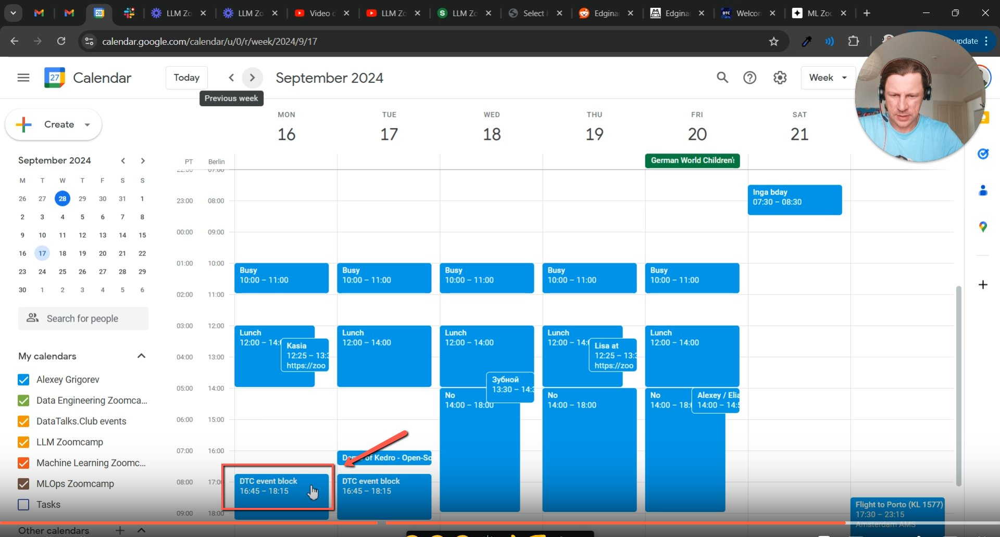
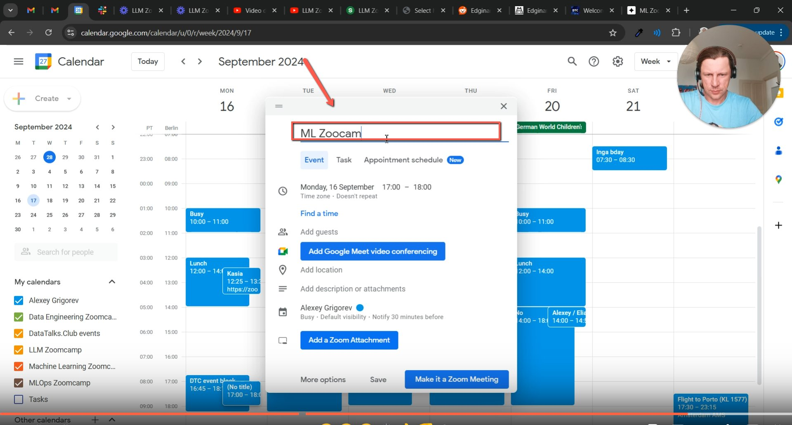
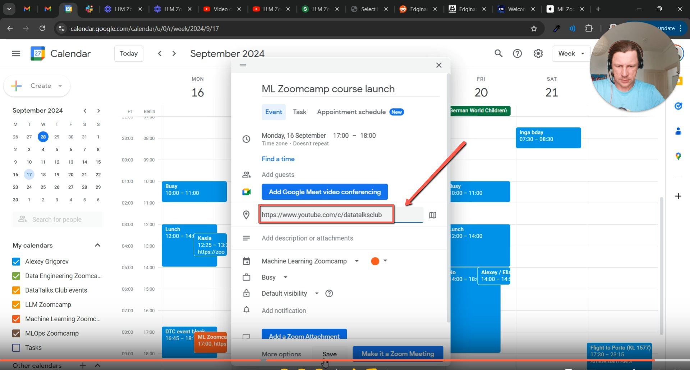
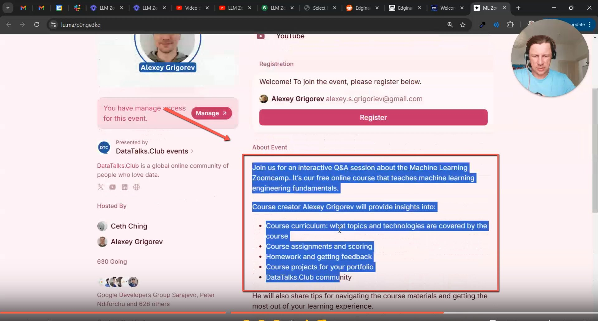
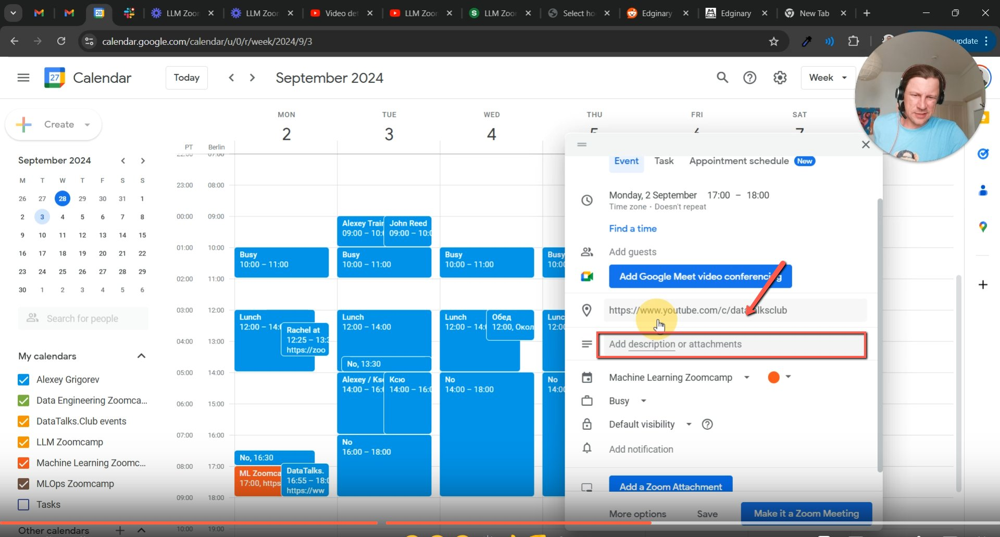
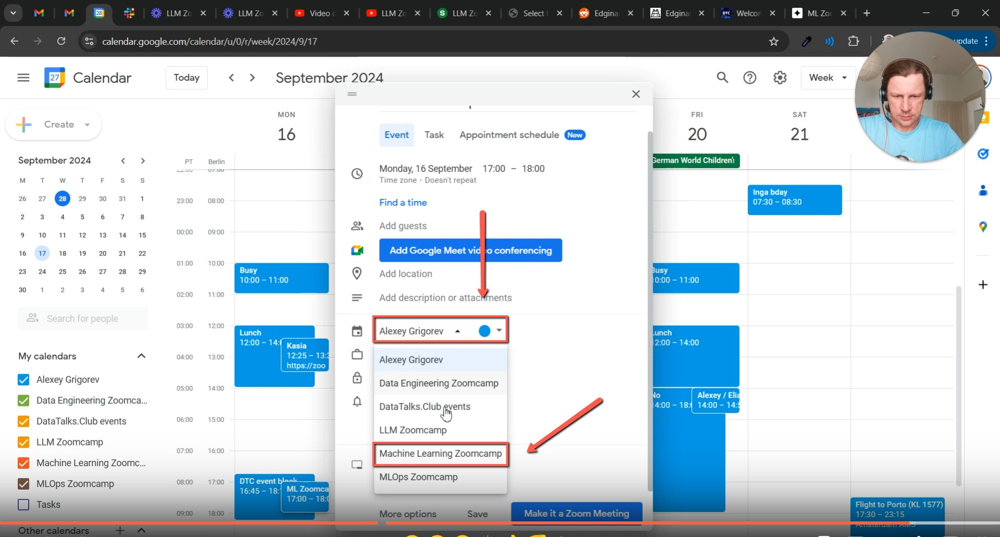
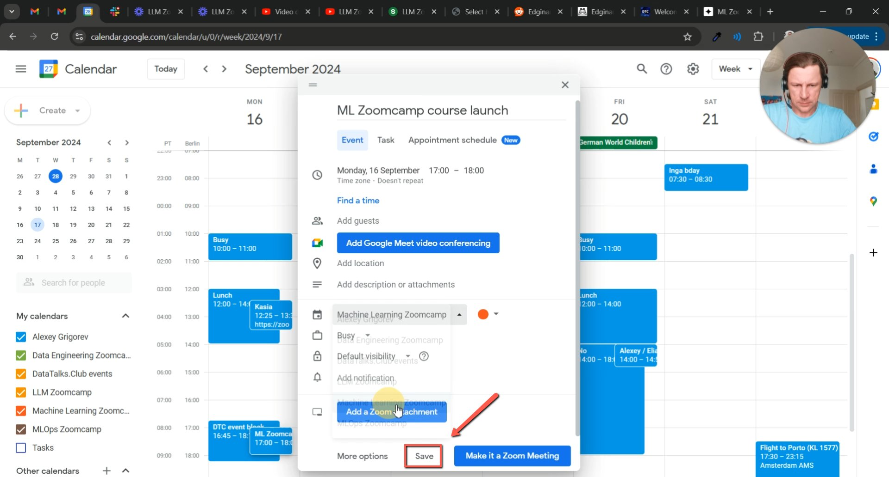

# Adding Events to Course Calendars

<!-- sop-section-start: summary -->
## Summary

- Purpose: Adding events to course calendars to notify participants and ensure they are aware of upcoming activities
- Outcome: This process ensures proper communication with course participants and maintains a well-organized calendar system for course-related events.
- Trigger: Whenever an event is scheduled for any course (e.g., Machine Learning Zoom Camp, Data Engineering Zoom Camp), it must be added to the corresponding course calendar.
- Frequency: Per course event.
<!-- sop-section-end -->

<!-- sop-section-start: prerequisites -->
## Prerequisites

- Access: Course Google Calendars.
- Tools: Google Calendar, Luma, YouTube.
- Inputs: Event title, date, time, course, stream link, and optional event page.
<!-- sop-section-end -->

<!-- sop-section-start: procedure -->
## Procedure

<!-- sop-group-start: "Setting Up the Event" -->
### Setting Up the Event

<!-- sop-step-start id=1 -->
1.  Open the Calendar Application, locate and click on the “block” with the corresponding time and date for the event.
    Image note: The screenshot shows the Google Calendar time block for the course event. Click the correct date and time slot before opening the full event editor.
<!-- sop-step-end -->

<!-- sop-step-start id=2 -->
2.  Another tab will open, add the name of the event on the first line.

    <!-- sop-screenshot-start -->
    
    <!-- sop-caption-start -->
    The screenshot shows the calendar event editor with the title field at the top. Enter the event name there so it appears clearly on the course calendar.
    <!-- sop-caption-end -->
    <!-- sop-screenshot-end -->
<!-- sop-step-end -->

<!-- sop-step-start id=3 -->
3.  Look for “Add location” and paste the standard youtube link: [https://www.youtube.com/c/DataTalksClub](https://www.youtube.com/c/DataTalksClub)

    <!-- sop-screenshot-start -->
    
    <!-- sop-caption-start -->
    The screenshot shows the Add location field in Google Calendar. Paste the standard DataTalks.Club YouTube URL there for course events streamed on YouTube.
    <!-- sop-caption-end -->
    <!-- sop-screenshot-end -->
<!-- sop-step-end -->

<!-- sop-step-start id=4 -->
4.  Go to [https://datatalks.club/events.html](https://datatalks.club/events.html) and select the event to be scheduled. It will bring you to the Luma site and proceed to copy the “About Event” description.

    <!-- sop-screenshot-start -->
    
    <!-- sop-caption-start -->
    The screenshot shows the DataTalks.Club events page leading to the Lu.ma event details. Use the Lu.ma About Event text as the source for the calendar description.
    <!-- sop-caption-end -->
    <!-- sop-screenshot-end -->
<!-- sop-step-end -->

<!-- sop-step-start id=5 -->
5.  Go back to the Calendar and Look for “Add description of attachments” and paste the copied description from Luma.

    <!-- sop-screenshot-start -->
    
    <!-- sop-caption-start -->
    The screenshot shows the calendar description area where the Lu.ma About Event text should be pasted. This gives course participants the event context directly in the invite.
    <!-- sop-caption-end -->
    <!-- sop-screenshot-end -->
<!-- sop-step-end -->

<!-- sop-step-start id=6 -->
6.  Look for the “calendar symbol” and select a course calendar relevant to the event ,such as *Machine Learning Zoom Camp* or *LLM Zoom Camp*.

    <!-- sop-screenshot-start -->
    
    <!-- sop-caption-start -->
    The screenshot shows the calendar selector used to choose the course-specific calendar. Select the matching course, such as Machine Learning Zoomcamp or LLM Zoomcamp, before saving.
    <!-- sop-caption-end -->
    <!-- sop-screenshot-end -->
<!-- sop-step-end -->

<!-- sop-step-start id=7 -->
7.  Verify the Selection, ensure the chosen calendar matches the course for which the event is intended, confirm the event details: title, time, location, and description are accurate and clear and click “Save” to finalize and notify calendar subscribers.

    <!-- sop-screenshot-start -->
    
    <!-- sop-caption-start -->
    The screenshot shows the completed calendar event before saving. Review the selected course calendar, title, time, YouTube location, and description so subscribers receive the correct event.
    <!-- sop-caption-end -->
    <!-- sop-screenshot-end -->
<!-- sop-step-end -->

<!-- sop-group-end -->
<!-- sop-section-end -->

<!-- sop-section-start: validation -->
## Validation

-
<!-- sop-section-end -->

<!-- sop-section-start: troubleshooting -->
## Troubleshooting

-
<!-- sop-section-end -->

<!-- sop-section-start: references -->
## References

-
<!-- sop-section-end -->
