# Create a calender invite for the guests speaker for an event

<!-- sop-section-start: summary -->
## Summary

- Purpose:
- Outcome:
- Trigger:
- Frequency:
<!-- sop-section-end -->

<!-- sop-section-start: prerequisites -->
## Prerequisites

- Access:
- Tools:
- Inputs:

Do first: [Select and propose a date for an event](https://docs.google.com/document/u/0/d/1USXNWAriIlK_AmbHSIR0qt3e0RC0aJh8GCSUJbq7-5k/edit)

What: Sending calendar invites to speakers for events.

Why: To make sure the speakers and Alexey have the event in their calendars and have quick access to the necessary information.

When: Immediately after agreeing on a date with the speaker, even if the topic is not yet finalized.
<!-- sop-section-end -->

<!-- sop-section-start: procedure -->
## Procedure

<!-- sop-group-start: "Create a calendar event" -->
### Create a calendar event

<!-- sop-step-start id=1 -->
1.  After the guest has confirmed the date, go to the Google Calendar: [https://calendar.google.com/calendar](https://calendar.google.com/calendar)

    <!-- sop-screenshot-start -->
    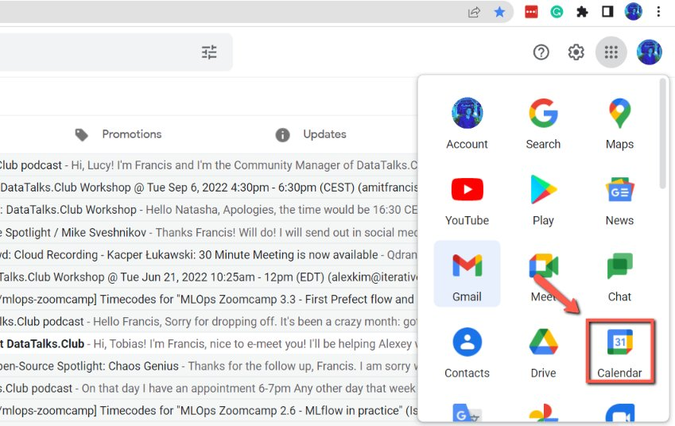
    <!-- sop-caption-start -->
    The screenshot shows Google Calendar as the starting point for creating the speaker invite. Use it after the guest has confirmed the date so the new event is created on the calendar, not in email or another tool.
    <!-- sop-caption-end -->
    <!-- sop-screenshot-end -->
<!-- sop-step-end -->

<!-- sop-step-start id=2 -->
2.  Then, Select the date of the event.
    Note: don’t edit the “DataTalks.Club Event” event, create a new one. The “DataTalks.Club Event” event is a blocker so nothing else could be scheduled in Alexey’s calendar.

    Also you should cross-check the date/time with Alexey’s calendar – to make sure he’s available. See more in [Alexey's Calendar](../../../internal-admin/reference/alexey-s-calendar.md)
    <!-- sop-screenshot-start -->
    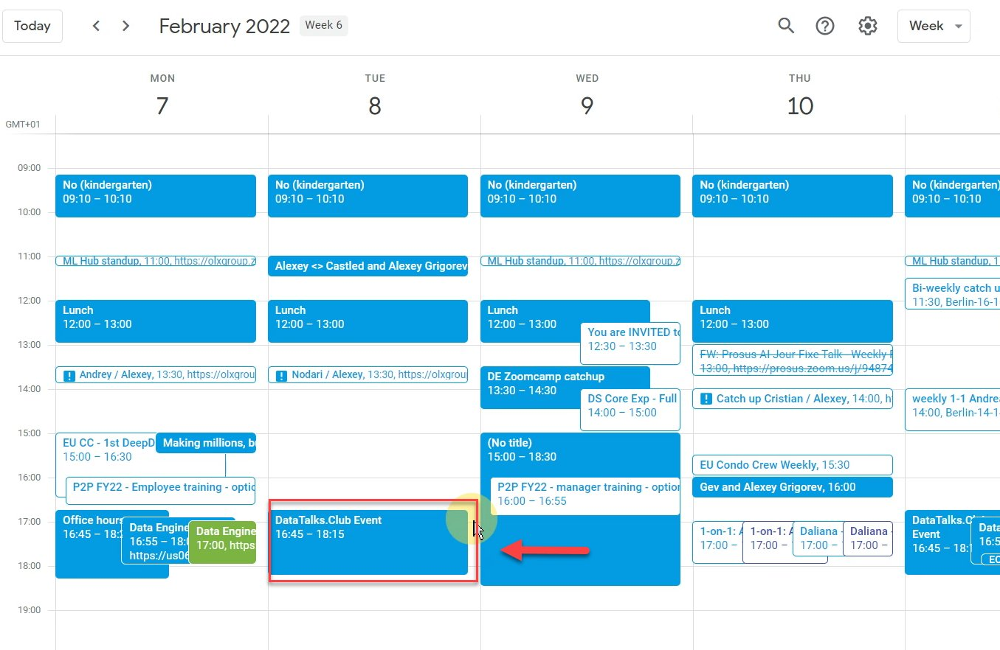
    <!-- sop-caption-start -->
    The screenshot shows the calendar view used to check the selected date and time against Alexey's availability. Create a separate event instead of editing the DataTalks.Club Event blocker.
    <!-- sop-caption-end -->
    <!-- sop-screenshot-end -->
<!-- sop-step-end -->

<!-- sop-step-start id=3 -->
3.  After selecting the date, click "More options" to add information

    <!-- sop-screenshot-start -->
    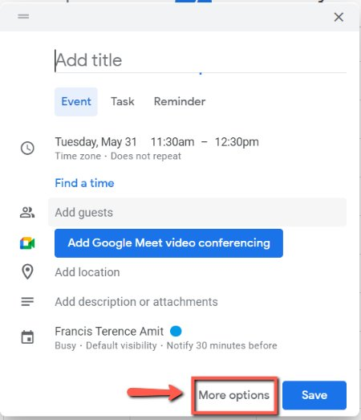
    <!-- sop-caption-start -->
    The screenshot shows the quick event popover with the More options button. Opening the full editor gives access to guests, description, location, and permissions.
    <!-- sop-caption-end -->
    <!-- sop-screenshot-end -->
<!-- sop-step-end -->

<!-- sop-group-end -->

<!-- sop-group-start: "Title, time, location" -->
### Title, time, location

<!-- sop-step-start id=4 -->
4.  Next, enter the title of the event
    Use these titles for the event:

    - *\<NAME\> at DataTalks.Club Podcast* - for podcast

    - *\<NAME\> at DataTalks.Club Webinar* - for the webinar

    - *\<NAME\> at DataTalks.Club Workshop* - for workshops

    Where \<NAME\> is the name of the guest, e.g. “Elena at DataTalks.Club webinar”

    Note: for proposed events just add the word “Proposed - \<NAME\> at DataTalks.Club podcast”

    <!-- sop-screenshot-start -->
    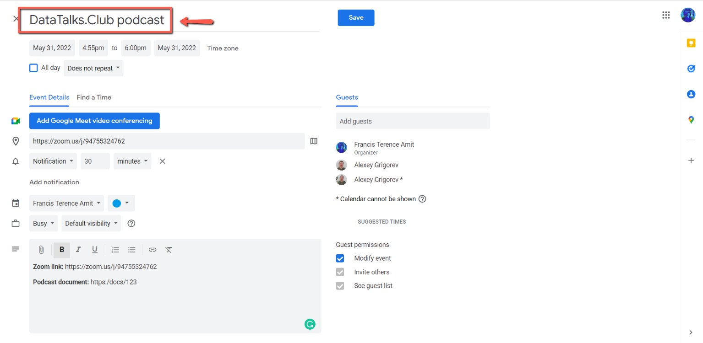
    <!-- sop-caption-start -->
    The screenshot shows the event title field using the guest-name format. It demonstrates how a title like "Elena at DataTalks.Club webinar" should appear in the calendar invite.
    <!-- sop-caption-end -->
    <!-- sop-screenshot-end -->
<!-- sop-step-end -->

<!-- sop-step-start id=5 -->
5.  Then, add the date and time of the event.

    Usual time:

    - 12:30 Berlin time for podcasts and webinars

    - 16:30 or 17:00 for workshops

    - We can do it at different times per speaker’s request

    Have an allowance of 5 minutes before the event for preparation. Thus, for a podcast it would be 12:25.
    Make sure the timezone is correct (Europe/Berlin)
    <!-- sop-screenshot-start -->
    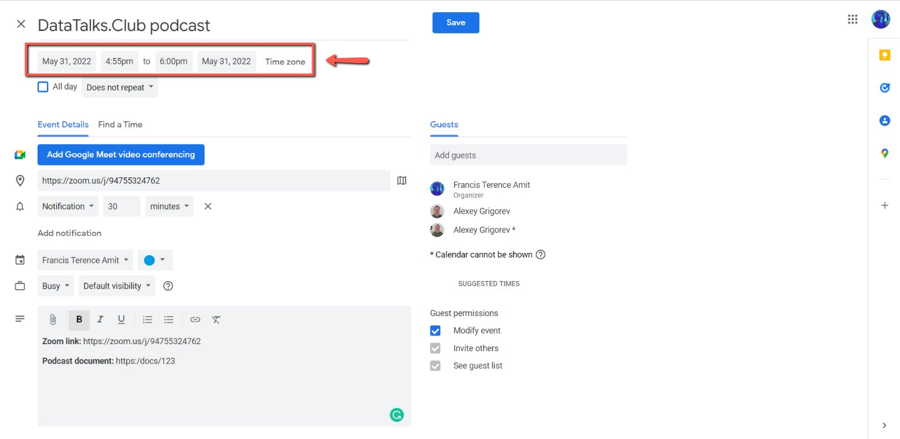
    <!-- sop-caption-start -->
    The screenshot shows the date, start time, end time, and timezone fields in the calendar editor. Confirm the timezone is Europe/Berlin before sending the invite.
    <!-- sop-caption-end -->
    <!-- sop-screenshot-end -->
<!-- sop-step-end -->

<!-- sop-step-start id=6 -->
6.  To proceed, enter the zoom link in "Add Location"

    The zoom link for events is always [https://zoom.us/j/94755324762](https://zoom.us/j/94755324762)

    <!-- sop-screenshot-start -->
    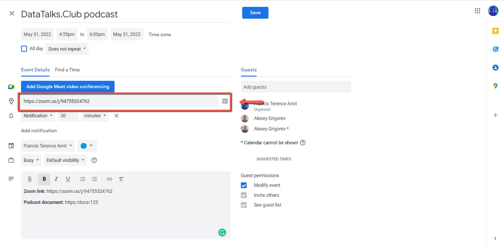
    <!-- sop-caption-start -->
    The screenshot shows the location field populated with the standard DataTalks.Club Zoom link. This keeps the invite location consistent and avoids adding a Google Meet room.
    <!-- sop-caption-end -->
    <!-- sop-screenshot-end -->

    Note: Ensure that the invite contains only the Zoom link and no Google Meet link to avoid any confusion.

    6.a In case a Google Meet link is included in the invite, remove it by clicking on the pencil (edit) icon of the event.

    Replace \<TODO\> with the actual podcast event sample
    <!-- sop-screenshot-start -->
    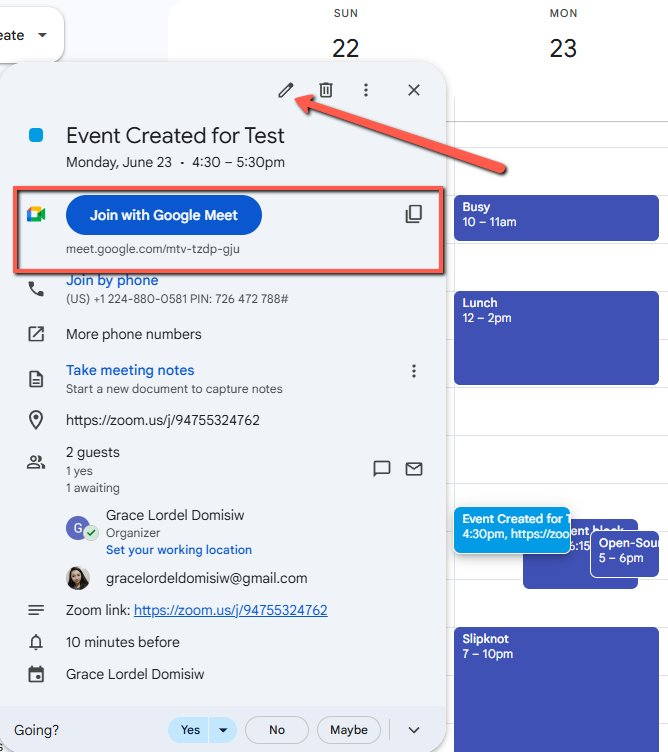
    <!-- sop-caption-start -->
    The screenshot shows a calendar event that has an unwanted Google Meet conference attached. Use the edit view to remove that Meet link before saving.
    <!-- sop-caption-end -->
    <!-- sop-screenshot-end -->

    6.b Click on the “X” icon.
    <!-- sop-screenshot-start -->
    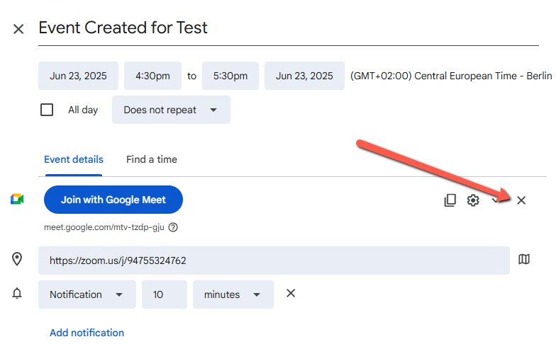
    <!-- sop-caption-start -->
    The screenshot shows the X control next to the Google Meet conferencing block. Clicking it removes the Meet room so attendees use the Zoom link instead.
    <!-- sop-caption-end -->
    <!-- sop-screenshot-end -->

    6.c Click the blue “Save” button.
    <!-- sop-screenshot-start -->
    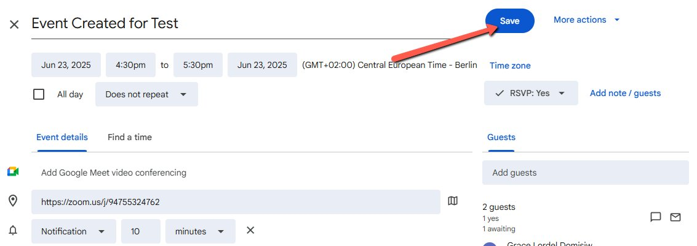
    <!-- sop-caption-start -->
    The screenshot shows the blue Save button after removing the Google Meet link. Save applies the conferencing change to the calendar event.
    <!-- sop-caption-end -->
    <!-- sop-screenshot-end -->

    6.d On the pop up notification, click on “Send”.
    <!-- sop-screenshot-start -->
    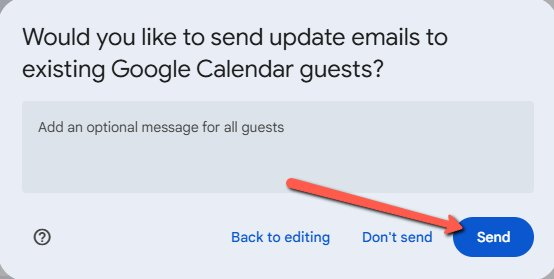
    <!-- sop-caption-start -->
    The screenshot shows the Google Calendar notification prompt after saving changes. Choose Send so guests receive the updated invite without the Meet link.
    <!-- sop-caption-end -->
    <!-- sop-screenshot-end -->
<!-- sop-step-end -->

<!-- sop-group-end -->

<!-- sop-group-start: "Adding guests and Alexey, adding description" -->
### Adding guests and Alexey, adding description

<!-- sop-step-start id=7 -->
7.  Don't forget to add the email of the guest(s) in "Add guests" and check the box "Modify events"
    Note: Make sure to add both accounts of Alexey:
    [alexey.s.grigoriev@gmail.com](mailto:alexey.s.grigoriev@gmail.com)
    [alexey@datatalks.club](mailto:alexey@datatalks.club)
    <!-- sop-screenshot-start -->
    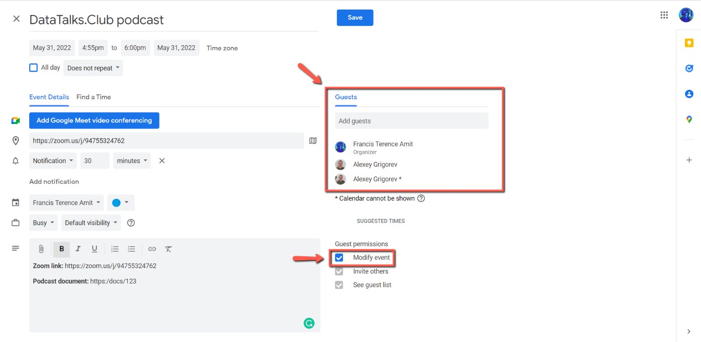
    <!-- sop-caption-start -->
    The screenshot shows the Add guests area with Alexey's required accounts and guest permissions. Include both Alexey addresses and the speaker email, then allow guests to modify the event.
    <!-- sop-caption-end -->
    <!-- sop-screenshot-end -->
<!-- sop-step-end -->

<!-- sop-step-start id=8 -->
8.  In the "Add description" box, add the zoom link and the podcast document for a podcast or the outline document for workshops.
    Follow this format

    Zoom link: [https://zoom.us/j/94755324762](https://zoom.us/j/94755324762)

    Podcast document: \<TODO\>

    Replace \<TODO\> with the actual podcast document
    <!-- sop-screenshot-start -->
    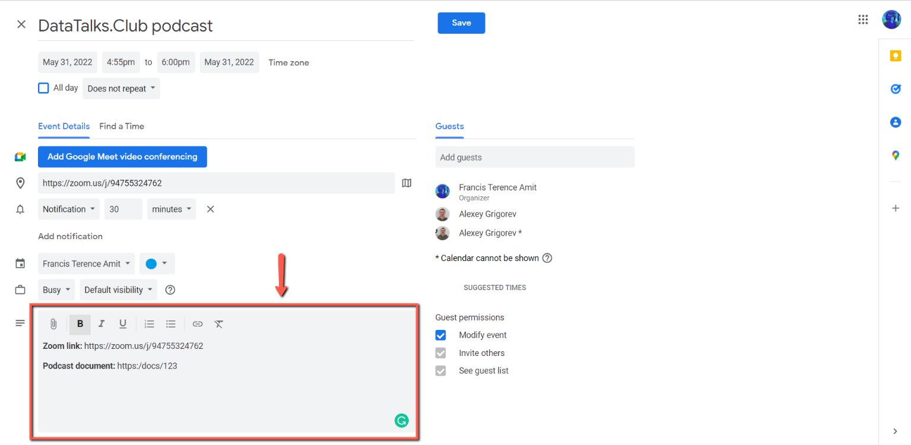
    <!-- sop-caption-start -->
    The screenshot shows the description field with the Zoom link and podcast or outline document link. Replace the placeholder with the real working document before sending.
    <!-- sop-caption-end -->
    <!-- sop-screenshot-end -->
<!-- sop-step-end -->

<!-- sop-step-start id=9 -->
9.  Once done, review the necessary information about the event. Make sure we didn’t forget anything.

    And that the guest is also there (Note that on the screenshot they aren’t added)
    <!-- sop-screenshot-start -->
    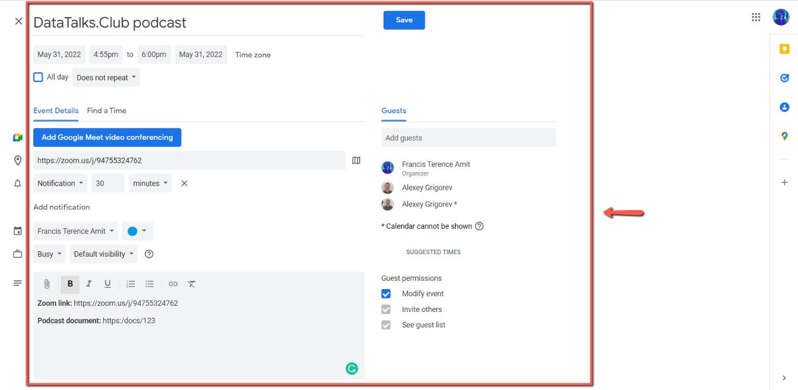
    <!-- sop-caption-start -->
    The screenshot shows the final calendar event review screen. Use it to check the title, Zoom location, description links, Alexey's accounts, and the speaker guest list before saving.
    <!-- sop-caption-end -->
    <!-- sop-screenshot-end -->
<!-- sop-step-end -->

<!-- sop-step-start id=10 -->
10. After reviewing, click save

    <!-- sop-screenshot-start -->
    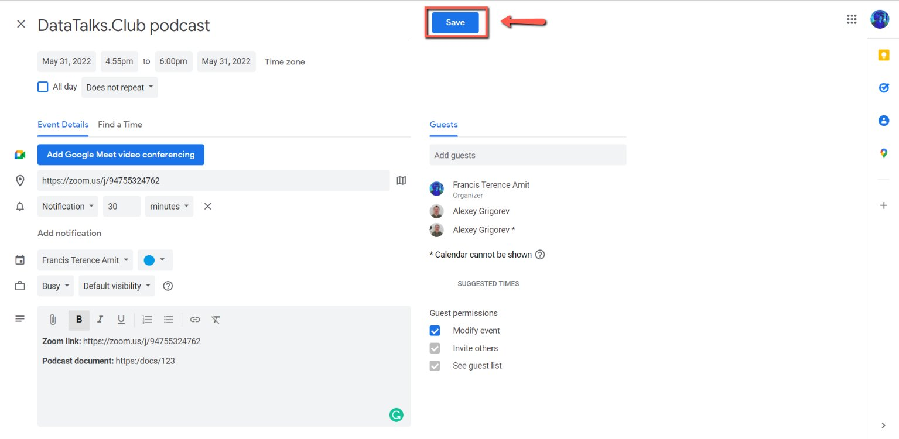
    <!-- sop-caption-start -->
    The screenshot shows the Save action in the calendar event editor. Click it after the invite details and guest list are complete.
    <!-- sop-caption-end -->
    <!-- sop-screenshot-end -->
<!-- sop-step-end -->

<!-- sop-step-start id=11 -->
11. Lastly, select "Send"

    <!-- sop-screenshot-start -->
    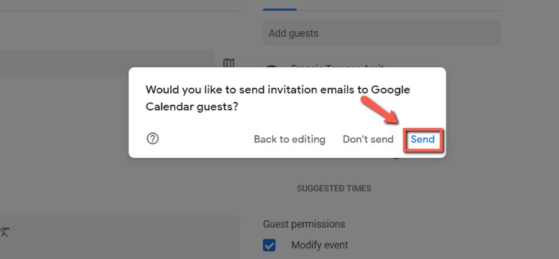
    <!-- sop-caption-start -->
    The screenshot shows the prompt asking whether to email guests about the calendar invite. Select Send so the speaker and Alexey receive the event.
    <!-- sop-caption-end -->
    <!-- sop-screenshot-end -->
<!-- sop-step-end -->

<!-- sop-group-end -->
<!-- sop-section-end -->

<!-- sop-section-start: validation -->
## Validation

-
<!-- sop-section-end -->

<!-- sop-section-start: troubleshooting -->
## Troubleshooting

-
<!-- sop-section-end -->

<!-- sop-section-start: references -->
## References

-
<!-- sop-section-end -->
