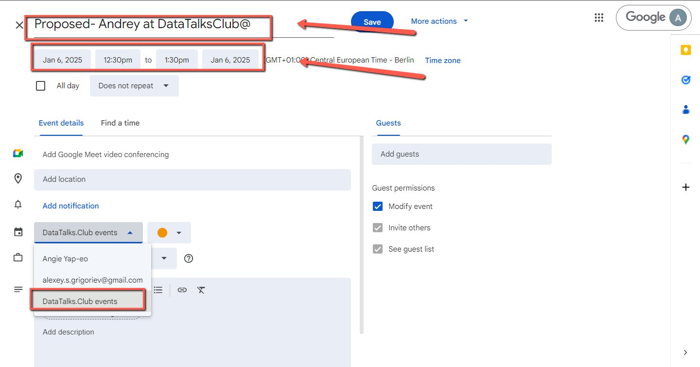
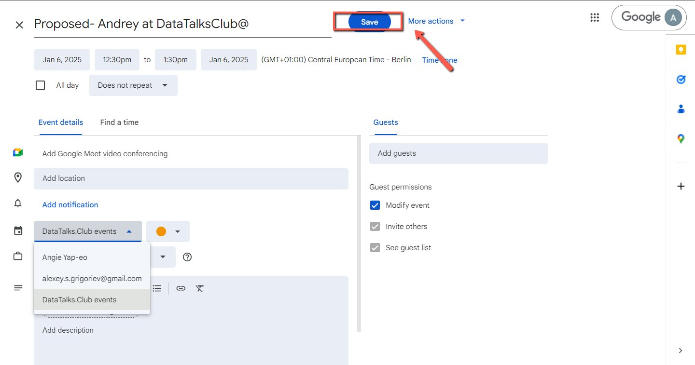
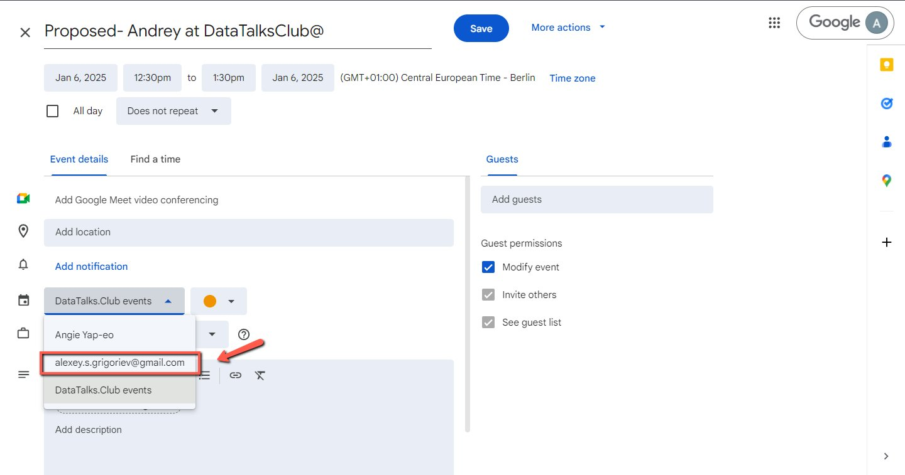
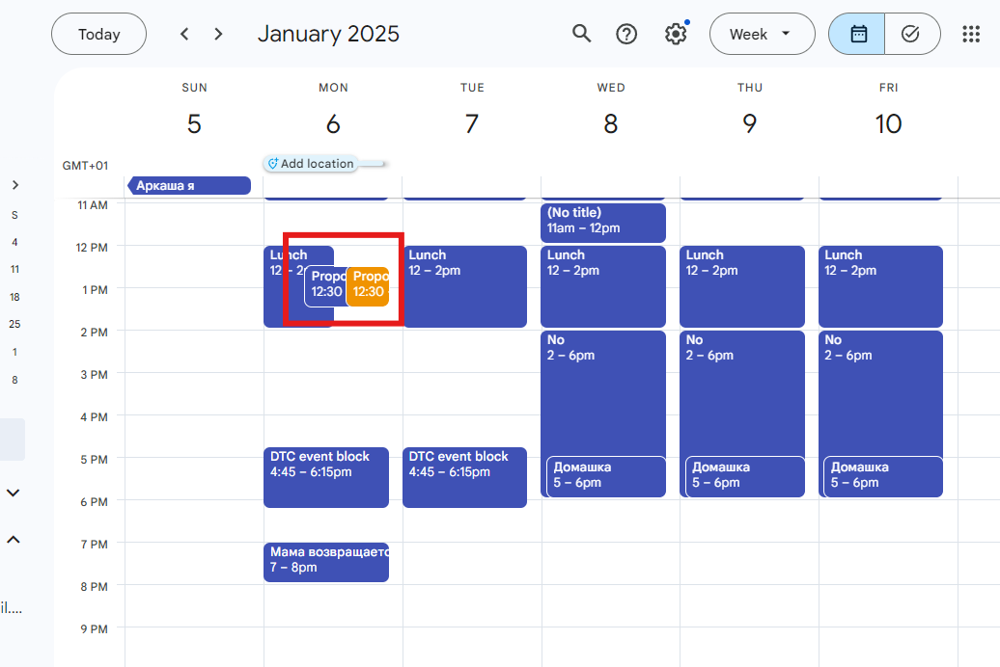

# Creating Tentative Event on Google Calendar

<!-- sop-section-start: summary -->
## Summary

- Purpose: Create a proposed event block on Google Calendar
- Outcome: To tentatively block the schedule
- Trigger: When proposing events for speakers
- Frequency:
<!-- sop-section-end -->

<!-- sop-section-start: prerequisites -->
## Prerequisites

- Access:
- Tools:
- Inputs:
<!-- sop-section-end -->

<!-- sop-section-start: procedure -->
## Procedure

<!-- sop-step-start id=1 -->
1.  On the Google calendar, click the time and date of the event.

    Note: Make sure that the time and date should be on CET.
    <!-- sop-screenshot-start -->
    
    <!-- sop-caption-start -->
    The screenshot shows the Google Calendar time slot where the tentative event block starts. Pick the proposed date and CET time before filling in the event details.
    <!-- sop-caption-end -->
    <!-- sop-screenshot-end -->
<!-- sop-step-end -->

<!-- sop-step-start id=2 -->
2.  And then, make sure to select “DataTalks.Club event” calendar
    <!-- sop-screenshot-start -->
    
    <!-- sop-caption-start -->
    The screenshot shows the calendar selector set to DataTalks.Club event. Use that calendar for the proposed block so it appears in the shared event schedule.
    <!-- sop-caption-end -->
    <!-- sop-screenshot-end -->
<!-- sop-step-end -->

<!-- sop-step-start id=3 -->
3.  And then, add the proposed event schedule and details.
    <!-- sop-screenshot-start -->
    
    <!-- sop-caption-start -->
    The screenshot shows the tentative event details being entered in the calendar editor. Include the proposed title and schedule before saving the block.
    <!-- sop-caption-end -->
    <!-- sop-screenshot-end -->
<!-- sop-step-end -->

<!-- sop-step-start id=4 -->
4.  Click “Save”.

    <!-- sop-screenshot-start -->
    
    <!-- sop-caption-start -->
    The screenshot shows the Save button for the tentative Google Calendar event. Saving creates the first proposed block on the selected calendar.
    <!-- sop-caption-end -->
    <!-- sop-screenshot-end -->

    Note: Do not forget to also create one under “[alexey.s.grigoriev@gmail.com](mailto:alexey.s.grigoriev@gmail.com)” and there should be two proposed blocks on Google Calendar

    <!-- sop-screenshot-start -->
    
    <!-- sop-caption-start -->
    The screenshot shows the second proposed block needed on Alexey's calendar. This duplicate hold keeps both calendars reserved for the same tentative event.
    <!-- sop-caption-end -->
    <!-- sop-screenshot-end -->

    <!-- sop-screenshot-start -->
    
    <!-- sop-caption-start -->
    The screenshot shows the calendar after the tentative blocks are created. Use it to confirm that both proposed event holds appear at the intended time.
    <!-- sop-caption-end -->
    <!-- sop-screenshot-end -->
<!-- sop-step-end -->
<!-- sop-section-end -->

<!-- sop-section-start: validation -->
## Validation

-
<!-- sop-section-end -->

<!-- sop-section-start: troubleshooting -->
## Troubleshooting

-
<!-- sop-section-end -->

<!-- sop-section-start: references -->
## References

-
<!-- sop-section-end -->
