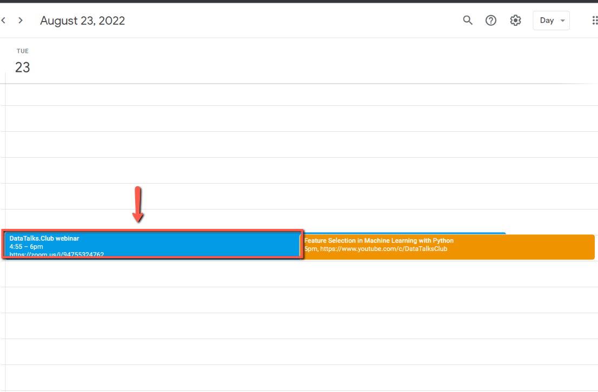
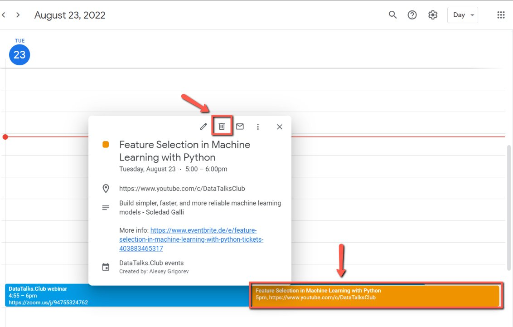
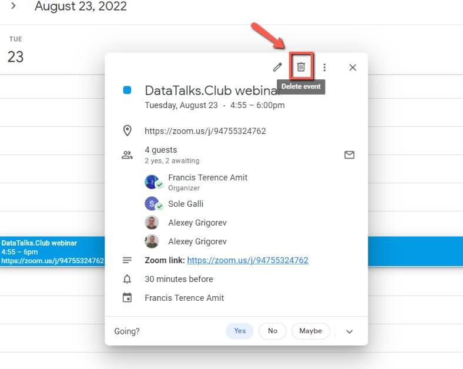

# Canceling a Calendar Invite

<!-- sop-section-start: summary -->
## Summary

- Purpose:
- Outcome:
- Trigger:
- Frequency:
<!-- sop-section-end -->

<!-- sop-section-start: prerequisites -->
## Prerequisites

- Access:
- Tools:
- Inputs:
<!-- sop-section-end -->

<!-- sop-section-start: procedure -->
## Procedure

<!-- sop-prose-start -->
How to Cancel a Calendar invite
This procedure will show you the steps on how to Cancel a Calendar invite

Step-by-step Instructions
<!-- sop-prose-end -->

<!-- sop-step-start id=1 -->
1.  The first thing you need to do is click the calendar invite.

    <!-- sop-screenshot-start -->
    
    <!-- sop-caption-start -->
    This screenshot anchors step 1 of the Canceling a Calendar Invite process by showing the screen for click the calendar invite. Look for the red box or arrow around Invite, then use that highlighted area as the target for the action before continuing.
    <!-- sop-caption-end -->
    <!-- sop-screenshot-end -->
<!-- sop-step-end -->

<!-- sop-step-start id=2 -->
2. Click the calendar invite for the event and delete it.

   <!-- sop-screenshot-start -->
   
   <!-- sop-caption-start -->
   This screenshot anchors step 2 of the Canceling a Calendar Invite process by showing the screen for deleting the event's calendar invite. Look for the red box or arrow around Invite, then use that highlighted area as the target for the action before continuing.
   <!-- sop-caption-end -->
   <!-- sop-screenshot-end -->
<!-- sop-step-end -->

<!-- sop-step-start id=3 -->
3.  And then, select “Delete event”

    <!-- sop-screenshot-start -->
    
    <!-- sop-caption-start -->
    This screenshot anchors step 3 of the Canceling a Calendar Invite process by showing the screen for , select "Delete event". Look for the red box or arrow around "Delete event", then use that highlighted area as the target for the action before continuing.
    <!-- sop-caption-end -->
    <!-- sop-screenshot-end -->
<!-- sop-step-end -->
<!-- sop-section-end -->

<!-- sop-section-start: validation -->
## Validation

-
<!-- sop-section-end -->

<!-- sop-section-start: troubleshooting -->
## Troubleshooting

-
<!-- sop-section-end -->

<!-- sop-section-start: references -->
## References

-
<!-- sop-section-end -->
