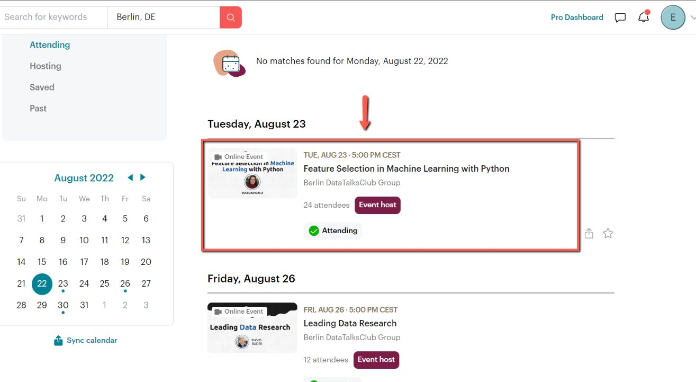
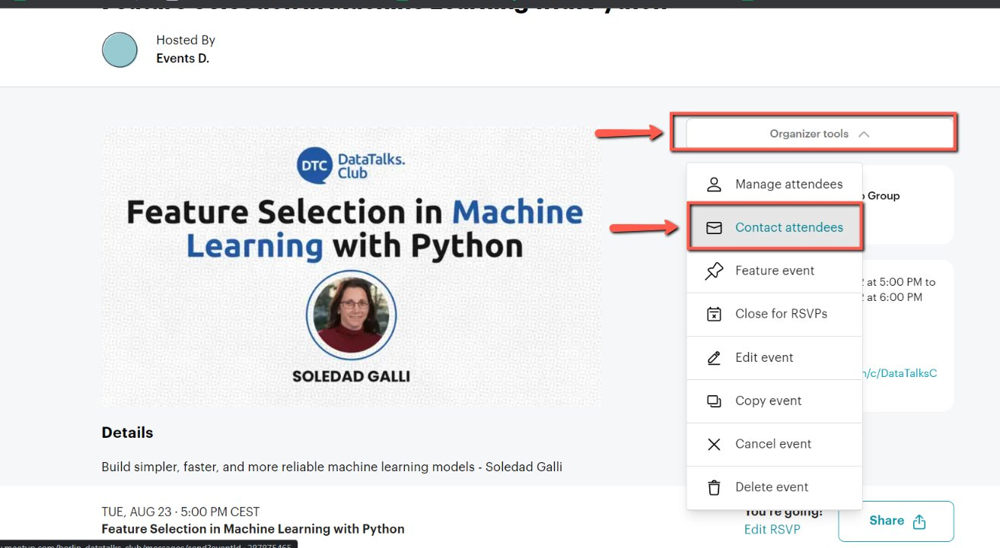
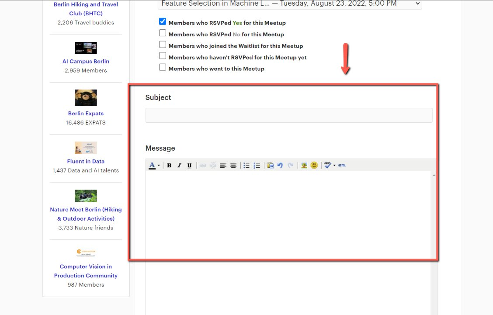
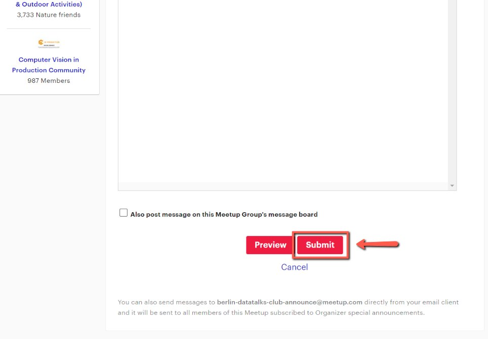
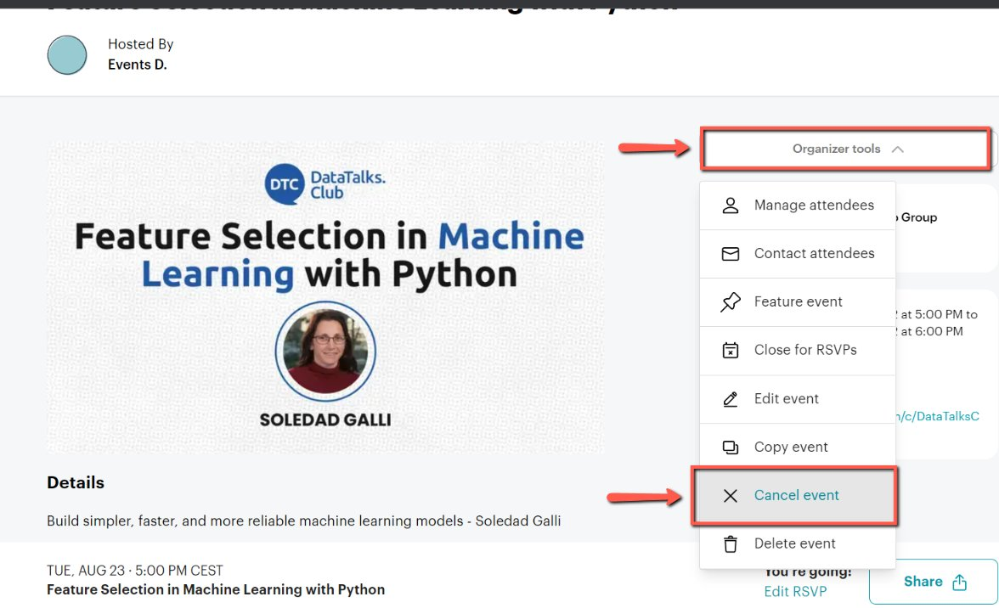

# Canceling Events on Meetup

<!-- sop-section-start: summary -->
## Summary

- Purpose:
- Outcome:
- Trigger:
- Frequency:
<!-- sop-section-end -->

<!-- sop-section-start: prerequisites -->
## Prerequisites

- Access:
- Tools:
- Inputs:
<!-- sop-section-end -->

<!-- sop-section-start: procedure -->
## Procedure

<!-- sop-prose-start -->
How to Cancel Events on Meetup
This procedure will show you the steps on how to Cancel Events on Meetup

Step-by-step Instructions
<!-- sop-prose-end -->

<!-- sop-step-start id=1 -->
1.  The first thing you need to do is click the event on Meetup

    <!-- sop-screenshot-start -->
    
    <!-- sop-caption-start -->
    This screenshot anchors step 1 of the Canceling Events on Meetup process by showing the screen for click the event on Meetup. Look for the red box, arrow, selected row, or highlighted screen area, then use that highlighted area as the target for the action before continuing.
    <!-- sop-caption-end -->
    <!-- sop-screenshot-end -->
<!-- sop-step-end -->

<!-- sop-step-start id=2 -->
2.  And then select the “Organizer tools” dropdown list and click “Contact Attendees”

    <!-- sop-screenshot-start -->
    
    <!-- sop-caption-start -->
    This screenshot anchors step 2 of the Canceling Events on Meetup process by showing the screen for select the "Organizer tools" dropdown list and click "Contact Attendees". Look for the red boxes or arrows around "Organizer tools", "Contact Attendees", then use that highlighted area as the target for the action before continuing.
    <!-- sop-caption-end -->
    <!-- sop-screenshot-end -->
<!-- sop-step-end -->

<!-- sop-step-start id=3 -->
3.  Then, edit the subject and message of the email.

    Note: Use this [template](https://docs.google.com/document/d/1-bPKXblRq9B-K7nJHRgoXk5yI50v5QE3If3MsU3wV6U/edit?usp=sharing) for the message of the email.

    <!-- sop-screenshot-start -->
    
    <!-- sop-caption-start -->
    This screenshot anchors step 3 of the Canceling Events on Meetup process by showing the screen for edit the subject and message of the email. Look for the red box or arrow around Edit, then use that highlighted area as the target for the action before continuing.
    <!-- sop-caption-end -->
    <!-- sop-screenshot-end -->
<!-- sop-step-end -->

<!-- sop-step-start id=4 -->
4.  Once done, click “Submit”

    <!-- sop-screenshot-start -->
    
    <!-- sop-caption-start -->
    This screenshot anchors step 4 of the Canceling Events on Meetup process by showing the screen for click "Submit". Look for the red box or arrow around "Submit", then use that highlighted area as the target for the action before continuing.
    <!-- sop-caption-end -->
    <!-- sop-screenshot-end -->
<!-- sop-step-end -->

<!-- sop-step-start id=5 -->
5.  After, go back to the event page, click the “Organizer tools” dragdown list and select “Cancel event”

    <!-- sop-screenshot-start -->
    
    <!-- sop-caption-start -->
    This screenshot anchors step 5 of the Canceling Events on Meetup process by showing the screen for go back to the event page, click the "Organizer tools" dragdown list and select "Cancel event". Look for the red boxes or arrows around "Organizer tools", "Cancel event", then use that highlighted area as the target for the action before continuing.
    <!-- sop-caption-end -->
    <!-- sop-screenshot-end -->
<!-- sop-step-end -->
<!-- sop-section-end -->

<!-- sop-section-start: validation -->
## Validation

-
<!-- sop-section-end -->

<!-- sop-section-start: troubleshooting -->
## Troubleshooting

-
<!-- sop-section-end -->

<!-- sop-section-start: references -->
## References

-
<!-- sop-section-end -->
