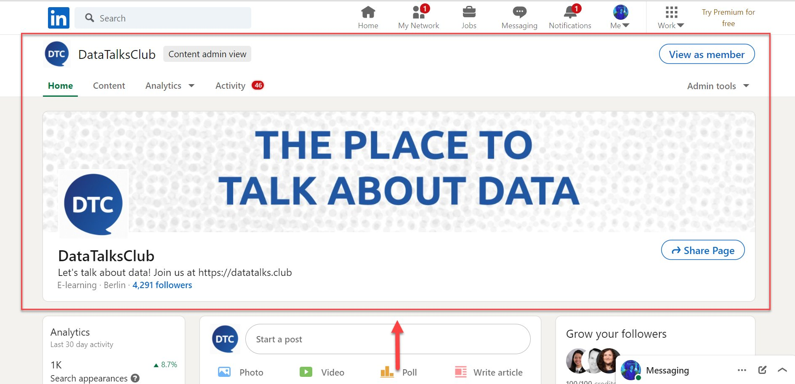
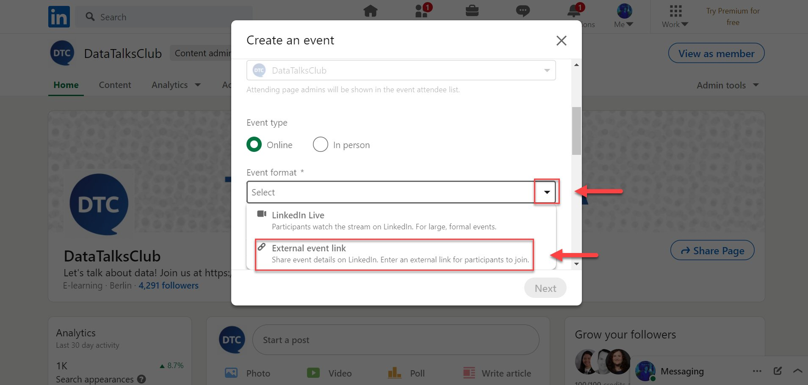
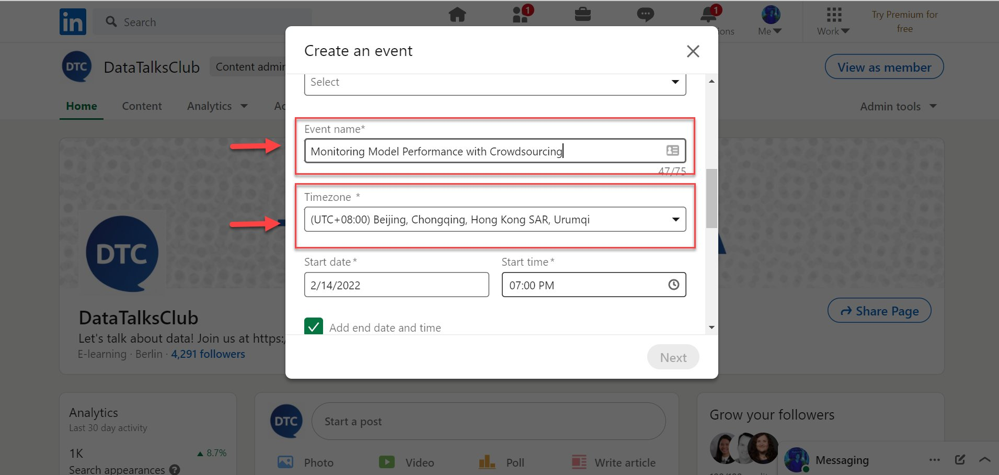
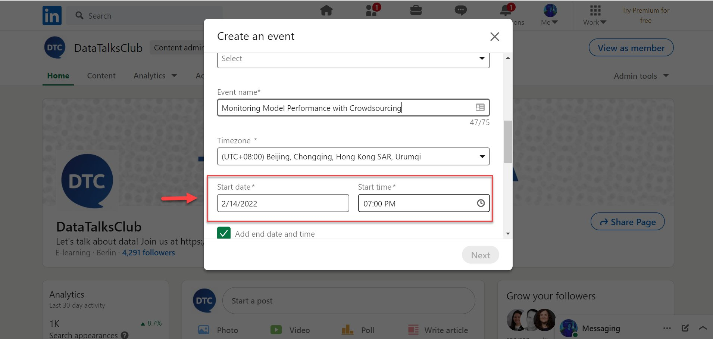
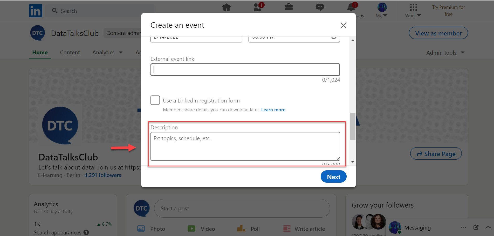
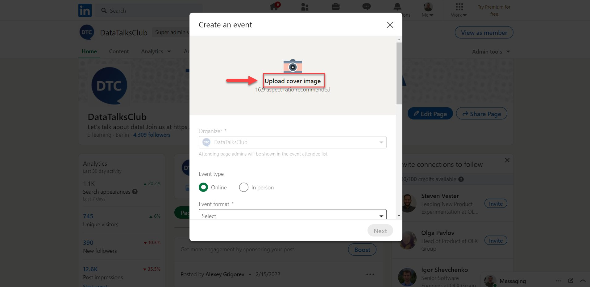
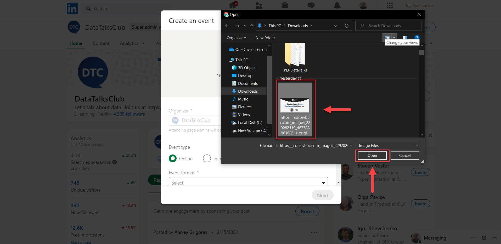
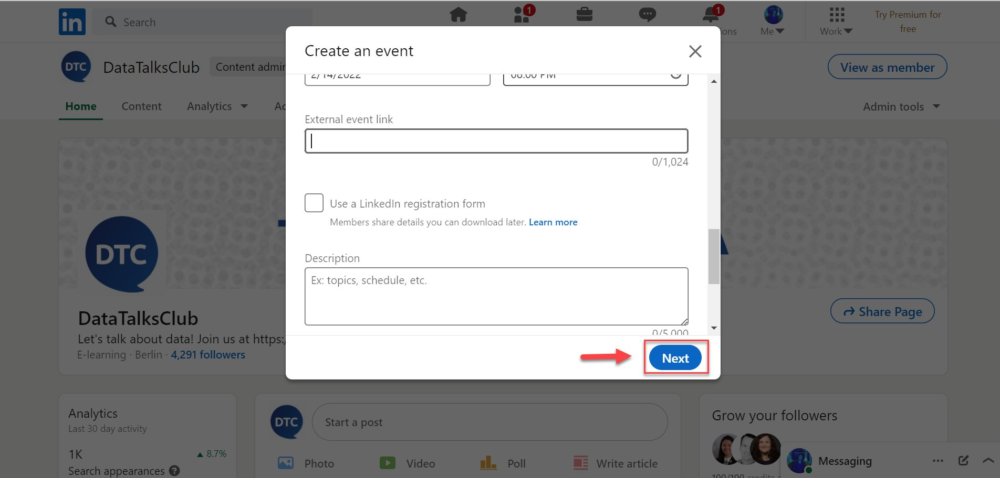
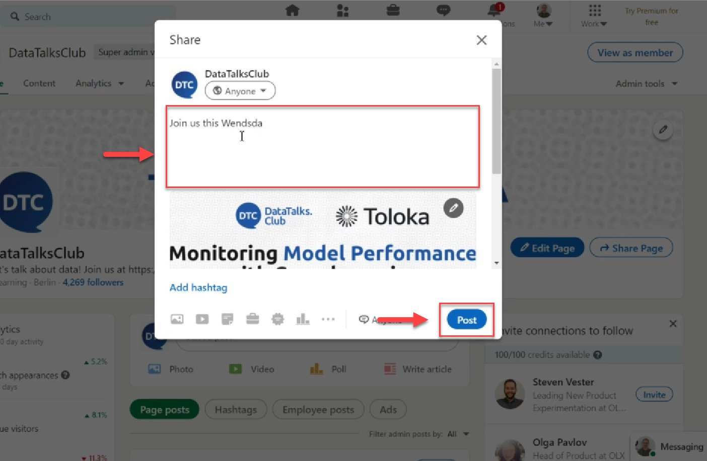
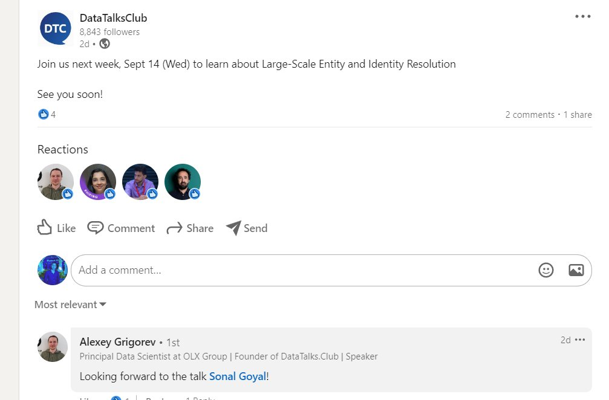

# Create events on LinkedIn

<!-- sop-section-start: summary -->
## Summary

- Purpose: Create and announce DataTalks.Club events on LinkedIn.
- Outcome: The LinkedIn event is published with the correct details and post.
- Trigger: An event needs LinkedIn promotion.
- Frequency: Per event.
<!-- sop-section-end -->

<!-- sop-section-start: prerequisites -->
## Prerequisites

- Access: DataTalks.Club LinkedIn page admin access.
- Tools: LinkedIn, Luma or Meetup, YouTube.
- Inputs: Event link, title, date, time, description, speaker details, and cover image.
<!-- sop-section-end -->

<!-- sop-section-start: procedure -->
## Procedure

<!-- sop-prose-start -->
How to create events on LinkedIn
This procedure will show you the steps on how to create events on LinkedIn. For announcing events on LinkedIn, announce the event 2 days after the Luma or Meetup announcement if it's more than one week from the announcement day. If it is less than a week, announce it on the next day.

Step-by-step Instructions
<!-- sop-prose-end -->

<!-- sop-step-start id=1 -->
1.  The first need you will be doing is to visit the DataTalksClub LinkedIn account- viewed as an admin.

    <!-- sop-screenshot-start -->
    
    <!-- sop-caption-start -->
    The screenshot shows the DataTalks.Club LinkedIn page in admin view. Use the Admin tools menu from this page to start creating the LinkedIn event.
    <!-- sop-caption-end -->
    <!-- sop-screenshot-end -->

    Next, click "Admin tools" and select "Create an event"
<!-- sop-step-end -->

<!-- sop-step-start id=2 -->
2.  And then, click the drag-down button under "Event Format" and select "External event link"

    <!-- sop-screenshot-start -->
    
    <!-- sop-caption-start -->
    The screenshot shows the Event Format dropdown with External event link selected. This format lets the LinkedIn event point attendees to the external DataTalks.Club event page or stream.
    <!-- sop-caption-end -->
    <!-- sop-screenshot-end -->
<!-- sop-step-end -->

<!-- sop-step-start id=3 -->
3.  Afterward, type the event name and select your timezone

    Note: In this example, the event name is "Monitoring Model Performance with Crowdsourcing”

    <!-- sop-screenshot-start -->
    
    <!-- sop-caption-start -->
    The screenshot shows the LinkedIn event name and timezone fields. Enter the event title and choose the correct timezone before setting the date and time.
    <!-- sop-caption-end -->
    <!-- sop-screenshot-end -->
<!-- sop-step-end -->

<!-- sop-step-start id=4 -->
4.  Next, select the start date and the end time of the event.

    <!-- sop-screenshot-start -->
    
    <!-- sop-caption-start -->
    The screenshot shows LinkedIn's start date and end time controls. Match these values to the source event so LinkedIn shows the correct schedule.
    <!-- sop-caption-end -->
    <!-- sop-screenshot-end -->

    For the External event link, paste the [Youtube URL of DataTalksClub](https://www.youtube.com/datatalksclub).
<!-- sop-step-end -->

<!-- sop-step-start id=5 -->
5.  And for the "Description", copy the description of the event from Luma or Meetup.

    Note: You can edit the format of the description of the event like justifications, spacing etc.

    <!-- sop-screenshot-start -->
    
    <!-- sop-caption-start -->
    The screenshot shows the Description field in the LinkedIn event form. Paste the event description from Luma or Meetup and clean up spacing before moving on.
    <!-- sop-caption-end -->
    <!-- sop-screenshot-end -->

    And then, type the name of the speaker under "Speakers"
<!-- sop-step-end -->

<!-- sop-step-start id=6 -->
6.  After typing the name of the speaker, attach the banner of the event by clicking
    "Upload cover image"
    <!-- sop-screenshot-start -->
    
    <!-- sop-caption-start -->
    The screenshot shows the Upload cover image button after entering speaker information. Use it to attach the event banner to the LinkedIn event.
    <!-- sop-caption-end -->
    <!-- sop-screenshot-end -->
<!-- sop-step-end -->

<!-- sop-step-start id=7 -->
7.  After clicking "Upload cover image", select the picture on your computer and click "open"

    Note: You can edit and crop the picture.

    <!-- sop-screenshot-start -->
    
    <!-- sop-caption-start -->
    The screenshot shows the file picker for selecting the LinkedIn cover image. Choose the correct local banner and open it for upload and cropping.
    <!-- sop-caption-end -->
    <!-- sop-screenshot-end -->
<!-- sop-step-end -->

<!-- sop-step-start id=8 -->
8.  And then, click "Next"

    <!-- sop-screenshot-start -->
    
    <!-- sop-caption-start -->
    The screenshot shows the LinkedIn event preview with the Next button. Continue only after the cover image and event details look correct.
    <!-- sop-caption-end -->
    <!-- sop-screenshot-end -->
<!-- sop-step-end -->

<!-- sop-step-start id=9 -->
9.  After clicking, add more description for your event by typing in the space
    Provided and click “Post”

    <!-- sop-screenshot-start -->
    
    <!-- sop-caption-start -->
    The screenshot shows the final LinkedIn post composer for announcing the event. Add the announcement text in the provided space, then post it.
    <!-- sop-caption-end -->
    <!-- sop-screenshot-end -->
<!-- sop-step-end -->

<!-- sop-step-start id=10 -->
10. After you announced it, comment on the posted event using Alexey’s Account.

    Note: Here’s are some example of variations of the comment:

    - “Cool stuff”
    - “Looking forward to the talk \<NAME OF THE SPEAKER\>”
    - ‘Looking forward to it!’
    - “Looking forward to the chat \<NAME OF THE SPEAKER\>”
    - “See you next week, \<NAME OF THE SPEAKER\>”

    <!-- sop-screenshot-start -->
    
    <!-- sop-caption-start -->
    The screenshot shows an example comment on the published LinkedIn event from Alexey's account. Use a short, natural comment that references the speaker or event.
    <!-- sop-caption-end -->
    <!-- sop-screenshot-end -->
<!-- sop-step-end -->
<!-- sop-section-end -->

<!-- sop-section-start: validation -->
## Validation

-
<!-- sop-section-end -->

<!-- sop-section-start: troubleshooting -->
## Troubleshooting

-
<!-- sop-section-end -->

<!-- sop-section-start: references -->
## References

-
<!-- sop-section-end -->
