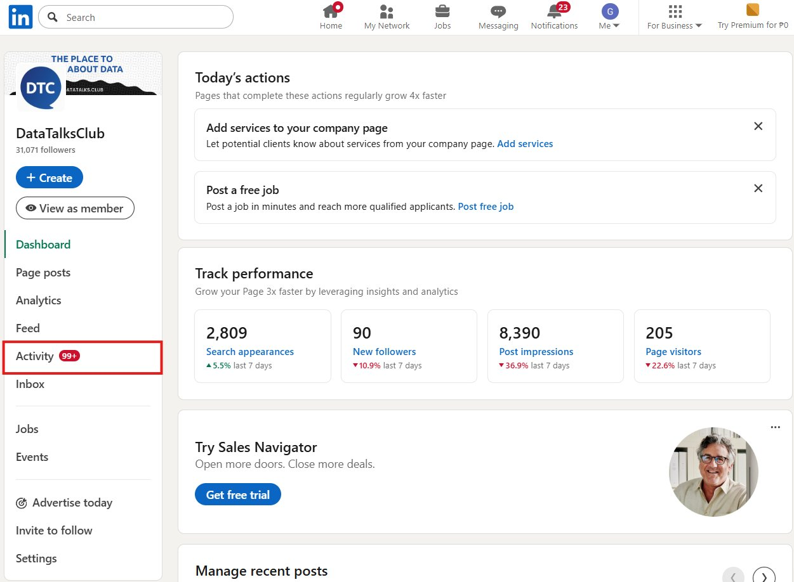
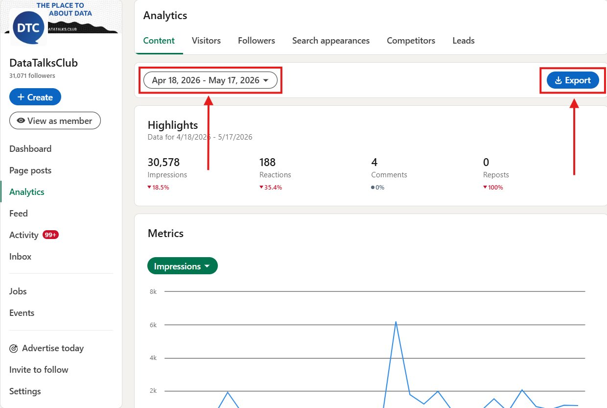
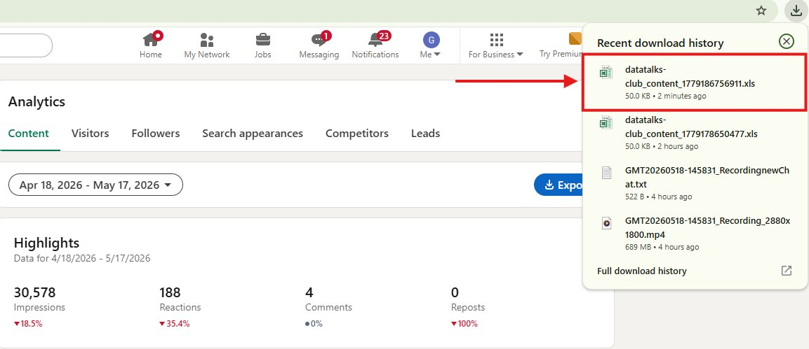
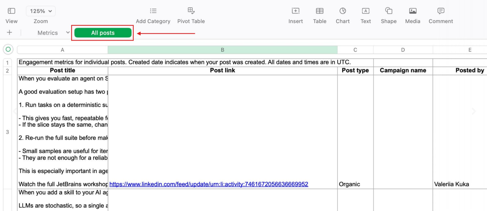
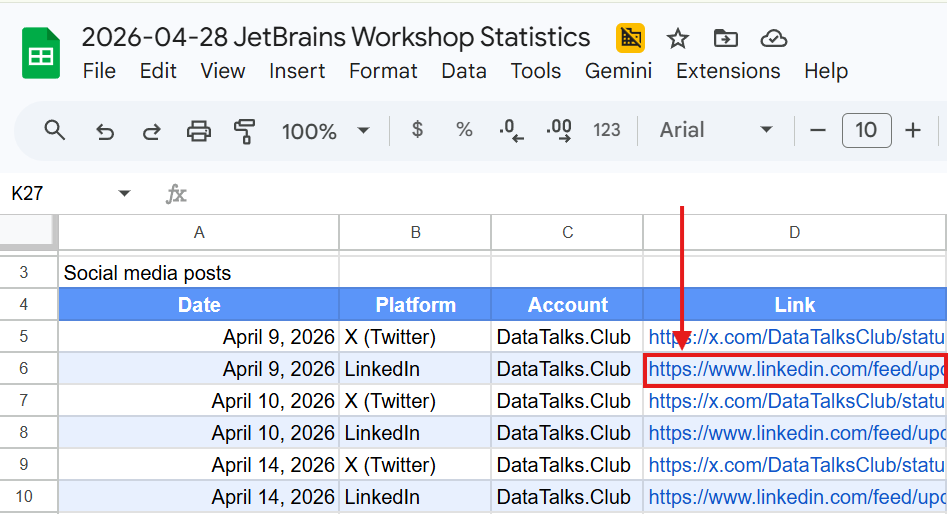
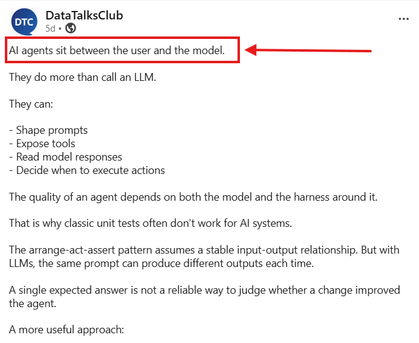
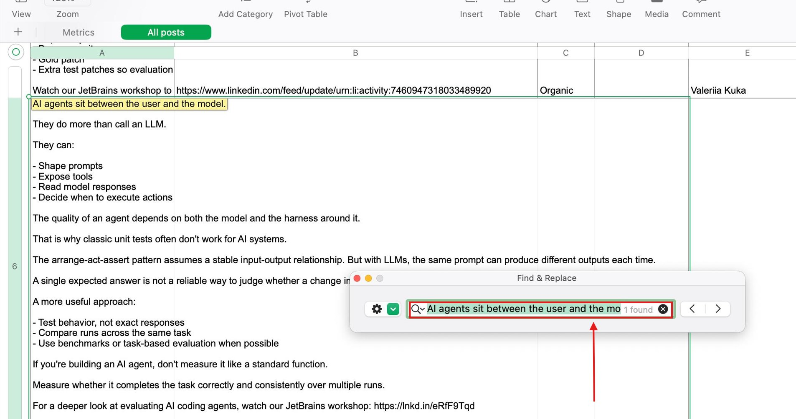
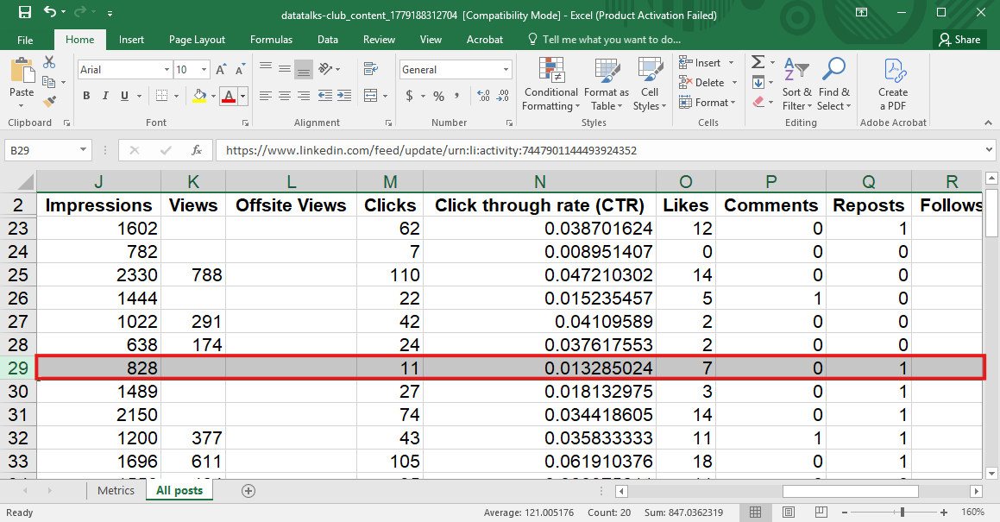

# Getting Post Analytics in LinkedIn

<!-- sop-section-start: summary -->
## Summary

- Purpose:
- Outcome:
- Trigger:
- Frequency:
<!-- sop-section-end -->

<!-- sop-section-start: prerequisites -->
## Prerequisites

- Access:
- Tools:
- Inputs:
<!-- sop-section-end -->

<!-- sop-section-start: procedure -->
## Procedure

<!-- sop-prose-start -->
Getting Post Analytics in LinkedIn
This procedure will help you quickly locate LinkedIn engagement metrics to update the Sponsors Statistics Workshop Sheet. Following this process is much faster than manually scrolling through the LinkedIn feed.

Step-by-step Instructions
<!-- sop-prose-end -->

<!-- sop-step-start id=1 -->
1.  Log in to the DTC Linkedin account. On the left side bar click on “Analytics”.

    <!-- sop-screenshot-start -->
    
    <!-- sop-caption-start -->
    The screenshot shows the DataTalks.Club LinkedIn admin sidebar with Analytics available. This is the entry point for exporting post performance data.
    <!-- sop-caption-end -->
    <!-- sop-screenshot-end -->
<!-- sop-step-end -->

<!-- sop-step-start id=2 -->
2.  Select a relevant date range for the posts you need and then click Export.

    <!-- sop-screenshot-start -->
    
    <!-- sop-caption-start -->
    The screenshot shows the LinkedIn analytics date range controls and export action. Set the range to cover the posts needed for the sponsors statistics sheet before exporting.
    <!-- sop-caption-end -->
    <!-- sop-screenshot-end -->
<!-- sop-step-end -->

<!-- sop-step-start id=3 -->
3.  Once the download is finished, open the Excel file.

    <!-- sop-screenshot-start -->
    
    <!-- sop-caption-start -->
    The screenshot shows the downloaded LinkedIn analytics spreadsheet opened in Excel. This file contains the post rows and metrics used in the lookup steps.
    <!-- sop-caption-end -->
    <!-- sop-screenshot-end -->
<!-- sop-step-end -->

<!-- sop-step-start id=4 -->
4.  Navigate to the “All posts” tab or subsheet.

    <!-- sop-screenshot-start -->
    
    <!-- sop-caption-start -->
    The screenshot shows the All posts worksheet in the exported Excel file. Use this tab because it contains the individual post links and performance columns.
    <!-- sop-caption-end -->
    <!-- sop-screenshot-end -->
<!-- sop-step-end -->

<!-- sop-step-start id=5 -->
5.  Open the LinkedIn post links provided one by one.

    <!-- sop-screenshot-start -->
    
    <!-- sop-caption-start -->
    The screenshot shows the post URL column used to open each LinkedIn post. Opening the post lets you copy recognizable text for matching it back to the spreadsheet row.
    <!-- sop-caption-end -->
    <!-- sop-screenshot-end -->
<!-- sop-step-end -->

<!-- sop-step-start id=6 -->
6.  For each post, copy the first line of the content text.

    <!-- sop-screenshot-start -->
    
    <!-- sop-caption-start -->
    The screenshot shows the visible LinkedIn post content where the first line can be copied. That line becomes the search key for finding the matching row in Excel.
    <!-- sop-caption-end -->
    <!-- sop-screenshot-end -->
<!-- sop-step-end -->

<!-- sop-step-start id=7 -->
7.  Switch to the Excel file, press Ctrl + F, and paste the line you just copied into the search bar.

    <!-- sop-screenshot-start -->
    
    <!-- sop-caption-start -->
    The screenshot shows Excel's search box with copied LinkedIn post text. Use Ctrl+F to jump directly to the matching post instead of scanning the export manually.
    <!-- sop-caption-end -->
    <!-- sop-screenshot-end -->
<!-- sop-step-end -->

<!-- sop-step-start id=8 -->
8.  Excel will jump directly to the row for that post. You can then scroll to the right in that row to find the impressions and engagement data needed for the workshop sheet.

    <!-- sop-screenshot-start -->
    
    <!-- sop-caption-start -->
    The screenshot shows the matched Excel row with the post's analytics columns available to the right. Read the impressions and engagement values from this row for the workshop sheet.
    <!-- sop-caption-end -->
    <!-- sop-screenshot-end -->
<!-- sop-step-end -->
<!-- sop-section-end -->

<!-- sop-section-start: validation -->
## Validation

-
<!-- sop-section-end -->

<!-- sop-section-start: troubleshooting -->
## Troubleshooting

-
<!-- sop-section-end -->

<!-- sop-section-start: references -->
## References

-
<!-- sop-section-end -->
