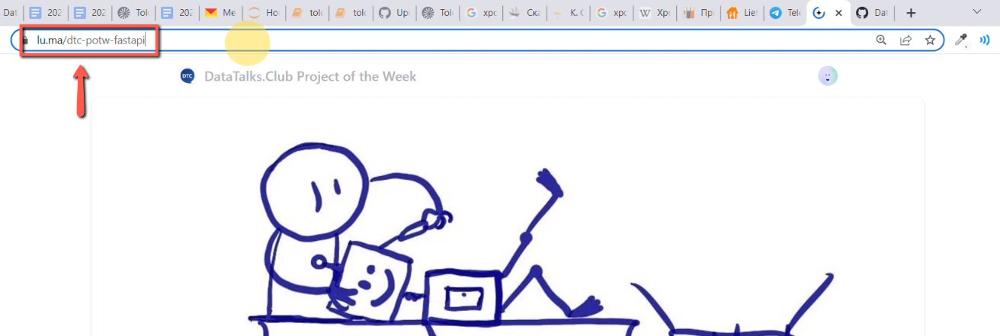
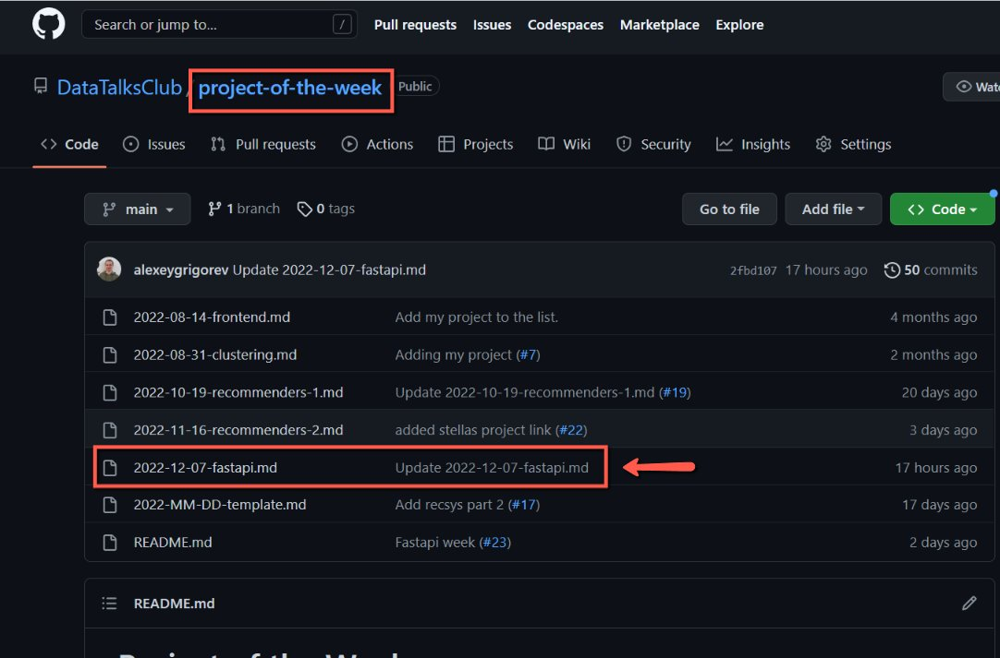
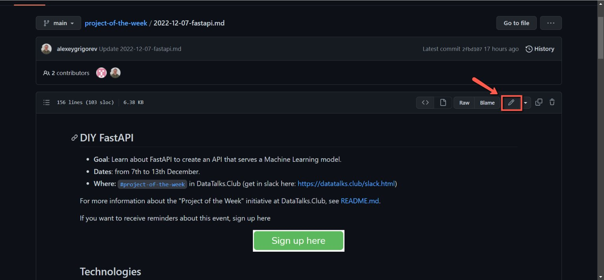
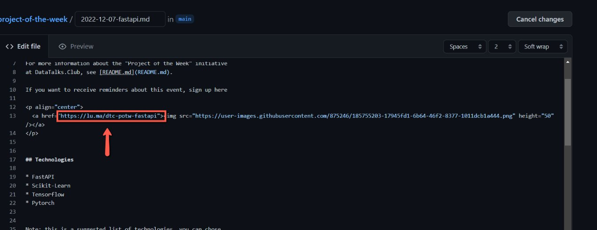
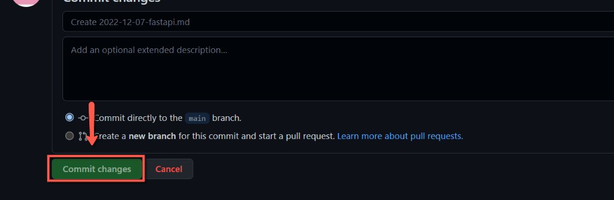

# Adding the link to the luma event for project of the week

<!-- sop-section-start: summary -->
## Summary

- Purpose: Add the created Luma event link to the Project of the Week page.
- Outcome: The Project of the Week page button points to the correct Luma event.
- Trigger: A Luma event has been created for Project of the Week.
- Frequency: For each Project of the Week event.
<!-- sop-section-end -->

<!-- sop-section-start: prerequisites -->
## Prerequisites

- Access: GitHub repository or page editor for the Project of the Week content.
- Tools: GitHub editor and Luma.
- Inputs: Luma event URL and the Project of the Week page to update.
<!-- sop-section-end -->

<!-- sop-section-start: procedure -->
## Procedure

<!-- sop-prose-start -->
How to Add the Link to the Luma event for Project of the Week
This document shows the steps on to Add the Link to the Luma event for Project of the Week to gain access and receive updates.

Step-by-step Instructions
<!-- sop-prose-end -->

<!-- sop-step-start id=1 -->
1.  The first thing you need to do is copy the URL of the Luma event that you just created.

    <!-- sop-screenshot-start -->
    
    <!-- sop-caption-start -->
    The screenshot shows the Luma event page URL that needs to be copied. This is the link that will replace the placeholder in the Project of the Week page.
    <!-- sop-caption-end -->
    <!-- sop-screenshot-end -->
<!-- sop-step-end -->

<!-- sop-step-start id=2 -->
2.  And then, open the [Project of the week github repository](https://github.com/DataTalksClub/project-of-the-week/blob/main/2022-12-07-fastapi.md) and click the project of the week.

    Note: In this example, the project of the week is “Fast API”

    <!-- sop-screenshot-start -->
    
    <!-- sop-caption-start -->
    The screenshot shows the Project of the Week repository page with the example project file. It helps confirm you are editing the correct project entry before adding the Luma link.
    <!-- sop-caption-end -->
    <!-- sop-screenshot-end -->
<!-- sop-step-end -->

<!-- sop-step-start id=3 -->
3.  Next, click the pen edit tool icon

    <!-- sop-screenshot-start -->
    
    <!-- sop-caption-start -->
    The screenshot shows GitHub's file toolbar with the edit pencil. This is the control that opens the Markdown file for editing in the browser.
    <!-- sop-caption-end -->
    <!-- sop-screenshot-end -->
<!-- sop-step-end -->

<!-- sop-step-start id=4 -->
4.  After, scroll down to the bottom and replace “TODO” with the URL link of the Luma event

    <!-- sop-screenshot-start -->
    
    <!-- sop-caption-start -->
    The screenshot shows the TODO placeholder near the bottom of the project Markdown file. Replace that placeholder with the copied Luma event URL so the page points to the registration event.
    <!-- sop-caption-end -->
    <!-- sop-screenshot-end -->
<!-- sop-step-end -->

<!-- sop-step-start id=5 -->
5.  Once done, click “Commit Changes”

    <!-- sop-screenshot-start -->
    
    <!-- sop-caption-start -->
    The screenshot shows GitHub's Commit Changes control after editing the file. Committing saves the updated Luma link to the repository.
    <!-- sop-caption-end -->
    <!-- sop-screenshot-end -->
<!-- sop-step-end -->
<!-- sop-section-end -->

<!-- sop-section-start: validation -->
## Validation

-
<!-- sop-section-end -->

<!-- sop-section-start: troubleshooting -->
## Troubleshooting

-
<!-- sop-section-end -->

<!-- sop-section-start: references -->
## References

-
<!-- sop-section-end -->
