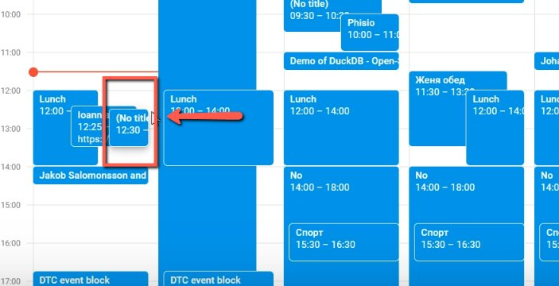
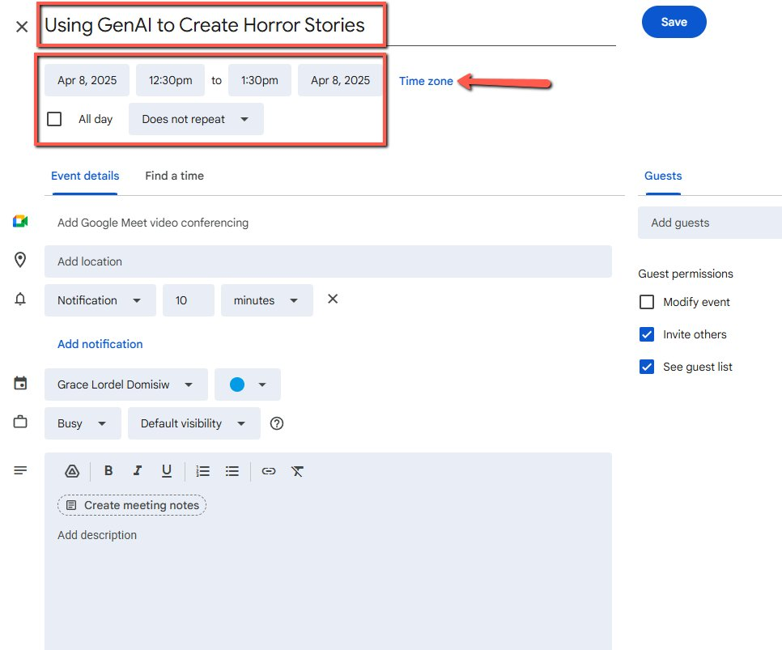
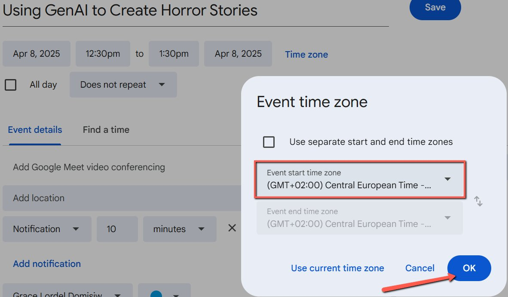
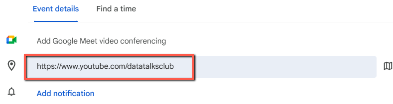
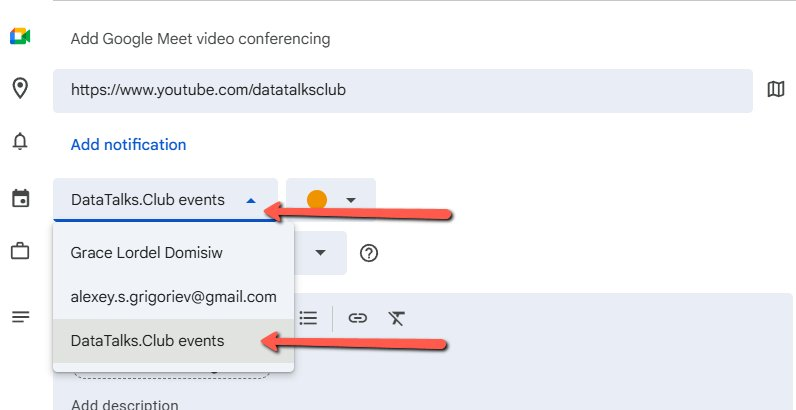
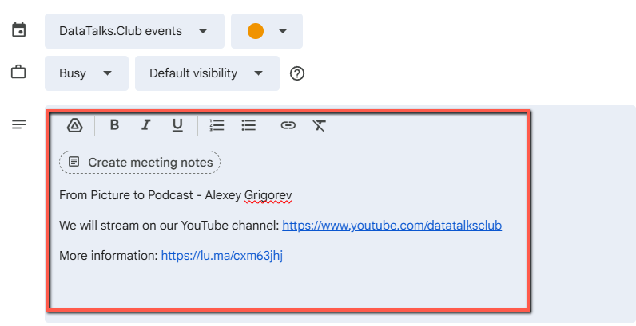
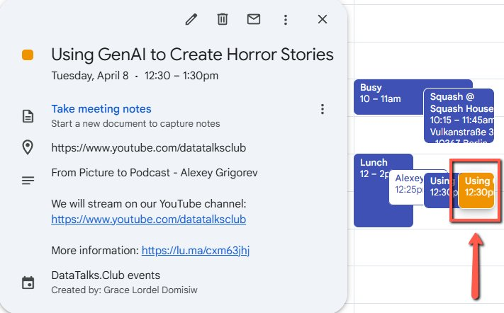

# Creating Events on Google Calendar

<!-- sop-section-start: summary -->
## Summary

- Purpose: Create a Google Calendar entry for a DataTalks.Club event.
- Outcome: The event appears on the DataTalks.Club events calendar with the title, time, YouTube location, and Luma link.
- Trigger: A Luma event needs a matching Google Calendar entry.
- Frequency: Whenever a DataTalks.Club event is added to the calendar manually.
<!-- sop-section-end -->

<!-- sop-section-start: prerequisites -->
## Prerequisites

- Access: Google Calendar access to the DataTalks.Club events calendar.
- Tools: Google Calendar, Luma, YouTube channel link.
- Inputs: Event title, date and time in CET, subtitle, Luma event link, and YouTube channel URL.
<!-- sop-section-end -->

<!-- sop-section-start: procedure -->
## Procedure

<!-- sop-prose-start -->
How to Create Events on Google Calendar
This document shows the steps on How to Create Events on Google Calendar based on Luma Events.

Step-by-step Instructions
<!-- sop-prose-end -->

<!-- sop-step-start id=1 -->
1.  On the [Google calendar](https://calendar.google.com/calendar/u/0/r), click the time and date of the event.

    Note: Make sure that the time and date should be on CET.

    <!-- sop-screenshot-start -->
    
    <!-- sop-caption-start -->
    The screenshot shows the Google Calendar time grid where the event slot is selected. It helps confirm the calendar entry starts on the intended CET date and time.
    <!-- sop-caption-end -->
    <!-- sop-screenshot-end -->
<!-- sop-step-end -->

<!-- sop-step-start id=2 -->
2.  Type the name of the event, select the event’s schedule (date and time). Click on “Time Zone”.

    <!-- sop-screenshot-start -->
    
    <!-- sop-caption-start -->
    The screenshot shows the Google Calendar event editor with title, schedule, and Time Zone controls. It indicates where to verify the event name and open the timezone settings.
    <!-- sop-caption-end -->
    <!-- sop-screenshot-end -->
<!-- sop-step-end -->

<!-- sop-step-start id=3 -->
3.  Make sure that time zone is in Central European Time (CET), and click “OK”.

    <!-- sop-screenshot-start -->
    
    <!-- sop-caption-start -->
    The screenshot shows the timezone dialog set to Central European Time. Confirming this prevents the calendar event from appearing at the wrong local time.
    <!-- sop-caption-end -->
    <!-- sop-screenshot-end -->
<!-- sop-step-end -->

<!-- sop-step-start id=4 -->
4.  Type in the DTC’s YouTube Channel link as the event’s corresponding location

    [https://www.youtube.com/datatalksclub](https://www.youtube.com/datatalksclub)

    <!-- sop-screenshot-start -->
    
    <!-- sop-caption-start -->
    The screenshot shows the location field populated with the DataTalks.Club YouTube channel link. This tells attendees where the event will be streamed.
    <!-- sop-caption-end -->
    <!-- sop-screenshot-end -->
<!-- sop-step-end -->

<!-- sop-step-start id=5 -->
5.  And then, make sure to select “DataTalks.Club event” calendar

    <!-- sop-screenshot-start -->
    
    <!-- sop-caption-start -->
    The screenshot shows the calendar dropdown set to DataTalks.Club event. This confirms the event will appear on the shared DTC calendar.
    <!-- sop-caption-end -->
    <!-- sop-screenshot-end -->
<!-- sop-step-end -->

<!-- sop-step-start id=6 -->
6.  On the description, follow this format:
    Subtitle of the event :

    We will stream on our YouTube channel: https://www.youtube.com/datatalksclub

    More information: (Luma Link)

    Example:
    From Picture to Podcast

    We will stream on our YouTube channel: [https://www.youtube.com/datatalksclub](https://www.youtube.com/datatalksclub)

    More information: [https://lu.ma/cxm63jhj](https://lu.ma/cxm63jhj)

    <!-- sop-screenshot-start -->
    
    <!-- sop-caption-start -->
    The screenshot shows the description field with the event subtitle, YouTube stream line, and Luma information link. It provides the exact structure attendees should see in the calendar description.
    <!-- sop-caption-end -->
    <!-- sop-screenshot-end -->
<!-- sop-step-end -->

<!-- sop-step-start id=7 -->
7.  Once done, click “Save" and it should look like the image below.

    <!-- sop-screenshot-start -->
    
    <!-- sop-caption-start -->
    The screenshot shows the completed Google Calendar event after saving. It confirms the title, time, calendar, YouTube location, and Luma details are visible together.
    <!-- sop-caption-end -->
    <!-- sop-screenshot-end -->
<!-- sop-step-end -->
<!-- sop-section-end -->

<!-- sop-section-start: validation -->
## Validation

-
<!-- sop-section-end -->

<!-- sop-section-start: troubleshooting -->
## Troubleshooting

-
<!-- sop-section-end -->

<!-- sop-section-start: references -->
## References

-
<!-- sop-section-end -->
