# Creating events (Webinar, Workshop and Podcast) on Luma

<!-- sop-section-start: summary -->
## Summary

- Purpose:
- Outcome:
- Trigger:
- Frequency:
<!-- sop-section-end -->

<!-- sop-section-start: prerequisites -->
## Prerequisites

- Access:
- Tools:
- Inputs:

This shows the steps to create events on Luma based on speaker’s provided information which may be viewed through email.
<!-- sop-section-end -->

<!-- sop-section-start: procedure -->
## Procedure

<!-- sop-step-start id=1 -->
1.  The first thing you need to do is go to Luma’s website and under the “Calendar” tab click [“DataTalksClub events”](https://lu.ma/home/calendars)

    Note: DataTalkClub events should be selected for it to appear in the common space and not in the personal one.

    <!-- sop-screenshot-start -->
    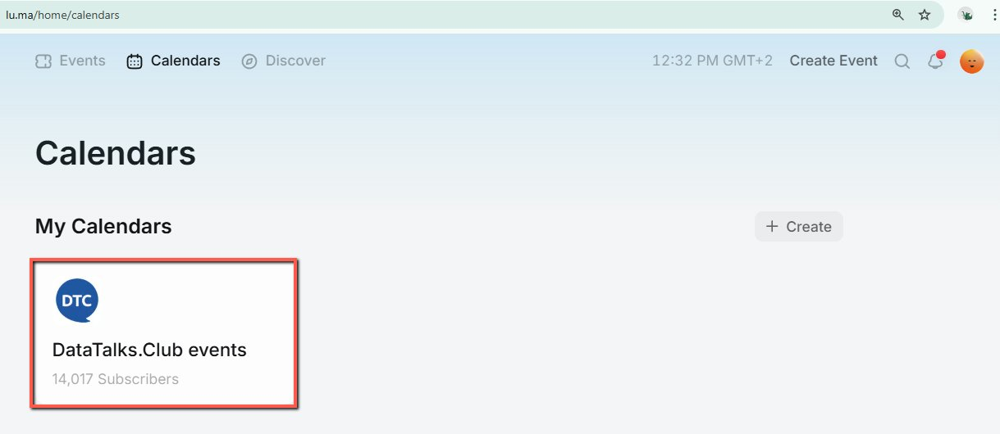
    <!-- sop-caption-start -->
    The screenshot shows the Luma Calendar tab with DataTalksClub events selected. Starting from this calendar keeps webinars, workshops, and podcasts in the shared DTC space.
    <!-- sop-caption-end -->
    <!-- sop-screenshot-end -->
<!-- sop-step-end -->

<!-- sop-step-start id=2 -->
2.  Once done, click the plus button right beside “Events”

    <!-- sop-screenshot-start -->
    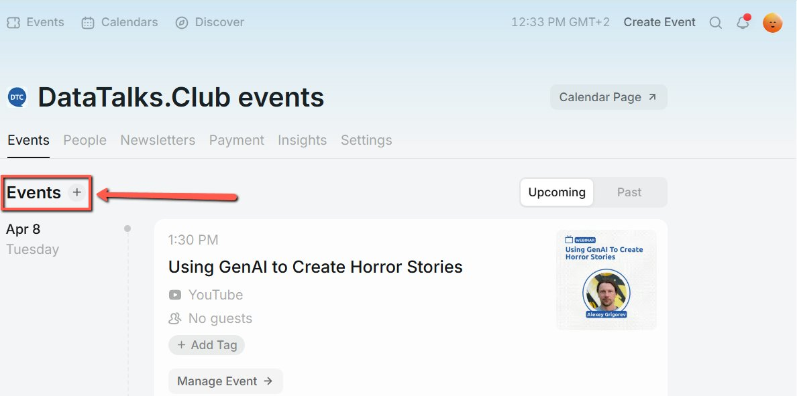
    <!-- sop-caption-start -->
    The screenshot shows the plus control next to Events in the selected Luma calendar. Use it to start adding a new event to the DataTalksClub events list.
    <!-- sop-caption-end -->
    <!-- sop-screenshot-end -->
<!-- sop-step-end -->

<!-- sop-step-start id=3 -->
3.  Then, click “Create New Event”

    <!-- sop-screenshot-start -->
    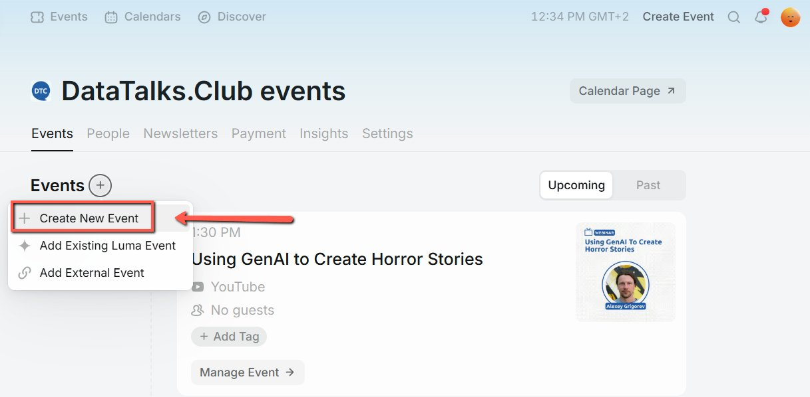
    <!-- sop-caption-start -->
    The screenshot shows the Create New Event choice in Luma. This opens the full event form for a webinar, workshop, or podcast.
    <!-- sop-caption-end -->
    <!-- sop-screenshot-end -->
<!-- sop-step-end -->

<!-- sop-step-start id=4 -->
4.  Click on “Theme” and the Font (Default) and color (Gray).

    Note: Make sure that the font should be consistent for all events.

    <!-- sop-screenshot-start -->
    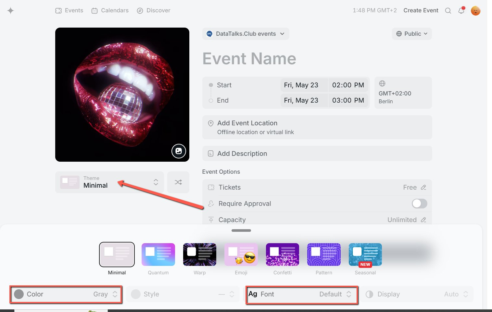
    <!-- sop-caption-start -->
    The screenshot shows the Theme settings for the Luma event. It identifies where to keep the default font and gray color consistent with other DTC events.
    <!-- sop-caption-end -->
    <!-- sop-screenshot-end -->
<!-- sop-step-end -->

<!-- sop-step-start id=5 -->
5.  Enter the event details (Title, Event cover, schedule of the event, event location, description)
    Add the DTC’s YouTube channel under Event location: *[https://www.youtube.com/@DataTalksClub](https://www.youtube.com/@DataTalksClub)*

    Creating the cover: [How to use Figma for creating event banners](../../../sales/sponsorship/sops/how-to-use-figma-for-creating-event-banners.md)

    Note: Be careful with the timezone and the AM / PM format. Make sure that the schedule of the event is in CET timezone. It is advisable to change your Computer or Laptop’s timezone to Berlin to avoid confusion.

    Podcast: Monday at 12:30 Berlin Time, if guests from US can be (17:00) or 5:00pm CET

    Webinar: Tuesday at 12:30 Berlin time, unless otherwise agreed with the speakers

    Workshop: 16:30 or 17:00 for workshops, we can do it at different times per speaker’s request
    <!-- sop-screenshot-start -->
    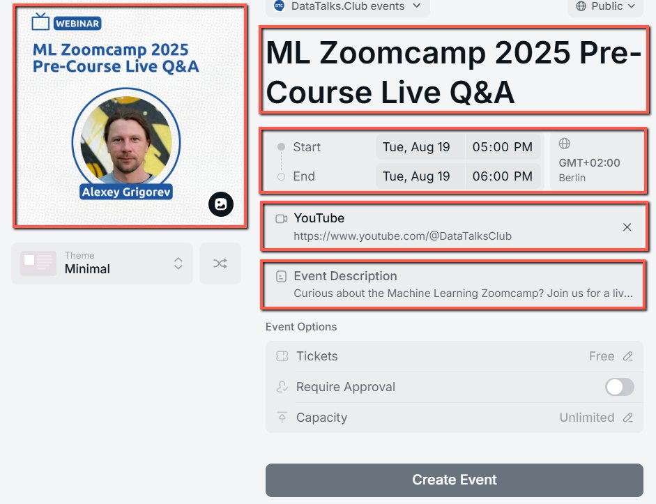
    <!-- sop-caption-start -->
    The screenshot shows the main Luma event details form with cover, title, schedule, location, and description fields. It is the reference point for entering the speaker-provided event details and CET schedule.
    <!-- sop-caption-end -->
    <!-- sop-screenshot-end -->
<!-- sop-step-end -->

<!-- sop-step-start id=6 -->
6.  In the “Event Description” add the details of the event.

    Note: Make sure that the format has a space \[Subtitle - Name\].

    <!-- sop-screenshot-start -->
    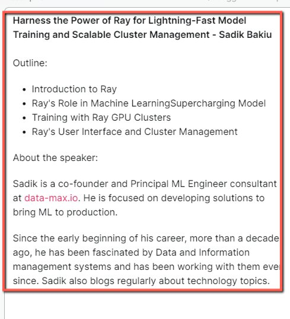
    <!-- sop-caption-start -->
    The screenshot shows the Event Description editor in Luma. It indicates where to add the formatted event details, including the subtitle and speaker information.
    <!-- sop-caption-end -->
    <!-- sop-screenshot-end -->
<!-- sop-step-end -->

<!-- sop-step-start id=7 -->
7.  At the bottom of the description add “​​​​​​[DataTalks.Club](http://datatalks.club/) is the place to talk about data. [Join our Slack community](https://datatalks.club/slack.html)!”. Then click on “Done”

    <!-- sop-screenshot-start -->
    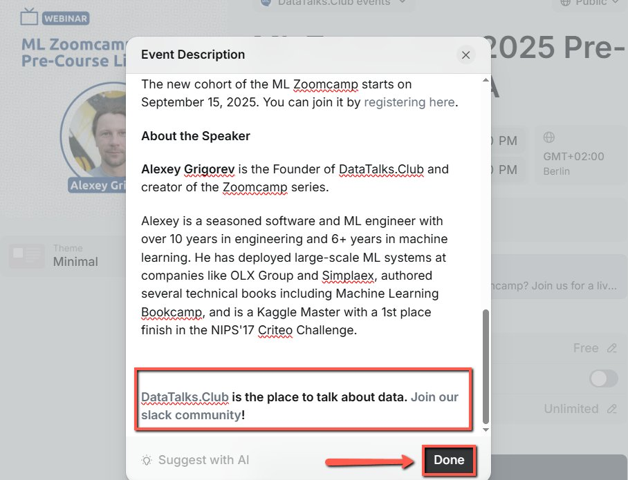
    <!-- sop-caption-start -->
    The screenshot shows the bottom of the Luma description editor with the DataTalks.Club and Slack community links. The Done button saves the description content.
    <!-- sop-caption-end -->
    <!-- sop-screenshot-end -->
<!-- sop-step-end -->

<!-- sop-step-start id=8 -->
8.  If the event is sponsored, indicate it at the last part of the event description through this format:

    “This event is sponsored by \[SPONSOR\].”

    Note: In this example, the sponsor is dltHub.

    <!-- sop-screenshot-start -->
    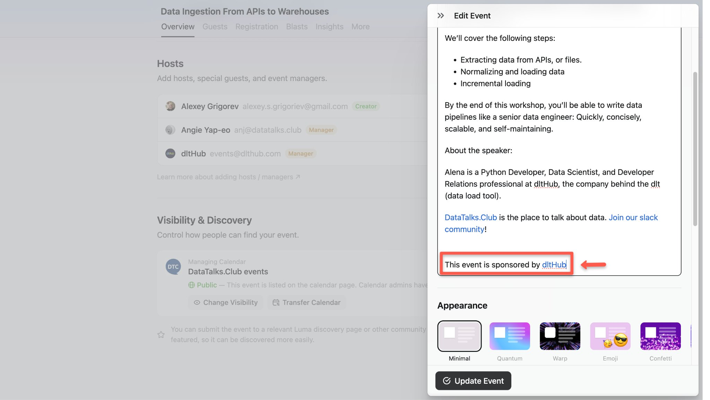
    <!-- sop-caption-start -->
    The screenshot shows the sponsor sentence added to the event description. It demonstrates where sponsorship disclosure belongs when the event has a sponsor.
    <!-- sop-caption-end -->
    <!-- sop-screenshot-end -->
<!-- sop-step-end -->

<!-- sop-step-start id=9 -->
9.  Once done, click “Create Event” or “Update Event” (If you are editing the event already created)

    <!-- sop-screenshot-start -->
    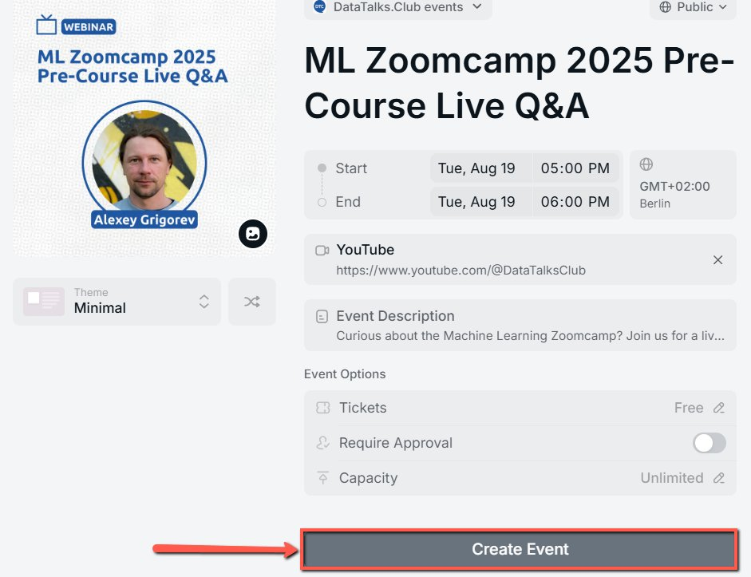
    <!-- sop-caption-start -->
    The screenshot shows the final event form action for creating or updating the Luma event. Use it after the event details, description, and settings have been reviewed.
    <!-- sop-caption-end -->
    <!-- sop-screenshot-end -->
    <!-- sop-screenshot-start -->
    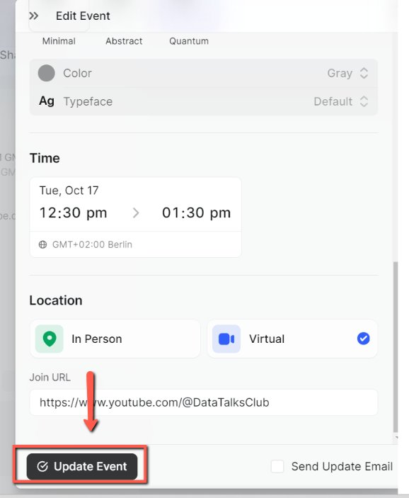
    <!-- sop-caption-start -->
    The screenshot shows the Update Event control for an existing Luma event. It confirms where to save changes when editing rather than creating from scratch.
    <!-- sop-caption-end -->
    <!-- sop-screenshot-end -->
<!-- sop-step-end -->

<!-- sop-step-start id=10 -->
10. On the Event tab, scroll down and click “Add Host” to add Alexey as the host and organizer of the event, and then select “Alexey Grigorev” (alexey.s.grigoriev@gmail.com).

    <!-- sop-screenshot-start -->
    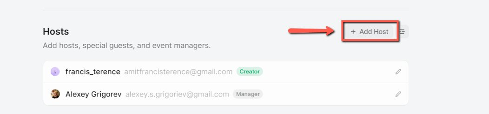
    <!-- sop-caption-start -->
    The screenshot shows the Host section with Alexey Grigorev selected. This confirms the event has the correct host and organizer assigned.
    <!-- sop-caption-end -->
    <!-- sop-screenshot-end -->
<!-- sop-step-end -->

<!-- sop-step-start id=11 -->
11. Go to “Registration”, scroll down and under “Custom Questions”, add an additional question:

    <!-- sop-screenshot-start -->
    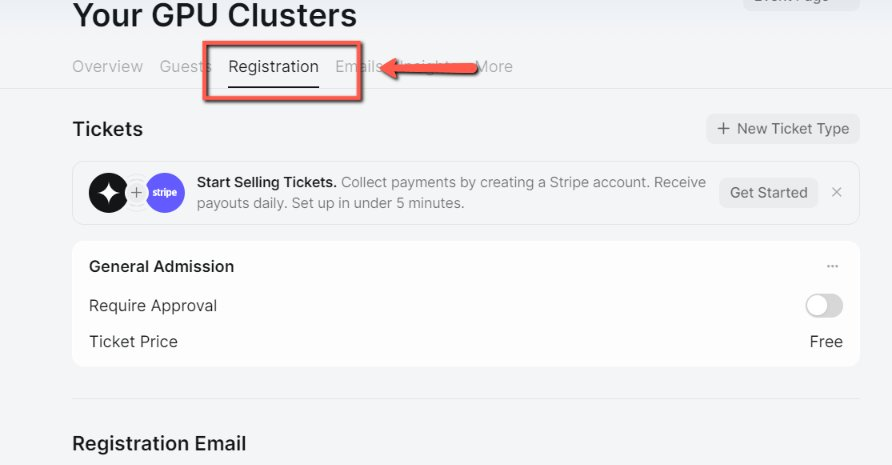
    <!-- sop-caption-start -->
    The screenshot shows the Registration tab and Custom Questions area. This is where attendee questions are added to the Luma registration form.
    <!-- sop-caption-end -->
    <!-- sop-screenshot-end -->
<!-- sop-step-end -->

<!-- sop-step-start id=12 -->
12. Select “Options:

    <!-- sop-screenshot-start -->
    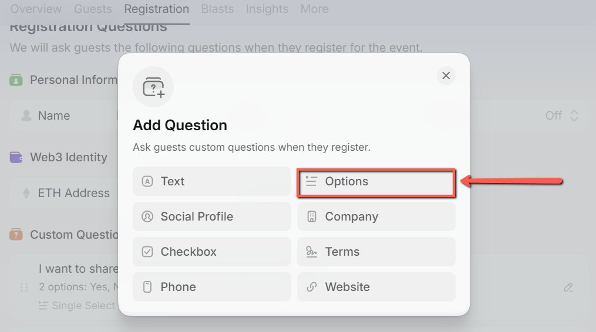
    <!-- sop-caption-start -->
    The screenshot shows the custom-question type picker in Luma. Choose Options when the answer should be limited to predefined choices such as Yes or No.
    <!-- sop-caption-end -->
    <!-- sop-screenshot-end -->
<!-- sop-step-end -->

<!-- sop-step-start id=13 -->
13. In the Question, type in or paste:
    “Do you want to subscribe to the DataTalks.Club newsletter and receive updates about future events?”

    Under Options, type 'Yes' (press Enter) and 'No' (press Enter). Ensure the Selection Type is set to 'Single,' and toggle the Required button to On.
    Then click on the “Add Question” button.
    <!-- sop-screenshot-start -->
    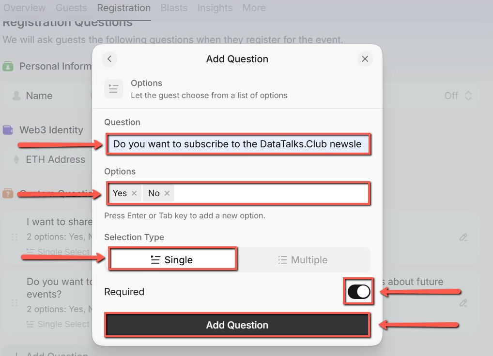
    <!-- sop-caption-start -->
    The screenshot shows the completed newsletter subscription question with Yes and No options. The Add Question button saves it to the registration form.
    <!-- sop-caption-end -->
    <!-- sop-screenshot-end -->
<!-- sop-step-end -->

<!-- sop-step-start id=14 -->
14. If an event is sponsored, we will add two more questions to ask if they want to share their emails with the sponsors and for the Company name of the registrants Follow the steps in number 11-14 and use the question:

    “I want to share my email with the sponsors (\<NAME\>)”

    Note: We will be sharing these information to the sponsors after the event

    In this example the sponsor is Astronomer

    <!-- sop-screenshot-start -->
    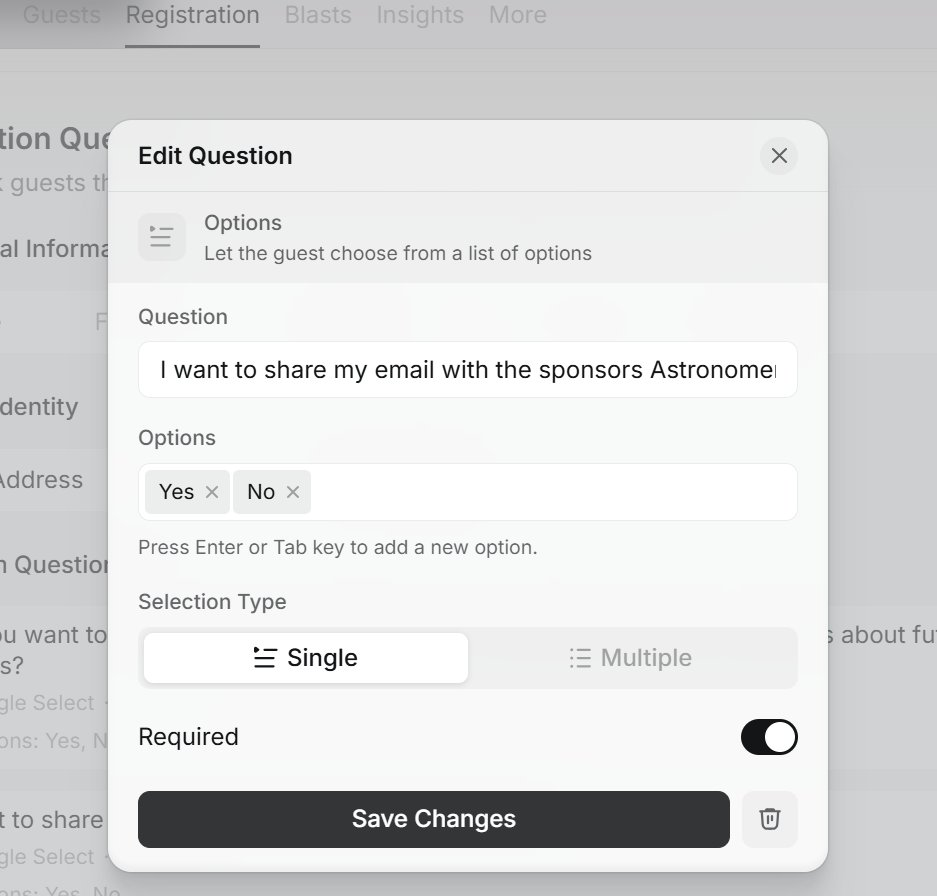
    <!-- sop-caption-start -->
    The screenshot shows the sponsored-event question configured with the sponsor name. It captures whether registrants agree to share their email with that sponsor.
    <!-- sop-caption-end -->
    <!-- sop-screenshot-end -->
<!-- sop-step-end -->

<!-- sop-step-start id=15 -->
15. For the second question follow step 11 and select “Text”.

    <!-- sop-screenshot-start -->
    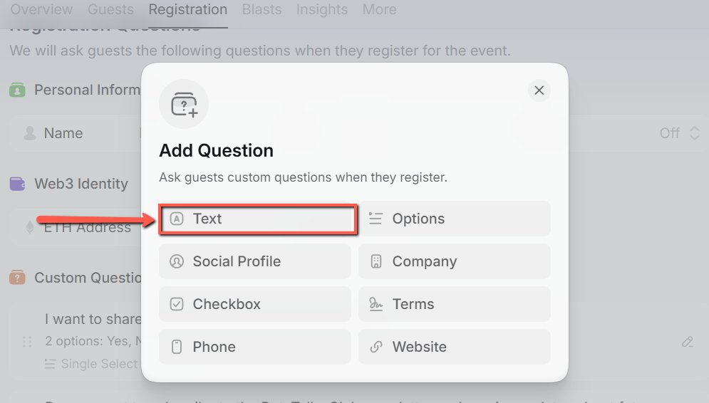
    <!-- sop-caption-start -->
    The screenshot shows Text selected as the custom-question type. Use it for the company-name question because attendees need to enter free-form text.
    <!-- sop-caption-end -->
    <!-- sop-screenshot-end -->
<!-- sop-step-end -->

<!-- sop-step-start id=16 -->
16. In the Question, type in or paste:
    “Company Name”

    Response Length should be “Short” and toggle the Required button to On.
    <!-- sop-screenshot-start -->
    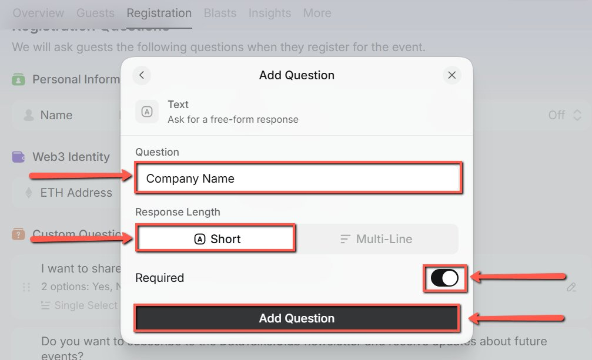
    <!-- sop-caption-start -->
    The screenshot shows the Company Name question settings with short response length and Required enabled. These settings keep sponsor-related registration data complete and concise.
    <!-- sop-caption-end -->
    <!-- sop-screenshot-end -->
<!-- sop-step-end -->

<!-- sop-step-start id=17 -->
17. After creating/updating the event, make sure to manually add the event to the Google Calendar
    See here: [Creating Events on Google Calendar (Luma Edition)](https://docs.google.com/document/d/1HwptQpp9w_TihEf7szGL130eSorzY_e_K4jSzAG-rAE/edit)

    <!-- sop-screenshot-start -->
    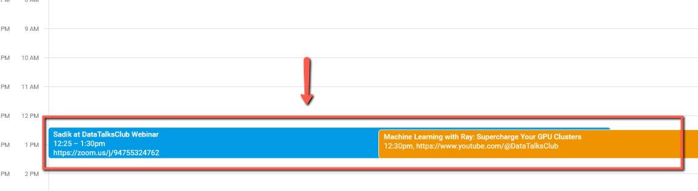
    <!-- sop-caption-start -->
    The screenshot points to the related Google Calendar process for adding the event manually. It links the Luma event creation flow to the calendar update that follows.
    <!-- sop-caption-end -->
    <!-- sop-screenshot-end -->
<!-- sop-step-end -->

<!-- sop-step-start id=18 -->
18. Make sure to turn off the notification for the “New Guest Registered” , go to settings, click preference then uncheck the New Guest Registered.
<!-- sop-step-end -->
<!-- sop-section-end -->

<!-- sop-section-start: validation -->
## Validation

-
<!-- sop-section-end -->

<!-- sop-section-start: troubleshooting -->
## Troubleshooting

-
<!-- sop-section-end -->

<!-- sop-section-start: references -->
## References

-
<!-- sop-section-end -->
