# Creating project of the week events in Luma

<!-- sop-section-start: summary -->
## Summary

- Purpose: Create a multi-day Luma event series for Project of the Week.
- Outcome: The Luma event series is created with the correct cover, dates, Slack location, description, public URL, hosts, and reminder emails.
- Trigger: A new Project of the Week is ready to be scheduled.
- Frequency: For each new Project of the Week.
<!-- sop-section-end -->

<!-- sop-section-start: prerequisites -->
## Prerequisites

- Access: Luma event management, Project of the Week repository, Slack project channel, and event cover image.
- Tools: Luma, GitHub, Slack.
- Inputs: Project title, project repository URL, date range, Slack channel link, description, and cover image.
<!-- sop-section-end -->

<!-- sop-section-start: procedure -->
## Procedure

<!-- sop-prose-start -->
How to Create Project of the Week Events in Luma
This document shows the steps on how to Create Project of the Week Events in Luma.

Project of the Week description: [https://docs.google.com/document/d/18rCX0Fhkq2KK4pi_lTHMR9yRaIHY2-956zoOyBRsvRE/edit?usp=sharing](https://docs.google.com/document/d/18rCX0Fhkq2KK4pi_lTHMR9yRaIHY2-956zoOyBRsvRE/edit?usp=sharing)

Step-by-step Instructions
<!-- sop-prose-end -->

<!-- sop-step-start id=1 -->
1.  The first thing you need to do is open, [Luma](https://lu.ma/home) and select “+Create” to create an event.

    <!-- sop-screenshot-start -->
    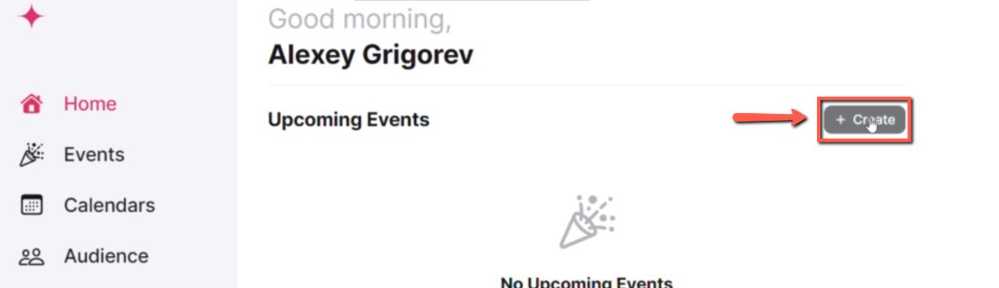
    <!-- sop-caption-start -->
    The screenshot shows Luma's +Create control on the home page. This starts the event series setup for Project of the Week.
    <!-- sop-caption-end -->
    <!-- sop-screenshot-end -->
<!-- sop-step-end -->

<!-- sop-step-start id=2 -->
2.  On the event tab, change the photo of the event and add the event details (Event name and time).

    Note: Always make sure that the timezone is on CET – Berlin.

    <!-- sop-screenshot-start -->
    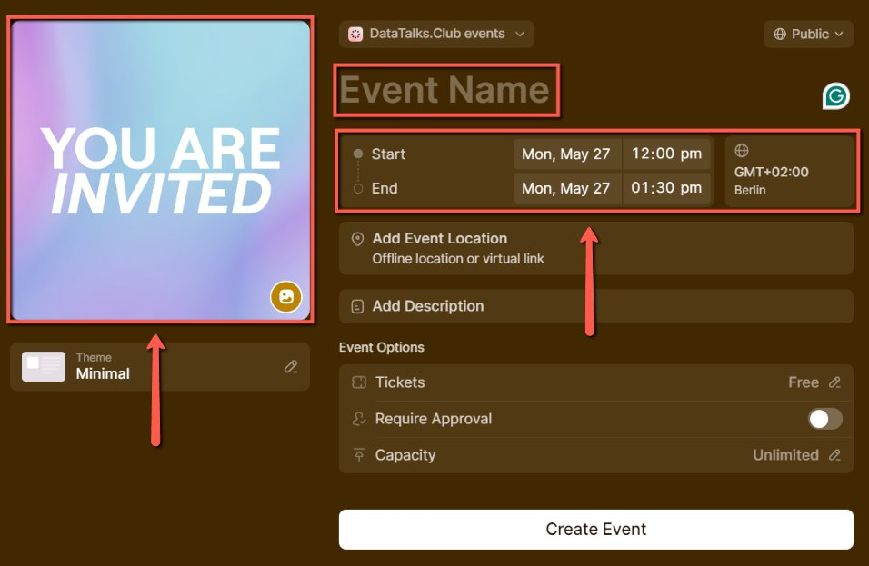
    <!-- sop-caption-start -->
    The screenshot shows the Luma event form with the cover, event name, date, time, and timezone fields. It clarifies where to enter the Project of the Week details and confirm the Berlin timezone.
    <!-- sop-caption-end -->
    <!-- sop-screenshot-end -->
<!-- sop-step-end -->

<!-- sop-step-start id=3 -->
3.  After, copy the Event URL from the github repo

    Note: Event URL is an internet address that is composed of the entered data.

    <!-- sop-screenshot-start -->
    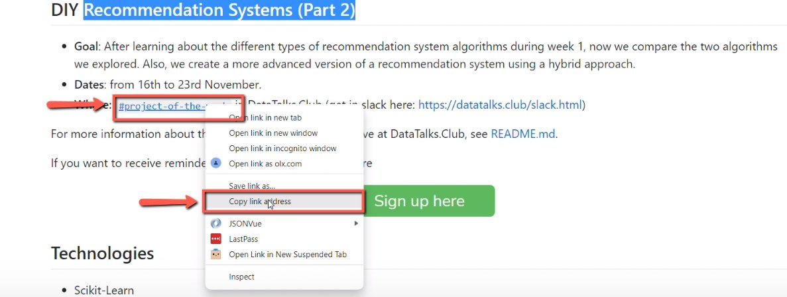
    <!-- sop-caption-start -->
    The screenshot shows the event URL value from the GitHub project page. This URL is reused as the location or public link for the Luma event.
    <!-- sop-caption-end -->
    <!-- sop-screenshot-end -->
<!-- sop-step-end -->

<!-- sop-step-start id=4 -->
4.  And paste it under the “Add Event Location”

    <!-- sop-screenshot-start -->
    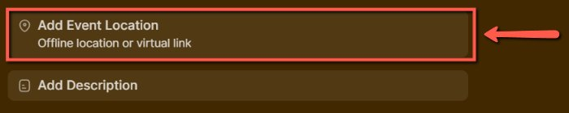
    <!-- sop-caption-start -->
    The screenshot shows the Add Event Location field in Luma. Paste the project URL there so attendees know where the project activity happens.
    <!-- sop-caption-end -->
    <!-- sop-screenshot-end -->
<!-- sop-step-end -->

<!-- sop-step-start id=5 -->
5.  To proceed, go to the “Add Description” tab of the event and add the description.

    Note: In this example, we copied the previous published event description on Luma with minor changes made since new event is just a continuation.

    <!-- sop-screenshot-start -->
    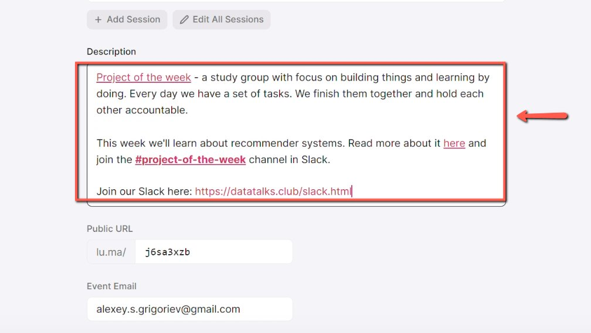
    <!-- sop-caption-start -->
    The screenshot shows the Add Description area in the Luma event editor. This is where the copied Project of the Week description is added and adjusted.
    <!-- sop-caption-end -->
    <!-- sop-screenshot-end -->
<!-- sop-step-end -->

<!-- sop-step-start id=6 -->
6.  In here, change the link in the word “here” to the a new link. Copy the new link from the github repo.

    <!-- sop-screenshot-start -->
    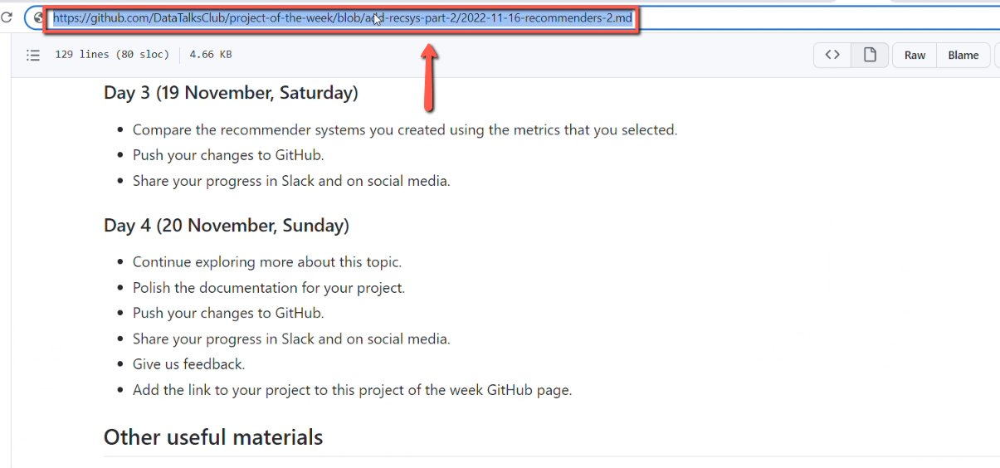
    <!-- sop-caption-start -->
    The screenshot shows the linked word here inside the Luma description. Update that hyperlink so it points to the current Project of the Week repository or page.
    <!-- sop-caption-end -->
    <!-- sop-screenshot-end -->
<!-- sop-step-end -->

<!-- sop-step-start id=7 -->
7.  And then add it.

    <!-- sop-screenshot-start -->
    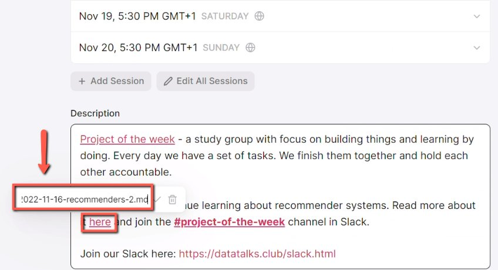
    <!-- sop-caption-start -->
    The screenshot shows the link editor used to apply the copied project URL. It confirms the destination is added to the selected description text.
    <!-- sop-caption-end -->
    <!-- sop-screenshot-end -->
<!-- sop-step-end -->

<!-- sop-step-start id=8 -->
8.  After, click on “More”, scroll down and enter the public URL of the event and once done, click “Update”.

    <!-- sop-screenshot-start -->
    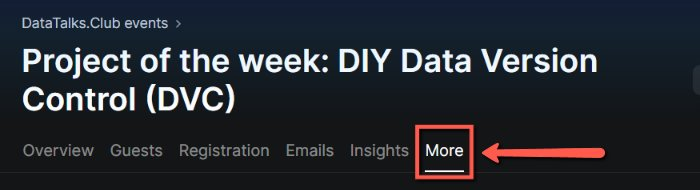
    <!-- sop-caption-start -->
    The screenshot shows the More section where the public URL can be entered. Updating this field sets the event's public address before saving.
    <!-- sop-caption-end -->
    <!-- sop-screenshot-end -->

    <!-- sop-screenshot-start -->
    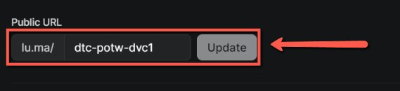
    <!-- sop-caption-start -->
    The screenshot shows the Update button after the public URL has been entered. Saving here applies the public URL change to the Luma event.
    <!-- sop-caption-end -->
    <!-- sop-screenshot-end -->
<!-- sop-step-end -->

<!-- sop-step-start id=9 -->
9.  After the event has created, go to “Overview”, scroll down and under “Hosts”, add Alexey’s gmail.

    <!-- sop-screenshot-start -->
    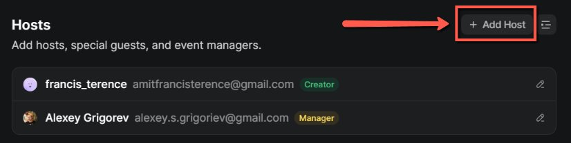
    <!-- sop-caption-start -->
    The screenshot shows the Hosts section on the Luma event overview. Add Alexey's Gmail there so he is listed as a host and organizer.
    <!-- sop-caption-end -->
    <!-- sop-screenshot-end -->
<!-- sop-step-end -->

<!-- sop-step-start id=10 -->
10. Lastly, on the “Emails” tab, click on “+ New Post” and use the template below:
    Hey Everyone! Welcome to day \<1\>of the project of the week: \<Name of the event\>, we're starting soon! The plan for the day can be seen on Slack. You can join the Project of the Week channel using this link. To learn more about the project of the week, check out the video of Antonis (insert link).

    Note: Schedule a post before the actual event. In here, the event occurs on May 23 to 29, 2024. A total of 7 days, therefore, 7 posts for the project of the week event. This serves as a reminder for the attendees of the event.

    <!-- sop-screenshot-start -->
    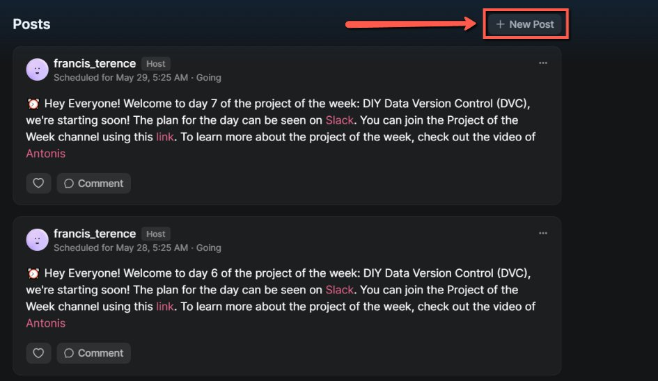
    <!-- sop-caption-start -->
    The screenshot shows Luma's post/email editor with the daily Project of the Week reminder text. Use it as a model for scheduling one message per event day.
    <!-- sop-caption-end -->
    <!-- sop-screenshot-end -->
<!-- sop-step-end -->
<!-- sop-section-end -->

<!-- sop-section-start: validation -->
## Validation

-
<!-- sop-section-end -->

<!-- sop-section-start: troubleshooting -->
## Troubleshooting

-
<!-- sop-section-end -->

<!-- sop-section-start: references -->
## References

-
<!-- sop-section-end -->
