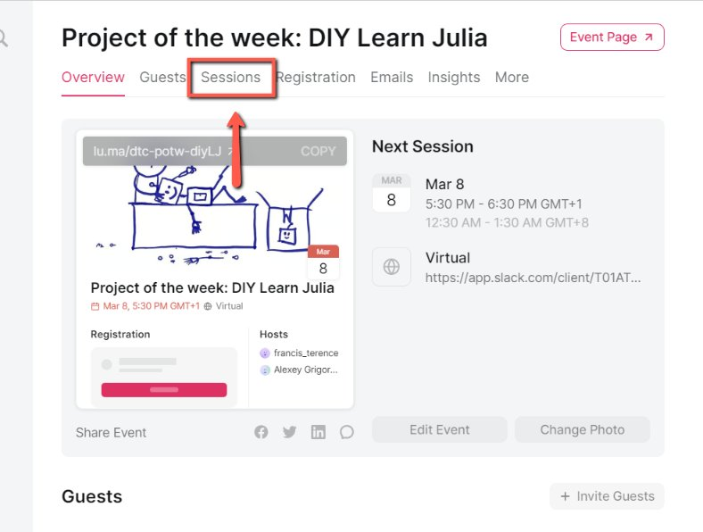
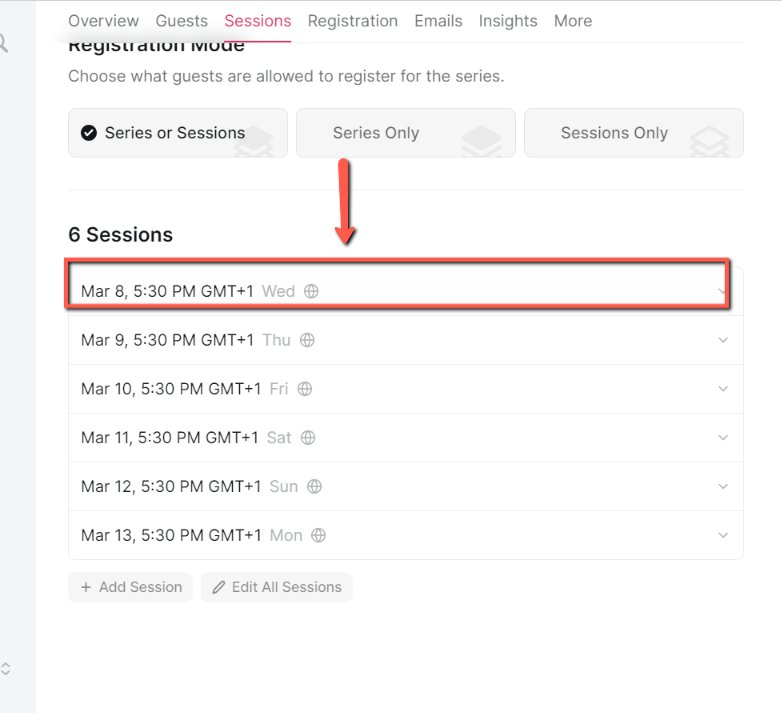
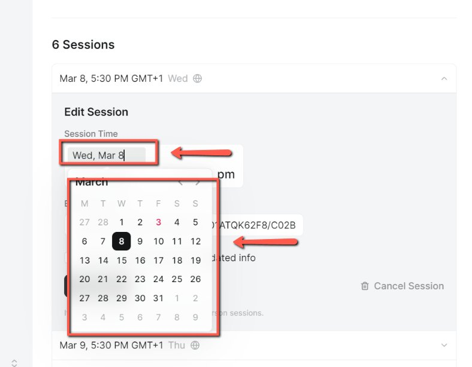
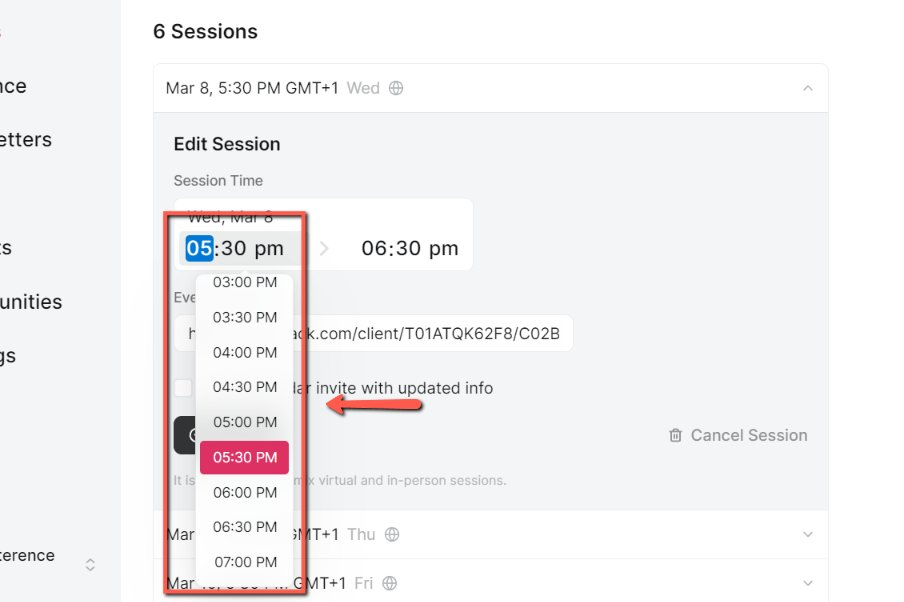
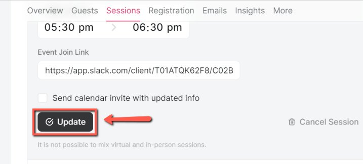
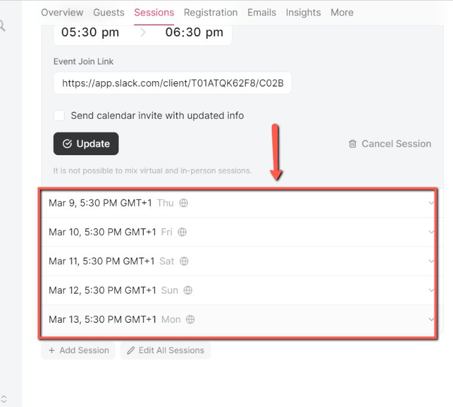

# Rescheduling Events on Luma

<!-- sop-section-start: summary -->
## Summary

- Purpose:
- Outcome:
- Trigger:
- Frequency:
<!-- sop-section-end -->

<!-- sop-section-start: prerequisites -->
## Prerequisites

- Access:
- Tools:
- Inputs:
<!-- sop-section-end -->

<!-- sop-section-start: procedure -->
## Procedure

<!-- sop-prose-start -->
How to Reschedule Events on Luma
This document shows the steps on how to Reschedule Events on Luma whenever certain circumstaces occur.

Step-by-step Instructions
<!-- sop-prose-end -->

<!-- sop-step-start id=1 -->
1.  On the Luma event, select “Sessions”

    <!-- sop-screenshot-start -->
    
    <!-- sop-caption-start -->
    The screenshot shows the Luma event management tabs with Sessions selected. This is where individual event dates can be edited.
    <!-- sop-caption-end -->
    <!-- sop-screenshot-end -->
<!-- sop-step-end -->

<!-- sop-step-start id=2 -->
2.  And then, click on the date

    <!-- sop-screenshot-start -->
    
    <!-- sop-caption-start -->
    The screenshot shows the session date entry inside Luma. Opening that entry lets you edit the specific session that needs to move.
    <!-- sop-caption-end -->
    <!-- sop-screenshot-end -->
<!-- sop-step-end -->

<!-- sop-step-start id=3 -->
3.  After, reschedule the session by clicking the date and time

    <!-- sop-screenshot-start -->
    
    <!-- sop-caption-start -->
    The screenshot shows the date and time controls for the selected Luma session. Use these fields to set the new schedule for that session.
    <!-- sop-caption-end -->
    <!-- sop-screenshot-end -->

    <!-- sop-screenshot-start -->
    
    <!-- sop-caption-start -->
    The screenshot shows the opened scheduling control after choosing the session time. It clarifies where the updated date and time are applied before saving.
    <!-- sop-caption-end -->
    <!-- sop-screenshot-end -->
<!-- sop-step-end -->

<!-- sop-step-start id=4 -->
4.  Once done, click “Update”

    <!-- sop-screenshot-start -->
    
    <!-- sop-caption-start -->
    The screenshot shows the Update button in the Luma session editor. Clicking it saves the revised session schedule.
    <!-- sop-caption-end -->
    <!-- sop-screenshot-end -->
<!-- sop-step-end -->

<!-- sop-step-start id=5 -->
5.  Then, repeat the process to others.

    <!-- sop-screenshot-start -->
    
    <!-- sop-caption-start -->
    The screenshot shows the sessions list after one session has been edited. It indicates where to select the next session when multiple dates need the same rescheduling pass.
    <!-- sop-caption-end -->
    <!-- sop-screenshot-end -->
<!-- sop-step-end -->
<!-- sop-section-end -->

<!-- sop-section-start: validation -->
## Validation

-
<!-- sop-section-end -->

<!-- sop-section-start: troubleshooting -->
## Troubleshooting

-
<!-- sop-section-end -->

<!-- sop-section-start: references -->
## References

-
<!-- sop-section-end -->
