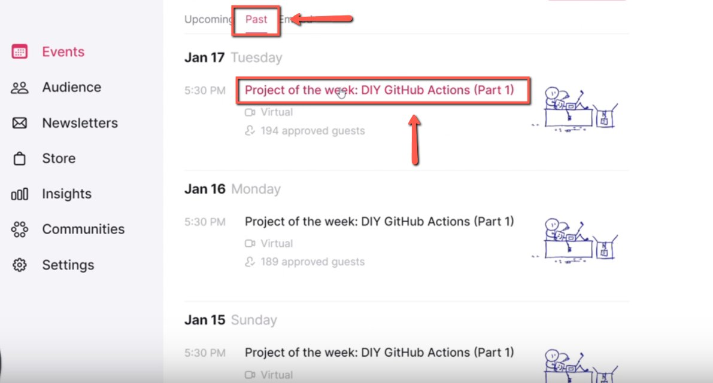
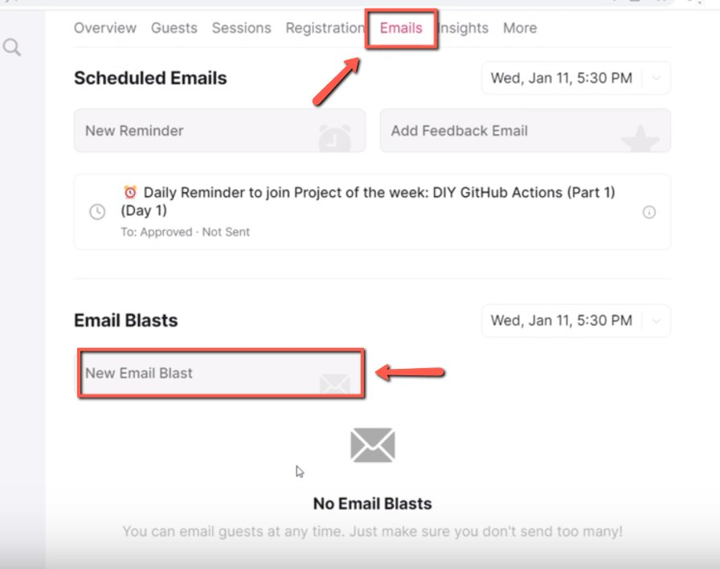
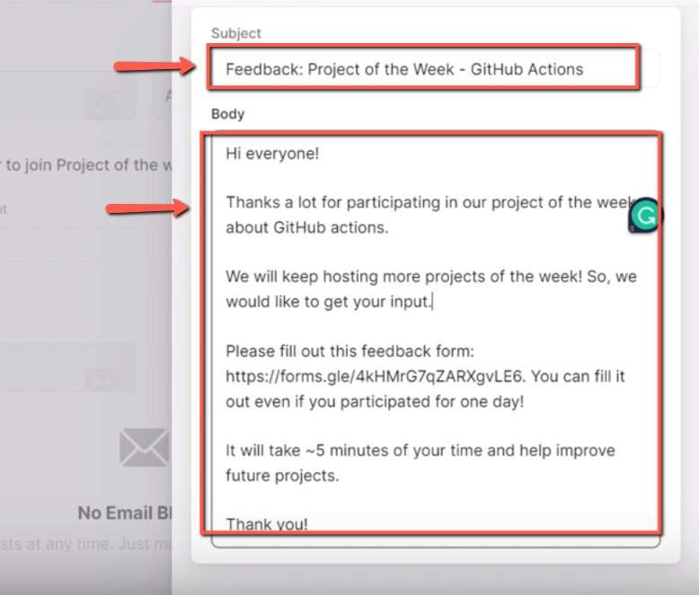
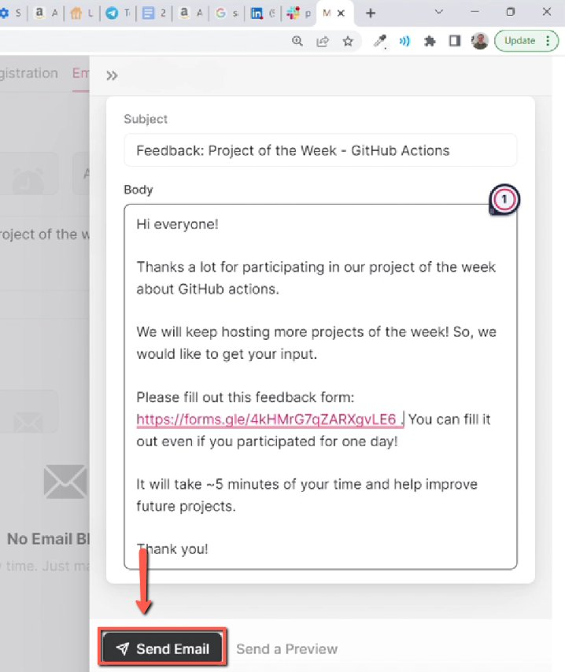

# Sending emails via Luma (feedback for project of the week)

<!-- sop-section-start: summary -->
## Summary

- Purpose: Send a feedback email to Project of the Week participants through Luma.
- Outcome: Participants receive a Luma email blast with the feedback form link.
- Trigger: A Project of the Week event has ended.
- Frequency: After each Project of the Week event.
<!-- sop-section-end -->

<!-- sop-section-start: prerequisites -->
## Prerequisites

- Access: Luma access to the past Project of the Week event.
- Tools: Luma email blast editor, feedback form.
- Inputs: Project name, feedback form link, and feedback email copy.
<!-- sop-section-end -->

<!-- sop-section-start: procedure -->
## Procedure

<!-- sop-prose-start -->
How to Send emails via Luma (feedback for project of the week)
This procedure will show you the steps on how to Send emails via Luma (feedback for project of the week)

Step-by-step Instructions
<!-- sop-prose-end -->

<!-- sop-step-start id=1 -->
1.  The first thing you need to do is open Luma and click on “Past” and select the recent Project of the week event.

    <!-- sop-screenshot-start -->
    
    <!-- sop-caption-start -->
    The screenshot shows the Past events view in Luma with the recent Project of the Week event. This ensures the feedback email is sent from the completed event, not an upcoming one.
    <!-- sop-caption-end -->
    <!-- sop-screenshot-end -->
<!-- sop-step-end -->

<!-- sop-step-start id=2 -->
2.  After, click on “Emails” and select “New Email Blast”

    <!-- sop-screenshot-start -->
    
    <!-- sop-caption-start -->
    The screenshot shows the Emails tab and New Email Blast option for the selected Luma event. This opens the editor used to send the feedback request to attendees.
    <!-- sop-caption-end -->
    <!-- sop-screenshot-end -->
<!-- sop-step-end -->

<!-- sop-step-start id=3 -->
3.  Then, add the subject and the text of the email.

    Note:

    Subject format: Feedback: Project of the Week - \<NAME OF PROJECT\>

    Body:

    Hi everyone!

    Thanks a lot for participating in our project of the week about GitHub actions.

    We will keep hosting more projects of the week! So, we would like to get your input.

    Please fill out this feedback form: \<LINK\>. You can fill it out even if you participated for one day!

    It will take ~5 minutes of your time and help improve future projects.

    Thank you!

    <!-- sop-screenshot-start -->
    
    <!-- sop-caption-start -->
    The screenshot shows the feedback email draft with the subject and body filled in. It provides the expected message structure, including the feedback form link and closing thank-you line.
    <!-- sop-caption-end -->
    <!-- sop-screenshot-end -->
<!-- sop-step-end -->

<!-- sop-step-start id=4 -->
4.  Once done, click “Send Email”

    <!-- sop-screenshot-start -->
    
    <!-- sop-caption-start -->
    The screenshot shows the Send Email button in Luma's email blast editor. Use it only after confirming the subject, body, and feedback form link are correct.
    <!-- sop-caption-end -->
    <!-- sop-screenshot-end -->
<!-- sop-step-end -->
<!-- sop-section-end -->

<!-- sop-section-start: validation -->
## Validation

-
<!-- sop-section-end -->

<!-- sop-section-start: troubleshooting -->
## Troubleshooting

-
<!-- sop-section-end -->

<!-- sop-section-start: references -->
## References

-
<!-- sop-section-end -->
