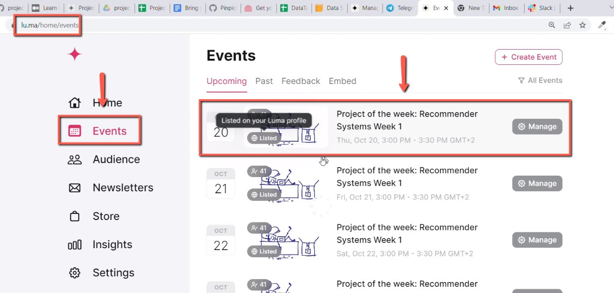
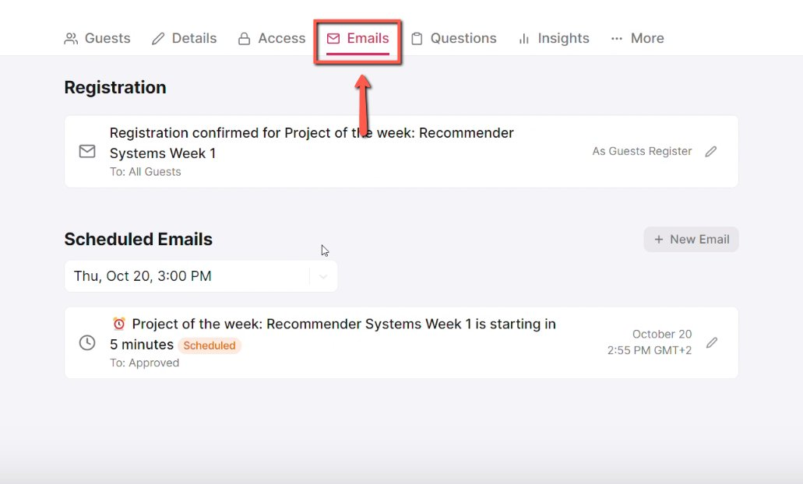
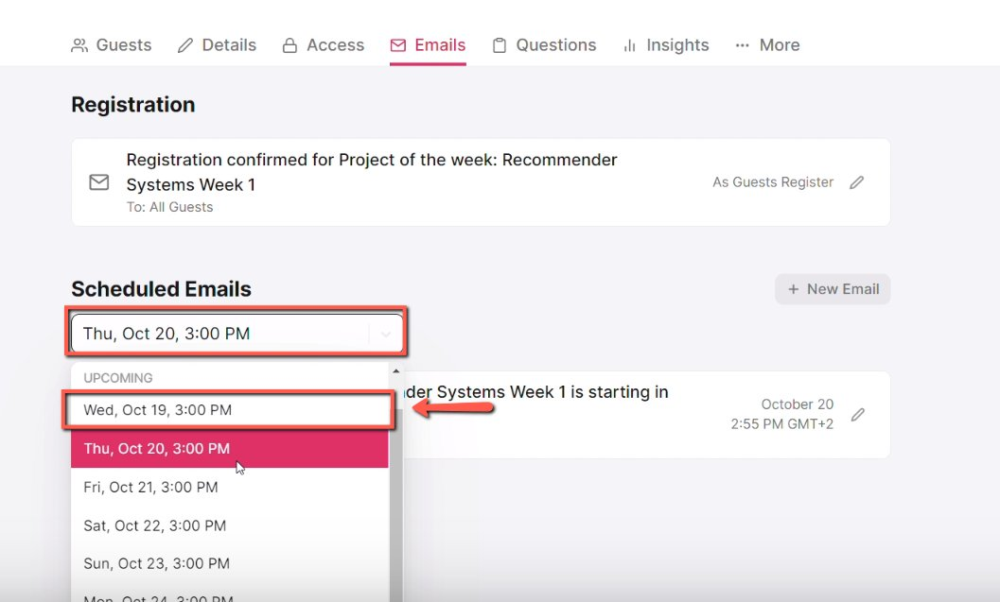
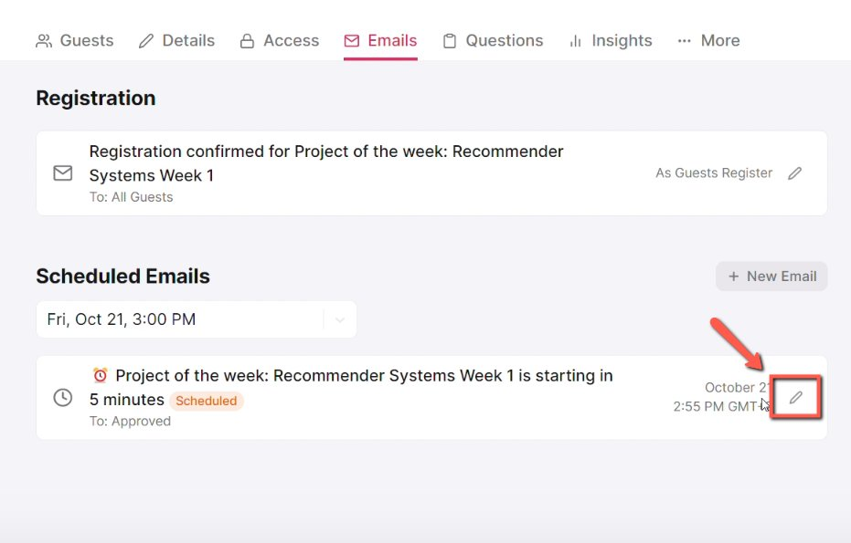
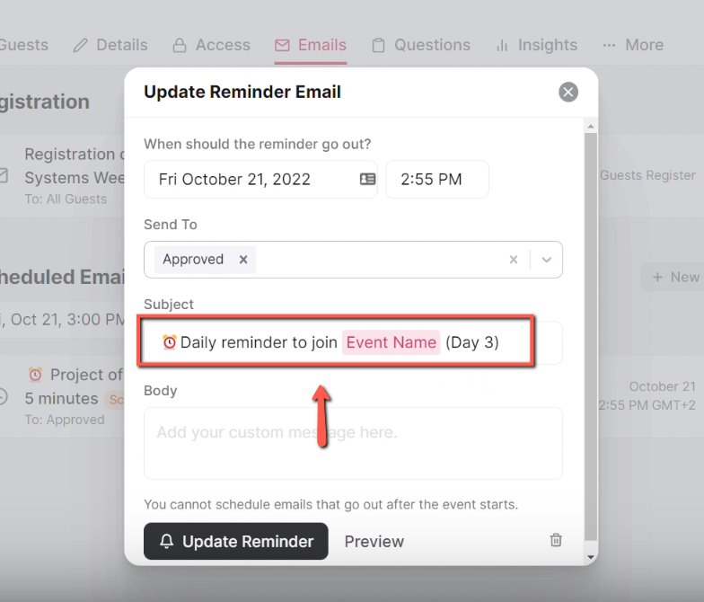
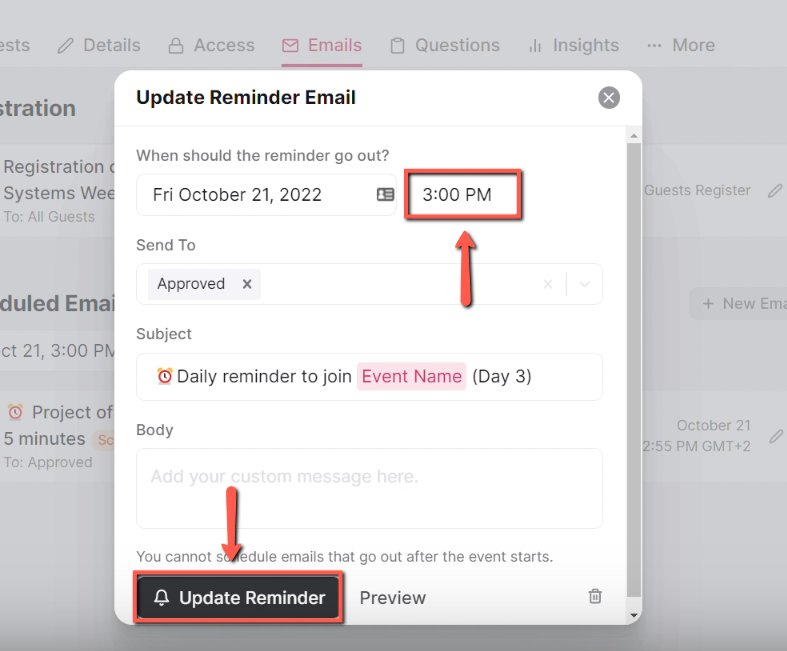

# Updating project of the week reminders (emails) in Luma

<!-- sop-section-start: summary -->
## Summary

- Purpose: Replace default Luma reminders with daily Project of the Week reminders.
- Outcome: Each session has one reminder sent at the session start time with the correct day number.
- Trigger: A Project of the Week event series has been created in Luma.
- Frequency: For each session in every Project of the Week series.
<!-- sop-section-end -->

<!-- sop-section-start: prerequisites -->
## Prerequisites

- Access: Admin access to edit the Project of the Week event series in Luma.
- Tools: Luma scheduled emails.
- Inputs: Event series, session start times, event name, and day numbers.
<!-- sop-section-end -->

<!-- sop-section-start: procedure -->
## Procedure

<!-- sop-prose-start -->
How to Update Project of the Week Reminders on Luma
This document shows the steps on how to Update Project of the Week Reminders on Luma to send a reminder everyday to the participants.

Project of the Week Description: [https://docs.google.com/document/d/18rCX0Fhkq2KK4pi_lTHMR9yRaIHY2-956zoOyBRsvRE/edit?usp=sharing](https://docs.google.com/document/d/18rCX0Fhkq2KK4pi_lTHMR9yRaIHY2-956zoOyBRsvRE/edit?usp=sharing)

Step-by-step Instructions
<!-- sop-prose-end -->

<!-- sop-step-start id=1 -->
1.  The first thing you need to do is open Luma and click “events” then click the event you want to edit.

    <!-- sop-screenshot-start -->
    
    <!-- sop-caption-start -->
    The screenshot shows the Luma Events view with the project event selected. It helps verify you are editing the correct Project of the Week series.
    <!-- sop-caption-end -->
    <!-- sop-screenshot-end -->
<!-- sop-step-end -->

<!-- sop-step-start id=2 -->
2.  After, click “Details”

    <!-- sop-screenshot-start -->
    
    <!-- sop-caption-start -->
    The screenshot shows the Details tab inside the Luma event editor. Scheduled reminder settings are managed from this event details area.
    <!-- sop-caption-end -->
    <!-- sop-screenshot-end -->
<!-- sop-step-end -->

<!-- sop-step-start id=3 -->
3.  Next, click the drop down list under “Scheduled Emails”

    <!-- sop-screenshot-start -->
    
    <!-- sop-caption-start -->
    The screenshot shows the Scheduled Emails section expanded in Luma. This is where the default reminders can be reviewed before editing them.
    <!-- sop-caption-end -->
    <!-- sop-screenshot-end -->
<!-- sop-step-end -->

<!-- sop-step-start id=4 -->
4.  By default, Luma creates three reminders. For this kind of event, project of the week event, we don’t to have a 1-hr reminder, 5-minute reminder and the like. We only want to send a reminder during the event. To edit it, click the “pen” icon.

    <!-- sop-screenshot-start -->
    
    <!-- sop-caption-start -->
    The screenshot shows the default reminder list with the edit control for a reminder. It identifies the reminder entry to keep and adjust for the Project of the Week schedule.
    <!-- sop-caption-end -->
    <!-- sop-screenshot-end -->
<!-- sop-step-end -->

<!-- sop-step-start id=5 -->
5.  And then, change the subject of the event to this format: “Daily Reminder to join \<EVENT NAME\> (Day \<NUMBER\>.

    <!-- sop-screenshot-start -->
    
    <!-- sop-caption-start -->
    The screenshot shows the reminder subject field in Luma. It demonstrates where to enter the daily reminder subject with the event name and day number.
    <!-- sop-caption-end -->
    <!-- sop-screenshot-end -->
<!-- sop-step-end -->

<!-- sop-step-start id=6 -->
6.  After, change the time of the event. Once done, click “Update Reminder”

    Note: In this example, the event will happen on 3:00 PM, so change the time to 3:00 PM.

    <!-- sop-screenshot-start -->
    
    <!-- sop-caption-start -->
    The screenshot shows the reminder send-time field and Update Reminder button. Set the reminder to the session start time before saving the change.
    <!-- sop-caption-end -->
    <!-- sop-screenshot-end -->
<!-- sop-step-end -->
<!-- sop-section-end -->

<!-- sop-section-start: validation -->
## Validation

-
<!-- sop-section-end -->

<!-- sop-section-start: troubleshooting -->
## Troubleshooting

-
<!-- sop-section-end -->

<!-- sop-section-start: references -->
## References

-
<!-- sop-section-end -->
