# Create events in Meetup.com

<!-- sop-section-start: summary -->
## Summary

- Purpose: Copy the announcement from Luma to Meetup.
- Outcome: We use meetup.com as an extra way to bring more people to our events.
- Trigger: After creating an event in Luma.
- Frequency: Per event.
<!-- sop-section-end -->

<!-- sop-section-start: prerequisites -->
## Prerequisites

- Access: DataTalks.Club Meetup group.
- Tools: Meetup, YouTube.
- Inputs: Event title, date, time, duration, image, description, and stream link.
<!-- sop-section-end -->

<!-- sop-section-start: procedure -->
## Procedure

<!-- sop-step-start id=1 -->
1.  The first thing you will need to do is go to "[www.meetup.com/home](https://www.meetup.com/home/?suggested=true&source=EVENTS)” click "Create event".
    [https://www.meetup.com/home/?suggested=true&source=EVENTS](https://www.meetup.com/home/?suggested=true&source=EVENTS)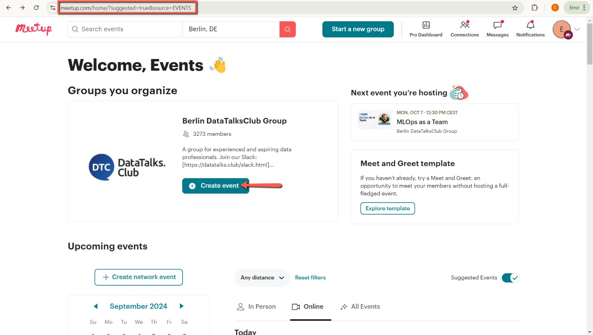
    Image note: The screenshot shows Meetup's home area where the Create event action starts a new DataTalks.Club listing. Use it after logging into the correct Meetup account.
<!-- sop-step-end -->

<!-- sop-step-start id=2 -->
2.  After, you can now fill in the necessary details or copy the details of the event you created on “[luma.com](https://lu.ma/calendar/manage/cal-kg9jR2UeDILH68H)”

    Note: In this example, our event name is "Using Data to Create Liveable Cities”
    <!-- sop-screenshot-start -->
    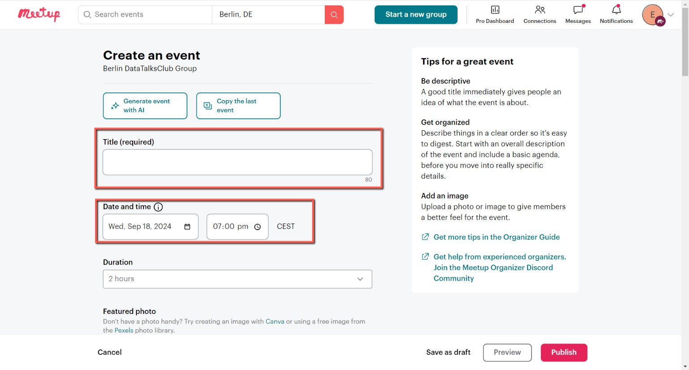
    <!-- sop-caption-start -->
    The screenshot shows the Meetup event form alongside details copied from Lu.ma. It establishes Lu.ma as the source for the title, date, description, and image.
    <!-- sop-caption-end -->
    <!-- sop-screenshot-end -->
<!-- sop-step-end -->

<!-- sop-step-start id=3 -->
3.  Paste the event name under the "Title (required)" on [Meetup.com](https://www.meetup.com/home/?suggested=true&source=EVENTS)

    <!-- sop-screenshot-start -->
    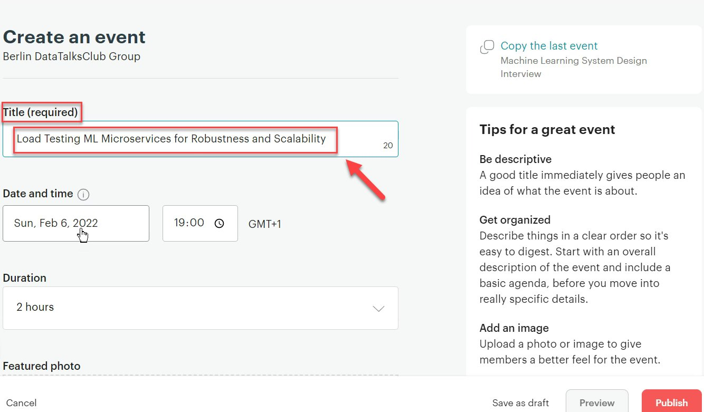
    <!-- sop-caption-start -->
    The screenshot shows the Title (required) field in the Meetup editor. Paste the Lu.ma event name here so the Meetup listing matches the original event.
    <!-- sop-caption-end -->
    <!-- sop-screenshot-end -->
<!-- sop-step-end -->

<!-- sop-step-start id=4 -->
4.  After pasting the title, choose your date and time.

    Note: For this example, we are having Mon, September 23, 2024, as our date and 12:30 CEST as the preferred time for the event.
    <!-- sop-screenshot-start -->
    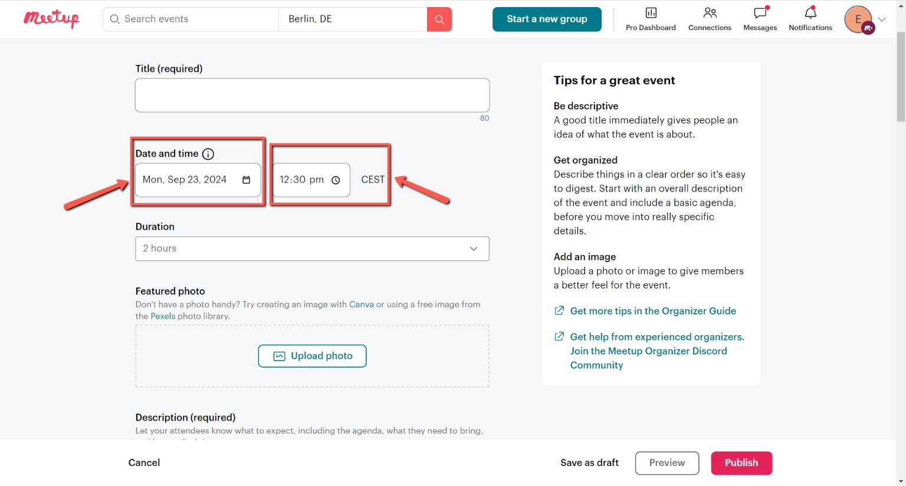
    <!-- sop-caption-start -->
    The screenshot shows the Meetup date and time selector with an example date and 12:30 CEST time. Use it to match the event schedule from Lu.ma.
    <!-- sop-caption-end -->
    <!-- sop-screenshot-end -->
<!-- sop-step-end -->

<!-- sop-step-start id=5 -->
5.  And click the drag-down button for the duration of the event.

    Note: In this example, the time duration of the event is 1 hour.
    <!-- sop-screenshot-start -->
    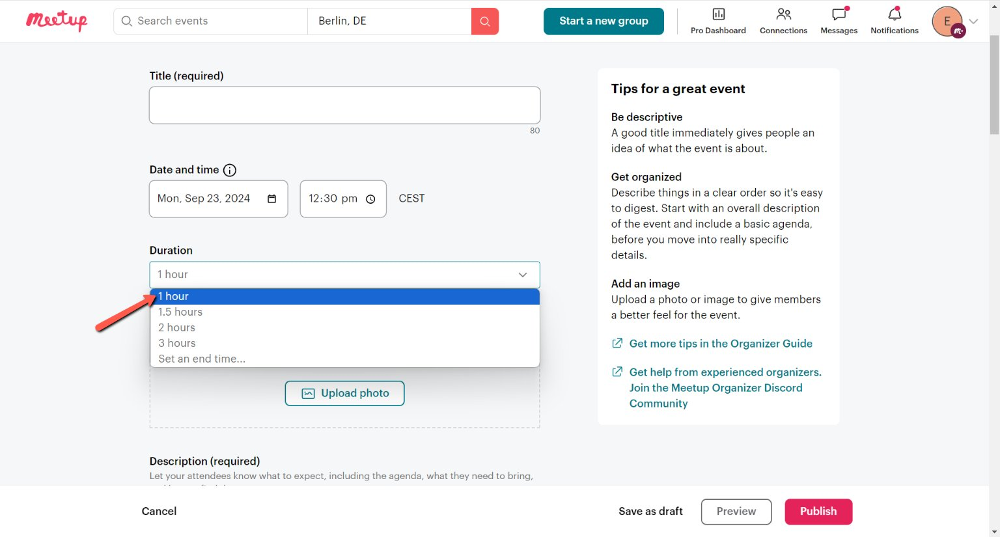
    <!-- sop-caption-start -->
    The screenshot shows the duration dropdown in the Meetup time section. Select the expected event length, such as one hour for the example event.
    <!-- sop-caption-end -->
    <!-- sop-screenshot-end -->
<!-- sop-step-end -->

<!-- sop-step-start id=6 -->
6.  To add a photo, select “upload photo”

    <!-- sop-screenshot-start -->
    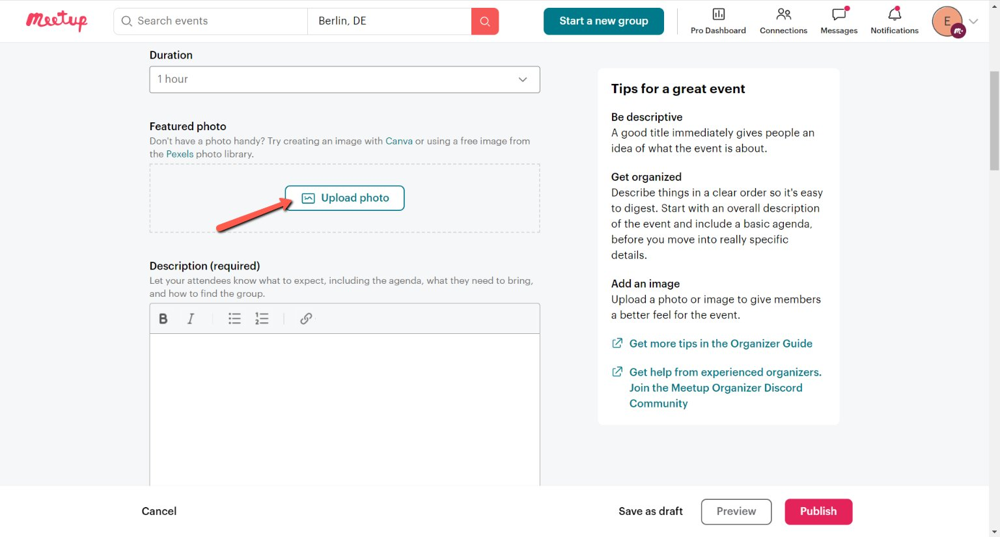
    <!-- sop-caption-start -->
    The screenshot shows the Upload photo control in the Meetup event image area. Use it to add the same banner used on the Lu.ma event.
    <!-- sop-caption-end -->
    <!-- sop-screenshot-end -->
<!-- sop-step-end -->

<!-- sop-step-start id=7 -->
7.  Then, select your photo on your computer and click "open"

    <!-- sop-screenshot-start -->
    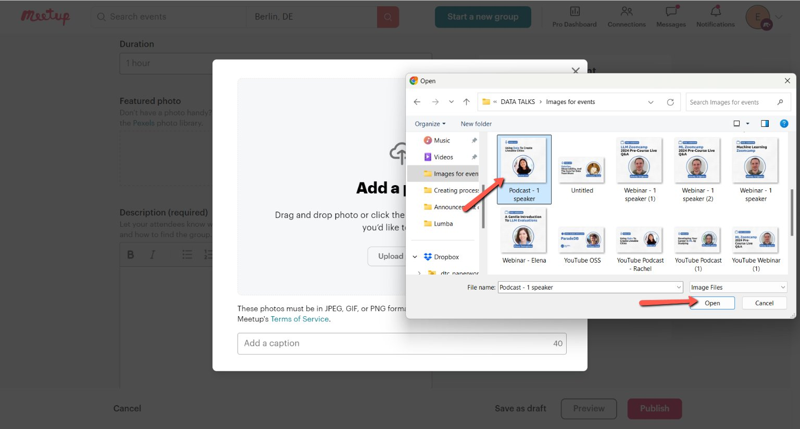
    <!-- sop-caption-start -->
    The screenshot shows the local file picker for choosing the event image. Select the correct downloaded banner and open it for upload.
    <!-- sop-caption-end -->
    <!-- sop-screenshot-end -->
<!-- sop-step-end -->

<!-- sop-step-start id=8 -->
8.  Crop your photo if needed and click "Save photo"

    <!-- sop-screenshot-start -->
    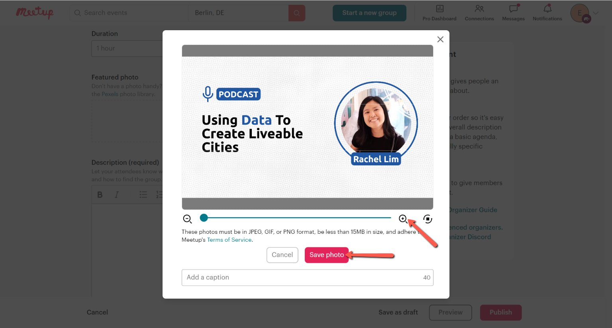
    <!-- sop-caption-start -->
    The screenshot shows the Meetup crop dialog for the uploaded event photo. Adjust the crop if needed, then save it so the banner appears on the event page.
    <!-- sop-caption-end -->
    <!-- sop-screenshot-end -->
<!-- sop-step-end -->

<!-- sop-step-start id=9 -->
9.  Once done, copy the description of the event from “Lu.ma”

    <!-- sop-screenshot-start -->
    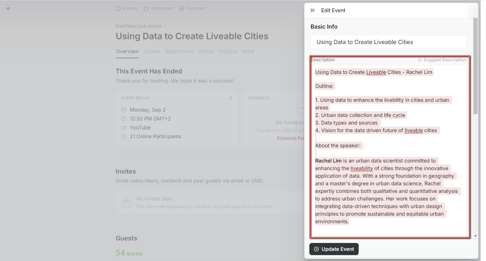
    <!-- sop-caption-start -->
    The screenshot shows the Lu.ma event description used as the source text for Meetup. Copy the full description before switching back to the Meetup editor.
    <!-- sop-caption-end -->
    <!-- sop-screenshot-end -->
<!-- sop-step-end -->

<!-- sop-step-start id=10 -->
10. After, paste it under "Description" on Meetup.com

    Note: You can edit necessary adjustments with the description you pasted like

    remove spacing, add bullets, etc.

    <!-- sop-screenshot-start -->
    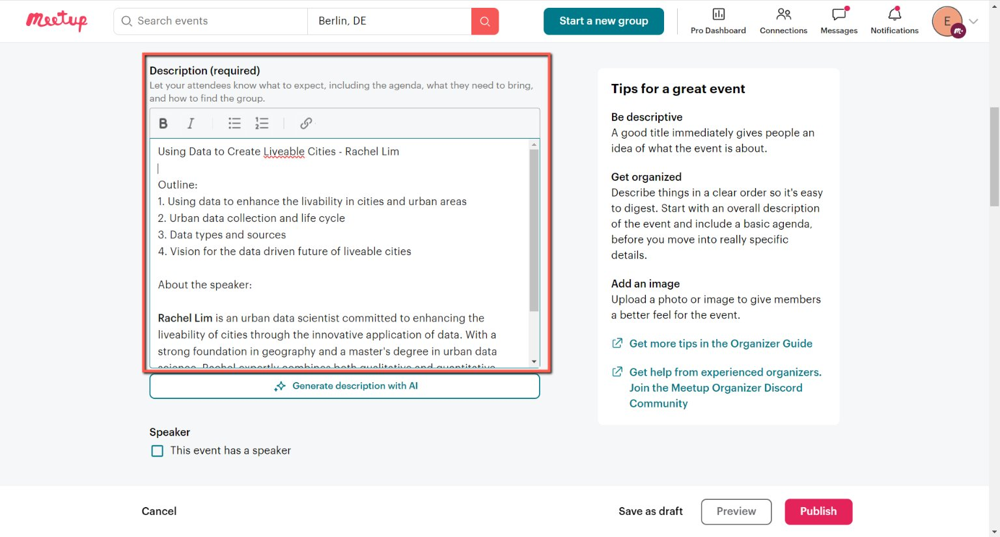
    <!-- sop-caption-start -->
    The screenshot shows the Meetup Description field after pasting the Lu.ma text. Clean up spacing and bullets here so the listing is readable.
    <!-- sop-caption-end -->
    <!-- sop-screenshot-end -->
<!-- sop-step-end -->

<!-- sop-step-start id=11 -->
11. Don't forget to add the link to the slack community.
    “Join our Slack: https://datatalks.club/slack.html”
    <!-- sop-screenshot-start -->
    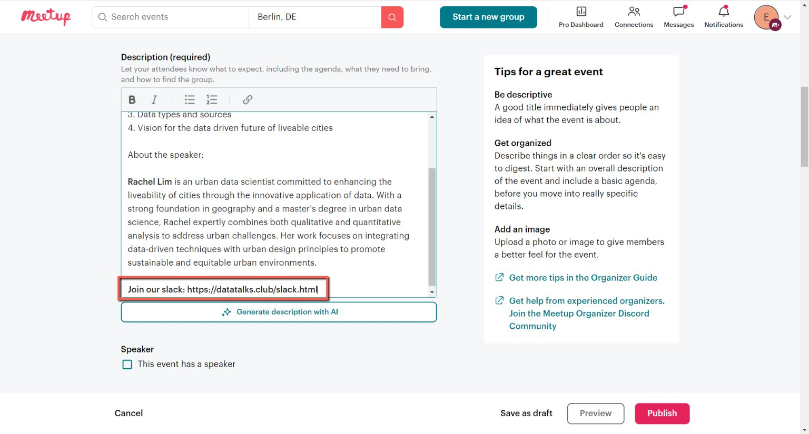
    <!-- sop-caption-start -->
    The screenshot shows the Slack community line added to the event description. Include the `https://datatalks.club/slack.html` link so attendees can join the community.
    <!-- sop-caption-end -->
    <!-- sop-screenshot-end -->
<!-- sop-step-end -->

<!-- sop-step-start id=12 -->
12. For the location, click the “Online" and add the link
    of DataTalk's youtube channel: [https://www.youtube.com/c/DataTalksClub](https://www.youtube.com/c/DataTalksClub).

    Note: Double-check that the location and YouTube link is correct.

    <!-- sop-screenshot-start -->
    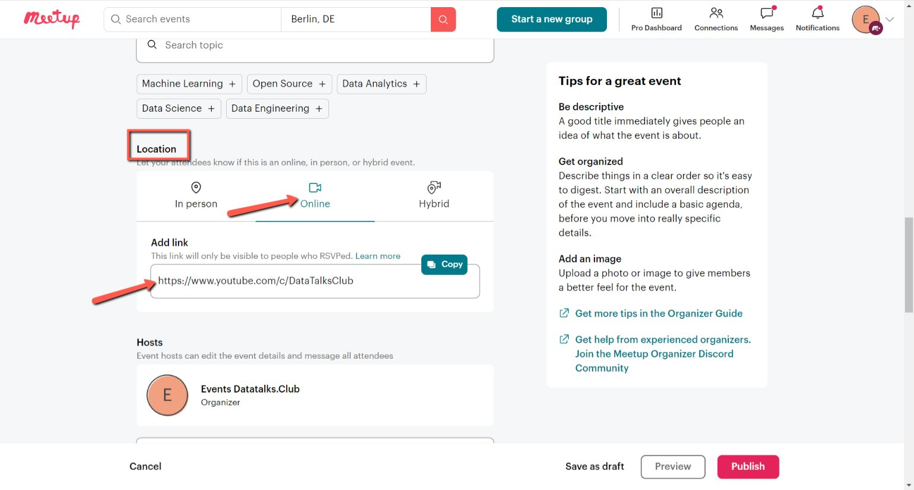
    <!-- sop-caption-start -->
    The screenshot shows the Online location field with the DataTalks.Club YouTube channel URL. This is the standard location for Meetup events streamed on YouTube.
    <!-- sop-caption-end -->
    <!-- sop-screenshot-end -->
<!-- sop-step-end -->

<!-- sop-step-start id=13 -->
13. The next thing to do is un toggle the check button for the "Registration form"

    <!-- sop-screenshot-start -->
    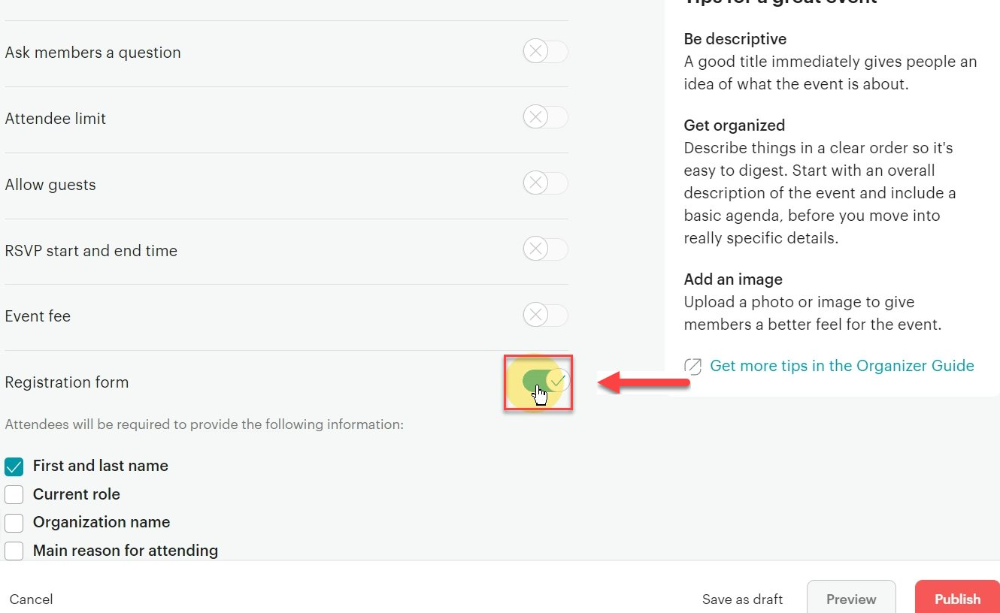
    <!-- sop-caption-start -->
    The screenshot shows the Registration form setting in the Meetup editor. Turn it off so attendees are not asked unnecessary custom questions.
    <!-- sop-caption-end -->
    <!-- sop-screenshot-end -->
<!-- sop-step-end -->

<!-- sop-step-start id=14 -->
14. After reviewing your work, click "Publish"

    <!-- sop-screenshot-start -->
    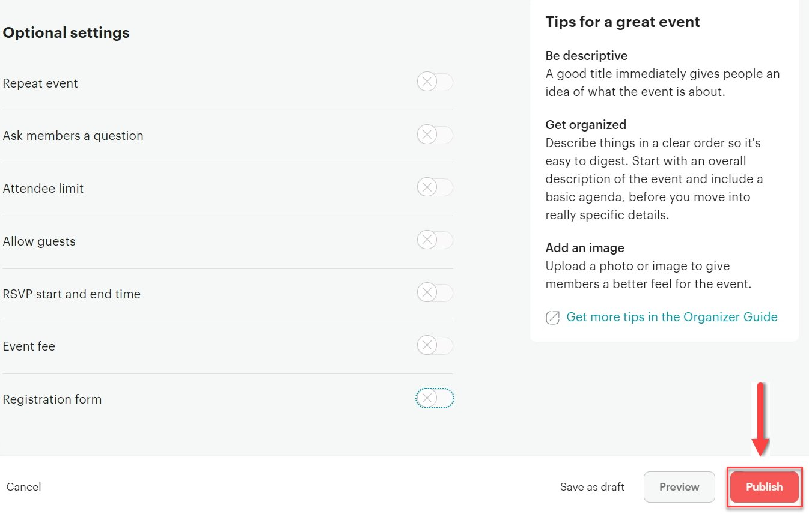
    <!-- sop-caption-start -->
    The screenshot shows the Publish button after the Meetup event details are complete. Use it only after checking the title, schedule, image, description, location, and registration setting.
    <!-- sop-caption-end -->
    <!-- sop-screenshot-end -->
<!-- sop-step-end -->

<!-- sop-step-start id=15 -->
15. After clicking, select "Announce it now"

    <!-- sop-screenshot-start -->
    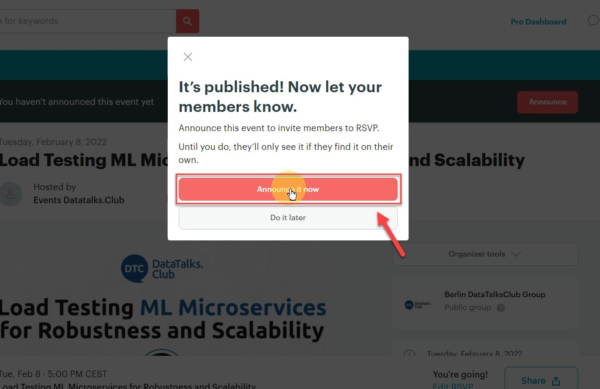
    <!-- sop-caption-start -->
    The screenshot shows Meetup's announcement prompt after publishing. Select Announce it now to notify the group immediately.
    <!-- sop-caption-end -->
    <!-- sop-screenshot-end -->
<!-- sop-step-end -->
<!-- sop-section-end -->

<!-- sop-section-start: validation -->
## Validation

-
<!-- sop-section-end -->

<!-- sop-section-start: troubleshooting -->
## Troubleshooting

-
<!-- sop-section-end -->

<!-- sop-section-start: references -->
## References

-
<!-- sop-section-end -->
